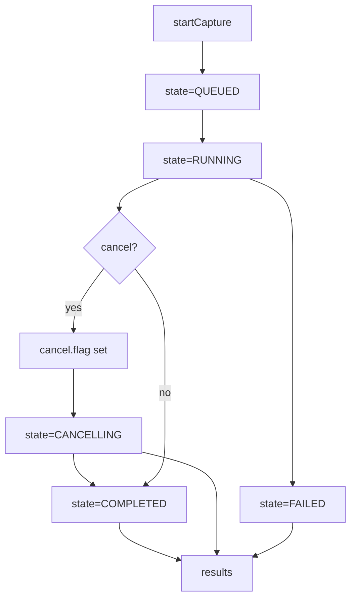

<!-- SPDX-License-Identifier: Apache-2.0 -->
<!-- Copyright (c) 2026 Maurice Garcia -->

# ChannelEstCoeff Orchestration Endpoints

ChannelEstCoeff serving-group orchestration uses a filesystem-backed operation model. The CMTS API creates and tracks job state while PyPNM captures are executed later in the pipeline.

## Lifecycle



## POST /cmts/pnm/sg/ds/ofdm/channelEstCoeff/startCapture

Create a new serving-group ChannelEstCoeff operation. The response returns a new `operation_id` and initial counters.
Status values use numeric `ServiceStatusCode`.

Current behavior: startCapture schedules background execution and returns immediately. Status, cancel, and results operate on persisted state and JSONL linkage records. Cancel creates `cancel.flag` and transitions to `CANCELLING`, and the runner transitions to `CANCELLED` when it observes the flag.

Collect-only behavior: PyPNM owns PNM artifacts in `.data/pnm/` and authoritative transaction records in `.data/db/transactions.json`. CMTS linkage records store transaction_id and filename pointers for later decode/analysis. See [SG operations data model](pypnm-cmts/sg-operations.md) for the on-disk data model.

Runner-level failures: the runner may synthesize stage outcomes when a per-modem timeout or internal exception occurs. In those cases, `ELIGIBILITY` and `PRECHECK` may be marked successful even if they did not run, and `CAPTURE` carries the failure status. `failure_reason` provides a normalized diagnostic for timeouts or runner-level failures.

### Usage

```bash
curl -X POST http://127.0.0.1:8000/cmts/pnm/sg/ds/ofdm/channelEstCoeff/startCapture \
  -H "content-type: application/json" \
  -d '{}'
```

### Request

```json
{
  "cmts": {
    "serving_group": { "id": [] },
    "cable_modem": {
      "mac_address": [],
      "pnm_parameters": {
        "tftp": { "ipv4": null, "ipv6": null },
        "capture": { "channel_ids": [] }
      },
      "snmp": { "snmpV2C": { "community": "public" } }
    }
  },
  "execution": {
    "max_workers": 16,
    "retry_count": 3,
    "retry_delay_seconds": 5.0,
    "per_modem_timeout_seconds": 30.0,
    "overall_timeout_seconds": 120.0
  }
}
```

### Request Elements

| Field | Type | Required | Notes |
|---|---|---|---|
| `cmts.serving_group.id` | `array<int>` | no | Empty list means all serving groups. |
| `cmts.cable_modem.mac_address` | `array<string>` | no | Empty list means all modems in selected serving groups. |
| `cmts.cable_modem.pnm_parameters.tftp.ipv4` | `string or null` | conditional | If `tftp` is present, both `ipv4` and `ipv6` keys must be present. Use `null` for defaults. |
| `cmts.cable_modem.pnm_parameters.tftp.ipv6` | `string or null` | conditional | If `tftp` is present, both `ipv4` and `ipv6` keys must be present. Use `null` for defaults. |
| `cmts.cable_modem.pnm_parameters.capture.channel_ids` | `array<int> or null` | no | `null`, missing, or empty means all channels. |
| `cmts.cable_modem.snmp.snmpV2C.community` | `string or null` | conditional | If `snmpV2C` is present, `community` key must be present. Use `null` for defaults. |
| `execution.max_workers` | `int` | no | Must be greater than `0`. Default `16`. |
| `execution.retry_count` | `int` | no | Must be `0` or greater. Default `3`. |
| `execution.retry_delay_seconds` | `float` | no | Must be `0.0` or greater. Default `5.0`. |
| `execution.per_modem_timeout_seconds` | `float` | no | Must be greater than `0.0`. Default `30.0`. |
| `execution.overall_timeout_seconds` | `float` | no | Must be greater than `0.0`. Default `120.0`. |

### Response

```json
{
  "status": 0,
  "message": "",
  "operation": {
    "operation_id": "1b3f5f3d4f3c4ab29a9ff9a3f0b7c8d1",
    "state": "queued",
    "counters": {
      "total_modems": 0,
      "eligible_modems": 0,
      "precheck_passed": 0,
      "capture_started": 0,
      "completed": 0,
      "success": 0,
      "failed": 0,
      "skipped": 0
    },
    "timestamps": {
      "created_epoch": 1767444600,
      "started_epoch": 0,
      "updated_epoch": 1767444600,
      "finished_epoch": 0
    },
    "request_summary": {
      "serving_group_ids": [],
      "mac_addresses": [],
      "channel_ids": [],
      "execution": {
        "max_workers": 16,
        "retry_count": 3,
        "retry_delay_seconds": 5.0,
        "per_modem_timeout_seconds": 30.0,
        "overall_timeout_seconds": 120.0
      }
    },
    "error_summary": null
  }
}
```

### Response Elements

| Field | Type | Always Present | Notes |
|---|---|---|---|
| `status` | `int` | yes | Numeric `ServiceStatusCode`. |
| `message` | `string` | yes | Informational or error message. |
| `operation.operation_id` | `string` | yes | Operation identifier used by status, results, and cancel. |
| `operation.state` | `string` | yes | `queued`, `running`, `cancelling`, `cancelled`, `completed`, or `failed`. |
| `operation.counters` | `object` | yes | Progress counters for modem processing lifecycle. |
| `operation.timestamps` | `object` | yes | Epoch timestamps for operation lifecycle. |
| `operation.request_summary` | `object` | yes | Normalized request scope and execution settings captured at start. |
| `operation.error_summary` | `object or null` | yes | Non-null when operation enters a failed terminal state. |

## POST /cmts/pnm/sg/ds/ofdm/channelEstCoeff/status

Return the persisted operation state.
The request payload uses `pnm_capture_operation_id`, while the returned state uses `operation_id`.

### Usage

```bash
curl -X POST http://127.0.0.1:8000/cmts/pnm/sg/ds/ofdm/channelEstCoeff/status \
  -H "content-type: application/json" \
  -d '{"pnm_capture_operation_id":"<operation_id>"}'
```

### Request

```json
{
  "pnm_capture_operation_id": "1b3f5f3d4f3c4ab29a9ff9a3f0b7c8d1"
}
```

### Request Elements

| Field | Type | Required | Notes |
|---|---|---|---|
| `pnm_capture_operation_id` | `string` | yes | Operation identifier returned by `startCapture`. |

### Response

```json
{
  "status": 0,
  "message": "",
  "operation": {
    "operation_id": "1b3f5f3d4f3c4ab29a9ff9a3f0b7c8d1",
    "state": "queued"
  }
}
```

### Response Elements

| Field | Type | Always Present | Notes |
|---|---|---|---|
| `status` | `int` | yes | Numeric `ServiceStatusCode`. |
| `message` | `string` | yes | Informational or error message. |
| `operation` | `object or null` | yes | Operation snapshot; `null` when not found or unavailable. |

## POST /cmts/pnm/sg/ds/ofdm/channelEstCoeff/results

Return structured ChannelEstCoeff results for an operation plus compatibility linkage records.
`results` supports the nested request shape (`operation`, `selection`, `analysis`, `output`) and still accepts the legacy flat `pnm_capture_operation_id` body.

### Usage

```bash
curl -X POST http://127.0.0.1:8000/cmts/pnm/sg/ds/ofdm/channelEstCoeff/results \
  -H "content-type: application/json" \
  -d '{"operation":{"pnm_capture_operation_id":"<operation_id>"},"selection":{"serving_group_ids":[],"channel_ids":[],"mac_addresses":[]},"analysis":{"type":"basic"},"output":{"type":"json"}}'
```

### Request

```json
{
  "operation": {
    "pnm_capture_operation_id": "1b3f5f3d4f3c4ab29a9ff9a3f0b7c8d1"
  },
  "selection": {
    "serving_group_ids": [],
    "channel_ids": [],
    "mac_addresses": []
  },
  "analysis": {
    "type": "basic"
  },
  "output": {
    "type": "json"
  }
}
```

### Request Elements

| Field | Type | Required | Notes |
|---|---|---|---|
| `operation.pnm_capture_operation_id` | `string` | yes | Operation identifier returned by `startCapture`. |
| `selection.serving_group_ids[]` | `array<int>` | no | Optional SG filter; empty means all. |
| `selection.channel_ids[]` | `array<int>` | no | Optional channel filter; empty means all. |
| `selection.mac_addresses[]` | `array<string>` | no | Optional modem MAC filter; empty means all. |
| `analysis.type` | `string` | no | `basic` runs PyPNM ChannelEstCoeff basic analysis decode. |
| `output.type` | `string` | no | `json` or `archive`. |
| `output.archive_includes` | `object` | conditional | Valid only when `output.type=archive`. |

### Response

```json
{
  "status": 0,
  "message": "",
  "results": {
    "capture_details": {
      "capture_type": "CHANNEL_EST_COEFF",
      "capture_time_epoch": 1772081360
    },
    "cmts": {
      "cmts_hostname": "172.19.124.6"
    },
    "channels": [],
    "serving_groups": [
      {
        "service_group_id": 3147522,
        "channels": [
          {
            "channel_id": 160,
            "service_group_id": 3147522,
            "cable_modems": [
              {
                "mac_address": "60:6c:63:f4:8f:b8",
                "system_description": {
                  "VENDOR": "LANCity",
                  "MODEL": "LCPET-3"
                },
                "status": "success",
                "message": "",
                "channel_est_coeff_data": {
                  "file": {
                    "transaction_id": "9e95d2358b02f317",
                    "filename": "ds_ofdm_chan_est_coeff_606c63f48fb8_160_1772081353.bin"
                  },
                  "stage_status_codes": {
                    "eligibility": 0,
                    "precheck": 0,
                    "capture": 0
                  },
                  "stage_messages": null,
                  "pnm_file_type": "OFDM_CHANNEL_ESTIMATE_COEFFICIENT",
                  "analysis": {},
                  "analysis_error": null
                }
              }
            ]
          }
        ]
      }
    ]
  },
  "summary": {
    "record_count": 3,
    "included_count": 3,
    "files_scanned": 1
  },
  "records": []
}
```

### Response Elements

| Field | Type | Always Present | Notes |
|---|---|---|---|
| `status` | `int` | yes | Numeric `ServiceStatusCode`. |
| `message` | `string` | yes | Informational or error message. |
| `results` | `object` | yes | Structured ChannelEstCoeff results payload. |
| `results.capture_details.capture_type` | `string` | yes | `CHANNEL_EST_COEFF`. |
| `results.cmts.cmts_hostname` | `string or null` | yes | CMTS hostname when available. |
| `results.serving_groups[]` | `array<object>` | yes | Primary SG-grouped results view. |
| `results.serving_groups[].channels[]` | `array<object>` | yes | Channel-grouped results under each SG. |
| `results.serving_groups[].channels[].cable_modems[]` | `array<object>` | yes | Per-modem results. |
| `...cable_modems[].channel_est_coeff_data.file` | `object or null` | conditional | Singular analyzed file link (`transaction_id`, `filename`). |
| `...cable_modems[].channel_est_coeff_data.stage_status_codes` | `object` | yes | Per-stage status codes. |
| `...cable_modems[].channel_est_coeff_data.analysis` | `object or null` | conditional | Decoded PyPNM ChannelEstCoeff basic analysis payload. |
| `...cable_modems[].channel_est_coeff_data.analysis_error` | `string or null` | yes | Decode/analysis error if analysis failed. |
| `summary.record_count` | `int` | yes | Total linkage records stored for the operation. |
| `summary.included_count` | `int` | yes | Records included in this API response. |
| `summary.files_scanned` | `int` | yes | Number of result files scanned. |
| `records[]` | `array<object>` | yes | Compatibility linkage records (temporary). |

## POST /cmts/pnm/sg/ds/ofdm/channelEstCoeff/cancel

Request cancellation for an operation.
The request payload uses `pnm_capture_operation_id`, while the returned state uses `operation_id`.

### Usage

```bash
curl -X POST http://127.0.0.1:8000/cmts/pnm/sg/ds/ofdm/channelEstCoeff/cancel \
  -H "content-type: application/json" \
  -d '{"pnm_capture_operation_id":"<operation_id>"}'
```

### Request

```json
{
  "pnm_capture_operation_id": "1b3f5f3d4f3c4ab29a9ff9a3f0b7c8d1"
}
```

### Request Elements

| Field | Type | Required | Notes |
|---|---|---|---|
| `pnm_capture_operation_id` | `string` | yes | Operation identifier returned by `startCapture`. |

### Response

```json
{
  "status": 0,
  "message": "",
  "operation": {
    "operation_id": "1b3f5f3d4f3c4ab29a9ff9a3f0b7c8d1",
    "state": "cancelling"
  }
}
```

### Response Elements

| Field | Type | Always Present | Notes |
|---|---|---|---|
| `status` | `int` | yes | Numeric `ServiceStatusCode`. |
| `message` | `string` | yes | Informational or error message. |
| `operation` | `object or null` | yes | Updated operation snapshot, usually with `state` set to `cancelling` when accepted. |
