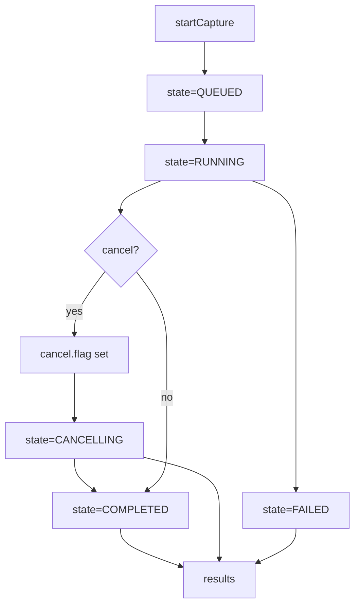

<!-- SPDX-License-Identifier: Apache-2.0 -->
<!-- Copyright (c) 2026 Maurice Garcia -->

# ModulationProfile Orchestration Endpoints

ModulationProfile serving-group orchestration uses a filesystem-backed operation model. The CMTS API creates and tracks job state while PyPNM captures are executed later in the pipeline.

## Lifecycle



## POST /cmts/pnm/sg/ds/ofdm/modulationProfile/startCapture

Create a new serving-group ModulationProfile operation. The response returns a new `operation_id` and initial counters.
Status values use numeric `ServiceStatusCode`.

### Usage

```bash
curl -X POST http://127.0.0.1:8000/cmts/pnm/sg/ds/ofdm/modulationProfile/startCapture \
  -H "content-type: application/json" \
  -d '{}'
```

### Request

```json
{
  "cmts": {
    "serving_group": { "id": [] },
    "cable_modem": {
      "mac_address": [],
      "pnm_parameters": {
        "tftp": { "ipv4": null, "ipv6": null },
        "capture": { "channel_ids": [] }
      },
      "snmp": { "snmpV2C": { "community": "public" } }
    }
  },
  "execution": {
    "max_workers": 16,
    "retry_count": 3,
    "retry_delay_seconds": 5.0,
    "per_modem_timeout_seconds": 30.0,
    "overall_timeout_seconds": 120.0
  }
}
```

## POST /cmts/pnm/sg/ds/ofdm/modulationProfile/status

Return the persisted operation state.

### Usage

```bash
curl -X POST http://127.0.0.1:8000/cmts/pnm/sg/ds/ofdm/modulationProfile/status \
  -H "content-type: application/json" \
  -d '{"pnm_capture_operation_id":"<operation_id>"}'
```

## POST /cmts/pnm/sg/ds/ofdm/modulationProfile/results

Return structured ModulationProfile results for an operation plus compatibility linkage records.
`results` supports the nested request shape (`operation`, `selection`, `analysis`, `output`) and still accepts the legacy flat `pnm_capture_operation_id` body.

### Usage

```bash
curl -X POST http://127.0.0.1:8000/cmts/pnm/sg/ds/ofdm/modulationProfile/results \
  -H "content-type: application/json" \
  -d '{"operation":{"pnm_capture_operation_id":"<operation_id>"},"selection":{"serving_group_ids":[],"channel_ids":[],"mac_addresses":[]},"analysis":{"type":"basic"},"output":{"type":"json"}}'
```

### Response

```json
{
  "status": 0,
  "message": "",
  "results": {
    "capture_details": {
      "capture_type": "MODULATION_PROFILE",
      "capture_time_epoch": 1772081360
    },
    "cmts": {
      "cmts_hostname": "172.19.124.6"
    },
    "channels": [],
    "serving_groups": [
      {
        "service_group_id": 3147522,
        "channels": [
          {
            "channel_id": 160,
            "service_group_id": 3147522,
            "cable_modems": [
              {
                "mac_address": "aa:bb:cc:dd:ee:ff",
                "system_description": {
                  "VENDOR": "LANCity",
                  "MODEL": "LCPET-3"
                },
                "status": "success",
                "message": "",
                "modulation_profile_data": {
                  "file": {
                    "transaction_id": "9e95d2358b02f317",
                    "filename": "ds_ofdm_modulation_profile_606c63f48fb8_160_1772081353.bin"
                  },
                  "stage_status_codes": {
                    "eligibility": 0,
                    "precheck": 0,
                    "capture": 0
                  },
                  "stage_messages": null,
                  "pnm_file_type": "OFDM_MODULATION_PROFILE",
                  "analysis": {},
                  "analysis_error": null
                }
              }
            ]
          }
        ]
      }
    ]
  },
  "summary": {
    "record_count": 3,
    "included_count": 3,
    "files_scanned": 1
  },
  "records": []
}
```

## POST /cmts/pnm/sg/ds/ofdm/modulationProfile/cancel

Request cancellation for an operation.

### Usage

```bash
curl -X POST http://127.0.0.1:8000/cmts/pnm/sg/ds/ofdm/modulationProfile/cancel \
  -H "content-type: application/json" \
  -d '{"pnm_capture_operation_id":"<operation_id>"}'
```
