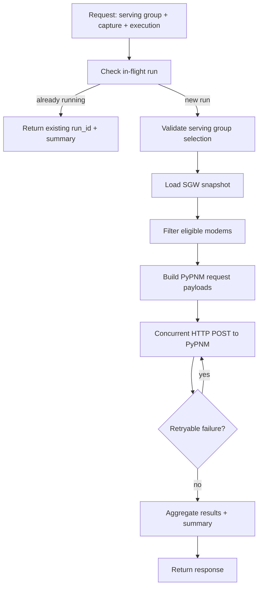

# RxMER Orchestration Endpoints

RxMER capture orchestration uses the SGW cache to identify cable modems in a serving group and triggers PyPNM RxMER capture concurrently per modem. Requests target the CMTS API and PyPNM is invoked under the `/cm` mount.

## POST /cmts/pnm/rxmer/getCapture

Orchestrate RxMER capture for a single serving group. The request enforces exactly one `cmts.serving_group.id`. Optional `cmts.cable_modem.pnm_parameters.capture.channel_ids` are forwarded to PyPNM to filter channels; empty or missing lists capture all channels. Per-modem and overall timeouts are configurable via `execution`.

### Flow



### Request

```json
{
  "cmts": {
    "serving_group": {
      "id": [3147266]
    },
    "cable_modem": {
      "pnm_parameters": {
        "capture": {
          "channel_ids": [193]
        }
      }
    }
  },
  "execution": {
    "max_workers": 32,
    "retry_count": 6,
    "retry_delay_seconds": 5.0,
    "per_modem_timeout_seconds": 30.0,
    "overall_timeout_seconds": 120.0
  }
}
```

### Response

```json
{
  "status": 0,
  "message": "",
  "timestamp": "2026-01-08T02:10:00.000000+00:00",
  "run_id": "3c7db8f0-1d38-4d28-88b2-1a2c4f8a2f8a",
  "already_running": false,
  "requested_sg_id": 3147266,
  "requested_channel_ids": [193],
  "summary": {
    "requested_count": 2,
    "attempted_count": 1,
    "success_count": 1,
    "failure_count": 0,
    "failures_by_reason": {},
    "elapsed_seconds": 1.23
  },
  "total_modems": 2,
  "eligible_modems": 1,
  "started_modems": 1,
  "success_modems": 1,
  "failed_modems": 0,
  "skipped_modems": 1,
  "results": [
    {
      "mac_address": "aa:bb:cc:dd:ee:ff",
      "ipv4": "192.168.0.100",
      "ipv6": null,
      "status": "success",
      "message": "ok",
      "transaction_id": "tx-123",
      "operation_id": "op-456",
      "attempts": 1,
      "http_status": 200,
      "pypnm_status": 0,
      "started_epoch": 1767444600.0,
      "finished_epoch": 1767444601.0
    }
  ]
}
```

### Notes

- `cmts.serving_group.id` must include exactly one SG id.
- `execution` controls concurrency and bounded retry behavior.
- `per_modem_timeout_seconds` bounds each individual cable-modem capture attempt.
- `overall_timeout_seconds` bounds the total orchestration time.
- Skipped modems report `status: "skipped"` with a reason in `message`.
- When a matching capture is already in-flight, the response includes `already_running: true` with the existing `run_id`.
- `failures_by_reason` keys are one of: `per_modem_timeout`, `overall_timeout`, `http_error`, `pypnm_error`, `request_error`, `unknown`.
- If `cmts.cable_modem.pnm_parameters.tftp` or `cmts.cable_modem.snmp.snmpV2C` is provided, their fields must be present; use `null` for defaults and never send blank strings.
- Duplicate entries in request lists (serving_group.id, cable_modem.mac_address, channel_ids) are rejected with 422.
