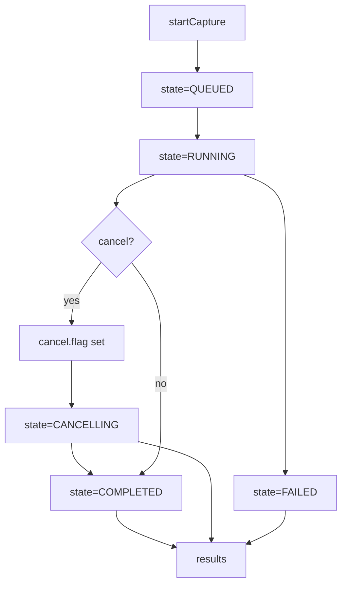

<!-- SPDX-License-Identifier: Apache-2.0 -->
<!-- Copyright (c) 2026 Maurice Garcia -->

# RxMER Orchestration Endpoints

RxMER serving-group orchestration uses a filesystem-backed operation model. The CMTS API creates and tracks job state while PyPNM captures are executed later in the pipeline.

## Lifecycle



## POST /cmts/pnm/rxmer/sg/startCapture

Create a new serving-group RxMER operation. The response returns a new `operation_id` and initial counters.
Status values use numeric `ServiceStatusCode`.

Current behavior (Step 3): startCapture schedules background execution and returns immediately. Status, cancel, and results operate on persisted state and JSONL linkage records. Cancel creates `cancel.flag` and transitions to `CANCELLING`, and the runner transitions to `CANCELLED` when it observes the flag.

Collect-only behavior (Step 9): PyPNM owns PNM artifacts in `.data/pnm/` and authoritative transaction records in `.data/db/transactions.json`. CMTS linkage records store transaction_id and filename pointers for later decode/analysis. See `docs/api/fast-api/pypnm-cmts/sg-operations.md` for the on-disk data model.

Runner-level failures: the runner may synthesize stage outcomes when a per-modem timeout or internal exception occurs. In those cases, `ELIGIBILITY` and `PRECHECK` may be marked successful even if they did not run, and `CAPTURE` carries the failure status. `failure_reason` provides a normalized diagnostic for timeouts or runner-level failures.

Status types: orchestration responses use numeric `ServiceStatusCode`. `PnmCaptureStatus` exists for other capture pipelines but is not used in RxMER orchestration responses.

### Request

```json
{
  "cmts": {
    "serving_group": { "id": [] },
    "cable_modem": {
      "mac_address": [],
      "pnm_parameters": {
        "tftp": { "ipv4": null, "ipv6": null },
        "capture": { "channel_ids": [] }
      },
      "snmp": { "snmpV2C": { "community": "public" } }
    }
  },
  "execution": {
    "max_workers": 16,
    "retry_count": 3,
    "retry_delay_seconds": 5.0,
    "per_modem_timeout_seconds": 30.0,
    "overall_timeout_seconds": 120.0
  }
}
```

### Response

```json
{
  "status": 0,
  "message": "",
  "operation": {
    "operation_id": "1b3f5f3d4f3c4ab29a9ff9a3f0b7c8d1",
    "state": "queued",
    "counters": {
      "total_modems": 0,
      "eligible_modems": 0,
      "precheck_passed": 0,
      "capture_started": 0,
      "completed": 0,
      "success": 0,
      "failed": 0,
      "skipped": 0
    },
    "timestamps": {
      "created_epoch": 1767444600,
      "started_epoch": 0,
      "updated_epoch": 1767444600,
      "finished_epoch": 0
    },
    "request_summary": {
      "serving_group_ids": [],
      "mac_addresses": [],
      "channel_ids": [],
      "execution": {
        "max_workers": 16,
        "retry_count": 3,
        "retry_delay_seconds": 5.0,
        "per_modem_timeout_seconds": 30.0,
        "overall_timeout_seconds": 120.0
      }
    },
    "error_summary": null
  }
}
```

## POST /cmts/pnm/rxmer/sg/status

Return the persisted operation state.
The request payload uses `pnm_capture_operation_id`, while the returned state uses `operation_id`.

### Request

```json
{
  "pnm_capture_operation_id": "1b3f5f3d4f3c4ab29a9ff9a3f0b7c8d1"
}
```

### Response

```json
{
  "status": 0,
  "message": "",
  "operation": {
    "operation_id": "1b3f5f3d4f3c4ab29a9ff9a3f0b7c8d1",
    "state": "queued",
    "counters": {
      "total_modems": 0,
      "eligible_modems": 0,
      "precheck_passed": 0,
      "capture_started": 0,
      "completed": 0,
      "success": 0,
      "failed": 0,
      "skipped": 0
    },
    "timestamps": {
      "created_epoch": 1767444600,
      "started_epoch": 0,
      "updated_epoch": 1767444600,
      "finished_epoch": 0
    },
    "request_summary": {
      "serving_group_ids": [],
      "mac_addresses": [],
      "channel_ids": [],
      "execution": {
        "max_workers": 16,
        "retry_count": 3,
        "retry_delay_seconds": 5.0,
        "per_modem_timeout_seconds": 30.0,
        "overall_timeout_seconds": 120.0
      }
    },
    "error_summary": null
  }
}
```

## POST /cmts/pnm/rxmer/sg/results

Return linkage records for an operation. The response includes records only when the dataset is small enough to inline.
The request payload uses `pnm_capture_operation_id`, while the returned state uses `operation_id`.

### Request

```json
{
  "pnm_capture_operation_id": "1b3f5f3d4f3c4ab29a9ff9a3f0b7c8d1"
}
```

### Response

```json
{
  "status": 0,
  "message": "no results recorded",
  "summary": {
    "record_count": 0,
    "included_count": 0,
    "files_scanned": 0
  },
  "records": []
}
```

## POST /cmts/pnm/rxmer/sg/cancel

Request cancellation for an operation.
The request payload uses `pnm_capture_operation_id`, while the returned state uses `operation_id`.

### Request

```json
{
  "pnm_capture_operation_id": "1b3f5f3d4f3c4ab29a9ff9a3f0b7c8d1"
}
```

### Response

```json
{
  "status": 0,
  "message": "",
  "operation": {
    "operation_id": "1b3f5f3d4f3c4ab29a9ff9a3f0b7c8d1",
    "state": "cancelling",
    "counters": {
      "total_modems": 0,
      "eligible_modems": 0,
      "precheck_passed": 0,
      "capture_started": 0,
      "completed": 0,
      "success": 0,
      "failed": 0,
      "skipped": 0
    },
    "timestamps": {
      "created_epoch": 1767444600,
      "started_epoch": 0,
      "updated_epoch": 1767444610,
      "finished_epoch": 0
    },
    "request_summary": {
      "serving_group_ids": [],
      "mac_addresses": [],
      "channel_ids": [],
      "execution": {
        "max_workers": 16,
        "retry_count": 3,
        "retry_delay_seconds": 5.0,
        "per_modem_timeout_seconds": 30.0,
        "overall_timeout_seconds": 120.0
      }
    },
    "error_summary": null
  }
}
```
