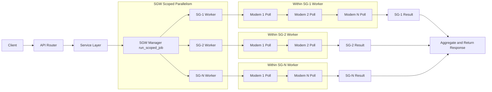

# Serving Group Endpoints

Cache-First Serving Group Endpoints Backed By SGW Snapshots. These endpoints do not trigger discovery or refresh; they return the latest cached snapshot and metadata.

## Common Fields

Response payloads include:

- `timestamp` ISO-8601 response timestamp
- `metadata.snapshot_time_epoch` epoch seconds for the cached snapshot
- `metadata.age_seconds` elapsed seconds since snapshot time, computed at request time
- `metadata.refresh_state` one of `OK`, `STALE`, or `ERROR`
- `metadata.last_error` bounded error message when present

Unless otherwise noted, examples use:

- MAC address: `aa:bb:cc:dd:ee:ff`
- IPv4 address: `192.168.0.100`

## GET /cmts/servingGroup/status

Return SGW Startup And Cache Readiness Status. This endpoint reports the discovered SG count, cache readiness, missing cache entries, and whether the background refresh loop is running.

Response:

```json
{
  "status": 0,
  "message": "sgw cache not ready",
  "timestamp": "2026-01-03T05:05:45.760643+00:00",
  "startup_status": {
    "startup_completed": true,
    "discovery_ok": true,
    "discovered_sg_ids": [1, 2],
    "last_refresh_epoch": 1767416694.071116,
    "error_message": "",
    "prime_failed": false
  },
  "refresh_running": false,
  "discovered_count": 2,
  "cache_ready": false,
  "missing_sg_ids": [2]
}
```

## GET /cmts/servingGroup/get/ids

Return Discovered Service Group Identifiers And Per-SG Cache Summaries. This endpoint returns HTTP 200 with `status` set to success even when `sgw_ready` is false; in that case, `message` is non-empty and summaries for missing snapshots report `refresh_state=ERROR` with a bounded `last_error`.
Uses runtime CMTS adapter settings (hostname/community/port) from system.json/env/CLI; request body is not required.
Startup discovery mode controls whether SG IDs are enumerated via SNMP (default) or from a static list.

Example:

```bash
curl -s http://127.0.0.1:8000/cmts/servingGroup/get/ids
```

Response:

```json
{
  "status": 0,
  "message": "",
  "timestamp": "2026-01-03T05:05:45.760643+00:00",
  "discovered_sg_ids": [1, 2],
  "sgw_ready": true,
  "summaries": [
    {
      "sg_id": 1,
      "metadata": {
        "snapshot_time_epoch": 1767416694.071116,
        "age_seconds": 0,
        "last_heavy_refresh_epoch": 1767416694.071116,
        "last_light_refresh_epoch": 1767416694.071116,
        "refresh_state": "OK",
        "last_error": null
      }
    }
  ]
}
```

## POST /cmts/servingGroup/get/cableModems

Return Cached Cable Modem Membership Grouped By Service Group. The request uses `cmts.serving_group.id` and is cache-first.
When a snapshot is missing for a discovered SG, the group returns empty items and `metadata.refresh_state` is `ERROR` with a bounded `last_error`.
Channel set values are populated from CMTS registration status when available; defaults are `0` otherwise.
Registration status is returned as an object with numeric `status` and decoded `text` tokens; unknown values map to `other`.
Heavy refresh also snapshots per-modem `sysdescr` into SGW cache.
By default, this endpoint returns data from the latest SGW heavy-poll snapshot.
If refresh is requested, the endpoint should use refreshed cache data when available.

Request body:

```json
{
  "cmts": {
    "serving_group": {
      "id": []
    }
  },
  "page": 1,
  "page_size": 100,
  "refresh": {
    "mode": "none",
    "wait_for_cache": false,
    "timeout_seconds": 8
  }
}
```

Semantics:
- `cmts.serving_group.id: []` means all discovered service groups.
- `cmts.serving_group.id: [3147266]` means a single service group.
- `cmts.serving_group.id: [3147266, 3213825]` means multiple service groups.
- Default response source is SGW heavy-poll cache snapshot data.
- Heavy-poll `sysdescr` fetch uses the configured CM default write community (`cm_snmpv2c_write_community`) as a single selected value.
- No SNMP community fallback/cycling is performed for heavy-poll `sysdescr` collection.
- Heavy-poll modem `sysdescr` logs include modem context: `sg_id`, `mac`, `ip`, and `community`.
- `refresh.mode` supports `none`, `light`, `heavy`.
- `refresh.wait_for_cache` waits for SGW snapshot advance when refresh mode is not `none`.
- `refresh.timeout_seconds` controls wait duration in seconds (default `8`).
- Unknown fields are ignored but not supported for this endpoint.

Response:

```json
{
  "status": 0,
  "message": "",
  "timestamp": "2026-01-03T06:39:23.046738+00:00",
  "requested_sg_ids": [],
  "resolved_sg_ids": [3147266, 3213825],
  "missing_sg_ids": [],
  "refresh": {
    "requested": false,
    "mode": "none",
    "applied": false,
    "wait_for_cache": false,
    "advanced": false,
    "timeout_seconds": 8,
    "message": ""
  },
  "groups": [
    {
      "sg_id": 3147266,
      "page": 1,
      "page_size": 100,
      "total_items": 1,
      "total_pages": 1,
      "items": [
        {
          "mac_address": "aa:bb:cc:dd:ee:ff",
          "ipv4": "192.168.0.100",
          "ipv6": "",
          "sysdescr": {
            "HW_REV": "1A",
            "VENDOR": "LANCity",
            "BOOTR": "LANCity-Boot-1.0.0",
            "SW_REV": "LANCity-7.3.5.0",
            "MODEL": "LANCity-D3.1",
            "is_empty": false
          },
          "ds_channel_ids": [10],
          "us_channel_ids": [20],
          "registration_status": {
            "status": 8,
            "text": "operational"
          }
        }
      ],
      "metadata": {
        "snapshot_time_epoch": 1767417069.3638031,
        "age_seconds": 0,
        "last_heavy_refresh_epoch": 1767417069.3638031,
        "last_light_refresh_epoch": 1767417069.3638031,
        "refresh_state": "OK",
        "last_error": null
      }
    }
  ]
}
```

Example: single SG id

```json
{
  "cmts": {
    "serving_group": {
      "id": [3147266]
    }
  },
  "page": 1,
  "page_size": 100
}
```

Example: multiple SG ids

```json
{
  "cmts": {
    "serving_group": {
      "id": [3147266, 3213825]
    }
  },
  "page": 1,
  "page_size": 100
}
```

## POST /cmts/servingGroup/get/topology

Return RF topology and cable-modem membership for one service group or all discovered service groups.
Endpoint Constraints: empty list means all service groups; a single id returns one group; multiple ids are rejected.
This endpoint is cache-first and does not block waiting for refresh completion.

Request body:

```json
{
  "cmts": {
    "serving_group": {
      "id": []
    }
  },
  "page": 1,
  "page_size": 100
}
```

## POST /cmts/servingGroup/cableModem/operations/docsDevResetNow

Issue `docsDevResetNow` to cable modems resolved from serving-group and MAC scope.
This endpoint is cache-backed for scope resolution and then sends per-modem SNMP reset commands.
OpenAPI tag: `CMTS Serving Group CableModem Operations`.

Request body:

```json
{
  "cmts": {
    "serving_group": {
      "id": []
    },
    "cable_modem": {
      "mac_address": [],
      "snmp": {
        "snmpV2C": {
          "community": "private"
        }
      }
    }
  }
}
```

Semantics:
- `cmts.serving_group.id: []` means all discovered service groups.
- `cmts.cable_modem.mac_address: []` means all cable modems in resolved service groups.
- `cmts.cable_modem.snmp.snmpV2C.community` is optional; system default write community is used when omitted or null.
- `pnm_parameters` is not part of this endpoint request.
- Post-reset verification uses ICMP ping:
- The service waits for ping failure as reset confirmation.
- If ping stays reachable, it retries up to 5 checks with 2-second delay between checks.
- If ping remains reachable after all retries, that modem is marked failed.

Response:

```json
{
  "status": 0,
  "message": "",
  "timestamp": "2026-02-13T20:15:30+00:00",
  "requested_sg_ids": [3147266],
  "requested_mac_addresses": ["aa:bb:cc:dd:ee:02"],
  "resolved_sg_ids": [3147266],
  "missing_sg_ids": [],
  "missing_mac_addresses": [],
  "groups": [
    {
      "service_group_id": 3147266,
      "status": 0,
      "message": "",
      "modem_count": 1,
      "success_count": 1,
      "failure_count": 0,
      "modems": {
        "aa:bb:cc:dd:ee:02": {
          "ip_address": "192.168.0.102",
          "status": 0,
          "message": "docsDevResetNow verified by ping failure after 2 attempt(s)",
          "ping_attempts": 2,
          "ping_last_reachable": false
        }
      }
    }
  ]
}
```

## POST /cmts/servingGroup/cableModem/operations/getSysDescr

Collect `sysDescr` for cable modems resolved from serving-group and MAC scope.
This endpoint is cache-backed for scope resolution and executes SG-scoped worker polling through SGW manager dispatch.
OpenAPI tag: `CMTS Serving Group CableModem Operations`.

Request body:

```json
{
  "cmts": {
    "serving_group": {
      "id": []
    },
    "cable_modem": {
      "mac_address": []
    }
  },
  "poll": {
    "source": "cache",
    "wait_for_cache": false,
    "timeout_seconds": 8
  }
}
```

Heavy-refresh request example:

```json
{
  "cmts": {
    "serving_group": {
      "id": [3147266]
    },
    "cable_modem": {
      "mac_address": []
    }
  },
  "poll": {
    "source": "heavy",
    "wait_for_cache": true,
    "timeout_seconds": 8
  }
}
```

Semantics:
- `cmts.serving_group.id: []` means all discovered service groups.
- `cmts.cable_modem.mac_address: []` means all cable modems in resolved service groups.
- `poll.source` supports `cache` and `heavy`.
- `poll.source=cache` uses current SGW cache scope (no on-demand refresh request).
- `poll.source=heavy` requests SGW heavy refresh for resolved SG ids before scope resolution.
- `poll.wait_for_cache` only applies when `poll.source=heavy`; when true, the endpoint waits for cache snapshot advance (bounded by `poll.timeout_seconds`) before resolving scope.
- Response includes `poll.type` to carry the effective request poll source (`cache` or `heavy`).
- Community is not request-configurable on this endpoint; it is resolved from `SystemConfigSettings.snmp_read_community`, then CMTS SNMPv2c read community.

Execution model:



Response:

```json
{
  "status": 0,
  "message": "",
  "timestamp": "2026-02-15T01:15:42+00:00",
  "poll": {
    "type": "cache"
  },
  "groups": [
    {
      "sg_id": 3147266,
      "status": 0,
      "message": "",
      "modem_count": 2,
      "success_count": 2,
      "failure_count": 0,
      "modems": {
        "aa:bb:cc:dd:ee:01": {
          "sysdescr": {
            "HW_REV": "1A",
            "VENDOR": "LANCity",
            "BOOTR": "LANCity-Boot-1.0.0",
            "SW_REV": "LANCity-7.3.5.0",
            "MODEL": "LANCity-D3.1",
            "is_empty": false
          }
        },
        "aa:bb:cc:dd:ee:02": {
          "sysdescr": {
            "HW_REV": "",
            "VENDOR": "",
            "BOOTR": "",
            "SW_REV": "",
            "MODEL": "",
            "is_empty": true
          }
        }
      }
    }
  ]
}
```

Single service group request:

```json
{
  "cmts": {
    "serving_group": {
      "id": [3147266]
    }
  },
  "page": 1,
  "page_size": 100
}
```

Invalid request (multiple ids):

```json
{
  "cmts": {
    "serving_group": {
      "id": [3147266, 3213825]
    }
  }
}
```

Response (grouped by service group). OFDMA entries omit center_frequency_hz and start_frequency_hz; use lower_frequency_hz, upper_frequency_hz, and channel_width_hz.

```json
{
  "status": 0,
  "message": "",
  "timestamp": "2026-01-03T05:05:45.760643+00:00",
  "requested_sg_ids": [],
  "resolved_sg_ids": [3147266],
  "missing_sg_ids": [],
  "groups": [
    {
      "sg_id": 3147266,
      "ds_ch_set_id": 10,
      "us_ch_set_id": 20,
      "channels": {
        "ds": {
          "sc_qam": [
            {
              "channel_id": 1,
              "channel_type": "sc_qam",
              "center_frequency_hz": 300000000,
              "channel_width_hz": 6000000,
              "lower_frequency_hz": 297000000,
              "upper_frequency_hz": 303000000
            }
          ],
          "ofdm": [
            {
              "channel_id": 33,
              "channel_type": "ofdm",
              "plc_frequency_hz": 330000000,
              "channel_width_hz": null,
              "lower_frequency_hz": 300000000,
              "upper_frequency_hz": 400000000
            }
          ],
          "counts": [
            {
              "channel_id": 1,
              "modem_count": 2
            },
            {
              "channel_id": 33,
              "modem_count": 2
            }
          ],
          "set_counts": [
            {
              "ch_set_id": 10,
              "modem_count": 2
            }
          ]
        },
        "us": {
          "sc_qam": [
            {
              "channel_id": 5,
              "channel_type": "sc_qam",
              "center_frequency_hz": 50000000,
              "channel_width_hz": 6400000,
              "lower_frequency_hz": 46800000,
              "upper_frequency_hz": 53200000
            }
          ],
          "ofdma": [],
          "counts": [
            {
              "channel_id": 5,
              "modem_count": 2
            }
          ],
          "set_counts": [
            {
              "ch_set_id": 20,
              "modem_count": 2
            }
          ]
        }
      },
      "page": 1,
      "page_size": 100,
      "total_items": 2,
      "total_pages": 1,
      "modems": ["aa:bb:cc:dd:ee:01", "aa:bb:cc:dd:ee:ff"],
      "metadata": {
        "snapshot_time_epoch": 1767416694.071116,
        "age_seconds": 0,
        "last_heavy_refresh_epoch": 1767416694.071116,
        "last_light_refresh_epoch": 1767416694.071116,
        "refresh_state": "OK",
        "last_error": null
      }
    }
  ]
}
```
