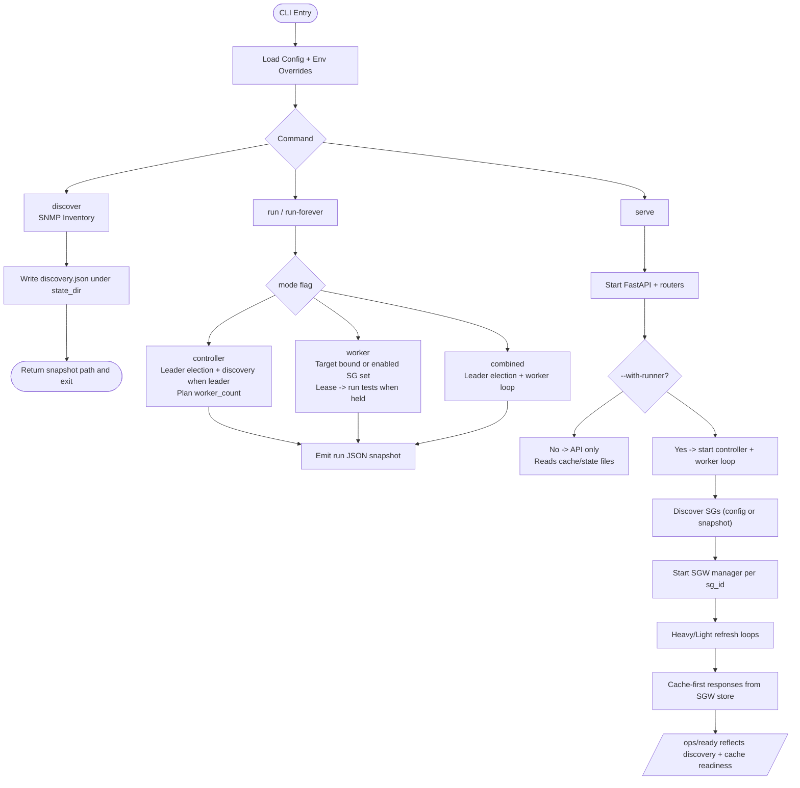

# PyPNM-CMTS Mode Contract (Current Snapshot)

## Surface Area Summary

Supported invocation styles:
- `pypnm-cmts …`
- `python -m pypnm_cmts.cli …`

Commands:
- `run` (single tick; prints JSON)
- `run-forever` (continuous ticks; prints JSON; optional max ticks)
- `discover` (SNMP discovery; can persist snapshot)
- `serve` (FastAPI / Uvicorn; add `--with-runner` to host the controller and worker in a single process)

Modes (`OrchestratorMode`):
- `standalone`
- `controller`
- `worker`
- `combined`

## Default Orchestrator Settings

Operationally relevant defaults (from the default dump):

- `mode`: `standalone`
- `adapter.kind`: `snmp`
- `adapter.hostname`: `""`
- `adapter.community`: `public`
- `adapter.port`: `161`
- `service_groups`: `[]`
- `auto_discover`: `false`
- `default_tests`: `["ds_ofdm_rxmer"]`
- `tick_interval_seconds`: `1.0`
- `leader_ttl_seconds`: `10`
- `lease_ttl_seconds`: `10`
- `state_dir`: `.data/coordination`
- `election_name`: `""`

Validator guarantees (high level):
- `shard_mode ∈ {"sequential","score"}` (default `sequential`)
- `target_service_groups >= 0`
- `worker_cap >= 0`
- `tick_interval_seconds > 0`
- `state_dir` non-empty and coerced to `Path`

## Runtime Responsibilities By Mode (Current Behavior)

### Controller

Leader-election tick only. Discovers inventory when leader; otherwise reuses snapshot or configured SG list. Computes `worker_count` for planning and never runs tests. Output includes `coordination_tick` with leadership and lease details.

### Worker

No leader election. Inventory priority: discovery snapshot -> enabled SG config -> error when discovery is required but no snapshot exists. Bound workers target one SG; unbound workers target the enabled SG set. Requests leases and runs tests only when a lease is held; writes results under `state_dir/results/sg_<id>/`.

### Standalone

Coordination-only tick without leader election. Uses config/discovery for SGs. Useful for coordination validation; does not run worker tests.

### Combined

Controller and worker loops in one process. Activated via `serve --with-runner` or `--mode combined` on runner commands. Runs leader election, acquires leases, writes `pids/` records, and executes tests whenever a lease is held.

## State Directory Contract

Base directory:
- `state_dir` default: `.data/coordination`
- Created if missing (`mkdir(parents=True, exist_ok=True)`)

Observed subpaths:
- `inventory/discovery.json` (discovery snapshot)
- `results/sg_<sg_id>/<run_id>_<test_name>.json` (worker results)
- `pids/controller.pid`
- `pids/worker_unbound.pid`
- `pids/worker_<sg>.pid`

Leader/lease persistence:
- Leader election and lease services store JSON + lock files under `state_dir` (exact filenames depend on implementation).

## Major Gaps / Inconsistencies (High Priority)

### Standalone and Combined Semantics

Standalone remains coordination-only: it manages leadership records and ensures leases can be acquired, but it does not run worker tests. Combined mode is now implemented via `serve --with-runner`. That flag boots an in-process controller + worker loop that runs leader election, acquires leases, writes the same `pids/` records, and executes worker tests whenever it holds a lease. This makes combined the go-to option when a single API process must also be the runner.

### Controller Computes worker_count, but Workers Don’t Consume “Shard Assignments”

Current contract is effectively:
- workers are stateless
- leases are the only assignment mechanism
- `worker_count` is advisory (for deployment scaling, not direct execution control)

This should be explicitly documented.

### Election Name / Owner Id Normalization Should Be Explicit

Clarify:
- what happens when `owner_id == ""` (hostname-derived, persisted)
- how `election_name` is derived when blank
- uniqueness expectations (per CMTS)

### CLI Warning on TFTP remote_dir During --help

Message observed:
- `Empty configuration value for 'PnmFileRetrieval.retrieval_method.methods.tftp.remote_dir'; using default ''`

Likely issues:
- path typo: `retrival_method` vs `retrieval_method`
- warning policy: `--help` should be quiet and side-effect free

## Practical Mode Contract Table (Current Behavior)

| Mode        | Leader Election | Inventory Source (preferred)                      | Lease Acquisition | Runs Tests | Typical Use |
|-------------|------------------|---------------------------------------------------|------------------|-----------|-------------|
| controller  | Yes              | discovery snapshot (if leader) / snapshot / config | Yes              | No        | Coordination + planning |
| worker      | No               | discovery snapshot or config SG list              | Yes              | Yes       | Distributed execution |
| standalone  | No               | config/discovery                                  | Yes              | No        | Coordination-only (today) |
| combined    | Yes              | config/discovery (controller-style)               | Yes              | Yes       | Controller + worker inside `serve --with-runner` |

## Startup Flow And SGW Interaction

Startup is deterministic across commands: parse CLI, load config and env overrides, resolve mode, then follow the chosen command path. SGW startup is gated on discovery output so cache-first endpoints never issue implicit SNMP walks.

## Recommended Next Step (Concrete)

1) Make `--help` quiet (avoid config warnings during CLI parsing).
2) Document the `serve --with-runner` combined-mode contract, including how it drives leader election, leases, test execution, and CLI activation.
3) Add a short doc page encoding:
   - `state_dir` layout
   - snapshot lifecycle (`discover` writes; workers read)
   - lease semantics (one SG per worker per tick)
   - how `worker_count` is intended to drive deployment scaling
