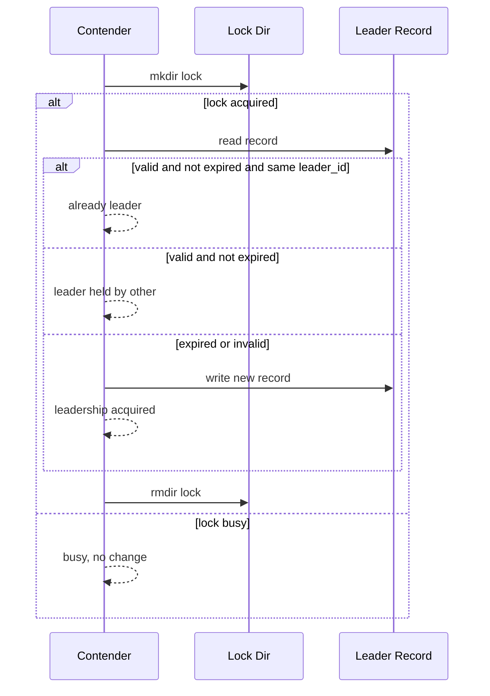
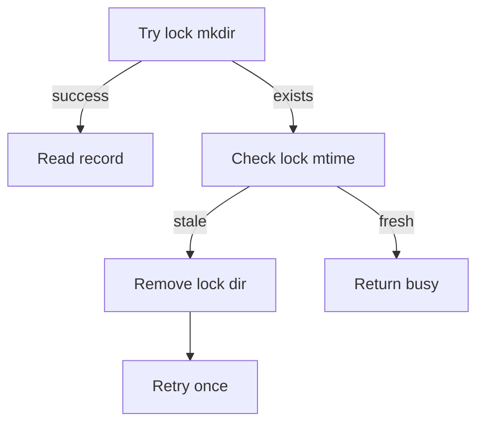
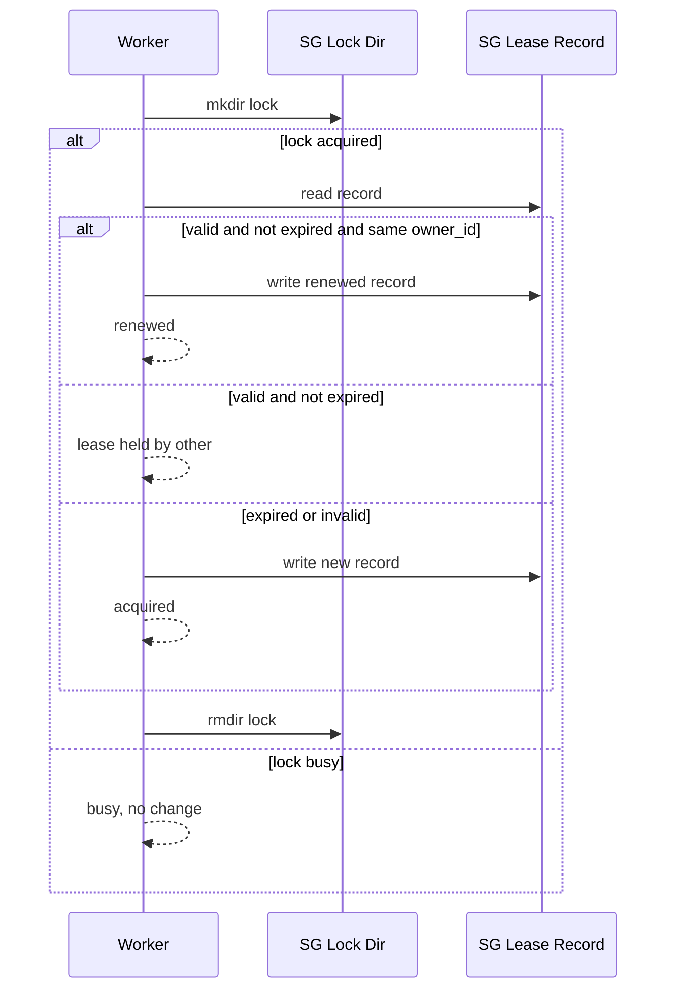
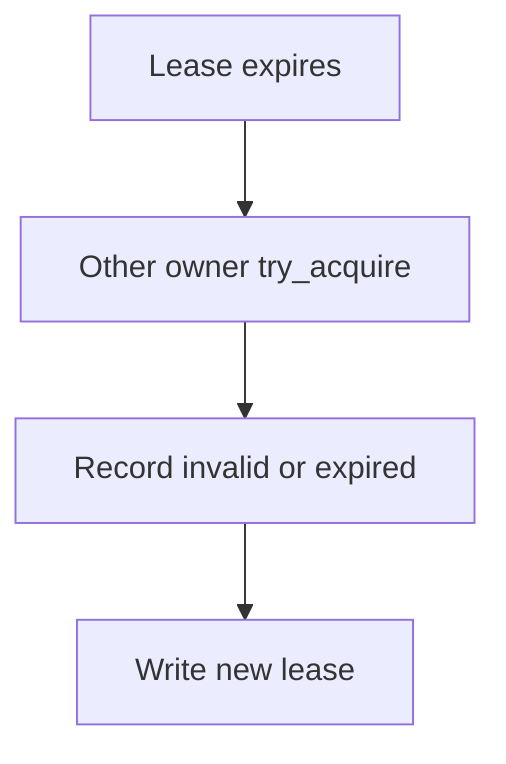
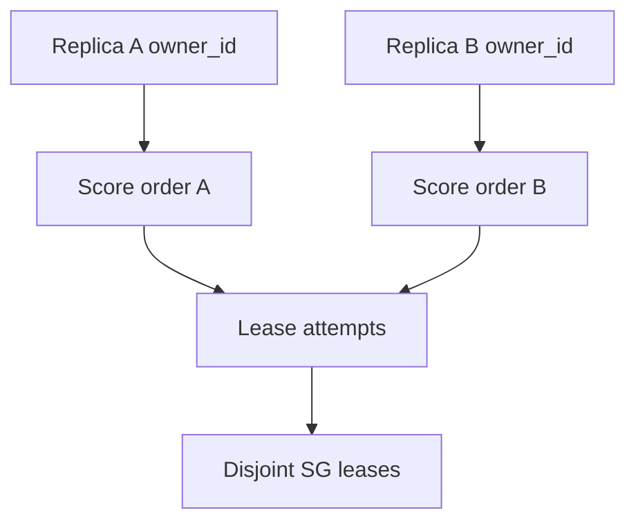

# Coordination

## Coordination Overview

Coordination provides two guarantees:
- Single leader for CMTS-wide actions.
- Service Group (SG) partitioning across replicas using per-SG leases.

Key identifiers:
- election_name: Shared namespace for leader election and leases.
- leader_id: Identity used for leader election ownership.
- owner_id: Identity used for service group lease ownership.
- sg_id: Service Group identifier.

TTL model:
- Each record stores acquired_at and expires_at.
- Renewal is required before expires_at.
- Expired records may be claimed by another contender.

## Replica and Worker Semantics

Replica definition:
- Replica = one running PyPNM-CMTS process or container instance.

Service group mapping:
- A replica's held SG leases define the SGs it is responsible for.
- Each held lease corresponds to one logical SG worker inside the replica.
- Worker pool size is bounded by target_service_groups and any future worker_cap.

Leader election meaning:
- Leader election is acquired or renewed each tick.
- SG lease acquisition is not gated by leader state.
- Leadership is reserved for controller-only duties later.

Shard mode overview:
- sequential orders SGs by ascending sg_id.
- score orders SGs by a stable score derived from owner_id and sg_id.
- score mode reduces herd contention and stabilizes partitioning across replicas.

## Filesystem State Layout

Record and lock paths:
- <state_dir>/<election_name>.json
- <state_dir>/<election_name>.lock/
- <state_dir>/<election_name>.sg-<sg_id>.json
- <state_dir>/<election_name>.sg-<sg_id>.lock/

Record contents (high level):
- Leader record: election_name, leader_id, acquired_at, expires_at.
- SG lease record: election_name, sg_id, owner_id, acquired_at, expires_at.

Lock directories guard record mutation and may be removed if stale.

## FileLeaderElection Behavior

Sequence: try_acquire()



Stale lock detection and cleanup:



Behavior notes:
- Expired records are replaced by the new contender.
- Corrupt JSON or invalid numeric fields are treated as missing records.
- election_name mismatch is treated as invalid and ignored.

## FileServiceGroupLease Behavior

Sequence: try_acquire() and renew()



Expiry handoff:



Behavior notes:
- Ownership mismatch prevents renew.
- Corrupt JSON or invalid numeric fields are treated as missing records.
- election_name mismatch is treated as invalid and ignored.

## Coordination Flow

CoordinationManager.tick() phases:

```mermaid
flowchart TD
    A[Tick start] --> B[Leader try_acquire]
    B --> C[Leader renew if held]
    C --> D[Renew held SG leases\n(ascending sg_id)]
    D --> E[Release extras\n(descending sg_id)]
    E --> F[Acquire until target\n(mode order + fallback)]
    F --> G[Return CoordinationTickResultModel]
```

Replica convergence with score sharding:



## CoordinationManager Tick Loop

Tick flow:

```mermaid
flowchart TD
    A[Tick start] --> B[Leader try_acquire]
    B --> C[Leader renew if held]
    C --> D[Renew held SG leases
(ascending sg_id)]
    D --> E[Release extras
(descending sg_id)]
    E --> F[Acquire if held < target
(mode-specific order + fallback)]
    F --> G[Return CoordinationTickResultModel]
```

Deterministic ordering rules:
- Renew held leases in ascending sg_id order.
- Release extras in descending sg_id order.
- Acquire ordering depends on shard_mode with fallback to ascending sg_id.

## Sharding Modes

sequential:
- Candidates in ascending sg_id order.

score:
- Compute score = sha256("owner_id:sg_id") using the first SCORE_DIGEST_BYTES.
- Sort by score descending, tie-break by sg_id ascending.

Fallback:
- After score-ordered attempts, remaining SGs are tried in ascending order.

```mermaid
flowchart TD
    A[Candidate SGs] --> B{shard_mode}
    B -->|sequential| C[Sort by sg_id asc]
    B -->|score| D[Score order desc
(tie: sg_id asc)]
    C --> E[Attempt acquire]
    D --> E
    E --> F{held < target}
    F -->|yes| G[Fallback: remaining SGs asc]
    F -->|no| H[Done]
```

## Configuration and Tuning

Key parameters:
- leader_ttl_seconds: Leader lease duration.
- lease_ttl_seconds: SG lease duration.
- target_service_groups: Max SG leases per replica.
- shard_mode: sequential or score.
- owner_id: Explicit owner id override; otherwise derived from hostname or persisted in state_dir.

Operational guidance:
- Tick interval should be well below TTL (for example, 1/3 to 1/2 of TTL).
- SG workers scale with Service Group count.
- Worker pool size should be configurable and capped, for example min(num_sgs, cap).

Wiring note:
- TODO: Resolve owner_id via OwnerIdResolver and pass coordination settings into CoordinationManager in the CLI or launcher path.

## Failure Modes and Expectations

- Process crash: lock becomes stale and is removed; leases expire and are reclaimed.
- File backend is single-host oriented; future Redis and Kubernetes backends should
  preserve the same interfaces and semantics.

## Minimal Usage Example

```python
from pathlib import Path

from pypnm_cmts.coordination import CoordinationManager
from pypnm_cmts.coordination.models import CoordinationElectionName, LeaderId, OwnerId
from pypnm_cmts.lib.types import ServiceGroupId

state_dir = Path("./coordination")
manager = CoordinationManager(
    state_dir=state_dir,
    election_name=CoordinationElectionName("cmts-main"),
    leader_id=LeaderId("leader-1"),
    owner_id=OwnerId("worker-1"),
    leader_ttl_seconds=10,
    lease_ttl_seconds=10,
    target_service_groups=2,
    shard_mode="score",
)

service_groups = [ServiceGroupId(1), ServiceGroupId(2), ServiceGroupId(3)]
result = manager.tick(service_groups)
status = manager.status()
leader_status = manager.leader_status()
```

Download: [coordination/index.md](index.md)
