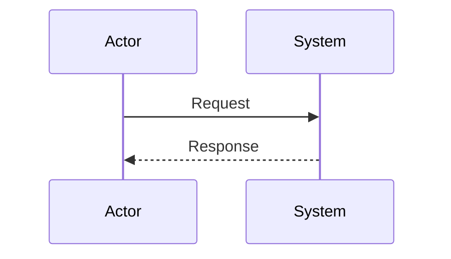
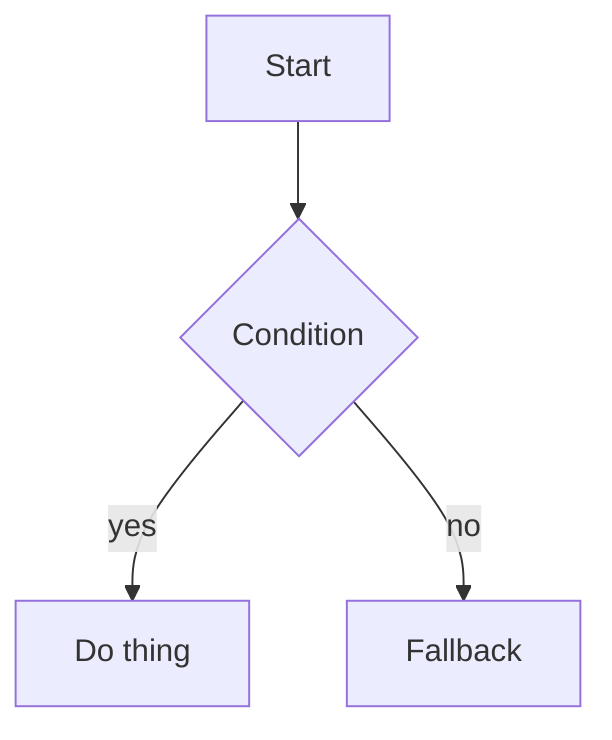

# Mermaid Examples

## Sequence Example

```mermaid
sequenceDiagram
    participant A as Actor
    participant B as System
    A->>B: Request
    B-->>A: Response
```

## Flowchart Example

```mermaid
flowchart TD
    A[Start] --> B{Condition}
    B -->|yes| C[Do thing]
    B -->|no| D[Fallback]
```

Download: [coordination/mermaid-examples.md](mermaid-examples.md)
