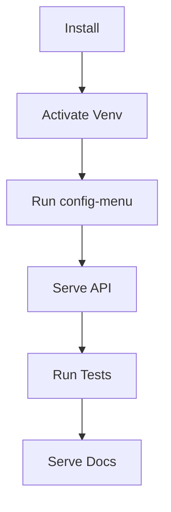

# Install

Installation and setup notes for PyPNM-CMTS.

## Quick install

Run the installer from the repo root:

```bash
./install.sh
```

## Post-install quickstart

Activate the virtual environment:

```bash
source .env/bin/activate
```

Run the CLI help:

```bash
pypnm-cmts --help
```

Run the service help:

```bash
pypnm-cmts serve --help
```

Configure system.json with the interactive config menu:

```bash
pypnm-cmts config-menu
```

Start the FastAPI service:

```bash
pypnm-cmts serve
```

The service binds to `127.0.0.1:8000` by default and loads CMTS adapter
settings from `system.json`. Use `pypnm-cmts config-menu` to set the CMTS
hostname and SNMP communities, or pass `--cmts-hostname` and `--read-community`
as overrides.

Run tests:

```bash
python -m pytest -v
```

Run docs locally:

```bash
python -m mkdocs serve
```



## Common modes

Use a custom virtual environment directory:

```bash
./install.sh .env-dev
```

Development mode:

```bash
./install.sh --development
```

Development mode attempts to install gitleaks via the system package manager and
falls back to a GitHub release download when the package is unavailable.

Update to the latest GA or hot-fix tag (or pass a tag explicitly):

```bash
./install.sh --update-ga
./install.sh --update-ga v0.1.39.0
./install.sh --update-hot-fix
./install.sh --update-hot-fix v0.1.39.1
```

Clean or uninstall local install artifacts:

```bash
./install.sh --clean
./install.sh --uninstall
```
