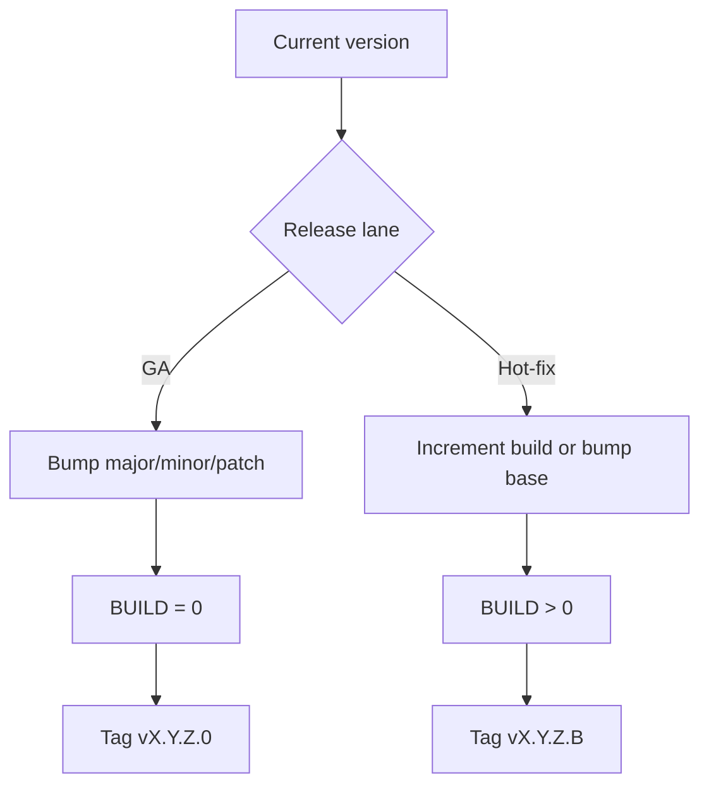
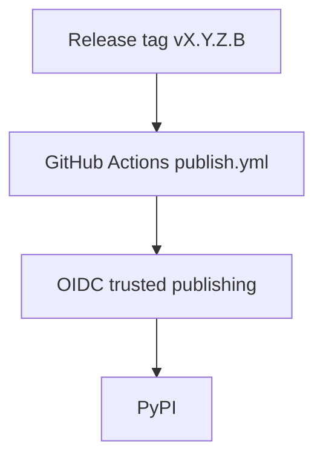

# PyPNM-CMTS Release Guide

## Table of contents

[1. Branch model](#1-branch-model)

[2. Version source of truth](#2-version-source-of-truth)

[3. Versioning scheme](#3-versioning-scheme)

[4. Release helper overview](#4-release-helper-overview)

[5. Release commands](#5-release-commands)

[6. Release lanes](#6-release-lanes)

[7. CI expectations](#7-ci-expectations)

[8. Release workflow](#8-release-workflow)

[9. Publishing](#9-publishing)

This guide follows the PyPNM release strategy and uses the same four-part versioning scheme.
The release entry point is `pypnm-cmts-release`.

## 1. Branch model

PyPNM-CMTS currently follows a single-branch release model:

* `main` is the release branch.
* Feature branches are optional and short-lived.

## 2. Version source of truth

The canonical version lives in:

```text
src/pypnm_cmts/version.py
```

The `pyproject.toml` version mirrors it and must match at all times.

Example:

```python
from __future__ import annotations

__all__ = ["__version__"]

# MAJOR.MINOR.PATCH.BUILD
__version__: str = "0.1.0.0"
```

## 3. Versioning scheme

PyPNM-CMTS uses a four-part version:

```text
MAJOR.MINOR.PATCH.BUILD
```

Guidelines:

* `MAJOR` for breaking changes.
* `MINOR` for backward-compatible features.
* `PATCH` for compatible bug fixes.
* `BUILD` for hot-fix releases or rebuilds.

Release lanes:

* GA tag format: `vMAJOR.MINOR.PATCH.0`
* Hot-fix tag format: `vMAJOR.MINOR.PATCH.BUILD` where `BUILD != 0`

## 4. Release helper overview

The release helper:

* Reads `src/pypnm_cmts/version.py`.
* Confirms it matches `pyproject.toml`.
* Computes a target version based on the four-part scheme.
* Runs repository hygiene checks (secrets + MAC scans).
* Prompts to run the pretest runner (`tools/release/test-runner.py`) before pytest.
* Runs pytest (unless `--skip-tests` is used).
* Optionally runs docker + Kubernetes smoke checks.
* Builds docs with `mkdocs --strict`.
* Updates versions, commits, tags, and pushes on success.
* Supports dry-run output without modifying files or running tests.

## 5. Release commands

### 5.1 Default GA maintenance release (build = 0)

```bash
pypnm-cmts-release
```

### 5.2 GA with explicit bump lane

```bash
pypnm-cmts-release --next minor
```

### 5.3 Hot-fix release (build bump)

```bash
pypnm-cmts-release --next build
```

### 5.4 Release explicit version

```bash
pypnm-cmts-release --version 0.2.1.0
```

### 5.5 Dry run (`--dry-run`)

```bash
pypnm-cmts-release --next maintenance --dry-run
```

### 5.6 Skip pretest runner prompt

```bash
pypnm-cmts-release --next maintenance --skip-pretest
```

## 6. Release lanes



## 7. CI expectations

CI must validate:

* Python 3.10, 3.11, 3.12, 3.13
* `ruff` checks
* `pytest`
* `mkdocs build --strict`
* `python -m build` (sdist + wheel)

CI is build-only; publishing is not performed by default.
The CI workflow lives in `.github/workflows/ci.yml` and enforces these steps.

## 8. Release workflow

Use this flow for routine releases on `main`:

```bash
pypnm-cmts-release --next maintenance --dry-run
pypnm-cmts-release --next maintenance
```

Hot-fix releases use the build bump lane:

```bash
pypnm-cmts-release --next build
```

The release helper requires a clean working tree before running the verification runner.

## 9. Publishing

PyPNM-CMTS uses GitHub Actions trusted publishing (OIDC) as the default path to PyPI.
Manual publishing with `pypnm-cmts-publish` is a fallback option.

### 9.1 Manual publish (token)

Set `PYPI_API_TOKEN` or provide it interactively when prompted:

```bash
pypnm-cmts-publish
```

Flags:

* `--clean` removes `dist/` before build
* `--skip-build` reuses existing artifacts
* `--skip-check` skips `twine check`
* `--dry-run` runs build/check without upload
* `--yes` skips the confirmation prompt
* `--force` uploads even if the version exists on PyPI
* `--skip-existing` (default) skips upload if the version already exists on PyPI

### 9.2 GitHub Actions trusted publishing

Configure a PyPI trusted publisher with:

* Repository: `PyPNMApps/PyPNM-CMTS`
* Workflow file: `publish.yml`
* Environment: `pypi`

The publish workflow supports:

* `workflow_dispatch` with `force_publish` input
* Tag-triggered publishes for tags matching `vMAJOR.MINOR.PATCH.BUILD`
* Skips publishing if the version already exists on PyPI (unless `force_publish` is true)

If you see `invalid-publisher`, verify the repository, workflow filename, and environment name match the trusted publisher configuration.



### 9.3 PyPI setup checklist

* Create the PyPI project `pypnm-docsis-cmts`.
* Create a PyPI API token for manual publishing (fallback).
* Configure a trusted publisher:
  * Repository: `PyPNMApps/PyPNM-CMTS`
  * Workflow file: `publish.yml`
  * Environment: `pypi`
* Create GitHub Environment `pypi` (optional approval gates).

### 9.4 Publish skipping behavior

The publish workflow checks PyPI before uploading. If the release version already exists, publishing is skipped unless `force_publish` is set to true on `workflow_dispatch`.
