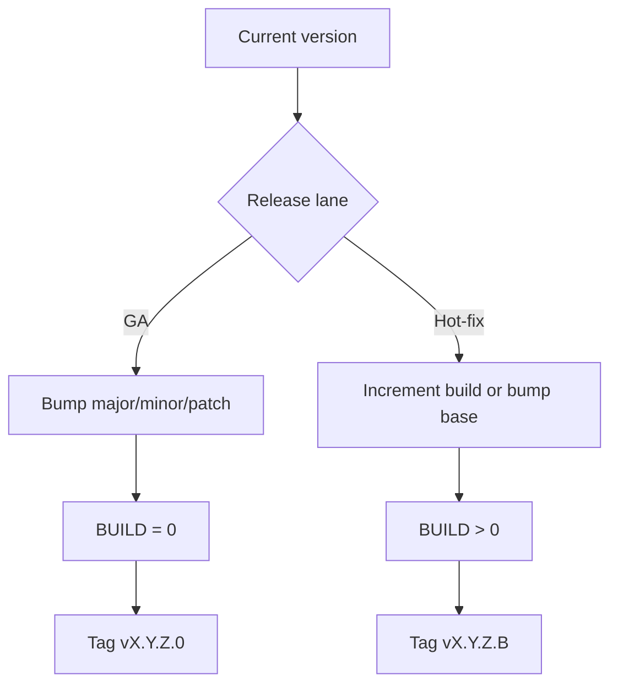

# PyPNM-CMTS Release Guide

## Table of contents

[1. Branch model](#1-branch-model)

[2. Version source of truth](#2-version-source-of-truth)

[3. Versioning scheme](#3-versioning-scheme)

[4. Release helper overview](#4-release-helper-overview)

[5. Release modes and examples](#5-release-modes-and-examples)

[6. Release lanes](#6-release-lanes)

[7. Quick reference](#7-quick-reference)

[8. Release workflow](#8-release-workflow)

This guide follows the PyPNM release strategy and uses the same four-part versioning scheme.
The release entry point is `pypnm-cmts-release`.

## 1. Branch model

PyPNM-CMTS currently follows a single-branch release model:

* `main` is the release branch.
* Feature branches are optional and short-lived.

## 2. Version source of truth

The canonical version lives in:

```text
src/pypnm_cmts/version.py
```

The `pyproject.toml` version mirrors it and must match at all times.

Example:

```python
from __future__ import annotations

__all__ = ["__version__"]

# MAJOR.MINOR.MAINTENANCE.BUILD
__version__: str = "0.1.0.0"
```

## 3. Versioning scheme

PyPNM-CMTS uses a four-part version:

```text
MAJOR.MINOR.MAINTENANCE.BUILD
```

Guidelines:

* `MAJOR` for breaking changes.
* `MINOR` for backward-compatible features.
* `MAINTENANCE` for compatible bug fixes.
* `BUILD` for small hotfixes or rebuilds.

All four segments must be numeric.

## 4. Release helper overview

The release helper:

* Reads `src/pypnm_cmts/version.py`.
* Confirms it matches `pyproject.toml`.
* Computes a target version based on GA or hot-fix rules.
* Optionally creates a git tag when the working tree is clean.
* Supports dry-run output without modifying files.

The helper does not run tests or build docs; those remain separate release steps.

## 5. Release modes and examples

### 5.1 GA release (build = 0)

```bash
pypnm-cmts-release --bump-ga --patch
```

### 5.2 Hot-fix release (build > 0)

```bash
pypnm-cmts-release --bump-hot-fix
```

### 5.3 GA with explicit bump lane

```bash
pypnm-cmts-release --bump-ga --minor
```

### 5.4 Hot-fix with explicit bump lane

```bash
pypnm-cmts-release --bump-hot-fix --patch
```

### 5.5 Dry run (`--dry-run`)

```bash
pypnm-cmts-release --bump-ga --patch --dry-run
```

## 6. Release lanes



## 7. Quick reference

* GA patch release:

  ```bash
  pypnm-cmts-release --bump-ga --patch
  ```

* Hot-fix build increment:

  ```bash
  pypnm-cmts-release --bump-hot-fix
  ```

* Dry run:

  ```bash
  pypnm-cmts-release --bump-ga --patch --dry-run
  ```

## 8. Release workflow

Use this flow for routine releases on `main`:

```bash
pypnm-cmts-release --bump-ga --patch --dry-run
pypnm-cmts-release --bump-ga --patch --tag
```

Hot-fix releases use the `hot-fix` branch and bump the `BUILD` segment:

```bash
pypnm-cmts-release --bump-hot-fix --tag
```

The release helper requires a clean working tree before tagging.
