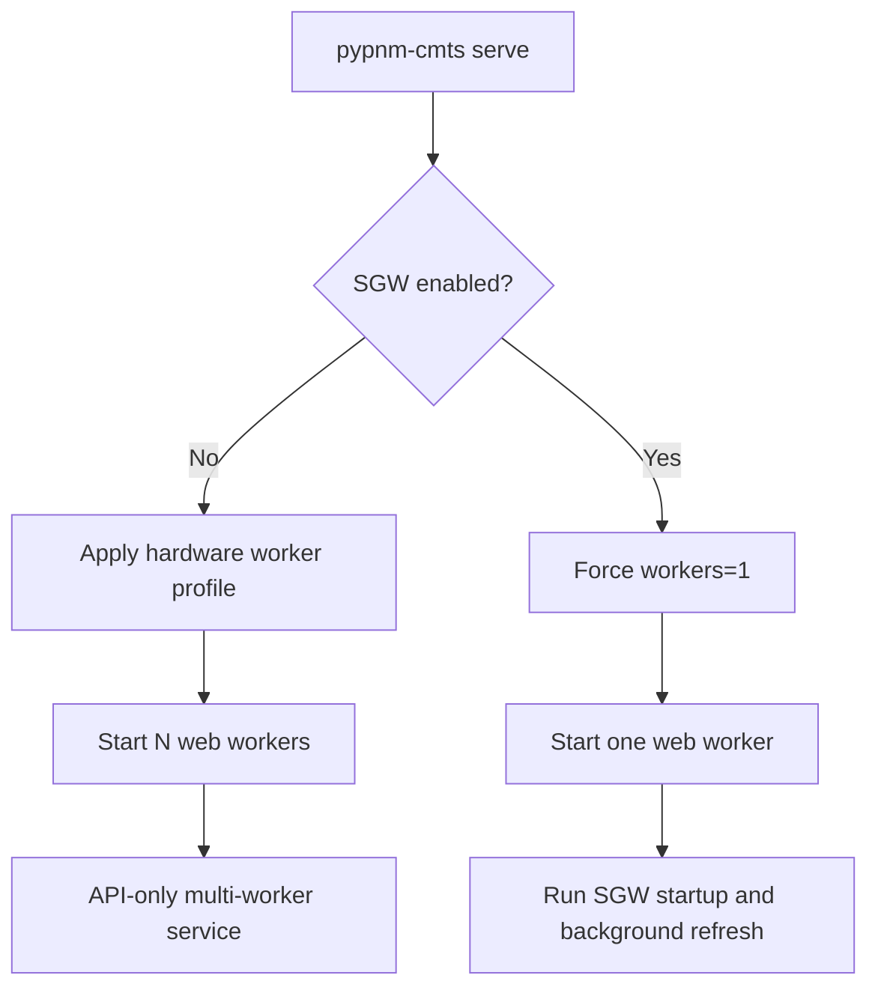

# CLI Service Launcher

Use the `pypnm-cmts serve` command to start the FastAPI service with development-friendly options.

## Table Of Contents

- [Assumptions](#assumptions)
- [When to Use](#when-to-use)
- [Usage](#usage)
- [Discovery (CMTS Inventory)](#discovery-cmts-inventory)
- [SGW Startup Discovery Modes](#sgw-startup-discovery-modes)
- [SGW Web Worker Safety](#sgw-web-worker-safety)
- [Orchestrator Run Modes](#orchestrator-run-modes)
- [Worker Result Persistence](#worker-result-persistence)
- [Coordination Flags](#coordination-flags)
- [Serve Options](#serve-options)
- [Security Tools](#security-tools)
- [Next Steps](#next-steps)

## Assumptions

- Commands are run from the repository root.
- Virtual environment activation is handled by your environment.

## When to Use

- Start the CMTS API locally during development.
- Enable hot reload when iterating on API code.

## Usage

### Basic HTTP

```bash
pypnm-cmts serve
```

The service binds to `127.0.0.1:8080` by default and reads CMTS adapter
settings from `system.json`. Use `pypnm-cmts config-menu` to set the CMTS
hostname and SNMP communities, or pass `--cmts-hostname` and `--read-community`
as overrides.

Worker count and `limit-max-requests` now follow the same hardware-aware
runtime profile logic used by `pypnm-docsis`. When you do not pass explicit
`--workers` or `--limit-max-requests`, PyPNM-CMTS first checks the seeded
worker profile env file from the installed `pypnm-docsis` runtime and then
falls back to CPU/RAM auto-detection.

For the shared sizing policy and hardware table, see the PyPNM worker-sizing doc:

- [PyPNM Worker Sizing](https://github.com/PyPNMApps/PyPNM/blob/main/docs/system/worker-sizing.md)

To suppress legacy PyPNM endpoints mounted under `/cm`:

```bash
pypnm-cmts serve --mute-pypnm-endpoints
```

To mute endpoint groups by FastAPI tag:

```bash
pypnm-cmts serve --mute-tags "Orchestrator,Operational"
```

To enforce policy blocking with HTTP 403 for matched tags:

```bash
pypnm-cmts serve --mute-tags "Orchestrator,Operational" --mute-tags-hard
```

### Custom host/port

```bash
pypnm-cmts serve --host 0.0.0.0 --port 8080
```

### Run in background

```bash
pypnm-cmts serve --run-background
```

Optional explicit paths:

```bash
pypnm-cmts serve --run-background \
  --background-log-file /var/log/pypnm-cmts.log \
  --background-pidfile /var/run/pypnm-cmts.pid
```

`--run-background` detaches the service from the current shell, writes a pidfile,
and redirects stdout/stderr to the background log file. Do not combine it with
`--reload`.

### Reload on changes

```bash
pypnm-cmts serve --reload
```

`--reload` is development-only and always forces `workers=1`, even if the
hardware profile would normally choose a higher worker count.

When `--reload` is active, PyPNM-CMTS also enables the dev/test retained-memory
tool at `POST /ops/debug/allocateMemory`. Use it to push process RSS over
the web-service memory-guard threshold and confirm that the current process
reloads.

Example:

```bash
curl -s -X POST http://127.0.0.1:8080/ops/debug/allocateMemory \
  -H 'content-type: application/json' \
  -d '{"megabytes": 1700}'
```

For non-reload development runs, enable the same tool explicitly with:

```bash
export PYPNM_CMTS_ENABLE_DEBUG_MEMORY_TOOLS=1
```

### Reload with custom watch paths

```bash
pypnm-cmts serve --reload --reload-dir src --reload-dir tools
```

For production-triggered web-service recycle, do not use `--reload`. Use the
`POST /cmts/system/webService/reload` endpoint together with the sentinel watcher:

```bash
./tools/support/watch_reload_sentinel.py \
  --sentinel /run/pypnm-cmts/webservice.reload \
  --restart-cmd "systemctl restart pypnm-cmts"
```

For non-systemd environments, use the recorded serve launch-state replay helper:

```bash
./tools/support/watch_reload_sentinel.py \
  --sentinel /run/pypnm-cmts/webservice.reload \
  --restart-cmd "./tools/support/restart_from_launch_state.py"
```

When `pypnm-cmts serve --reload` is active, PyPNM-CMTS automatically starts a
detached local sentinel watcher that replays the recorded launch state on
`POST /cmts/system/webService/reload`. This makes the WebUI Reload button recycle
the dev service without requiring a separate manual watcher process.

`pypnm-cmts serve` records the latest runtime launch settings in:

- `<runtime_dir>/pypnm-cmts-serve-launch.json`

The restart helper reads that file, stops the recorded serve PID, and relaunches
with the same executable/arguments/environment snapshot.

### HTTPS

```bash
pypnm-cmts serve --ssl --cert ./certs/cert.pem --key ./certs/key.pem
```

### Production Worker Profile

Use plain `pypnm-cmts serve` for normal production startup when you want the
same worker auto-selection behavior as `pypnm-docsis`:

```bash
pypnm-cmts serve --host 0.0.0.0 --port 8080
```

Use explicit overrides only when you need to pin a specific runtime profile:

```bash
pypnm-cmts serve --host 0.0.0.0 --port 8080 --workers 4 --limit-max-requests 2000
```

When SGW is enabled, PyPNM-CMTS forces `workers=1` even if the hardware profile
or explicit CLI flags would select more. SGW currently uses per-process in-memory
cache and background refresh state, so multiple web workers would each build
their own SGW cache and poll the same CMTS in parallel.

`--with-runner` intentionally forces `workers=1` because combined mode hosts the
API and in-process controller/worker runner in the same process:

```bash
pypnm-cmts serve --with-runner
```

## SGW Web Worker Safety

PyPNM-CMTS currently treats SGW as a single-process service when you launch the
web API with `serve`.

- Only one web worker can safely own SGW today.
- Additional web workers would each create their own SGW cache and refresh loop.
- That would duplicate SNMP load and make SGW-backed API state inconsistent across workers.



Current advantage of forcing `workers=1` with SGW enabled:

- avoids duplicate SG discovery and polling
- avoids multiple in-memory SGW caches drifting apart
- keeps SGW-backed endpoints consistent
- reduces unnecessary memory and SNMP load

SGW guard defaults are also active for `serve` startup/discovery runtime:

- `rss_restart_threshold_mb`: `1536`
- `max_consecutive_error_cycles`: `3`
- `min_restart_interval_seconds`: `300`
- `max_restarts_per_hour`: `6`

## Discovery (CMTS Inventory)

Discover service groups and registered cable modems from a CMTS using SNMP.
If `--write-community` is omitted or empty, the discovery path uses the effective read community.
Use `--port` to override the SNMP port for the `discover` command; `run` and `serve` use `--snmp-port`.
The `run` and `run-forever` commands load CMTS adapter settings from system.json unless you pass adapter overrides.

```bash
pypnm-cmts discover --cmts-hostname 192.168.0.100 --read-community public --state-dir ./.data/coordination
```

```bash
pypnm-cmts discover --cmts-hostname 192.168.0.100 --read-community public --write-community private --state-dir ./.data/coordination
```

## SGW Startup Discovery Modes

SGW discovery runs during `pypnm-cmts serve` startup. The mode is configured in `CmtsOrchestrator.sgw.discovery.mode`.
If the mode is missing or empty, the default is `snmp`.

### SNMP Mode (Default)

SNMP discovery queries the CMTS to enumerate SG IDs.

- Uses adapter settings from system.json or CLI/env overrides:
  - `adapter.hostname`
  - `adapter.community`
  - `adapter.port`
- Runs a precheck before discovery:
  - ICMP ping
  - SNMP sysDescr

Example: set discovery mode in system.json and override the target at runtime:

```json
{
  "CmtsOrchestrator": {
    "sgw": {
      "enabled": true,
      "discovery": {
        "mode": "snmp"
      }
    }
  }
}
```

```bash
pypnm-cmts serve --cmts-hostname 192.168.0.100 --read-community public --write-community public
```

### Static Mode

Static discovery uses the configured service group list and performs no SNMP calls.

- Requires `service_groups` entries to be present.
- If the list is empty, discovery returns no SGs.

```json
{
  "CmtsOrchestrator": {
    "sgw": {
      "enabled": true,
      "discovery": {
        "mode": "static"
      }
    },
    "service_groups": [
      {
        "sg_id": 1,
        "enabled": true
      },
      {
        "sg_id": 2,
        "enabled": true
      }
    ]
  }
}
```

## Orchestrator Run Modes

Run a single coordination tick and print JSON output.

Worker mode supports a numeric service group id (bound worker) or no `--sg-id` (unbound worker).
Use adapter overrides to supply CMTS hostname and read/write communities at runtime without editing system.json.

Tick index is 1-based. The one-shot run reports `tick_index` = 1.
Continuous runs increment `tick_index` once per tick in the same process.
Worker persistence happens only when `lease_held` is true.

```bash
pypnm-cmts run --mode standalone
```

```bash
pypnm-cmts run --mode controller
```

```bash
pypnm-cmts run --mode worker --sg-id 1
```

Run continuously with a tick interval (seconds):

```bash
pypnm-cmts run-forever --mode standalone --tick-interval-seconds 1 --max-ticks 5
```

```bash
pypnm-cmts run-forever --mode controller --tick-interval-seconds 1
```

```bash
pypnm-cmts run-forever --mode worker --sg-id 1 --tick-interval-seconds 1
```

```bash
pypnm-cmts run-forever --mode worker --tick-interval-seconds 1
```

## Worker Result Persistence

Worker mode persists test results under the coordination state directory:

```
<state_dir>/results/sg_<sg_id>/
```

Each file name is deterministic per tick:

```
sg<sg_id>_tick<tick_index>_<test_name>.json
```

Tick indices are 1-based within a single run.

## Coordination Flags

These flags are supported by `run` and `run-forever`.

Example:

```bash
pypnm-cmts run-forever --mode standalone --owner-id replica-1 --target-service-groups 2 --shard-mode score \
  --cmts-hostname 192.168.0.100 --read-community public --snmp-port 161 \
  --state-dir ./.data/coordination --election-name cmts-primary
```

Flags:
- --owner-id <str>
- --target-service-groups <int>
- --shard-mode sequential|score
- --tick-interval-seconds <float>
- --leader-ttl-seconds <int>
- --lease-ttl-seconds <int>
- --state-dir <path>
- --election-name <str>
- --cmts-hostname <str>
- --read-community <str>
- --write-community <str>
- --snmp-port <int> (SNMP port override; --cmts-port is deprecated)

If both `--snmp-port` and `--cmts-port` are supplied, `--snmp-port` takes precedence and the deprecated alias emits a warning.

## Serve Options

These options apply to `pypnm-cmts serve`.

```text
-v, --version Show PyPNM-CMTS version and exit.
--host Host to bind (default: 127.0.0.1)
--port Port to bind (default: 8080)
--ssl Enable HTTPS (requires cert and key)
--cert Path to SSL certificate (default: ./certs/cert.pem)
--key Path to SSL private key (default: ./certs/key.pem)
--log-level Uvicorn log level (default: info)
--workers Number of worker processes (default: 1)
--no-access-log Disable Uvicorn access log
--reload Enable auto-reload on file changes (dev only)
--reload-dir Directory to watch for changes (repeatable)
--reload-include Glob pattern(s) to include (repeatable; default: *.py)
--reload-exclude Glob pattern(s) to exclude (repeatable)
--mute-pypnm-endpoints Suppress legacy PyPNM routes under /cm at startup
--mute-tags Comma-separated route tags to mute at startup
--mute-tags-hard Enforce 403 for routes matched by --mute-tags
```

For full command and option coverage across all CLI commands, see [CLI option reference](cli-options.md).

## Security Tools

Repository security checks live under `tools/security`.
The MAC scan respects `.gitignore` directory entries by default; use `--skip-gitignore` to scan ignored paths.

```bash
./tools/security/scan-mac-addresses.py --fail-on-found
```

```bash
./tools/security/scan-mac-addresses.py --fail-on-found --skip-gitignore
```

## Next Steps

- Review the system configuration defaults in `src/pypnm_cmts/settings/system.json`.
- Check the FastAPI reference for available endpoints.
