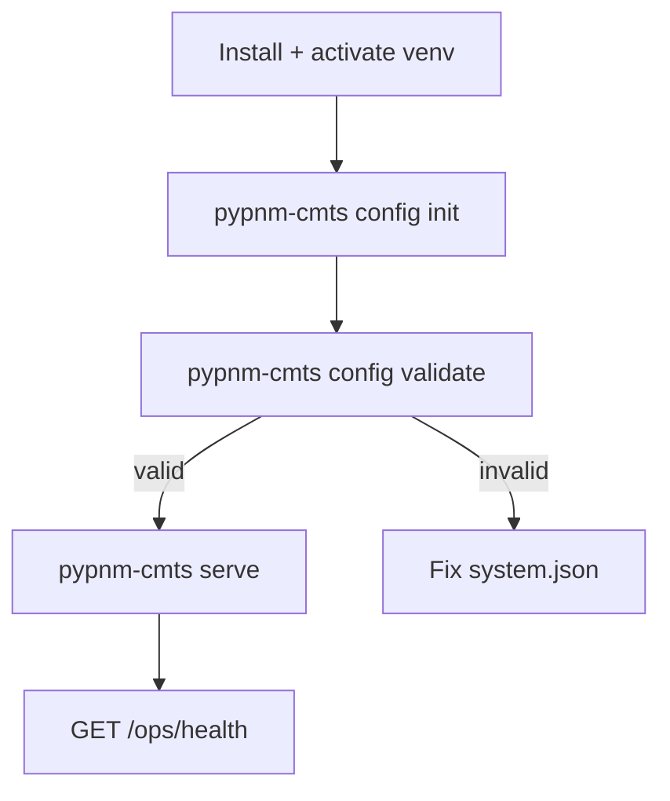

# System configuration workflow

This page describes the non-interactive configuration workflow for PyPNM-CMTS.
Use these commands when you want repeatable automation (CI, container, or scripted setup).

## When to use which command

Use the interactive menu when you want guided input:

- `pypnm-cmts config-menu`

Use non-interactive commands for automation:

- `pypnm-cmts config init` to create a baseline system.json.
- `pypnm-cmts config validate` to verify required settings.
- `pypnm-cmts config show` to print the effective configuration.

The CMTS configuration can also update the PyPNM (pypnm-docsis) sections in `system.json`
so SNMP, TFTP, and retrieval settings remain aligned between PyPNM and PyPNM-CMTS.

## Workflow



## Command reference

## SGW worker guard settings

`CmtsOrchestrator.sgw.guard` configures the shared in-process worker governor used by the SGW refresh supervisor.
Even though this lives under `CmtsOrchestrator`, it applies to SGW runtime used by `pypnm-cmts serve` discovery startup as well (not only orchestrator run commands).

Example:

```json
{
  "CmtsOrchestrator": {
    "sgw": {
      "guard": {
        "enabled": true,
        "rss_restart_threshold_mb": 1536,
        "max_consecutive_error_cycles": 3,
        "min_restart_interval_seconds": 300,
        "max_restarts_per_hour": 6
      }
    }
  }
}
```

Field meanings:

- `enabled` enables the shared guard evaluation loop for SGW background refresh.
- `rss_restart_threshold_mb` restarts SGW when process RSS reaches the configured MiB threshold. `0` disables RSS-based restart.
- `max_consecutive_error_cycles` restarts SGW after this many consecutive refresh cycles with one or more errors. `0` disables error-cycle-based restart.
- `min_restart_interval_seconds` prevents immediate repeat restarts after a guard-triggered recycle.
- `max_restarts_per_hour` caps guard-triggered restarts per process hour window.

Operational notes:

- Guard decisions and restart budgeting are implemented in `src/pypnm_cmts/support/worker_guard.py`.
- SGW restart state is surfaced through SGW startup status fields such as `guard_restart_count` and `last_guard_reason`.
- This guard is process-local. Use an external process supervisor as well if you need recovery from hard crashes or blocked native calls.

Default guard policy:

- `enabled`: `true`
- `rss_restart_threshold_mb`: `1536`
- `max_consecutive_error_cycles`: `3`
- `min_restart_interval_seconds`: `300`
- `max_restarts_per_hour`: `6`

## Web-service reload sentinel

`GET /cmts/system` endpoints are safe to call in production, but web-service reload is handled through an external watcher contract rather than Uvicorn `--reload`.

Configuration sources, in precedence order:

- `PYPNM_CMTS_WEB_SERVICE_RELOAD_SENTINEL`
- `pypnm-cmts.service.webService.reloadSentinelPath` in `system.json`
- default: `<coordination_state_dir>/webservice.reload`

Example `system.json` fragment:

```json
{
  "pypnm-cmts": {
    "service": {
      "webService": {
        "reloadSentinelPath": "/run/pypnm-cmts/webservice.reload"
      }
    }
  }
}
```

Operational notes:

- `POST /cmts/system/webService/reload` writes the sentinel file and returns immediately.
- An external watcher or supervisor must observe that file and restart `pypnm-cmts`.
- The API logs the restart request before it writes the sentinel file.
- A repo-local watcher helper is available at `tools/support/watch_reload_sentinel.py`.

Example watcher:

```bash
./tools/support/watch_reload_sentinel.py \
  --sentinel /run/pypnm-cmts/webservice.reload \
  --restart-cmd "systemctl restart pypnm-cmts" \
  --poll-seconds 1
```

Non-systemd watcher with launch-state replay:

```bash
./tools/support/watch_reload_sentinel.py \
  --sentinel /run/pypnm-cmts/webservice.reload \
  --restart-cmd "./tools/support/restart_from_launch_state.py" \
  --poll-seconds 1
```

### pypnm-cmts config init

Creates or overwrites system.json with the CMTS template merged in.

```bash
pypnm-cmts config init
```

Optional flags:

- `--path <path>` target a specific system.json location.
- `--force` overwrite an existing file.
- `--print` print the resulting JSON to stdout.
- `--dry-run` do not write (prints only with `--print`).

### pypnm-cmts config validate

Validates system.json and exits non-zero when required values are missing.

```bash
pypnm-cmts config validate
```

Optional flags:

- `--path <path>` validate a specific system.json file.
- `--json` emit JSON output for automation.

Exit codes:

- `0` valid
- `2` invalid configuration
- `1` runtime error (missing file, unexpected error)

### pypnm-cmts config show

Prints the effective configuration with CMTS defaults merged.

```bash
pypnm-cmts config show --pretty
```

Optional flags:

- `--path <path>` read a specific system.json file.
- `--pretty` pretty-print JSON output.
