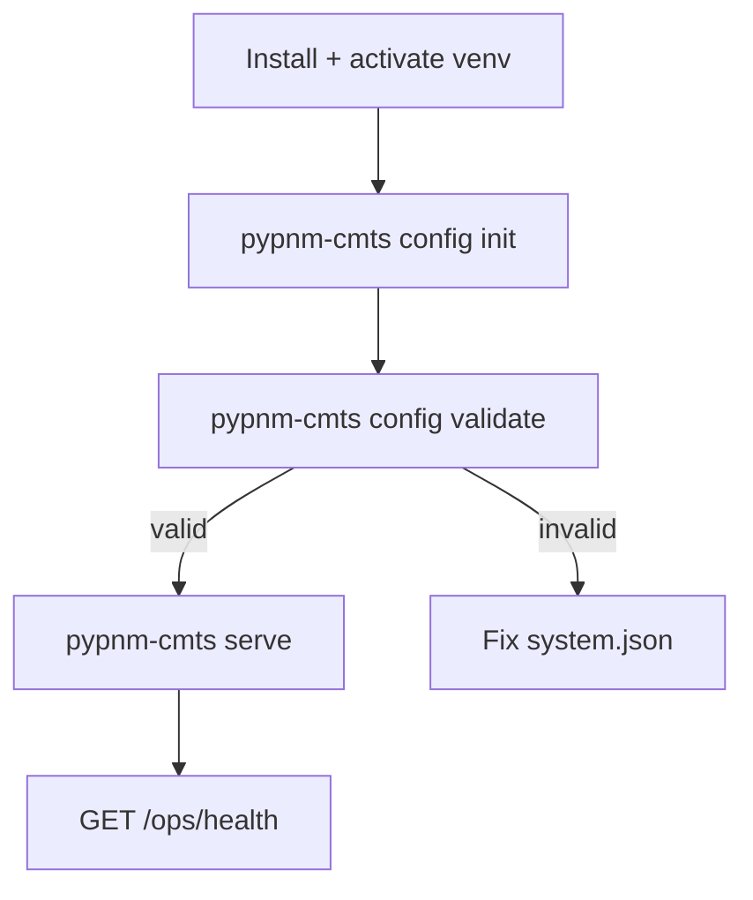

# System configuration workflow

This page describes the non-interactive configuration workflow for PyPNM-CMTS.
Use these commands when you want repeatable automation (CI, container, or scripted setup).

## When to use which command

Use the interactive menu when you want guided input:

- `pypnm-cmts config-menu`

Use non-interactive commands for automation:

- `pypnm-cmts config init` to create a baseline system.json.
- `pypnm-cmts config validate` to verify required settings.
- `pypnm-cmts config show` to print the effective configuration.

The CMTS configuration can also update the PyPNM (pypnm-docsis) sections in `system.json`
so SNMP, TFTP, and retrieval settings remain aligned between PyPNM and PyPNM-CMTS.

## Workflow



## Command reference

### pypnm-cmts config init

Creates or overwrites system.json with the CMTS template merged in.

```bash
pypnm-cmts config init
```

Optional flags:

- `--path <path>` target a specific system.json location.
- `--force` overwrite an existing file.
- `--print` print the resulting JSON to stdout.
- `--dry-run` do not write (prints only with `--print`).

### pypnm-cmts config validate

Validates system.json and exits non-zero when required values are missing.

```bash
pypnm-cmts config validate
```

Optional flags:

- `--path <path>` validate a specific system.json file.
- `--json` emit JSON output for automation.

Exit codes:

- `0` valid
- `2` invalid configuration
- `1` runtime error (missing file, unexpected error)

### pypnm-cmts config show

Prints the effective configuration with CMTS defaults merged.

```bash
pypnm-cmts config show --pretty
```

Optional flags:

- `--path <path>` read a specific system.json file.
- `--pretty` pretty-print JSON output.
