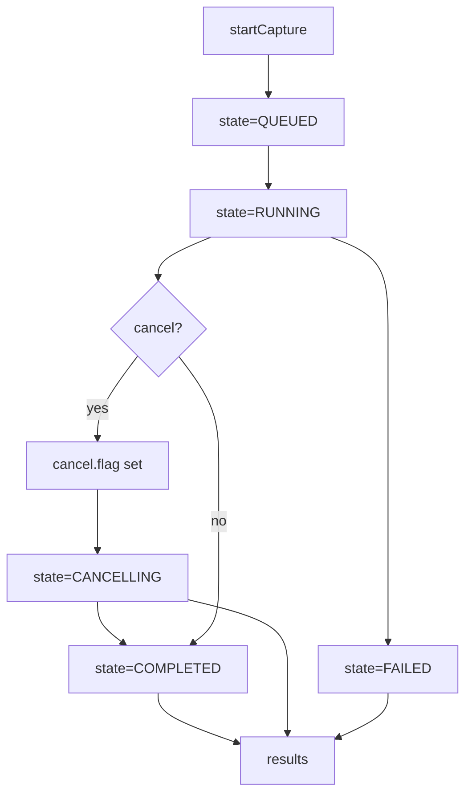
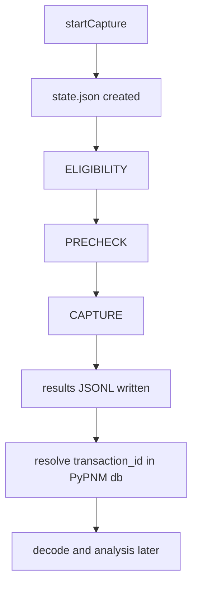

Summary:
- Added failure_reason to stage and linkage models and propagated it in the runner.
- Documented cancellation flow, runner-level failure semantics, and status type usage.
- Added per-modem timeout validation in RxMER artifact tests and failure_reason assertions.

# FILE: src/pypnm_cmts/api/common/operations/models.py
# SPDX-License-Identifier: Apache-2.0
# Copyright (c) 2026 Maurice Garcia

from __future__ import annotations

from pydantic import BaseModel, Field
from pypnm.api.routes.common.service.status_codes import ServiceStatusCode
from pypnm.lib.types import (
    ChannelId,
    FileNameStr,
    InetAddressStr,
    MacAddressStr,
    TimestampSec,
    TransactionId,
    IPv4Str,
    IPv6Str,
    SnmpWriteCommunity,
)

from pypnm_cmts.lib.constants import OperationStage, OperationState, PnmCaptureFailureReason
from pypnm_cmts.lib.types import PnmCaptureOperationId, ServiceGroupId

MIN_TIMEOUT_SECONDS = 1.0


class OperationCountersModel(BaseModel):
    """Aggregate counters for operation progress tracking."""

    total_modems: int = Field(default=0, ge=0, description="Total modems in scope.")
    eligible_modems: int = Field(default=0, ge=0, description="Modems passing eligibility gate.")
    precheck_passed: int = Field(default=0, ge=0, description="Modems passing precheck stage.")
    capture_started: int = Field(default=0, ge=0, description="Modems with capture started.")
    completed: int = Field(default=0, ge=0, description="Modems with completed processing.")
    success: int = Field(default=0, ge=0, description="Modems with successful capture.")
    failed: int = Field(default=0, ge=0, description="Modems with failed capture.")
    skipped: int = Field(default=0, ge=0, description="Modems skipped by eligibility or constraints.")


class OperationTimestampsModel(BaseModel):
    """Epoch timestamp lifecycle for an operation."""

    created_epoch: TimestampSec = Field(
        default=TimestampSec(0),
        ge=0,
        description="Epoch timestamp when the operation was created.",
    )
    started_epoch: TimestampSec = Field(
        default=TimestampSec(0),
        ge=0,
        description="Epoch timestamp when execution started.",
    )
    updated_epoch: TimestampSec = Field(
        default=TimestampSec(0),
        ge=0,
        description="Epoch timestamp for the last state update.",
    )
    finished_epoch: TimestampSec = Field(
        default=TimestampSec(0),
        ge=0,
        description="Epoch timestamp when execution finished.",
    )


class OperationExecutionModel(BaseModel):
    """Execution settings captured for the operation request summary."""

    max_workers: int = Field(default=0, ge=0, description="Maximum concurrent workers requested.")
    retry_count: int = Field(default=0, ge=0, description="Retry attempts for retryable failures.")
    retry_delay_seconds: float = Field(default=0.0, ge=0.0, description="Delay between retry attempts in seconds.")
    per_modem_timeout_seconds: float = Field(
        default=MIN_TIMEOUT_SECONDS,
        gt=0.0,
        description="Per-modem timeout in seconds.",
    )
    overall_timeout_seconds: float = Field(
        default=MIN_TIMEOUT_SECONDS,
        gt=0.0,
        description="Overall timeout in seconds.",
    )


class OperationRequestSummaryModel(BaseModel):
    """Minimal summary of the request payload for tracking and auditing."""

    serving_group_ids: list[ServiceGroupId] = Field(
        default_factory=list,
        description="Requested serving group identifiers (empty means all).",
    )
    mac_addresses: list[MacAddressStr] = Field(
        default_factory=list,
        description="Requested cable modem MAC addresses (empty means all).",
    )
    channel_ids: list[ChannelId] = Field(
        default_factory=list,
        description="Requested channel identifiers (empty means all).",
    )
    execution: OperationExecutionModel = Field(
        default_factory=OperationExecutionModel,
        description="Execution settings supplied with the request.",
    )


class OperationRequestContextModel(BaseModel):
    """Internal request context for capture overrides."""

    tftp_ipv4: IPv4Str | None = Field(default=None, description="Optional TFTP IPv4 override.")
    tftp_ipv6: IPv6Str | None = Field(default=None, description="Optional TFTP IPv6 override.")
    snmp_write_community: SnmpWriteCommunity | None = Field(
        default=None,
        description="Optional SNMP write community override.",
    )


class OperationErrorSummaryModel(BaseModel):
    """Optional error summary for failed operations."""

    message: str = Field(default="", description="Error message describing the failure.")
    detail: str = Field(default="", description="Optional failure detail.")


class OperationStageResultModel(BaseModel):
    """Per-stage execution result for a modem."""

    stage: OperationStage = Field(..., description="Execution stage identifier.")
    status_code: ServiceStatusCode = Field(default=ServiceStatusCode.SUCCESS, description="Stage status code.")
    failure_reason: PnmCaptureFailureReason | None = Field(
        default=None,
        description="Optional normalized failure reason for the stage.",
    )
    transaction_ids: list[TransactionId] = Field(
        default_factory=list,
        description="Transaction identifiers linked to this stage.",
    )
    filenames: list[FileNameStr] = Field(
        default_factory=list,
        description="Capture filenames linked to this stage.",
    )
    message: str = Field(default="", description="Stage message or error detail.")
    started_epoch: TimestampSec = Field(
        default=TimestampSec(0),
        ge=0,
        description="Epoch timestamp when stage started.",
    )
    finished_epoch: TimestampSec = Field(
        default=TimestampSec(0),
        ge=0,
        description="Epoch timestamp when stage finished.",
    )


class OperationStateModel(BaseModel):
    """Filesystem-backed operation state record."""

    operation_id: PnmCaptureOperationId = Field(..., description="Operation identifier.")
    state: OperationState = Field(default=OperationState.QUEUED, description="Lifecycle state for the operation.")
    counters: OperationCountersModel = Field(default_factory=OperationCountersModel, description="Progress counters.")
    timestamps: OperationTimestampsModel = Field(default_factory=OperationTimestampsModel, description="Lifecycle timestamps.")
    request_summary: OperationRequestSummaryModel = Field(
        default_factory=OperationRequestSummaryModel,
        description="Minimal request summary for the operation.",
    )
    error_summary: OperationErrorSummaryModel | None = Field(
        default=None,
        description="Optional error summary if the operation fails.",
    )


class PerModemLinkageRecordModel(BaseModel):
    """JSONL linkage record tying a modem to capture artifacts and outcomes."""

    pnm_capture_operation_id: PnmCaptureOperationId = Field(..., description="Parent operation identifier.")
    sg_id: ServiceGroupId = Field(..., description="Serving group identifier for the modem.")
    mac_address: MacAddressStr = Field(..., description="Cable modem MAC address.")
    ip_address: InetAddressStr | None = Field(default=None, description="Cable modem IP address, if known.")
    stage: OperationStage = Field(default=OperationStage.ELIGIBILITY, description="Operation stage for this record.")
    status_code: ServiceStatusCode = Field(default=ServiceStatusCode.SUCCESS, description="Status code for this stage.")
    failure_reason: PnmCaptureFailureReason | None = Field(
        default=None,
        description="Optional normalized failure reason for the stage.",
    )
    transaction_ids: list[TransactionId] = Field(
        default_factory=list,
        description="Transaction identifiers linked to this modem stage.",
    )
    filenames: list[FileNameStr] = Field(
        default_factory=list,
        description="Capture filenames linked to this modem stage.",
    )
    started_epoch: TimestampSec = Field(
        default=TimestampSec(0),
        ge=0,
        description="Epoch timestamp when stage started.",
    )
    finished_epoch: TimestampSec = Field(
        default=TimestampSec(0),
        ge=0,
        description="Epoch timestamp when stage finished.",
    )
    message: str = Field(default="", description="Stage message or error detail.")


class OperationResultsSummaryModel(BaseModel):
    """Summary of JSONL linkage results for a completed operation."""

    record_count: int = Field(default=0, ge=0, description="Total linkage records stored for this operation.")
    included_count: int = Field(default=0, ge=0, description="Linkage records included in the response.")
    files_scanned: int = Field(default=0, ge=0, description="Result files scanned for linkage records.")


__all__ = [
    "OperationCountersModel",
    "OperationErrorSummaryModel",
    "OperationExecutionModel",
    "OperationRequestContextModel",
    "OperationRequestSummaryModel",
    "OperationResultsSummaryModel",
    "OperationStageResultModel",
    "OperationStateModel",
    "OperationTimestampsModel",
    "PerModemLinkageRecordModel",
]

# FILE: src/pypnm_cmts/api/common/operations/runner.py
# SPDX-License-Identifier: Apache-2.0
# Copyright (c) 2026 Maurice Garcia

from __future__ import annotations

import logging
import threading
import time
from collections.abc import Callable
from concurrent.futures import FIRST_COMPLETED, Future, ThreadPoolExecutor, wait

from pydantic import BaseModel, Field
from pypnm.api.routes.common.service.status_codes import ServiceStatusCode
from pypnm.lib.types import MacAddressStr, TimestampSec
from pypnm.lib.utils import Generate, TimeUnit

from pypnm_cmts.api.common.operations.models import (
    OperationErrorSummaryModel,
    OperationExecutionModel,
    OperationStageResultModel,
    OperationStateModel,
    OperationTimestampsModel,
    PerModemLinkageRecordModel,
)
from pypnm_cmts.api.common.operations.store import OperationStore
from pypnm_cmts.lib.constants import OperationStage, OperationState, PnmCaptureFailureReason
from pypnm_cmts.lib.types import PnmCaptureOperationId, ServiceGroupId

DEFAULT_WORKER_DELAY_SECONDS = 0.01
DEFAULT_CANCEL_GRACE_SECONDS = 1.0
DEFAULT_POLL_INTERVAL_SECONDS = 0.05
DEFAULT_OVERALL_TIMEOUT_MESSAGE = "overall timeout exceeded"
DEFAULT_PER_MODEM_TIMEOUT_MESSAGE = "per-modem timeout exceeded"


class OperationWorkerResultModel(BaseModel):
    """Result payload returned by per-modem worker functions."""

    stages: list[OperationStageResultModel] = Field(
        default_factory=list,
        description="Per-stage execution results for the modem.",
    )


class OperationWorkItemModel(BaseModel):
    """Work item describing a single modem execution."""

    operation_id: PnmCaptureOperationId = Field(..., description="Parent operation identifier.")
    sg_id: ServiceGroupId = Field(..., description="Serving group identifier.")
    mac_address: MacAddressStr = Field(..., description="Cable modem MAC address.")
    attempt: int = Field(default=0, ge=0, description="Attempt index for retry tracking.")


class OperationRunner:
    """Background runner that executes operation work in a thread."""

    def __init__(
        self,
        store: OperationStore,
        worker: Callable[[OperationWorkItemModel], OperationWorkerResultModel] | None = None,
        cancel_grace_seconds: float = DEFAULT_CANCEL_GRACE_SECONDS,
        poll_interval_seconds: float = DEFAULT_POLL_INTERVAL_SECONDS,
    ) -> None:
        self._store = store
        self._worker = worker or self._default_worker
        self._cancel_grace_seconds = cancel_grace_seconds
        self._poll_interval_seconds = poll_interval_seconds
        self._lock = threading.Lock()
        self._threads: dict[PnmCaptureOperationId, threading.Thread] = {}
        self.logger = logging.getLogger(f"{self.__class__.__name__}")

    def start(self, operation_id: PnmCaptureOperationId) -> bool:
        """Start background execution for the operation if not already running."""
        with self._lock:
            existing = self._threads.get(operation_id)
            if existing is not None and existing.is_alive():
                return False
            thread = threading.Thread(
                target=self._run_operation,
                args=(operation_id,),
                daemon=True,
            )
            self._threads[operation_id] = thread
            thread.start()
            return True

    def is_running(self, operation_id: PnmCaptureOperationId) -> bool:
        """Return whether a background thread is active for the operation."""
        with self._lock:
            thread = self._threads.get(operation_id)
            if thread is None:
                return False
            return thread.is_alive()

    def request_cancel(self, operation_id: PnmCaptureOperationId) -> OperationStateModel:
        """Request cooperative cancellation via the store."""
        return self._store.request_cancel(operation_id)

    def _run_operation(self, operation_id: PnmCaptureOperationId) -> None:
        try:
            self._execute_operation(operation_id)
        except Exception as exc:
            self.logger.exception("operation runner failed for %s", operation_id)
            self._mark_failed(operation_id, str(exc))
        finally:
            self._cleanup(operation_id)

    def _execute_operation(self, operation_id: PnmCaptureOperationId) -> None:
        state = self._store.load_state(operation_id)
        state = self._transition_to_running(state)
        self._store.save_state_atomic(state)

        request_summary = state.request_summary
        execution = request_summary.execution
        macs = list(request_summary.mac_addresses)
        sg_ids = list(request_summary.serving_group_ids)

        if not macs or not sg_ids:
            self._mark_completed(state, operation_id, counters_total=0)
            return

        total_modems = len(macs)
        state = state.model_copy(update={"counters": state.counters.model_copy(update={"total_modems": total_modems})})
        self._store.save_state_atomic(state)

        work_items = self._build_work_items(operation_id, macs, sg_ids)
        overall_deadline = time.monotonic() + execution.overall_timeout_seconds

        executor = ThreadPoolExecutor(max_workers=execution.max_workers)
        pending: dict[Future, tuple[OperationWorkItemModel, float]] = {}
        abandoned: dict[Future, tuple[OperationWorkItemModel, float]] = {}
        queue: list[OperationWorkItemModel] = list(work_items)
        retry_queue: list[tuple[float, OperationWorkItemModel]] = []
        cancelled = False
        failed = False
        try:
            while queue or pending or abandoned or retry_queue:
                if self._store.is_cancel_requested(operation_id):
                    cancelled = True
                    self._cancel_remaining(list(pending.keys()) + list(abandoned.keys()), executor, overall_deadline)
                    return
                if time.monotonic() >= overall_deadline:
                    failed = True
                    self._cancel_remaining(list(pending.keys()) + list(abandoned.keys()), executor, overall_deadline)
                    return

                now = time.monotonic()
                ready_retries = [(ready_at, item) for (ready_at, item) in retry_queue if ready_at <= now]
                if ready_retries:
                    retry_queue = [(ready_at, item) for (ready_at, item) in retry_queue if ready_at > now]
                    ready_retries.sort(key=lambda entry: entry[0])
                    for _, item in ready_retries:
                        queue.append(item)

                in_flight = len(pending) + len(abandoned)
                while queue and in_flight < execution.max_workers:
                    item = queue.pop(0)
                    future = executor.submit(self._execute_modem, item)
                    pending[future] = (item, time.monotonic())
                    in_flight = len(pending) + len(abandoned)

                futures = list(pending.keys()) + list(abandoned.keys())
                if not futures:
                    time.sleep(self._poll_interval_seconds)
                    continue

                done, _ = wait(
                    futures,
                    timeout=self._poll_interval_seconds,
                    return_when=FIRST_COMPLETED,
                )

                now = time.monotonic()
                timed_out: list[Future] = []
                for future, (_, start_time) in pending.items():
                    if future.done():
                        continue
                    if now - start_time >= execution.per_modem_timeout_seconds:
                        timed_out.append(future)

                for future in timed_out:
                    item, start_time = pending.pop(future)
                    abandoned[future] = (item, start_time)
                    future.cancel()
                    result = self._timeout_result()
                    state = self._handle_result(operation_id, state, item, result, execution, retry_queue)
                    if state.state in {OperationState.CANCELLED, OperationState.FAILED}:
                        return

                for future in done:
                    if future in abandoned:
                        abandoned.pop(future, None)
                        continue

                    pending_item = pending.pop(future, None)
                    if pending_item is None:
                        continue

                    item, _ = pending_item
                    result = self._resolve_future_result(future)
                    state = self._handle_result(operation_id, state, item, result, execution, retry_queue)
                    if state.state in {OperationState.CANCELLED, OperationState.FAILED}:
                        return
        finally:
            if cancelled:
                executor.shutdown(wait=False, cancel_futures=True)
                self._mark_cancelled(operation_id)
                return
            if failed:
                executor.shutdown(wait=False, cancel_futures=True)
                self._mark_failed(operation_id, DEFAULT_OVERALL_TIMEOUT_MESSAGE)
                return
            executor.shutdown(wait=True)

        terminal_state = OperationState.COMPLETED
        if state.counters.failed > 0:
            terminal_state = OperationState.FAILED
        state = state.model_copy(
            update={
                "state": terminal_state,
                "timestamps": self._finish_timestamps(state.timestamps),
                "error_summary": None,
            }
        )
        self._store.save_state_atomic(state)

    def _execute_modem(self, item: OperationWorkItemModel) -> OperationWorkerResultModel:
        return self._worker(item)

    def _default_worker(self, item: OperationWorkItemModel) -> OperationWorkerResultModel:
        started_epoch = self._now_epoch()
        time.sleep(DEFAULT_WORKER_DELAY_SECONDS)
        finished_epoch = self._now_epoch()
        return OperationWorkerResultModel(
            stages=self._build_stage_results(
                status_code=ServiceStatusCode.SUCCESS,
                message="completed",
                started_epoch=started_epoch,
                finished_epoch=finished_epoch,
            ),
        )

    def _resolve_future_result(
        self,
        future: Future,
    ) -> OperationWorkerResultModel:
        try:
            return future.result()
        except Exception as exc:
            return self._failure_result(str(exc))

    def _persist_stage_records(
        self,
        operation_id: PnmCaptureOperationId,
        item: OperationWorkItemModel,
        result: OperationWorkerResultModel,
    ) -> None:
        for stage_result in result.stages:
            record = PerModemLinkageRecordModel(
                pnm_capture_operation_id=operation_id,
                sg_id=item.sg_id,
                mac_address=item.mac_address,
                ip_address=None,
                stage=stage_result.stage,
                status_code=stage_result.status_code,
                failure_reason=stage_result.failure_reason,
                transaction_ids=list(stage_result.transaction_ids),
                filenames=list(stage_result.filenames),
                started_epoch=stage_result.started_epoch,
                finished_epoch=stage_result.finished_epoch,
                message=stage_result.message,
            )
            self._store.append_result_record(record)

    def _update_counters(self, state: OperationStateModel, result: OperationWorkerResultModel) -> OperationStateModel:
        counters = state.counters
        eligibility = self._find_stage(result, OperationStage.ELIGIBILITY)
        precheck = self._find_stage(result, OperationStage.PRECHECK)
        capture = self._find_stage(result, OperationStage.CAPTURE)
        if eligibility is not None and eligibility.status_code == ServiceStatusCode.SUCCESS:
            counters = counters.model_copy(update={"eligible_modems": counters.eligible_modems + 1})
        if precheck is not None and precheck.status_code == ServiceStatusCode.SUCCESS:
            counters = counters.model_copy(update={"precheck_passed": counters.precheck_passed + 1})
        if capture is not None:
            counters = counters.model_copy(update={"capture_started": counters.capture_started + 1})
        counters = counters.model_copy(
            update={
                "completed": counters.completed + 1,
            }
        )
        final_status = self._final_status_code(result)
        if final_status == ServiceStatusCode.SUCCESS:
            counters = counters.model_copy(update={"success": counters.success + 1})
        else:
            counters = counters.model_copy(update={"failed": counters.failed + 1})
        return state.model_copy(update={"counters": counters})

    def _cancel_remaining(
        self,
        futures: list[Future],
        executor: ThreadPoolExecutor,
        deadline: float,
    ) -> None:
        for future in futures:
            future.cancel()
        remaining = max(0.0, deadline - time.monotonic())
        wait_limit = min(self._cancel_grace_seconds, remaining)
        if wait_limit <= 0:
            return
        end = time.monotonic() + wait_limit
        while time.monotonic() < end:
            if all(f.done() for f in futures):
                return
            time.sleep(self._poll_interval_seconds)
        executor.shutdown(wait=False, cancel_futures=True)

    def _mark_cancelled(self, operation_id: PnmCaptureOperationId) -> None:
        state = self._store.load_state(operation_id)
        state = state.model_copy(
            update={
                "state": OperationState.CANCELLED,
                "timestamps": self._finish_timestamps(state.timestamps),
                "error_summary": None,
            }
        )
        self._store.save_state_atomic(state)

    def _mark_failed(self, operation_id: PnmCaptureOperationId, message: str) -> None:
        state = self._store.load_state(operation_id)
        state = state.model_copy(
            update={
                "state": OperationState.FAILED,
                "timestamps": self._finish_timestamps(state.timestamps),
                "error_summary": OperationErrorSummaryModel(message=message, detail=""),
            }
        )
        self._store.save_state_atomic(state)

    def _mark_completed(
        self,
        state: OperationStateModel,
        operation_id: PnmCaptureOperationId,
        counters_total: int,
    ) -> None:
        updated = state.model_copy(
            update={
                "state": OperationState.COMPLETED,
                "counters": state.counters.model_copy(update={"total_modems": counters_total}),
                "timestamps": self._finish_timestamps(state.timestamps),
                "error_summary": None,
            }
        )
        self._store.save_state_atomic(updated)

    def _transition_to_running(self, state: OperationStateModel) -> OperationStateModel:
        timestamps = state.timestamps
        if timestamps.started_epoch == TimestampSec(0):
            timestamps = timestamps.model_copy(update={"started_epoch": self._now_epoch()})
        timestamps = self._touch_timestamp(timestamps)
        return state.model_copy(update={"state": OperationState.RUNNING, "timestamps": timestamps})

    def _finish_timestamps(self, timestamps: OperationTimestampsModel) -> OperationTimestampsModel:
        now_epoch = self._now_epoch()
        return timestamps.model_copy(
            update={
                "updated_epoch": now_epoch,
                "finished_epoch": now_epoch,
            }
        )

    def _touch_timestamp(self, timestamps: OperationTimestampsModel) -> OperationTimestampsModel:
        return timestamps.model_copy(update={"updated_epoch": self._now_epoch()})

    def _build_work_items(
        self,
        operation_id: PnmCaptureOperationId,
        macs: list[MacAddressStr],
        sg_ids: list[ServiceGroupId],
    ) -> list[OperationWorkItemModel]:
        items: list[OperationWorkItemModel] = []
        sg_count = len(sg_ids)
        for index, mac in enumerate(macs):
            sg_id = sg_ids[index % sg_count]
            items.append(
                OperationWorkItemModel(
                    operation_id=operation_id,
                    sg_id=sg_id,
                    mac_address=mac,
                    attempt=0,
                )
            )
        return items

    def _handle_result(
        self,
        operation_id: PnmCaptureOperationId,
        state: OperationStateModel,
        item: OperationWorkItemModel,
        result: OperationWorkerResultModel,
        execution: OperationExecutionModel,
        retry_queue: list[tuple[float, OperationWorkItemModel]],
    ) -> OperationStateModel:
        final_status = self._final_status_code(result)
        if final_status != ServiceStatusCode.SUCCESS and item.attempt < execution.retry_count:
            retry_item = item.model_copy(update={"attempt": item.attempt + 1})
            ready_at = time.monotonic() + execution.retry_delay_seconds
            retry_queue.append((ready_at, retry_item))
            updated = state.model_copy(update={"timestamps": self._touch_timestamp(state.timestamps)})
            self._store.save_state_atomic(updated)
            return updated

        self._persist_stage_records(operation_id, item, result)
        updated = self._update_counters(state, result)
        updated = updated.model_copy(update={"timestamps": self._touch_timestamp(updated.timestamps)})
        self._store.save_state_atomic(updated)
        return updated

    def _timeout_result(self) -> OperationWorkerResultModel:
        now_epoch = self._now_epoch()
        timeout_status = getattr(ServiceStatusCode, "MEASUREMENT_TIMEOUT", ServiceStatusCode.FAILURE)
        return OperationWorkerResultModel(
            stages=self._build_stage_results(
                status_code=timeout_status,
                message=DEFAULT_PER_MODEM_TIMEOUT_MESSAGE,
                started_epoch=now_epoch,
                finished_epoch=now_epoch,
                capture_only=True,
                failure_reason=PnmCaptureFailureReason.PER_MODEM_TIMEOUT,
            ),
        )

    def _failure_result(self, message: str) -> OperationWorkerResultModel:
        now_epoch = self._now_epoch()
        return OperationWorkerResultModel(
            stages=self._build_stage_results(
                status_code=ServiceStatusCode.FAILURE,
                message=message,
                started_epoch=now_epoch,
                finished_epoch=now_epoch,
                capture_only=True,
                failure_reason=PnmCaptureFailureReason.UNKNOWN,
            ),
        )

    def _build_stage_results(
        self,
        status_code: ServiceStatusCode,
        message: str,
        started_epoch: TimestampSec,
        finished_epoch: TimestampSec,
        capture_only: bool = False,
        failure_reason: PnmCaptureFailureReason | None = None,
    ) -> list[OperationStageResultModel]:
        capture_result = OperationStageResultModel(
            stage=OperationStage.CAPTURE,
            status_code=status_code,
            transaction_ids=[],
            filenames=[],
            failure_reason=failure_reason,
            message=message,
            started_epoch=started_epoch,
            finished_epoch=finished_epoch,
        )
        if capture_only:
            return [
                OperationStageResultModel(
                    stage=OperationStage.ELIGIBILITY,
                    status_code=ServiceStatusCode.SUCCESS,
                    transaction_ids=[],
                    filenames=[],
                    failure_reason=None,
                    message="",
                    started_epoch=started_epoch,
                    finished_epoch=finished_epoch,
                ),
                OperationStageResultModel(
                    stage=OperationStage.PRECHECK,
                    status_code=ServiceStatusCode.SUCCESS,
                    transaction_ids=[],
                    filenames=[],
                    failure_reason=None,
                    message="",
                    started_epoch=started_epoch,
                    finished_epoch=finished_epoch,
                ),
                capture_result,
            ]
        return [
            OperationStageResultModel(
                stage=OperationStage.ELIGIBILITY,
                status_code=status_code,
                transaction_ids=[],
                filenames=[],
                failure_reason=failure_reason,
                message=message,
                started_epoch=started_epoch,
                finished_epoch=finished_epoch,
            ),
            OperationStageResultModel(
                stage=OperationStage.PRECHECK,
                status_code=status_code,
                transaction_ids=[],
                filenames=[],
                failure_reason=failure_reason,
                message=message,
                started_epoch=started_epoch,
                finished_epoch=finished_epoch,
            ),
            capture_result,
        ]

    @staticmethod
    def _find_stage(
        result: OperationWorkerResultModel,
        stage: OperationStage,
    ) -> OperationStageResultModel | None:
        for stage_result in result.stages:
            if stage_result.stage == stage:
                return stage_result
        return None

    def _final_status_code(self, result: OperationWorkerResultModel) -> ServiceStatusCode:
        capture = self._find_stage(result, OperationStage.CAPTURE)
        if capture is not None:
            return capture.status_code
        precheck = self._find_stage(result, OperationStage.PRECHECK)
        if precheck is not None:
            return precheck.status_code
        eligibility = self._find_stage(result, OperationStage.ELIGIBILITY)
        if eligibility is not None:
            return eligibility.status_code
        return ServiceStatusCode.FAILURE

    @staticmethod
    def _now_epoch() -> TimestampSec:
        return TimestampSec(Generate.time_stamp(unit=TimeUnit.SECONDS))

    def _cleanup(self, operation_id: PnmCaptureOperationId) -> None:
        with self._lock:
            self._threads.pop(operation_id, None)


__all__ = [
    "OperationRunner",
    "OperationWorkerResultModel",
    "OperationWorkItemModel",
]

# FILE: docs/api/fast-api/pnm-rxmer.md
<!-- SPDX-License-Identifier: Apache-2.0 -->
<!-- Copyright (c) 2026 Maurice Garcia -->

# RxMER Orchestration Endpoints

RxMER serving-group orchestration uses a filesystem-backed operation model. The CMTS API creates and tracks job state while PyPNM captures are executed later in the pipeline.

## Lifecycle



## POST /cmts/pnm/rxmer/sg/startCapture

Create a new serving-group RxMER operation. The response returns a new `operation_id` and initial counters.
Status values use numeric `ServiceStatusCode`.

Current behavior (Step 3): startCapture schedules background execution and returns immediately. Status, cancel, and results operate on persisted state and JSONL linkage records. Cancel creates `cancel.flag` and transitions to `CANCELLING`, and the runner transitions to `CANCELLED` when it observes the flag.

Collect-only behavior (Step 9): PyPNM owns PNM artifacts in `.data/pnm/` and authoritative transaction records in `.data/db/transactions.json`. CMTS linkage records store transaction_id and filename pointers for later decode/analysis. See `docs/api/fast-api/pypnm-cmts/sg-operations.md` for the on-disk data model.

Runner-level failures: the runner may synthesize stage outcomes when a per-modem timeout or internal exception occurs. In those cases, `ELIGIBILITY` and `PRECHECK` may be marked successful even if they did not run, and `CAPTURE` carries the failure status. `failure_reason` provides a normalized diagnostic for timeouts or runner-level failures.

Status types: orchestration responses use numeric `ServiceStatusCode`. `PnmCaptureStatus` exists for other capture pipelines but is not used in RxMER orchestration responses.

### Request

```json
{
  "cmts": {
    "serving_group": { "id": [] },
    "cable_modem": {
      "mac_address": [],
      "pnm_parameters": {
        "tftp": { "ipv4": null, "ipv6": null },
        "capture": { "channel_ids": [] }
      },
      "snmp": { "snmpV2C": { "community": "public" } }
    }
  },
  "execution": {
    "max_workers": 16,
    "retry_count": 3,
    "retry_delay_seconds": 5.0,
    "per_modem_timeout_seconds": 30.0,
    "overall_timeout_seconds": 120.0
  }
}
```

### Response

```json
{
  "status": 0,
  "message": "",
  "operation": {
    "operation_id": "1b3f5f3d4f3c4ab29a9ff9a3f0b7c8d1",
    "state": "queued",
    "counters": {
      "total_modems": 0,
      "eligible_modems": 0,
      "precheck_passed": 0,
      "capture_started": 0,
      "completed": 0,
      "success": 0,
      "failed": 0,
      "skipped": 0
    },
    "timestamps": {
      "created_epoch": 1767444600,
      "started_epoch": 0,
      "updated_epoch": 1767444600,
      "finished_epoch": 0
    },
    "request_summary": {
      "serving_group_ids": [],
      "mac_addresses": [],
      "channel_ids": [],
      "execution": {
        "max_workers": 16,
        "retry_count": 3,
        "retry_delay_seconds": 5.0,
        "per_modem_timeout_seconds": 30.0,
        "overall_timeout_seconds": 120.0
      }
    },
    "error_summary": null
  }
}
```

## POST /cmts/pnm/rxmer/sg/status

Return the persisted operation state.
The request payload uses `pnm_capture_operation_id`, while the returned state uses `operation_id`.

### Request

```json
{
  "pnm_capture_operation_id": "1b3f5f3d4f3c4ab29a9ff9a3f0b7c8d1"
}
```

### Response

```json
{
  "status": 0,
  "message": "",
  "operation": {
    "operation_id": "1b3f5f3d4f3c4ab29a9ff9a3f0b7c8d1",
    "state": "queued",
    "counters": {
      "total_modems": 0,
      "eligible_modems": 0,
      "precheck_passed": 0,
      "capture_started": 0,
      "completed": 0,
      "success": 0,
      "failed": 0,
      "skipped": 0
    },
    "timestamps": {
      "created_epoch": 1767444600,
      "started_epoch": 0,
      "updated_epoch": 1767444600,
      "finished_epoch": 0
    },
    "request_summary": {
      "serving_group_ids": [],
      "mac_addresses": [],
      "channel_ids": [],
      "execution": {
        "max_workers": 16,
        "retry_count": 3,
        "retry_delay_seconds": 5.0,
        "per_modem_timeout_seconds": 30.0,
        "overall_timeout_seconds": 120.0
      }
    },
    "error_summary": null
  }
}
```

## POST /cmts/pnm/rxmer/sg/results

Return linkage records for an operation. The response includes records only when the dataset is small enough to inline.
The request payload uses `pnm_capture_operation_id`, while the returned state uses `operation_id`.

### Request

```json
{
  "pnm_capture_operation_id": "1b3f5f3d4f3c4ab29a9ff9a3f0b7c8d1"
}
```

### Response

```json
{
  "status": 0,
  "message": "no results recorded",
  "summary": {
    "record_count": 0,
    "included_count": 0,
    "files_scanned": 0
  },
  "records": []
}
```

## POST /cmts/pnm/rxmer/sg/cancel

Request cancellation for an operation.
The request payload uses `pnm_capture_operation_id`, while the returned state uses `operation_id`.

### Request

```json
{
  "pnm_capture_operation_id": "1b3f5f3d4f3c4ab29a9ff9a3f0b7c8d1"
}
```

### Response

```json
{
  "status": 0,
  "message": "",
  "operation": {
    "operation_id": "1b3f5f3d4f3c4ab29a9ff9a3f0b7c8d1",
    "state": "cancelling",
    "counters": {
      "total_modems": 0,
      "eligible_modems": 0,
      "precheck_passed": 0,
      "capture_started": 0,
      "completed": 0,
      "success": 0,
      "failed": 0,
      "skipped": 0
    },
    "timestamps": {
      "created_epoch": 1767444600,
      "started_epoch": 0,
      "updated_epoch": 1767444610,
      "finished_epoch": 0
    },
    "request_summary": {
      "serving_group_ids": [],
      "mac_addresses": [],
      "channel_ids": [],
      "execution": {
        "max_workers": 16,
        "retry_count": 3,
        "retry_delay_seconds": 5.0,
        "per_modem_timeout_seconds": 30.0,
        "overall_timeout_seconds": 120.0
      }
    },
    "error_summary": null
  }
}
```

# FILE: docs/api/fast-api/pypnm-cmts/sg-operations.md
<!-- SPDX-License-Identifier: Apache-2.0 -->
<!-- Copyright (c) 2026 Maurice Garcia -->

# SG Operations Data Model

This document describes the on-disk layout for PyPNM-CMTS serving-group operations and how orchestration records link to PyPNM capture artifacts and transaction records.

## PyPNM-CMTS On-Disk Layout

```
.data/sg_operations
└── <sg_operation_id>
    ├── state.json
    ├── request_context.json
    ├── cancel.flag
    └── results
        ├── sg-<sg_id>.jsonl
        └── ...
```

- `state.json` stores operation state, counters, timestamps, and the request summary.
- `request_context.json` stores optional TFTP/SNMP override context for the run.
- `cancel.flag` indicates cooperative cancellation has been requested.
- `results/sg-<sg_id>.jsonl` stores per-modem stage outcomes and pointers to PyPNM capture artifacts.

## Relationship To PyPNM Artifacts And Transactions

- PyPNM owns binary capture artifacts under `.data/pnm/`.
- PyPNM owns the authoritative transaction database under `.data/db/transactions.json`.
- PyPNM-CMTS stores orchestration results only. Linkage records reference PyPNM artifacts via:
  - `transaction_id` (primary pointer)
  - `filename` (secondary pointer)

Results processing resolves artifacts by transaction_id using the PyPNM transaction database and then performs decode/analysis in a later phase.

## Cancellation Semantics

- The cancel endpoint creates `cancel.flag` and updates operation state to `CANCELLING`.
- The runner observes `cancel.flag` and transitions the operation to `CANCELLED`.
- Results and status can be queried at any point during cancellation.

## Runner-Level Failures

The runner may synthesize stage results when a per-modem timeout or internal exception occurs. In those cases:

- `ELIGIBILITY` and `PRECHECK` may be marked successful even if they did not run.
- `CAPTURE` carries the failure status and a normalized `failure_reason` when the runner can determine it.
- Worker-reported failures keep `failure_reason` unset unless the worker provides a reliable mapping.

## Status Types

- Orchestration responses use numeric `ServiceStatusCode` values.
- `PnmCaptureStatus` exists for other capture workflows and is not used in the RxMER orchestration responses.

## Traceability Flow

- `startCapture` creates the CMTS operation state and schedules work.
- Per-modem stages run in order:
  - `ELIGIBILITY` (local CMTS orchestration)
  - `PRECHECK` (PyPNM precheck)
  - `CAPTURE` (PyPNM set_and_go returns transaction_id and filename)
- CMTS stores per-modem stage outcomes and pointers in `results/sg-<sg_id>.jsonl`.
- A later results workflow resolves transaction records from PyPNM and runs decode/analysis.



# FILE: tests/test_rxmer_pnm_artifacts.py
# SPDX-License-Identifier: Apache-2.0
# Copyright (c) 2026 Maurice Garcia

from __future__ import annotations

from pathlib import Path
import time

from pypnm.api.routes.common.extended.common_messaging_service import MessageResponse
from pypnm.api.routes.common.service.status_codes import ServiceStatusCode
from pypnm.lib.types import FileNameStr, IPv4Str, IPv6Str, MacAddressStr, TransactionId

from pypnm_cmts.api.common.cmts_request import (
    CmtsCableModemFilterModel,
    CmtsRequestEnvelopeModel,
    CmtsServingGroupFilterModel,
)
from pypnm_cmts.api.common.operations.store import OperationStore
from pypnm_cmts.api.routes.pnm.rxmer.schemas import (
    RxMerServiceGroupExecutionModel,
    RxMerServiceGroupStartCaptureRequest,
)
from pypnm_cmts.api.routes.pnm.rxmer.service import RxMerServiceGroupOperationService
from pypnm_cmts.lib.constants import OperationStage, OperationState, PnmCaptureFailureReason
from pypnm_cmts.lib.types import PnmCaptureOperationId, ServiceGroupId
from pypnm_cmts.sgw.models import SgwCableModemModel, SgwCacheEntryModel, SgwSnapshotModel
from pypnm_cmts.sgw.store import SgwCacheStore

POLL_INTERVAL_SECONDS = 0.02
STATE_TIMEOUT_SECONDS = 3.0
TEST_TRANSACTION_ID = TransactionId("1a2b3c4d5e6f7a8b9c0d1e2f")
TEST_FILENAME = FileNameStr("rxmer-test.bin")


def _wait_for_state(
    store: OperationStore,
    operation_id: PnmCaptureOperationId,
    targets: set[OperationState],
) -> OperationState | None:
    deadline = time.monotonic() + STATE_TIMEOUT_SECONDS
    while time.monotonic() < deadline:
        state = store.load_state(operation_id)
        if state.state in targets:
            return state.state
        time.sleep(POLL_INTERVAL_SECONDS)
    return None


def _build_sgw_store(mac_address: MacAddressStr, sg_id: ServiceGroupId) -> SgwCacheStore:
    store = SgwCacheStore()
    snapshot = SgwSnapshotModel(
        sg_id=sg_id,
        cable_modems=[
            SgwCableModemModel(
                mac=mac_address,
                ipv4=IPv4Str("192.168.0.100"),
                ipv6=IPv6Str(""),
            )
        ],
    )
    store.upsert_entry(SgwCacheEntryModel(sg_id=sg_id, snapshot=snapshot))
    return store


def test_rxmer_capture_persists_artifacts(tmp_path: Path) -> None:
    mac = MacAddressStr("aa:bb:cc:dd:ee:ff")
    sg_id = ServiceGroupId(1)
    pnm_source_dir = tmp_path / "pypnm"
    pnm_source_dir.mkdir(parents=True, exist_ok=True)
    sgw_store = _build_sgw_store(mac, sg_id)

    def _fake_precheck(_cm) -> tuple[ServiceStatusCode, str]:
        return (ServiceStatusCode.SUCCESS, "precheck ok")

    def _fake_capture(_cm, _interface_parameters, _tftp_servers, _tftp_path) -> MessageResponse:
        (pnm_source_dir / str(TEST_FILENAME)).write_text("data", encoding="utf-8")
        payload = [
            {
                "status": ServiceStatusCode.SUCCESS.name,
                "message_type": "PNM_FILE_TRANSACTION",
                "message": {
                    "transaction_id": str(TEST_TRANSACTION_ID),
                    "filename": str(TEST_FILENAME),
                },
            }
        ]
        return MessageResponse(ServiceStatusCode.SUCCESS, payload)

    service = RxMerServiceGroupOperationService(
        store=OperationStore(base_dir=tmp_path / "ops"),
        capture_executor=_fake_capture,
        precheck_executor=_fake_precheck,
        sgw_store=sgw_store,
    )
    request = RxMerServiceGroupStartCaptureRequest(
        cmts=CmtsRequestEnvelopeModel(
            serving_group=CmtsServingGroupFilterModel(id=[sg_id]),
            cable_modem=CmtsCableModemFilterModel(mac_address=[mac]),
        ),
        execution=RxMerServiceGroupExecutionModel(
            max_workers=1,
            retry_count=0,
            retry_delay_seconds=0.0,
            per_modem_timeout_seconds=1.0,
            overall_timeout_seconds=2.0,
        ),
    )
    start_response = service.start_capture(request)
    terminal_state = _wait_for_state(
        service._store,
        start_response.operation.operation_id,
        {OperationState.COMPLETED, OperationState.FAILED},
    )
    assert terminal_state == OperationState.COMPLETED

    assert not (tmp_path / "pnm").exists()

    records = service._store.load_result_records(start_response.operation.operation_id)
    capture_records = [record for record in records if record.stage == OperationStage.CAPTURE]
    assert capture_records
    assert capture_records[0].transaction_ids == [TEST_TRANSACTION_ID]
    assert capture_records[0].filenames == [TEST_FILENAME]
    assert capture_records[0].failure_reason is None


def test_rxmer_capture_failure_records_linkage(tmp_path: Path) -> None:
    mac = MacAddressStr("aa:bb:cc:dd:ee:01")
    sg_id = ServiceGroupId(2)
    pnm_source_dir = tmp_path / "pypnm"
    sgw_store = _build_sgw_store(mac, sg_id)

    def _fake_precheck(_cm) -> tuple[ServiceStatusCode, str]:
        return (ServiceStatusCode.SUCCESS, "precheck ok")

    def _fake_capture(_cm, _interface_parameters, _tftp_servers, _tftp_path) -> MessageResponse:
        return MessageResponse(ServiceStatusCode.FAILURE, [])

    service = RxMerServiceGroupOperationService(
        store=OperationStore(base_dir=tmp_path / "ops"),
        capture_executor=_fake_capture,
        precheck_executor=_fake_precheck,
        sgw_store=sgw_store,
    )
    request = RxMerServiceGroupStartCaptureRequest(
        cmts=CmtsRequestEnvelopeModel(
            serving_group=CmtsServingGroupFilterModel(id=[sg_id]),
            cable_modem=CmtsCableModemFilterModel(mac_address=[mac]),
        ),
        execution=RxMerServiceGroupExecutionModel(
            max_workers=1,
            retry_count=0,
            retry_delay_seconds=0.0,
            per_modem_timeout_seconds=1.0,
            overall_timeout_seconds=2.0,
        ),
    )
    start_response = service.start_capture(request)
    terminal_state = _wait_for_state(
        service._store,
        start_response.operation.operation_id,
        {OperationState.COMPLETED, OperationState.FAILED},
    )
    assert terminal_state == OperationState.FAILED

    assert not (tmp_path / "pnm").exists()
    records = service._store.load_result_records(start_response.operation.operation_id)
    capture_records = [record for record in records if record.stage == OperationStage.CAPTURE]
    assert capture_records
    assert capture_records[0].status_code == ServiceStatusCode.FAILURE
    assert capture_records[0].transaction_ids == []
    assert capture_records[0].filenames == []
    assert capture_records[0].failure_reason is None


def test_rxmer_capture_per_modem_timeout_sets_failure_reason(tmp_path: Path) -> None:
    mac = MacAddressStr("aa:bb:cc:dd:ee:02")
    sg_id = ServiceGroupId(3)
    pnm_source_dir = tmp_path / "pypnm"
    pnm_source_dir.mkdir(parents=True, exist_ok=True)
    sgw_store = _build_sgw_store(mac, sg_id)

    def _fake_precheck(_cm) -> tuple[ServiceStatusCode, str]:
        return (ServiceStatusCode.SUCCESS, "precheck ok")

    def _slow_capture(_cm, _interface_parameters, _tftp_servers, _tftp_path) -> MessageResponse:
        time.sleep(0.2)
        return MessageResponse(ServiceStatusCode.SUCCESS, [])

    service = RxMerServiceGroupOperationService(
        store=OperationStore(base_dir=tmp_path / "ops"),
        capture_executor=_slow_capture,
        precheck_executor=_fake_precheck,
        sgw_store=sgw_store,
    )
    request = RxMerServiceGroupStartCaptureRequest(
        cmts=CmtsRequestEnvelopeModel(
            serving_group=CmtsServingGroupFilterModel(id=[sg_id]),
            cable_modem=CmtsCableModemFilterModel(mac_address=[mac]),
        ),
        execution=RxMerServiceGroupExecutionModel(
            max_workers=1,
            retry_count=0,
            retry_delay_seconds=0.0,
            per_modem_timeout_seconds=0.01,
            overall_timeout_seconds=2.0,
        ),
    )
    start_response = service.start_capture(request)
    terminal_state = _wait_for_state(
        service._store,
        start_response.operation.operation_id,
        {OperationState.COMPLETED, OperationState.FAILED},
    )
    assert terminal_state == OperationState.FAILED
    assert not (tmp_path / "pnm").exists()

    records = service._store.load_result_records(start_response.operation.operation_id)
    capture_records = [record for record in records if record.stage == OperationStage.CAPTURE]
    assert capture_records
    assert capture_records[0].failure_reason == PnmCaptureFailureReason.PER_MODEM_TIMEOUT

