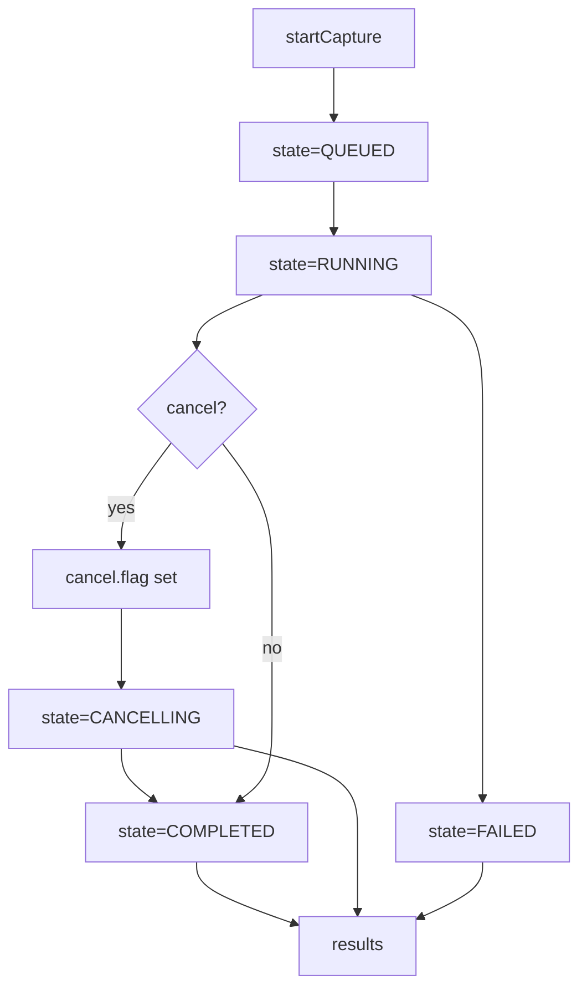

## Agent Review Bundle Summary
- Goal: Move RxMER SG endpoint and route package from /cmts/pnm/sg/ds/rxmer to /cmts/pnm/sg/ds/ofdm/rxmer and keep path aligned with directory layout.
- Changes: Added ofdm package segment, moved RxMER route module under pnm/sg/ds/ofdm/rxmer, updated router imports/prefixes, updated tests and FastAPI docs endpoint paths.
- Files: docs/api/fast-api/index.md, docs/api/fast-api/pnm-rxmer.md, src/pypnm_cmts/api/routes/pnm/router.py, src/pypnm_cmts/api/routes/pnm/sg/__init__.py, src/pypnm_cmts/api/routes/pnm/sg/ds/__init__.py, src/pypnm_cmts/api/routes/pnm/sg/ds/ofdm/__init__.py, src/pypnm_cmts/api/routes/pnm/sg/ds/ofdm/rxmer/__init__.py, src/pypnm_cmts/api/routes/pnm/sg/ds/ofdm/rxmer/router.py, src/pypnm_cmts/api/routes/pnm/sg/ds/ofdm/rxmer/schemas.py, src/pypnm_cmts/api/routes/pnm/sg/ds/ofdm/rxmer/service.py, tests/test_rxmer_orchestration.py, tests/test_rxmer_pnm_artifacts.py
- Tests: PYTEST_ADDOPTS='-p no:cacheprovider' pytest -q tests/test_rxmer_orchestration.py tests/test_rxmer_pnm_artifacts.py; route mount check confirms /cmts/pnm/sg/ds/ofdm/rxmer present and prior path absent.
- Notes: Legacy source files under src/pypnm_cmts/api/routes/pnm/rxmer are removed as part of the move.

# FILE: docs/api/fast-api/index.md
<!-- SPDX-License-Identifier: Apache-2.0 -->
<!-- Copyright (c) 2026 Maurice Garcia -->

# FastAPI Reference

FastAPI Endpoint Documentation For PyPNM-CMTS Lives Here.

## Running The Service

Start the FastAPI service using the CLI:

```bash
pypnm-cmts serve --host 127.0.0.1 --port 8000
```

Example health checks:

```bash
curl http://127.0.0.1:8000/ops/health
curl http://127.0.0.1:8000/ops/ready
```

PyPNM endpoints from `pypnm-docsis` are mounted under the `/cm` prefix. Example:

```bash
curl http://127.0.0.1:8000/cm/health
```

CMTS endpoints document JSON-only responses; binary or archive responses are advertised only for PyPNM endpoints that return files.

SGW refresh runs in a background loop after startup prime. Cache-first endpoints
may request a refresh, but they do not execute SNMP in the request thread.

## Current Endpoints

- `GET /cmts/system/sysDescr` - CMTS sysDescr lookup.
- `GET /cmts/servingGroup/get/ids` - SG cache summary and discovered IDs.
- `GET /cmts/servingGroup/status` - SGW startup status and cache readiness.
- `POST /cmts/servingGroup/get/cableModems` - SG cache modem membership (paginated).
- `POST /cmts/servingGroup/get/topology` - SG cache topology summary.
- `POST /cmts/pnm/sg/ds/ofdm/rxmer` - Start serving group RxMER operation.
- `POST /cmts/pnm/sg/ds/ofdm/rxmer/status` - Get serving group RxMER operation status.
- `POST /cmts/pnm/sg/ds/ofdm/rxmer/results` - Get serving group RxMER operation results.
- `POST /cmts/pnm/sg/ds/ofdm/rxmer/cancel` - Cancel serving group RxMER operation.
- `GET /ops/health` - Liveness probe.
- `GET /ops/ready` - Readiness probe.
- `GET /ops/version` - Service identity and version.
- `GET /ops/status` - Operational process status snapshot.
- `GET /ops/servingGroupWorker/process` - SGW worker uptime snapshot.
- `GET /ops/servingGroupWorker/poll-interval` - SGW poll interval summary.
- `POST /ops/servingGroupWorker/restart` - Queue a heavy refresh for an SGW worker.
- `POST /ops/servingGroupWorker/resetCounters` - Reset refresh counters for an SGW worker.

## Endpoint Documentation

- [Operational endpoints](operational.md)
- [RxMER orchestration](pnm-rxmer.md)
- [Serving group endpoints](serving-group.md)

## GET /cmts/system/sysDescr

This endpoint uses runtime CMTS adapter settings from `system.json`.
No request body or query parameters are required.

Example request:

```bash
curl -X GET "http://127.0.0.1:8000/cmts/system/sysDescr"
```


## Next Steps

- Add endpoint summaries as routes are added.
- Link each route section to the owning module under `src/pypnm_cmts/api`.

# FILE: docs/api/fast-api/pnm-rxmer.md
<!-- SPDX-License-Identifier: Apache-2.0 -->
<!-- Copyright (c) 2026 Maurice Garcia -->

# RxMER Orchestration Endpoints

RxMER serving-group orchestration uses a filesystem-backed operation model. The CMTS API creates and tracks job state while PyPNM captures are executed later in the pipeline.

## Lifecycle



## POST /cmts/pnm/sg/ds/ofdm/rxmer

Create a new serving-group RxMER operation. The response returns a new `operation_id` and initial counters.
Status values use numeric `ServiceStatusCode`.

Current behavior (Step 3): startCapture schedules background execution and returns immediately. Status, cancel, and results operate on persisted state and JSONL linkage records. Cancel creates `cancel.flag` and transitions to `CANCELLING`, and the runner transitions to `CANCELLED` when it observes the flag.

Collect-only behavior (Step 9): PyPNM owns PNM artifacts in `.data/pnm/` and authoritative transaction records in `.data/db/transactions.json`. CMTS linkage records store transaction_id and filename pointers for later decode/analysis. See `docs/api/fast-api/pypnm-cmts/sg-operations.md` for the on-disk data model.

Runner-level failures: the runner may synthesize stage outcomes when a per-modem timeout or internal exception occurs. In those cases, `ELIGIBILITY` and `PRECHECK` may be marked successful even if they did not run, and `CAPTURE` carries the failure status. `failure_reason` provides a normalized diagnostic for timeouts or runner-level failures.

Status types: orchestration responses use numeric `ServiceStatusCode`. `PnmCaptureStatus` exists for other capture pipelines but is not used in RxMER orchestration responses.

### Request

```json
{
  "cmts": {
    "serving_group": { "id": [] },
    "cable_modem": {
      "mac_address": [],
      "pnm_parameters": {
        "tftp": { "ipv4": null, "ipv6": null },
        "capture": { "channel_ids": [] }
      },
      "snmp": { "snmpV2C": { "community": "public" } }
    }
  },
  "execution": {
    "max_workers": 16,
    "retry_count": 3,
    "retry_delay_seconds": 5.0,
    "per_modem_timeout_seconds": 30.0,
    "overall_timeout_seconds": 120.0
  }
}
```

### Response

```json
{
  "status": 0,
  "message": "",
  "operation": {
    "operation_id": "1b3f5f3d4f3c4ab29a9ff9a3f0b7c8d1",
    "state": "queued",
    "counters": {
      "total_modems": 0,
      "eligible_modems": 0,
      "precheck_passed": 0,
      "capture_started": 0,
      "completed": 0,
      "success": 0,
      "failed": 0,
      "skipped": 0
    },
    "timestamps": {
      "created_epoch": 1767444600,
      "started_epoch": 0,
      "updated_epoch": 1767444600,
      "finished_epoch": 0
    },
    "request_summary": {
      "serving_group_ids": [],
      "mac_addresses": [],
      "channel_ids": [],
      "execution": {
        "max_workers": 16,
        "retry_count": 3,
        "retry_delay_seconds": 5.0,
        "per_modem_timeout_seconds": 30.0,
        "overall_timeout_seconds": 120.0
      }
    },
    "error_summary": null
  }
}
```

## POST /cmts/pnm/sg/ds/ofdm/rxmer/status

Return the persisted operation state.
The request payload uses `pnm_capture_operation_id`, while the returned state uses `operation_id`.

### Request

```json
{
  "pnm_capture_operation_id": "1b3f5f3d4f3c4ab29a9ff9a3f0b7c8d1"
}
```

### Response

```json
{
  "status": 0,
  "message": "",
  "operation": {
    "operation_id": "1b3f5f3d4f3c4ab29a9ff9a3f0b7c8d1",
    "state": "queued",
    "counters": {
      "total_modems": 0,
      "eligible_modems": 0,
      "precheck_passed": 0,
      "capture_started": 0,
      "completed": 0,
      "success": 0,
      "failed": 0,
      "skipped": 0
    },
    "timestamps": {
      "created_epoch": 1767444600,
      "started_epoch": 0,
      "updated_epoch": 1767444600,
      "finished_epoch": 0
    },
    "request_summary": {
      "serving_group_ids": [],
      "mac_addresses": [],
      "channel_ids": [],
      "execution": {
        "max_workers": 16,
        "retry_count": 3,
        "retry_delay_seconds": 5.0,
        "per_modem_timeout_seconds": 30.0,
        "overall_timeout_seconds": 120.0
      }
    },
    "error_summary": null
  }
}
```

## POST /cmts/pnm/sg/ds/ofdm/rxmer/results

Return linkage records for an operation. The response includes records only when the dataset is small enough to inline.
The request payload uses `pnm_capture_operation_id`, while the returned state uses `operation_id`.

### Request

```json
{
  "pnm_capture_operation_id": "1b3f5f3d4f3c4ab29a9ff9a3f0b7c8d1"
}
```

### Response

```json
{
  "status": 0,
  "message": "no results recorded",
  "summary": {
    "record_count": 0,
    "included_count": 0,
    "files_scanned": 0
  },
  "records": []
}
```

## POST /cmts/pnm/sg/ds/ofdm/rxmer/cancel

Request cancellation for an operation.
The request payload uses `pnm_capture_operation_id`, while the returned state uses `operation_id`.

### Request

```json
{
  "pnm_capture_operation_id": "1b3f5f3d4f3c4ab29a9ff9a3f0b7c8d1"
}
```

### Response

```json
{
  "status": 0,
  "message": "",
  "operation": {
    "operation_id": "1b3f5f3d4f3c4ab29a9ff9a3f0b7c8d1",
    "state": "cancelling",
    "counters": {
      "total_modems": 0,
      "eligible_modems": 0,
      "precheck_passed": 0,
      "capture_started": 0,
      "completed": 0,
      "success": 0,
      "failed": 0,
      "skipped": 0
    },
    "timestamps": {
      "created_epoch": 1767444600,
      "started_epoch": 0,
      "updated_epoch": 1767444610,
      "finished_epoch": 0
    },
    "request_summary": {
      "serving_group_ids": [],
      "mac_addresses": [],
      "channel_ids": [],
      "execution": {
        "max_workers": 16,
        "retry_count": 3,
        "retry_delay_seconds": 5.0,
        "per_modem_timeout_seconds": 30.0,
        "overall_timeout_seconds": 120.0
      }
    },
    "error_summary": null
  }
}
```

# FILE: src/pypnm_cmts/api/routes/pnm/router.py
# SPDX-License-Identifier: Apache-2.0
# Copyright (c) 2026 Maurice Garcia

"""PNM orchestration router."""
from __future__ import annotations

from pypnm_cmts.api.routes.pnm.sg.ds.ofdm.rxmer.router import router

__all__ = [
    "router",
]

# FILE: src/pypnm_cmts/api/routes/pnm/sg/__init__.py
# SPDX-License-Identifier: Apache-2.0
# Copyright (c) 2026 Maurice Garcia


# FILE: src/pypnm_cmts/api/routes/pnm/sg/ds/__init__.py
# SPDX-License-Identifier: Apache-2.0
# Copyright (c) 2026 Maurice Garcia


# FILE: src/pypnm_cmts/api/routes/pnm/sg/ds/ofdm/__init__.py
# SPDX-License-Identifier: Apache-2.0
# Copyright (c) 2026 Maurice Garcia


# FILE: src/pypnm_cmts/api/routes/pnm/sg/ds/ofdm/rxmer/__init__.py
# SPDX-License-Identifier: Apache-2.0
# Copyright (c) 2026 Maurice Garcia

"""RxMER PNM orchestration routes."""
from __future__ import annotations

from pypnm_cmts.api.routes.pnm.sg.ds.ofdm.rxmer.router import router

__all__ = [
    "router",
]

# FILE: src/pypnm_cmts/api/routes/pnm/sg/ds/ofdm/rxmer/router.py
# SPDX-License-Identifier: Apache-2.0
# Copyright (c) 2026 Maurice Garcia

from __future__ import annotations

import logging

from fastapi import APIRouter

from pypnm_cmts.api.routes.pnm.sg.ds.ofdm.rxmer.schemas import (
    RxMerServiceGroupCancelResponse,
    RxMerServiceGroupOperationRequest,
    RxMerServiceGroupResultsResponse,
    RxMerServiceGroupStartCaptureRequest,
    RxMerServiceGroupStartCaptureResponse,
    RxMerServiceGroupStatusResponse,
)
from pypnm_cmts.api.routes.pnm.sg.ds.ofdm.rxmer.service import RxMerServiceGroupOperationService
from pypnm_cmts.api.utils.fastapi_responses import JSON_ONLY_FAST_API_RESPONSE


class RxMerRouter:
    """
    FastAPI router for RxMER orchestration endpoints.
    """

    def __init__(
        self,
        prefix: str = "/cmts/pnm/sg/ds/ofdm/rxmer",
        tags: list[str] | None = None,
    ) -> None:
        if tags is None:
            tags = ["CMTS PNM RxMER"]
        self.router = APIRouter(prefix=prefix, tags=tags)
        self.logger = logging.getLogger(__name__)
        self._service = RxMerServiceGroupOperationService()
        self._register_routes()

    def _register_routes(self) -> None:
        @self.router.post(
            "",
            response_model=RxMerServiceGroupStartCaptureResponse,
            summary="Start SG-level RxMER capture",
            description="Creates a filesystem-backed RxMER operation for serving groups.",
            responses={**JSON_ONLY_FAST_API_RESPONSE},
        )
        def start_capture(
            payload: RxMerServiceGroupStartCaptureRequest,
        ) -> RxMerServiceGroupStartCaptureResponse:
            """
            **Serving Group RxMER Start Capture**

            Creates a new SG-level RxMER orchestration operation.
            """
            return self._service.start_capture(payload)

        @self.router.post(
            "/status",
            response_model=RxMerServiceGroupStatusResponse,
            summary="Get SG-level RxMER status",
            description="Returns operation state for an RxMER serving group job.",
            responses={**JSON_ONLY_FAST_API_RESPONSE},
        )
        def status(
            payload: RxMerServiceGroupOperationRequest,
        ) -> RxMerServiceGroupStatusResponse:
            """
            **Serving Group RxMER Status**

            Returns the latest operation state for an SG-level RxMER job.
            """
            return self._service.status(payload)

        @self.router.post(
            "/results",
            response_model=RxMerServiceGroupResultsResponse,
            summary="Get SG-level RxMER results",
            description="Returns linkage results for an RxMER serving group job.",
            responses={**JSON_ONLY_FAST_API_RESPONSE},
        )
        def results(
            payload: RxMerServiceGroupOperationRequest,
        ) -> RxMerServiceGroupResultsResponse:
            """
            **Serving Group RxMER Results**

            Returns summary and linkage records for an SG-level RxMER job.
            """
            return self._service.results(payload)

        @self.router.post(
            "/cancel",
            response_model=RxMerServiceGroupCancelResponse,
            summary="Cancel SG-level RxMER capture",
            description="Requests cancellation for an RxMER serving group job.",
            responses={**JSON_ONLY_FAST_API_RESPONSE},
        )
        def cancel(
            payload: RxMerServiceGroupOperationRequest,
        ) -> RxMerServiceGroupCancelResponse:
            """
            **Serving Group RxMER Cancel**

            Requests cancellation for an SG-level RxMER job.
            """
            return self._service.cancel(payload)


router = RxMerRouter().router

__all__ = [
    "router",
]

# FILE: src/pypnm_cmts/api/routes/pnm/sg/ds/ofdm/rxmer/schemas.py
# SPDX-License-Identifier: Apache-2.0
# Copyright (c) 2026 Maurice Garcia

from __future__ import annotations

from pydantic import BaseModel, ConfigDict, Field
from pypnm.api.routes.common.service.status_codes import ServiceStatusCode

from pypnm_cmts.api.common.cmts_request import CmtsRequestEnvelopeModel
from pypnm_cmts.api.common.operations.models import (
    OperationResultsSummaryModel,
    OperationStateModel,
    PerModemLinkageRecordModel,
)
from pypnm_cmts.lib.types import PnmCaptureOperationId

DEFAULT_MAX_WORKERS = 16
DEFAULT_RETRY_COUNT = 3
DEFAULT_RETRY_DELAY_SECONDS = 5.0
DEFAULT_PER_MODEM_TIMEOUT_SECONDS = 30.0
DEFAULT_OVERALL_TIMEOUT_SECONDS = 120.0


class RxMerServiceGroupExecutionModel(BaseModel):
    """Execution controls for serving-group RxMER orchestration."""

    max_workers: int = Field(default=DEFAULT_MAX_WORKERS, gt=0, description="Maximum concurrent workers.")
    retry_count: int = Field(default=DEFAULT_RETRY_COUNT, ge=0, description="Retry attempts for retryable failures.")
    retry_delay_seconds: float = Field(
        default=DEFAULT_RETRY_DELAY_SECONDS,
        ge=0.0,
        description="Delay between retry attempts in seconds.",
    )
    per_modem_timeout_seconds: float = Field(
        default=DEFAULT_PER_MODEM_TIMEOUT_SECONDS,
        gt=0.0,
        description="Timeout for each modem in seconds.",
    )
    overall_timeout_seconds: float = Field(
        default=DEFAULT_OVERALL_TIMEOUT_SECONDS,
        gt=0.0,
        description="Overall timeout in seconds.",
    )


class RxMerServiceGroupStartCaptureRequest(BaseModel):
    """Request payload for SG-level RxMER startCapture."""

    model_config = ConfigDict(extra="ignore")

    cmts: CmtsRequestEnvelopeModel = Field(default_factory=CmtsRequestEnvelopeModel, description="CMTS request envelope.")
    execution: RxMerServiceGroupExecutionModel = Field(
        default_factory=RxMerServiceGroupExecutionModel,
        description="Execution settings for the orchestration.",
    )


class RxMerServiceGroupOperationRequest(BaseModel):
    """Request payload for SG-level RxMER operation lookup."""

    pnm_capture_operation_id: PnmCaptureOperationId = Field(..., description="Operation identifier.")


class RxMerServiceGroupStartCaptureResponse(BaseModel):
    """Response payload for SG-level RxMER startCapture."""

    status: ServiceStatusCode = Field(default=ServiceStatusCode.SUCCESS, description="Service status code.")
    message: str = Field(default="", description="Informational or error message.")
    operation: OperationStateModel = Field(..., description="Initial operation state.")


class RxMerServiceGroupStatusResponse(BaseModel):
    """Response payload for SG-level RxMER status."""

    status: ServiceStatusCode = Field(default=ServiceStatusCode.SUCCESS, description="Service status code.")
    message: str = Field(default="", description="Informational or error message.")
    operation: OperationStateModel | None = Field(default=None, description="Operation state snapshot.")


class RxMerServiceGroupCancelResponse(BaseModel):
    """Response payload for SG-level RxMER cancel."""

    status: ServiceStatusCode = Field(default=ServiceStatusCode.SUCCESS, description="Service status code.")
    message: str = Field(default="", description="Informational or error message.")
    operation: OperationStateModel | None = Field(default=None, description="Updated operation state.")


class RxMerServiceGroupResultsResponse(BaseModel):
    """Response payload for SG-level RxMER results."""

    status: ServiceStatusCode = Field(default=ServiceStatusCode.SUCCESS, description="Service status code.")
    message: str = Field(default="", description="Informational or error message.")
    summary: OperationResultsSummaryModel = Field(
        default_factory=OperationResultsSummaryModel,
        description="Results summary for the operation.",
    )
    records: list[PerModemLinkageRecordModel] = Field(
        default_factory=list,
        description="Linkage records included in the response.",
    )


__all__ = [
    "RxMerServiceGroupCancelResponse",
    "RxMerServiceGroupExecutionModel",
    "RxMerServiceGroupOperationRequest",
    "RxMerServiceGroupResultsResponse",
    "RxMerServiceGroupStartCaptureRequest",
    "RxMerServiceGroupStartCaptureResponse",
    "RxMerServiceGroupStatusResponse",
]

# FILE: src/pypnm_cmts/api/routes/pnm/sg/ds/ofdm/rxmer/service.py
# SPDX-License-Identifier: Apache-2.0
# Copyright (c) 2026 Maurice Garcia

from __future__ import annotations

import asyncio
import logging
from collections.abc import Callable

from pypnm.api.routes.common.classes.operation.cable_modem_precheck import CableModemServicePreCheck
from pypnm.api.routes.common.extended.common_measure_schema import DownstreamOfdmParameters
from pypnm.api.routes.common.extended.common_messaging_service import (
    MessagePayload,
    MessageResponse,
    MessageResponseType,
)
from pypnm.api.routes.common.service.status_codes import ServiceStatusCode
from pypnm.api.routes.docs.pnm.ds.ofdm.rxmer.service import CmDsOfdmRxMerService
from pypnm.config.pnm_config_manager import PnmConfigManager
from pypnm.docsis.cable_modem import CableModem
from pypnm.lib.inet import Inet
from pypnm.lib.mac_address import MacAddress
from pypnm.lib.types import ChannelId, FileNameStr, InetAddressStr, MacAddressStr, TimestampSec, TransactionId
from pypnm.lib.utils import Generate, TimeUnit

from pypnm_cmts.api.common.cmts_request import CmtsRequestEnvelopeModel
from pypnm_cmts.api.common.operations.models import (
    OperationExecutionModel,
    OperationRequestContextModel,
    OperationRequestSummaryModel,
    OperationResultsSummaryModel,
    OperationStageResultModel,
)
from pypnm_cmts.api.common.operations.runner import (
    OperationRunner,
    OperationWorkItemModel,
    OperationWorkerResultModel,
)
from pypnm_cmts.api.common.operations.store import OperationStore
from pypnm_cmts.api.routes.pnm.sg.ds.ofdm.rxmer.schemas import (
    RxMerServiceGroupCancelResponse,
    RxMerServiceGroupOperationRequest,
    RxMerServiceGroupResultsResponse,
    RxMerServiceGroupStartCaptureRequest,
    RxMerServiceGroupStartCaptureResponse,
    RxMerServiceGroupStatusResponse,
)
from pypnm_cmts.lib.constants import OperationStage, OperationState
from pypnm_cmts.lib.types import PnmCaptureOperationId, ServiceGroupId
from pypnm_cmts.sgw.models import SgwCableModemModel
from pypnm_cmts.sgw.runtime_state import get_sgw_store
from pypnm_cmts.sgw.store import SgwCacheStore

DEFAULT_MAX_INLINE_RECORDS = 250
NOT_FOUND_MESSAGE = "operation not found"
CLEAR_MESSAGE = ""
PRECHECK_FAILURE_MESSAGE = "precheck failed"
MISSING_IP_MESSAGE = "modem ip address missing"
NO_MESSAGE_RESPONSE = "capture returned no message response"
MISSING_TRANSACTION_MESSAGE = "missing transaction_id or filename"

CaptureExecutor = Callable[
    [CableModem, DownstreamOfdmParameters | None, tuple[Inet, Inet], str],
    MessageResponse,
]
PrecheckExecutor = Callable[[CableModem], tuple[ServiceStatusCode, str]]


class RxMerCaptureWorker:
    """Execute eligibility, precheck, and capture stages for a single modem."""

    def __init__(
        self,
        store: OperationStore,
        capture_executor: CaptureExecutor,
        precheck_executor: PrecheckExecutor,
        sgw_store: SgwCacheStore | None,
    ) -> None:
        self._store = store
        self._capture_executor = capture_executor
        self._precheck_executor = precheck_executor
        self._sgw_store = sgw_store
        self.logger = logging.getLogger(f"{self.__class__.__name__}")

    def __call__(self, item: OperationWorkItemModel) -> OperationWorkerResultModel:
        """Run eligibility, precheck, and capture for a modem work item."""
        state = self._store.load_state(item.operation_id)
        request_summary = state.request_summary
        request_context = self._store.load_request_context(item.operation_id)
        ip_address = self._resolve_modem_ip(item.sg_id, item.mac_address)
        now_epoch = self._now_epoch()
        stages: list[OperationStageResultModel] = []
        eligibility_result = OperationStageResultModel(
            stage=OperationStage.ELIGIBILITY,
            status_code=ServiceStatusCode.SUCCESS if ip_address is not None else ServiceStatusCode.INVALID_CAPTURE_PARAMETERS,
            transaction_ids=[],
            filenames=[],
            message="" if ip_address is not None else MISSING_IP_MESSAGE,
            started_epoch=now_epoch,
            finished_epoch=now_epoch,
        )
        stages.append(eligibility_result)
        if eligibility_result.status_code != ServiceStatusCode.SUCCESS:
            return OperationWorkerResultModel(ip_address=ip_address, stages=stages)

        write_community = self._resolve_write_community(request_context)
        cm = CableModem(
            mac_address=MacAddress(item.mac_address),
            inet=Inet(InetAddressStr(ip_address)),
            write_community=write_community,
        )
        precheck_status, precheck_message = self._precheck_executor(cm)
        precheck_result = OperationStageResultModel(
            stage=OperationStage.PRECHECK,
            status_code=precheck_status,
            transaction_ids=[],
            filenames=[],
            message=precheck_message,
            started_epoch=now_epoch,
            finished_epoch=now_epoch,
        )
        stages.append(precheck_result)
        if precheck_status != ServiceStatusCode.SUCCESS:
            return OperationWorkerResultModel(ip_address=ip_address, stages=stages)

        capture_result = self._run_capture(
            operation_id=item.operation_id,
            sg_id=item.sg_id,
            mac_address=item.mac_address,
            cable_modem=cm,
            channel_ids=list(request_summary.channel_ids),
            request_context=request_context,
        )
        stages.append(capture_result)
        return OperationWorkerResultModel(ip_address=ip_address, stages=stages)

    def _resolve_modem_ip(
        self,
        sg_id: ServiceGroupId,
        mac_address: MacAddressStr,
    ) -> InetAddressStr | None:
        store = self._sgw_store
        if store is None:
            return None
        entry = store.get_entry(sg_id)
        if entry is None:
            return None
        for modem in entry.snapshot.cable_modems:
            if modem.mac != mac_address:
                continue
            ip_value = self._select_ip(modem)
            if ip_value is None:
                return None
            try:
                return InetAddressStr(str(Inet(ip_value)))
            except Exception:
                return None
        return None

    @staticmethod
    def _select_ip(modem: SgwCableModemModel) -> str | None:
        ipv4 = str(modem.ipv4).strip()
        if ipv4 not in {"", "0.0.0.0"}:
            return ipv4
        ipv6 = str(modem.ipv6).strip()
        if ipv6 not in {"", "::"}:
            return ipv6
        return None

    @staticmethod
    def _resolve_write_community(context: OperationRequestContextModel | None) -> str:
        if context is None or context.snmp_write_community is None:
            return PnmConfigManager.get_write_community()
        return str(context.snmp_write_community)

    def _run_capture(
        self,
        operation_id: PnmCaptureOperationId,
        sg_id: ServiceGroupId,
        mac_address: MacAddressStr,
        cable_modem: CableModem,
        channel_ids: list[ChannelId],
        request_context: OperationRequestContextModel | None,
    ) -> OperationStageResultModel:
        interface_parameters = None
        if channel_ids:
            interface_parameters = DownstreamOfdmParameters(channel_id=list(channel_ids))
        tftp_servers = self._resolve_tftp_servers(request_context)
        tftp_path = PnmConfigManager.get_tftp_path()
        capture_response = self._capture_executor(cable_modem, interface_parameters, tftp_servers, tftp_path)
        status_code, transaction_id, filename, message = self._parse_capture_response(capture_response)
        created_epoch = self._now_epoch()
        final_transaction_ids: list[TransactionId] = []
        final_filenames: list[FileNameStr] = []
        final_message = message
        if status_code == ServiceStatusCode.SUCCESS and filename is not None and transaction_id is not None:
            final_transaction_ids = [transaction_id]
            final_filenames = [filename]
        else:
            final_message = message or MISSING_TRANSACTION_MESSAGE
        return OperationStageResultModel(
            stage=OperationStage.CAPTURE,
            status_code=status_code,
            transaction_ids=final_transaction_ids,
            filenames=final_filenames,
            message=final_message,
            started_epoch=created_epoch,
            finished_epoch=created_epoch,
        )

    @staticmethod
    def _resolve_tftp_servers(context: OperationRequestContextModel | None) -> tuple[Inet, Inet]:
        default_v4, default_v6 = PnmConfigManager.get_tftp_servers()
        ipv4 = default_v4 if context is None or context.tftp_ipv4 is None else Inet(str(context.tftp_ipv4))
        ipv6 = default_v6 if context is None or context.tftp_ipv6 is None else Inet(str(context.tftp_ipv6))
        return (ipv4, ipv6)

    @staticmethod
    def _parse_capture_response(
        response: MessageResponse | None,
    ) -> tuple[ServiceStatusCode, TransactionId | None, FileNameStr | None, str]:
        if response is None:
            return (ServiceStatusCode.FAILURE, None, None, NO_MESSAGE_RESPONSE)
        status_code = response.status
        if status_code != ServiceStatusCode.SUCCESS:
            return (status_code, None, None, f"{status_code.name}")
        payload = response.payload
        if not isinstance(payload, list):
            return (ServiceStatusCode.FAILURE, None, None, MISSING_TRANSACTION_MESSAGE)
        for element in payload:
            message_type, message = RxMerCaptureWorker._extract_payload_entry(element)
            if message_type != MessageResponseType.PNM_FILE_TRANSACTION.name:
                continue
            if not isinstance(message, dict):
                continue
            transaction_id = message.get("transaction_id")
            filename = message.get("filename")
            if transaction_id is None or filename is None:
                continue
            return (
                status_code,
                TransactionId(str(transaction_id)),
                FileNameStr(str(filename)),
                CLEAR_MESSAGE,
            )
        return (ServiceStatusCode.PNM_FILE_TRANSACTION_ID_NOT_FOUND, None, None, MISSING_TRANSACTION_MESSAGE)

    @staticmethod
    def _extract_payload_entry(
        element: MessagePayload | dict[str, object],
    ) -> tuple[str | None, object | None]:
        if isinstance(element, MessagePayload):
            return (element.message_type, element.message)
        if isinstance(element, dict):
            message_type = element.get("message_type")
            message = element.get("message")
            return (
                str(message_type) if message_type is not None else None,
                message,
            )
        return (None, None)

    @staticmethod
    def _now_epoch() -> TimestampSec:
        return TimestampSec(Generate.time_stamp(unit=TimeUnit.SECONDS))


def _run_pypnm_capture(
    cable_modem: CableModem,
    interface_parameters: DownstreamOfdmParameters | None,
    tftp_servers: tuple[Inet, Inet],
    tftp_path: str,
) -> MessageResponse:
    service = CmDsOfdmRxMerService(cable_modem, tftp_servers, tftp_path)
    return asyncio.run(service.set_and_go(interface_parameters=interface_parameters))


class RxMerServiceGroupOperationService:
    """Service layer for SG-level RxMER operation lifecycle endpoints."""

    def __init__(
        self,
        store: OperationStore | None = None,
        runner: OperationRunner | None = None,
        capture_executor: CaptureExecutor | None = None,
        precheck_executor: PrecheckExecutor | None = None,
        sgw_store: SgwCacheStore | None = None,
        max_inline_records: int = DEFAULT_MAX_INLINE_RECORDS,
    ) -> None:
        self._store = store or OperationStore()
        self._capture_executor = capture_executor or _run_pypnm_capture
        self._precheck_executor = precheck_executor or self._run_precheck
        self._sgw_store = sgw_store or get_sgw_store()
        if runner is None:
            worker = RxMerCaptureWorker(
                store=self._store,
                capture_executor=self._capture_executor,
                precheck_executor=self._precheck_executor,
                sgw_store=self._sgw_store,
            )
            runner = OperationRunner(self._store, worker=worker)
        self._runner = runner
        self._max_inline_records = max_inline_records
        self.logger = logging.getLogger(f"{self.__class__.__name__}")

    def start_capture(
        self,
        request: RxMerServiceGroupStartCaptureRequest,
    ) -> RxMerServiceGroupStartCaptureResponse:
        """Create a new SG-level RxMER operation state record."""
        request_summary = self._build_request_summary(request)
        request_context = self._build_request_context(request)
        state = self._store.create_operation(request_summary, request_context)
        started = self._runner.start(state.operation_id)
        if not started:
            self.logger.warning("operation runner already active for %s", state.operation_id)
        return RxMerServiceGroupStartCaptureResponse(
            status=ServiceStatusCode.SUCCESS,
            message="",
            operation=state,
        )

    def status(
        self,
        request: RxMerServiceGroupOperationRequest,
    ) -> RxMerServiceGroupStatusResponse:
        """Return the persisted state for an operation."""
        try:
            state = self._store.load_state(request.pnm_capture_operation_id)
        except FileNotFoundError:
            return RxMerServiceGroupStatusResponse(
                status=ServiceStatusCode.FAILURE,
                message=NOT_FOUND_MESSAGE,
                operation=None,
            )
        message = ""
        if state.state == OperationState.COMPLETED and state.counters.total_modems == 0:
            message = "no modems selected"
        return RxMerServiceGroupStatusResponse(
            status=ServiceStatusCode.SUCCESS,
            message=message,
            operation=state,
        )

    def cancel(
        self,
        request: RxMerServiceGroupOperationRequest,
    ) -> RxMerServiceGroupCancelResponse:
        """Request cancellation for an operation."""
        try:
            state = self._runner.request_cancel(request.pnm_capture_operation_id)
        except FileNotFoundError:
            return RxMerServiceGroupCancelResponse(
                status=ServiceStatusCode.FAILURE,
                message=NOT_FOUND_MESSAGE,
                operation=None,
            )
        return RxMerServiceGroupCancelResponse(
            status=ServiceStatusCode.SUCCESS,
            message="",
            operation=state,
        )

    def results(
        self,
        request: RxMerServiceGroupOperationRequest,
    ) -> RxMerServiceGroupResultsResponse:
        """Return linkage records for an operation when available."""
        try:
            self._store.load_state(request.pnm_capture_operation_id)
        except FileNotFoundError:
            return RxMerServiceGroupResultsResponse(
                status=ServiceStatusCode.FAILURE,
                message=NOT_FOUND_MESSAGE,
            )

        files_scanned = self._store.count_result_files(request.pnm_capture_operation_id)
        total_records = self._store.count_result_records(request.pnm_capture_operation_id)
        include_records = total_records <= self._max_inline_records
        records = []
        if include_records:
            records = self._store.load_result_records(request.pnm_capture_operation_id)
        summary = OperationResultsSummaryModel(
            record_count=total_records,
            included_count=len(records),
            files_scanned=files_scanned,
        )
        message = "" if total_records > 0 else "no results recorded"
        return RxMerServiceGroupResultsResponse(
            status=ServiceStatusCode.SUCCESS,
            message=message,
            summary=summary,
            records=records,
        )

    @staticmethod
    def _build_request_context(
        request: RxMerServiceGroupStartCaptureRequest,
    ) -> OperationRequestContextModel:
        cmts = request.cmts
        pnm = cmts.cable_modem.pnm_parameters
        tftp = pnm.tftp if pnm is not None else None
        snmp = cmts.cable_modem.snmp
        snmp_v2c = snmp.snmpV2C if snmp is not None else None
        return OperationRequestContextModel(
            tftp_ipv4=tftp.ipv4 if tftp is not None else None,
            tftp_ipv6=tftp.ipv6 if tftp is not None else None,
            snmp_write_community=snmp_v2c.community if snmp_v2c is not None else None,
        )

    @staticmethod
    def _run_precheck(cable_modem: CableModem) -> tuple[ServiceStatusCode, str]:
        try:
            return asyncio.run(
                CableModemServicePreCheck(cable_modem=cable_modem, validate_ofdm_exist=True).run_precheck()
            )
        except Exception as exc:
            return (ServiceStatusCode.FAILURE, f"{PRECHECK_FAILURE_MESSAGE}: {exc}")

    @staticmethod
    def _build_request_summary(
        request: RxMerServiceGroupStartCaptureRequest,
    ) -> OperationRequestSummaryModel:
        cmts = request.cmts
        channel_ids = RxMerServiceGroupOperationService._resolve_channel_ids(cmts)
        execution = request.execution
        return OperationRequestSummaryModel(
            serving_group_ids=list(cmts.serving_group.id),
            mac_addresses=list(cmts.cable_modem.mac_address),
            channel_ids=channel_ids,
            execution=OperationExecutionModel(
                max_workers=execution.max_workers,
                retry_count=execution.retry_count,
                retry_delay_seconds=execution.retry_delay_seconds,
                per_modem_timeout_seconds=execution.per_modem_timeout_seconds,
                overall_timeout_seconds=execution.overall_timeout_seconds,
            ),
        )

    @staticmethod
    def _resolve_channel_ids(cmts: CmtsRequestEnvelopeModel) -> list[ChannelId]:
        pnm = cmts.cable_modem.pnm_parameters
        capture = pnm.capture if pnm is not None else None
        channel_ids = capture.channel_ids if capture is not None else None
        if not channel_ids:
            return []
        return list(channel_ids)


__all__ = [
    "RxMerServiceGroupOperationService",
]

# FILE: tests/test_rxmer_orchestration.py
# SPDX-License-Identifier: Apache-2.0
# Copyright (c) 2026 Maurice Garcia

from __future__ import annotations

from collections.abc import Callable
from pathlib import Path
import time

import pytest
from pydantic import ValidationError
from pypnm.api.routes.common.service.status_codes import ServiceStatusCode
from pypnm.lib.types import FileNameStr, InetAddressStr, MacAddressStr, TimestampSec, TransactionId
from pypnm.lib.utils import Generate, TimeUnit

from pypnm_cmts.api.common.cmts_request import (
    CmtsCableModemFilterModel,
    CmtsPnmCaptureParametersModel,
    CmtsPnmParametersModel,
    CmtsRequestEnvelopeModel,
    CmtsServingGroupFilterModel,
    CmtsSnmpModel,
    CmtsSnmpV2CModel,
    CmtsTftpParametersModel,
)
from pypnm_cmts.api.common.operations.models import PerModemLinkageRecordModel
from pypnm_cmts.api.common.operations.runner import (
    DEFAULT_OVERALL_TIMEOUT_MESSAGE,
    OperationRunner,
    OperationWorkItemModel,
    OperationWorkerResultModel,
)
from pypnm_cmts.api.common.operations.models import OperationStageResultModel
from pypnm_cmts.api.common.operations.store import OperationStore
from pypnm_cmts.api.routes.pnm.sg.ds.ofdm.rxmer.schemas import (
    RxMerServiceGroupExecutionModel,
    RxMerServiceGroupOperationRequest,
    RxMerServiceGroupStartCaptureRequest,
)
from pypnm_cmts.api.routes.pnm.sg.ds.ofdm.rxmer.service import RxMerServiceGroupOperationService
from pypnm_cmts.lib.constants import OperationStage, OperationState
from pypnm_cmts.lib.types import PnmCaptureOperationId, ServiceGroupId

POLL_INTERVAL_SECONDS = 0.02
STATE_TIMEOUT_SECONDS = 2.0
WORKER_DELAY_SECONDS = 0.1


def _build_service(
    tmp_path: Path,
    worker: Callable[[OperationWorkItemModel], OperationWorkerResultModel] | None = None,
) -> RxMerServiceGroupOperationService:
    store = OperationStore(base_dir=tmp_path)
    runner = OperationRunner(store=store, worker=worker)
    return RxMerServiceGroupOperationService(store=store, runner=runner)


def _build_request(
    mac_count: int = 0,
    execution: RxMerServiceGroupExecutionModel | None = None,
) -> RxMerServiceGroupStartCaptureRequest:
    macs = [MacAddressStr(f"aa:bb:cc:dd:ee:{index:02x}") for index in range(mac_count)]
    return RxMerServiceGroupStartCaptureRequest(
        cmts=CmtsRequestEnvelopeModel(
            serving_group=CmtsServingGroupFilterModel(id=[ServiceGroupId(1)]),
            cable_modem=CmtsCableModemFilterModel(mac_address=macs),
        ),
        execution=execution or RxMerServiceGroupExecutionModel(),
    )


def _wait_for_state(
    store: OperationStore,
    operation_id: PnmCaptureOperationId,
    targets: set[OperationState],
) -> OperationState | None:
    deadline = time.monotonic() + STATE_TIMEOUT_SECONDS
    while time.monotonic() < deadline:
        state = store.load_state(operation_id)
        if state.state in targets:
            return state.state
        time.sleep(POLL_INTERVAL_SECONDS)
    return None


def _slow_worker(item: OperationWorkItemModel) -> OperationWorkerResultModel:
    started_epoch = TimestampSec(Generate.time_stamp(unit=TimeUnit.SECONDS))
    time.sleep(WORKER_DELAY_SECONDS)
    finished_epoch = TimestampSec(Generate.time_stamp(unit=TimeUnit.SECONDS))
    return OperationWorkerResultModel(
        stages=[
            OperationStageResultModel(
                stage=OperationStage.ELIGIBILITY,
                status_code=ServiceStatusCode.SUCCESS,
                transaction_ids=[],
                filenames=[],
                message="eligible",
                started_epoch=started_epoch,
                finished_epoch=finished_epoch,
            ),
            OperationStageResultModel(
                stage=OperationStage.PRECHECK,
                status_code=ServiceStatusCode.SUCCESS,
                transaction_ids=[],
                filenames=[],
                message="precheck ok",
                started_epoch=started_epoch,
                finished_epoch=finished_epoch,
            ),
            OperationStageResultModel(
                stage=OperationStage.CAPTURE,
                status_code=ServiceStatusCode.SUCCESS,
                transaction_ids=[TransactionId("1a2b3c4d5e6f7a8b9c0d1e2f")],
                filenames=[FileNameStr("capture.bin")],
                message="completed",
                started_epoch=started_epoch,
                finished_epoch=finished_epoch,
            ),
        ]
    )


def test_rxmer_start_capture_creates_state(tmp_path: Path) -> None:
    service = _build_service(tmp_path)
    request = _build_request()
    response = service.start_capture(request)

    operation = response.operation
    assert operation.state == OperationState.QUEUED

    state_path = tmp_path / str(operation.operation_id) / "state.json"
    assert state_path.exists()


def test_rxmer_status_reads_state(tmp_path: Path) -> None:
    service = _build_service(tmp_path)
    request = _build_request()
    start_response = service.start_capture(request)

    status_request = RxMerServiceGroupOperationRequest(
        pnm_capture_operation_id=start_response.operation.operation_id,
    )
    status_response = service.status(status_request)
    assert status_response.operation is not None
    assert status_response.operation.operation_id == start_response.operation.operation_id


def test_rxmer_cancel_creates_flag(tmp_path: Path) -> None:
    service = _build_service(tmp_path, worker=_slow_worker)
    request = _build_request(mac_count=2)
    start_response = service.start_capture(request)

    cancel_request = RxMerServiceGroupOperationRequest(
        pnm_capture_operation_id=start_response.operation.operation_id,
    )
    cancel_response = service.cancel(cancel_request)
    assert cancel_response.operation is not None
    assert cancel_response.operation.state in {OperationState.CANCELLING, OperationState.CANCELLED}
    assert service._store.is_cancel_requested(start_response.operation.operation_id)


def test_rxmer_results_empty(tmp_path: Path) -> None:
    service = _build_service(tmp_path)
    request = _build_request()
    start_response = service.start_capture(request)

    results_request = RxMerServiceGroupOperationRequest(
        pnm_capture_operation_id=start_response.operation.operation_id,
    )
    results_response = service.results(results_request)
    assert results_response.summary.record_count == 0
    assert results_response.records == []


def test_rxmer_results_include_records(tmp_path: Path) -> None:
    service = _build_service(tmp_path)
    request = _build_request()
    start_response = service.start_capture(request)

    record = PerModemLinkageRecordModel(
        pnm_capture_operation_id=start_response.operation.operation_id,
        sg_id=ServiceGroupId(1),
        mac_address=MacAddressStr("aa:bb:cc:dd:ee:ff"),
        ip_address=InetAddressStr("192.168.0.100"),
        stage=OperationStage.ELIGIBILITY,
        status_code=ServiceStatusCode.SUCCESS,
        transaction_ids=[TransactionId("1a2b3c4d5e6f7a8b9c0d1e2f")],
        filenames=[FileNameStr("capture.bin")],
        started_epoch=1,
        finished_epoch=2,
        message="",
    )
    service._store.append_result_record(record)

    results_request = RxMerServiceGroupOperationRequest(
        pnm_capture_operation_id=start_response.operation.operation_id,
    )
    results_response = service.results(results_request)
    assert results_response.summary.record_count == 1
    assert len(results_response.records) == 1


def test_rxmer_runner_transitions_to_running(tmp_path: Path) -> None:
    service = _build_service(tmp_path, worker=_slow_worker)
    request = _build_request(mac_count=2)
    start_response = service.start_capture(request)

    running_state = _wait_for_state(
        service._store,
        start_response.operation.operation_id,
        {OperationState.RUNNING},
    )
    assert running_state == OperationState.RUNNING


def test_rxmer_runner_cancelled(tmp_path: Path) -> None:
    service = _build_service(tmp_path, worker=_slow_worker)
    request = _build_request(mac_count=2)
    start_response = service.start_capture(request)

    cancel_request = RxMerServiceGroupOperationRequest(
        pnm_capture_operation_id=start_response.operation.operation_id,
    )
    service.cancel(cancel_request)
    cancelled_state = _wait_for_state(
        service._store,
        start_response.operation.operation_id,
        {OperationState.CANCELLED},
    )
    assert cancelled_state == OperationState.CANCELLED


def test_rxmer_runner_emits_records(tmp_path: Path) -> None:
    service = _build_service(tmp_path, worker=_slow_worker)
    request = _build_request(mac_count=2)
    start_response = service.start_capture(request)

    terminal_state = _wait_for_state(
        service._store,
        start_response.operation.operation_id,
        {OperationState.COMPLETED, OperationState.FAILED},
    )
    assert terminal_state == OperationState.COMPLETED
    assert service._store.count_result_records(start_response.operation.operation_id) > 0


def test_rxmer_runner_no_modems_selected(tmp_path: Path) -> None:
    service = _build_service(tmp_path, worker=_slow_worker)
    request = _build_request(mac_count=0)
    start_response = service.start_capture(request)

    completed_state = _wait_for_state(
        service._store,
        start_response.operation.operation_id,
        {OperationState.COMPLETED},
    )
    assert completed_state == OperationState.COMPLETED
    state = service._store.load_state(start_response.operation.operation_id)
    assert state.counters.total_modems == 0
    assert service._store.count_result_records(start_response.operation.operation_id) == 0


def test_rxmer_runner_retries_until_success(tmp_path: Path) -> None:
    attempts: dict[str, int] = {}

    def _flaky_worker(item: OperationWorkItemModel) -> OperationWorkerResultModel:
        count = attempts.get(str(item.mac_address), 0) + 1
        attempts[str(item.mac_address)] = count
        started_epoch = TimestampSec(Generate.time_stamp(unit=TimeUnit.SECONDS))
        finished_epoch = TimestampSec(Generate.time_stamp(unit=TimeUnit.SECONDS))
        if count == 1:
            return OperationWorkerResultModel(
                stages=[
                    OperationStageResultModel(
                        stage=OperationStage.ELIGIBILITY,
                        status_code=ServiceStatusCode.SUCCESS,
                        transaction_ids=[],
                        filenames=[],
                        message="eligible",
                        started_epoch=started_epoch,
                        finished_epoch=finished_epoch,
                    ),
                    OperationStageResultModel(
                        stage=OperationStage.PRECHECK,
                        status_code=ServiceStatusCode.SUCCESS,
                        transaction_ids=[],
                        filenames=[],
                        message="precheck ok",
                        started_epoch=started_epoch,
                        finished_epoch=finished_epoch,
                    ),
                    OperationStageResultModel(
                        stage=OperationStage.CAPTURE,
                        status_code=ServiceStatusCode.FAILURE,
                        transaction_ids=[],
                        filenames=[],
                        message="failed once",
                        started_epoch=started_epoch,
                        finished_epoch=finished_epoch,
                    ),
                ]
            )
        return OperationWorkerResultModel(
            stages=[
                OperationStageResultModel(
                    stage=OperationStage.ELIGIBILITY,
                    status_code=ServiceStatusCode.SUCCESS,
                    transaction_ids=[],
                    filenames=[],
                    message="eligible",
                    started_epoch=started_epoch,
                    finished_epoch=finished_epoch,
                ),
                OperationStageResultModel(
                    stage=OperationStage.PRECHECK,
                    status_code=ServiceStatusCode.SUCCESS,
                    transaction_ids=[],
                    filenames=[],
                    message="precheck ok",
                    started_epoch=started_epoch,
                    finished_epoch=finished_epoch,
                ),
                OperationStageResultModel(
                    stage=OperationStage.CAPTURE,
                    status_code=ServiceStatusCode.SUCCESS,
                    transaction_ids=[],
                    filenames=[],
                    message="recovered",
                    started_epoch=started_epoch,
                    finished_epoch=finished_epoch,
                ),
            ]
        )

    service = _build_service(tmp_path, worker=_flaky_worker)
    request = _build_request(
        mac_count=1,
        execution=RxMerServiceGroupExecutionModel(
            max_workers=1,
            retry_count=1,
            retry_delay_seconds=0.0,
            per_modem_timeout_seconds=1.0,
            overall_timeout_seconds=2.0,
        ),
    )
    start_response = service.start_capture(request)
    terminal_state = _wait_for_state(
        service._store,
        start_response.operation.operation_id,
        {OperationState.COMPLETED, OperationState.FAILED},
    )
    assert terminal_state == OperationState.COMPLETED
    state = service._store.load_state(start_response.operation.operation_id)
    assert state.counters.success == 1
    assert state.counters.failed == 0


def test_rxmer_runner_per_modem_timeout(tmp_path: Path) -> None:
    def _slow_timeout_worker(item: OperationWorkItemModel) -> OperationWorkerResultModel:
        started_epoch = TimestampSec(Generate.time_stamp(unit=TimeUnit.SECONDS))
        time.sleep(WORKER_DELAY_SECONDS)
        finished_epoch = TimestampSec(Generate.time_stamp(unit=TimeUnit.SECONDS))
        return OperationWorkerResultModel(
            stages=[
                OperationStageResultModel(
                    stage=OperationStage.ELIGIBILITY,
                    status_code=ServiceStatusCode.SUCCESS,
                    transaction_ids=[],
                    filenames=[],
                    message="eligible",
                    started_epoch=started_epoch,
                    finished_epoch=finished_epoch,
                ),
                OperationStageResultModel(
                    stage=OperationStage.PRECHECK,
                    status_code=ServiceStatusCode.SUCCESS,
                    transaction_ids=[],
                    filenames=[],
                    message="precheck ok",
                    started_epoch=started_epoch,
                    finished_epoch=finished_epoch,
                ),
                OperationStageResultModel(
                    stage=OperationStage.CAPTURE,
                    status_code=ServiceStatusCode.SUCCESS,
                    transaction_ids=[],
                    filenames=[],
                    message="late",
                    started_epoch=started_epoch,
                    finished_epoch=finished_epoch,
                ),
            ]
        )

    service = _build_service(tmp_path, worker=_slow_timeout_worker)
    request = _build_request(
        mac_count=2,
        execution=RxMerServiceGroupExecutionModel(
            max_workers=1,
            retry_count=0,
            retry_delay_seconds=0.0,
            per_modem_timeout_seconds=0.01,
            overall_timeout_seconds=2.0,
        ),
    )
    start_response = service.start_capture(request)
    terminal_state = _wait_for_state(
        service._store,
        start_response.operation.operation_id,
        {OperationState.COMPLETED, OperationState.FAILED},
    )
    assert terminal_state == OperationState.FAILED
    state = service._store.load_state(start_response.operation.operation_id)
    assert state.counters.failed == 2
    assert state.counters.success == 0
    records = service._store.load_result_records(start_response.operation.operation_id)
    assert len(records) == 6
    stages = {record.stage for record in records}
    assert stages == {OperationStage.ELIGIBILITY, OperationStage.PRECHECK, OperationStage.CAPTURE}


def test_rxmer_runner_overall_timeout(tmp_path: Path) -> None:
    def _slow_overall_worker(item: OperationWorkItemModel) -> OperationWorkerResultModel:
        started_epoch = TimestampSec(Generate.time_stamp(unit=TimeUnit.SECONDS))
        time.sleep(WORKER_DELAY_SECONDS)
        finished_epoch = TimestampSec(Generate.time_stamp(unit=TimeUnit.SECONDS))
        return OperationWorkerResultModel(
            stages=[
                OperationStageResultModel(
                    stage=OperationStage.ELIGIBILITY,
                    status_code=ServiceStatusCode.SUCCESS,
                    transaction_ids=[],
                    filenames=[],
                    message="eligible",
                    started_epoch=started_epoch,
                    finished_epoch=finished_epoch,
                ),
                OperationStageResultModel(
                    stage=OperationStage.PRECHECK,
                    status_code=ServiceStatusCode.SUCCESS,
                    transaction_ids=[],
                    filenames=[],
                    message="precheck ok",
                    started_epoch=started_epoch,
                    finished_epoch=finished_epoch,
                ),
                OperationStageResultModel(
                    stage=OperationStage.CAPTURE,
                    status_code=ServiceStatusCode.SUCCESS,
                    transaction_ids=[],
                    filenames=[],
                    message="late",
                    started_epoch=started_epoch,
                    finished_epoch=finished_epoch,
                ),
            ]
        )

    service = _build_service(tmp_path, worker=_slow_overall_worker)
    request = _build_request(
        mac_count=2,
        execution=RxMerServiceGroupExecutionModel(
            max_workers=1,
            retry_count=0,
            retry_delay_seconds=0.0,
            per_modem_timeout_seconds=1.0,
            overall_timeout_seconds=0.05,
        ),
    )
    start_response = service.start_capture(request)
    terminal_state = _wait_for_state(
        service._store,
        start_response.operation.operation_id,
        {OperationState.FAILED},
    )
    assert terminal_state == OperationState.FAILED
    state = service._store.load_state(start_response.operation.operation_id)
    assert state.error_summary is not None
    assert DEFAULT_OVERALL_TIMEOUT_MESSAGE in state.error_summary.message


def test_rxmer_runner_cancel_mid_flight(tmp_path: Path) -> None:
    service = _build_service(tmp_path, worker=_slow_worker)
    request = _build_request(mac_count=5)
    start_response = service.start_capture(request)

    running_state = _wait_for_state(
        service._store,
        start_response.operation.operation_id,
        {OperationState.RUNNING},
    )
    assert running_state == OperationState.RUNNING

    cancel_request = RxMerServiceGroupOperationRequest(
        pnm_capture_operation_id=start_response.operation.operation_id,
    )
    service.cancel(cancel_request)
    cancelled_state = _wait_for_state(
        service._store,
        start_response.operation.operation_id,
        {OperationState.CANCELLED},
    )
    assert cancelled_state == OperationState.CANCELLED
    assert service._runner.is_running(start_response.operation.operation_id) is False


def test_rxmer_request_rejects_blank_snmp_community() -> None:
    with pytest.raises(ValidationError):
        RxMerServiceGroupStartCaptureRequest(
            cmts=CmtsRequestEnvelopeModel(
                cable_modem=CmtsCableModemFilterModel(
                    snmp=CmtsSnmpModel(
                        snmpV2C=CmtsSnmpV2CModel(community=""),
                    ),
                )
            )
        )


def test_rxmer_request_allows_null_snmp_community() -> None:
    request = RxMerServiceGroupStartCaptureRequest(
        cmts=CmtsRequestEnvelopeModel(
            cable_modem=CmtsCableModemFilterModel(
                snmp=CmtsSnmpModel(
                    snmpV2C=CmtsSnmpV2CModel(community=None),
                ),
            )
        )
    )
    assert request.cmts.cable_modem.snmp is not None


def test_rxmer_request_rejects_blank_tftp_overrides() -> None:
    with pytest.raises(ValidationError):
        RxMerServiceGroupStartCaptureRequest(
            cmts=CmtsRequestEnvelopeModel(
                cable_modem=CmtsCableModemFilterModel(
                    pnm_parameters=CmtsPnmParametersModel(
                        tftp=CmtsTftpParametersModel(ipv4="", ipv6=None),
                    )
                )
            )
        )


def test_rxmer_request_allows_null_tftp_overrides() -> None:
    request = RxMerServiceGroupStartCaptureRequest(
        cmts=CmtsRequestEnvelopeModel(
            cable_modem=CmtsCableModemFilterModel(
                pnm_parameters=CmtsPnmParametersModel(
                    tftp=CmtsTftpParametersModel(ipv4=None, ipv6=None),
                    capture=CmtsPnmCaptureParametersModel(channel_ids=[]),
                )
            )
        )
    )
    assert request.cmts.cable_modem.pnm_parameters is not None


def test_rxmer_execution_validation_rules() -> None:
    with pytest.raises(ValidationError):
        RxMerServiceGroupExecutionModel(
            max_workers=0,
            retry_count=0,
            retry_delay_seconds=0.0,
            per_modem_timeout_seconds=1.0,
            overall_timeout_seconds=1.0,
        )
    with pytest.raises(ValidationError):
        RxMerServiceGroupExecutionModel(
            max_workers=1,
            retry_count=-1,
            retry_delay_seconds=0.0,
            per_modem_timeout_seconds=1.0,
            overall_timeout_seconds=1.0,
        )
    with pytest.raises(ValidationError):
        RxMerServiceGroupExecutionModel(
            max_workers=1,
            retry_count=0,
            retry_delay_seconds=-1.0,
            per_modem_timeout_seconds=1.0,
            overall_timeout_seconds=1.0,
        )
    with pytest.raises(ValidationError):
        RxMerServiceGroupExecutionModel(
            max_workers=1,
            retry_count=0,
            retry_delay_seconds=0.0,
            per_modem_timeout_seconds=0.0,
            overall_timeout_seconds=1.0,
        )
    with pytest.raises(ValidationError):
        RxMerServiceGroupExecutionModel(
            max_workers=1,
            retry_count=0,
            retry_delay_seconds=0.0,
            per_modem_timeout_seconds=1.0,
            overall_timeout_seconds=0.0,
        )

# FILE: tests/test_rxmer_pnm_artifacts.py
# SPDX-License-Identifier: Apache-2.0
# Copyright (c) 2026 Maurice Garcia

from __future__ import annotations

from pathlib import Path
import time

from pypnm.api.routes.common.extended.common_messaging_service import MessageResponse
from pypnm.api.routes.common.service.status_codes import ServiceStatusCode
from pypnm.lib.types import FileNameStr, IPv4Str, IPv6Str, MacAddressStr, TransactionId

from pypnm_cmts.api.common.cmts_request import (
    CmtsCableModemFilterModel,
    CmtsRequestEnvelopeModel,
    CmtsServingGroupFilterModel,
)
from pypnm_cmts.api.common.operations.store import OperationStore
from pypnm_cmts.api.routes.pnm.sg.ds.ofdm.rxmer.schemas import (
    RxMerServiceGroupExecutionModel,
    RxMerServiceGroupStartCaptureRequest,
)
from pypnm_cmts.api.routes.pnm.sg.ds.ofdm.rxmer.service import RxMerServiceGroupOperationService
from pypnm_cmts.lib.constants import OperationStage, OperationState, PnmCaptureFailureReason
from pypnm_cmts.lib.types import PnmCaptureOperationId, ServiceGroupId
from pypnm_cmts.sgw.models import SgwCableModemModel, SgwCacheEntryModel, SgwSnapshotModel
from pypnm_cmts.sgw.store import SgwCacheStore

POLL_INTERVAL_SECONDS = 0.02
STATE_TIMEOUT_SECONDS = 3.0
TEST_TRANSACTION_ID = TransactionId("1a2b3c4d5e6f7a8b9c0d1e2f")
TEST_FILENAME = FileNameStr("rxmer-test.bin")


def _wait_for_state(
    store: OperationStore,
    operation_id: PnmCaptureOperationId,
    targets: set[OperationState],
) -> OperationState | None:
    deadline = time.monotonic() + STATE_TIMEOUT_SECONDS
    while time.monotonic() < deadline:
        state = store.load_state(operation_id)
        if state.state in targets:
            return state.state
        time.sleep(POLL_INTERVAL_SECONDS)
    return None


def _build_sgw_store(mac_address: MacAddressStr, sg_id: ServiceGroupId) -> SgwCacheStore:
    store = SgwCacheStore()
    snapshot = SgwSnapshotModel(
        sg_id=sg_id,
        cable_modems=[
            SgwCableModemModel(
                mac=mac_address,
                ipv4=IPv4Str("192.168.0.100"),
                ipv6=IPv6Str(""),
            )
        ],
    )
    store.upsert_entry(SgwCacheEntryModel(sg_id=sg_id, snapshot=snapshot))
    return store


def test_rxmer_capture_persists_artifacts(tmp_path: Path) -> None:
    mac = MacAddressStr("aa:bb:cc:dd:ee:ff")
    sg_id = ServiceGroupId(1)
    pnm_source_dir = tmp_path / "pypnm"
    pnm_source_dir.mkdir(parents=True, exist_ok=True)
    sgw_store = _build_sgw_store(mac, sg_id)

    def _fake_precheck(_cm) -> tuple[ServiceStatusCode, str]:
        return (ServiceStatusCode.SUCCESS, "precheck ok")

    def _fake_capture(_cm, _interface_parameters, _tftp_servers, _tftp_path) -> MessageResponse:
        (pnm_source_dir / str(TEST_FILENAME)).write_text("data", encoding="utf-8")
        payload = [
            {
                "status": ServiceStatusCode.SUCCESS.name,
                "message_type": "PNM_FILE_TRANSACTION",
                "message": {
                    "transaction_id": str(TEST_TRANSACTION_ID),
                    "filename": str(TEST_FILENAME),
                },
            }
        ]
        return MessageResponse(ServiceStatusCode.SUCCESS, payload)

    service = RxMerServiceGroupOperationService(
        store=OperationStore(base_dir=tmp_path / "ops"),
        capture_executor=_fake_capture,
        precheck_executor=_fake_precheck,
        sgw_store=sgw_store,
    )
    request = RxMerServiceGroupStartCaptureRequest(
        cmts=CmtsRequestEnvelopeModel(
            serving_group=CmtsServingGroupFilterModel(id=[sg_id]),
            cable_modem=CmtsCableModemFilterModel(mac_address=[mac]),
        ),
        execution=RxMerServiceGroupExecutionModel(
            max_workers=1,
            retry_count=0,
            retry_delay_seconds=0.0,
            per_modem_timeout_seconds=1.0,
            overall_timeout_seconds=2.0,
        ),
    )
    start_response = service.start_capture(request)
    terminal_state = _wait_for_state(
        service._store,
        start_response.operation.operation_id,
        {OperationState.COMPLETED, OperationState.FAILED},
    )
    assert terminal_state == OperationState.COMPLETED

    assert not (tmp_path / "pnm").exists()

    records = service._store.load_result_records(start_response.operation.operation_id)
    capture_records = [record for record in records if record.stage == OperationStage.CAPTURE]
    assert capture_records
    assert capture_records[0].transaction_ids == [TEST_TRANSACTION_ID]
    assert capture_records[0].filenames == [TEST_FILENAME]
    assert str(capture_records[0].ip_address) == "192.168.0.100"
    assert capture_records[0].failure_reason is None


def test_rxmer_capture_failure_records_linkage(tmp_path: Path) -> None:
    mac = MacAddressStr("aa:bb:cc:dd:ee:01")
    sg_id = ServiceGroupId(2)
    pnm_source_dir = tmp_path / "pypnm"
    sgw_store = _build_sgw_store(mac, sg_id)

    def _fake_precheck(_cm) -> tuple[ServiceStatusCode, str]:
        return (ServiceStatusCode.SUCCESS, "precheck ok")

    def _fake_capture(_cm, _interface_parameters, _tftp_servers, _tftp_path) -> MessageResponse:
        return MessageResponse(ServiceStatusCode.FAILURE, [])

    service = RxMerServiceGroupOperationService(
        store=OperationStore(base_dir=tmp_path / "ops"),
        capture_executor=_fake_capture,
        precheck_executor=_fake_precheck,
        sgw_store=sgw_store,
    )
    request = RxMerServiceGroupStartCaptureRequest(
        cmts=CmtsRequestEnvelopeModel(
            serving_group=CmtsServingGroupFilterModel(id=[sg_id]),
            cable_modem=CmtsCableModemFilterModel(mac_address=[mac]),
        ),
        execution=RxMerServiceGroupExecutionModel(
            max_workers=1,
            retry_count=0,
            retry_delay_seconds=0.0,
            per_modem_timeout_seconds=1.0,
            overall_timeout_seconds=2.0,
        ),
    )
    start_response = service.start_capture(request)
    terminal_state = _wait_for_state(
        service._store,
        start_response.operation.operation_id,
        {OperationState.COMPLETED, OperationState.FAILED},
    )
    assert terminal_state == OperationState.FAILED

    assert not (tmp_path / "pnm").exists()
    records = service._store.load_result_records(start_response.operation.operation_id)
    capture_records = [record for record in records if record.stage == OperationStage.CAPTURE]
    assert capture_records
    assert capture_records[0].status_code == ServiceStatusCode.FAILURE
    assert capture_records[0].transaction_ids == []
    assert capture_records[0].filenames == []
    assert capture_records[0].failure_reason is None


def test_rxmer_capture_per_modem_timeout_sets_failure_reason(tmp_path: Path) -> None:
    mac = MacAddressStr("aa:bb:cc:dd:ee:02")
    sg_id = ServiceGroupId(3)
    pnm_source_dir = tmp_path / "pypnm"
    pnm_source_dir.mkdir(parents=True, exist_ok=True)
    sgw_store = _build_sgw_store(mac, sg_id)

    def _fake_precheck(_cm) -> tuple[ServiceStatusCode, str]:
        return (ServiceStatusCode.SUCCESS, "precheck ok")

    def _slow_capture(_cm, _interface_parameters, _tftp_servers, _tftp_path) -> MessageResponse:
        time.sleep(0.2)
        return MessageResponse(ServiceStatusCode.SUCCESS, [])

    service = RxMerServiceGroupOperationService(
        store=OperationStore(base_dir=tmp_path / "ops"),
        capture_executor=_slow_capture,
        precheck_executor=_fake_precheck,
        sgw_store=sgw_store,
    )
    request = RxMerServiceGroupStartCaptureRequest(
        cmts=CmtsRequestEnvelopeModel(
            serving_group=CmtsServingGroupFilterModel(id=[sg_id]),
            cable_modem=CmtsCableModemFilterModel(mac_address=[mac]),
        ),
        execution=RxMerServiceGroupExecutionModel(
            max_workers=1,
            retry_count=0,
            retry_delay_seconds=0.0,
            per_modem_timeout_seconds=0.01,
            overall_timeout_seconds=2.0,
        ),
    )
    start_response = service.start_capture(request)
    terminal_state = _wait_for_state(
        service._store,
        start_response.operation.operation_id,
        {OperationState.COMPLETED, OperationState.FAILED},
    )
    assert terminal_state == OperationState.FAILED
    assert not (tmp_path / "pnm").exists()

    records = service._store.load_result_records(start_response.operation.operation_id)
    capture_records = [record for record in records if record.stage == OperationStage.CAPTURE]
    assert capture_records
    assert capture_records[0].failure_reason == PnmCaptureFailureReason.PER_MODEM_TIMEOUT

