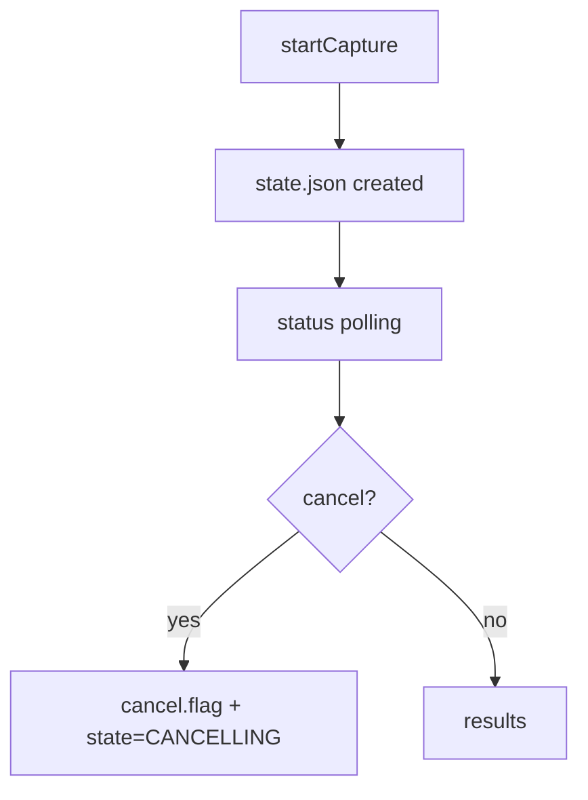

# FILE: docs/planning/phase11-step2-prompt.md
<!-- SPDX-License-Identifier: Apache-2.0 -->
<!-- Copyright (c) 2026 Maurice Garcia -->

Phase 11 · Step 2 · Generic SG Operation Foundation (Models + FS Store + Thin POST Endpoints) + RxMER Wiring Only

Implement Phase 11 Step 2 in the PyPNM-CMTS repo ONLY. One step at a time: do not advance to any later steps until Step 2 is complete and reviewed.

Before writing code, VERIFY whether AGENTS.md already contains the “Symbol Map (PyPNM Reuse Index)” section and the “BaseModel-first / avoid dicts / avoid generics” guidance. If any part is missing, UPDATE AGENTS.md in this same step to include it (minimal change only, preserve style).

Critical Coding Rules (Must Follow)
- Avoid generics and generic container imports: NO Dict/List/Tuple/Union. Use built-ins (list, dict) and |.
- Use semantic type aliases where possible (prefer src/pypnm_cmts/lib/types.py and pypnm.lib.types).
- Prefer Pydantic BaseModel for any public/stateful structure and any message passing (requests, responses, operation state, store I/O).
- dicts are allowed ONLY for short-lived internal glue (e.g., json dump/load boundaries). If a public method would accept/return a dict, replace it with a BaseModel.
- Router files must be thin; all logic in service/store layers.
- Do NOT call PyPNM FastAPI HTTP endpoints. Reuse PyPNM engine classes only (later steps).
- Any cable-modem interaction (L1/L2/L3, SNMP, reachability, capture, polling) MUST remain in PyPNM (later steps). Step 2 has NO CM interaction.
- Preserve whitespace/alignment; do not auto-format. Ruff clean. Strict typing; avoid Any.
- Update SPDX header years to 2026 (or 2025-2026) on any touched file per repo policy.
- POST-only for these Phase 11 SG endpoints:
  /cmts/pnm/rxmer/sg/startCapture
  /cmts/pnm/rxmer/sg/status
  /cmts/pnm/rxmer/sg/results
  /cmts/pnm/rxmer/sg/cancel

Step 2 Objective (Reusable Foundation First)
This step lays the reusable job/orchestration foundation for multiple future PNM operations. RxMER is the first consumer, but generic-first code reuse in PyPNM-CMTS is mandatory.

Do NOT implement SGW fanout, precheck, capture, or any PyPNM engine calls in this step.

Reuse-First Requirement (Critical)
- Build a GENERIC operation framework under:
  src/pypnm_cmts/api/common/operations/
  (models + filesystem store + shared helpers)
- RxMER route/service must only “wire” to the generic framework using RxMER request schemas and RxMER endpoint paths.
- Do NOT create RxMER-only duplicates of generic concerns (operation state, counters, filesystem layout, JSONL writer, cancellation).
- If a model/store/helper is reusable across future PNM jobs, it MUST live under api/common/operations/ and be composed by RxMER schemas.

Repo Placement Constraints (Verified)
- RxMER route placement: src/pypnm_cmts/api/routes/pnm/rxmer/
- Routers: class-based wrapper with APIRouter + _register_routes() and module-level router export.
- Shared responses: JSON_ONLY_FAST_API_RESPONSE.
- Docs: docs/api/fast-api/pnm-rxmer.md exists and follows repo conventions.
- Symbol map must be respected:
  tools/agent-review/phase11-pypnm-reuse-symbol-table.md

Schema Contract (Must Match Exactly)
Request JSON (empty list semantics):
- cmts.serving_group.id: list; empty [] means all SGs
- cmts.cable_modem.mac_address: list; empty [] means all modems in targeted SGs
- cmts.cable_modem.pnm_parameters.tftp.ipv4/ipv6: null means use PyPNM defaults; blank string invalid
- cmts.cable_modem.pnm_parameters.capture.channel_ids: list; empty [] means all channels
- cmts.cable_modem.snmp.snmpV2C.community: string or null; null uses PyPNM defaults; blank string invalid
- execution: max_workers, retry_count, retry_delay_seconds, per_modem_timeout_seconds, overall_timeout_seconds
Important: Preserve JSON casing (snmpV2C). Validate numeric fields (>= 0 where applicable; timeouts > 0).

Type Reuse Requirements
- Use PyPNM types where appropriate:
  - from pypnm.lib.types import MacAddressStr, InetAddressStr, IPv4Str, IPv6Str, TransactionId, OperationId, FileNameStr
  - from pypnm.api.routes.common.service.status_codes import ServiceStatusCode
- Prefer composing PyPNM schema models where feasible:
  - TftpConfig, PnmCaptureConfig, SNMPConfig/SNMPv2c (for blank/null rules and casing)
- Use CMTS ID aliases from src/pypnm_cmts/lib/types.py for sg_id and operation ids if they exist; otherwise add new aliases there only when necessary.

Generic Operation Models (BaseModels) — api/common/operations/
Create reusable BaseModels:
- Operation identifier type alias for pnm_capture_operation_id (semantic alias; stored as string)
- OperationState enum (API-visible): QUEUED, RUNNING, COMPLETED, FAILED, CANCELLING, CANCELLED
  Put API-visible enums/tokens in src/pypnm_cmts/lib/constants.py.
- OperationStage enum (API-visible): ELIGIBILITY, PRECHECK, CAPTURE
  Put in constants.py.
- OperationCountersModel:
  total_modems, eligible_modems, precheck_passed, capture_started, completed, success, failed, skipped
- OperationTimestampsModel (epoch seconds only):
  created_epoch, started_epoch, updated_epoch, finished_epoch
- OperationStateModel:
  operation_id + state + counters + timestamps + request_summary (minimal BaseModel) + error_summary (optional BaseModel)

Generic Results / Linkage Models (BaseModels) — api/common/operations/
- PerModemLinkageRecordModel (for JSONL append):
  - pnm_capture_operation_id
  - sg_id
  - mac_address: MacAddressStr
  - ip_address: InetAddressStr | None
  - stage: OperationStage
  - status_code: ServiceStatusCode (do not introduce CmtsStatusCode in Step 2 unless absolutely required)
  - transaction_ids: list[TransactionId] (0..N)
  - filenames: list[FileNameStr] (0..N)
  - started_epoch, finished_epoch
  - message: str

Filesystem Layout (Authoritative)
Under: .data/sg_operations/<pnm_capture_operation_id>/
- state.json (overwrite atomically)
- cancel.flag (exists => cancel requested)
- results/
  - sg-<sg_id>.jsonl (append-only; one PerModemLinkageRecordModel per line)
No retention/cleanup in this step.

Implementation Tasks
1) Create generic operations package:
   - src/pypnm_cmts/api/common/operations/__init__.py
   - src/pypnm_cmts/api/common/operations/models.py
   - src/pypnm_cmts/api/common/operations/store.py
   store.py must be class-based with strictly typed methods returning BaseModels, not dicts.
2) Implement filesystem store methods:
   - create_operation(...)
   - load_state(...)
   - save_state_atomic(...)
   - request_cancel(...)
   - is_cancel_requested(...)
   - append_result_record(...)
   All I/O boundaries may use dict internally for json load/dump, but public methods must return BaseModels.
3) RxMER schemas (compose generic models) under:
   - src/pypnm_cmts/api/routes/pnm/rxmer/schemas.py
   Do not duplicate generic state/counters fields.
4) RxMER service.py:
   - delegates to generic store for start/status/results/cancel
   - contains NO CM logic
5) RxMER router.py:
   - 4 POST endpoints with JSON_ONLY_FAST_API_RESPONSE
   - router remains glue only

Endpoint Behavior (Step 2 Only)
- startCapture:
  - validate request model
  - allocate new pnm_capture_operation_id
  - create operation dir + initial state.json (state = QUEUED or RUNNING; choose one and document it)
  - return a response BaseModel including operation_id + initial counters/timestamps
- status:
  - load and return state.json as BaseModel
- cancel:
  - create cancel.flag + update state to CANCELLING unless terminal
  - return updated state
- results:
  - return a lightweight summary BaseModel and, if “small”, include parsed JSONL records as list[PerModemLinkageRecordModel]
  - JSON-only response; no file/streaming responses in Step 2

Tests (Mandatory in Step 2)
Add pytest coverage using tmp_path (no real .data usage):
- startCapture creates operation dir + valid state.json
- status reads and returns state
- cancel creates cancel.flag and state transitions to CANCELLING
- results returns empty summary when no JSONL exists; after appending records, returns parsed results when small
No SGW and no CM mocking needed in Step 2.

Docs (Mandatory in Step 2)
Update docs/api/fast-api/pnm-rxmer.md:
- Add SG job endpoints (start/status/results/cancel)
- Request/Response JSON examples matching schemas
- Mermaid lifecycle diagram (start -> poll -> results/cancel)
No horizontal rules.

Agent Review Bundle (Mandatory)
Create/update a tools/agent-review bundle file that concatenates full contents of all touched files, each preceded by:
# FILE: <path>

Deliverables in Codex Response
- Summary of changes + why (emphasize reusable foundation)
- List of modified files (paths only)
- Tests run (pytest) + results
- Confirm API schema/response shape changes
- Path to agent review bundle

# FILE: src/pypnm_cmts/lib/types.py
# SPDX-License-Identifier: Apache-2.0
# Copyright (c) 2025-2026 Maurice Garcia

"""Type aliases for PyPNM-CMTS."""
from __future__ import annotations

from typing import NewType

from pypnm.lib.types import (
    InterfaceIndex,
    IPv4Str,
    IPv6Str,
    MacAddressStr,
    PathLike,
    SnmpIndex,
)

IPv6LinkLocalStr        = NewType("IPv6LinkLocalStr", IPv6Str)
CableModemIndex         = NewType("CableModemIndex", SnmpIndex)
CmRegSgId               = NewType("CmRegSgId", int)
RegisterCmMacInetAddress = tuple[CableModemIndex, MacAddressStr, IPv4Str, IPv6Str, IPv6LinkLocalStr]
RegisterCmInetAddress   = tuple[IPv4Str, IPv6Str, IPv6LinkLocalStr]

MacAddressExist = NewType("MacAddressExist", bool)

CoordinationElectionName = NewType("CoordinationElectionName", str)
LeaderId                 = NewType("LeaderId", str)
OwnerId                  = NewType("OwnerId", str)
ServiceGroupId           = NewType("ServiceGroupId", int)
TickIndex                = NewType("TickIndex", int)
OrchestratorRunId        = NewType("OrchestratorRunId", str)
CoordinationPath         = PathLike
PnmCaptureOperationId    = NewType("PnmCaptureOperationId", str)

NodeName        = NewType("NodeName", str)
MdCmSgId        = NewType("MdCmSgId", int)
MdDsSgId        = NewType("MdDsSgId", int)
MdUsSgId        = NewType("MdUsSgId", int)
MdNodeStatus    = tuple[InterfaceIndex, NodeName, MdCmSgId]

CmtsCmRegStatusId       = NewType("CmtsCmRegStatusId", int)
CmtsCmRegStatusMacAddr  = tuple[CmtsCmRegStatusId, MacAddressStr]
CmtsCmRegState          = NewType("CmtsCmRegState", int)
InterfaceIndexOrZero    = NewType("InterfaceIndexOrZero", int)
MdIfIndex               = InterfaceIndexOrZero
RcpId                   = NewType("RcpId", str)
ChSetId                 = NewType("ChSetId", int)
DocsisQosVersion        = NewType("DocsisQosVersion", int)
DateAndTime             = NewType("DateAndTime", str)
EnergyMgtBits           = NewType("EnergyMgtBits", int)
InetAddressIPv4         = IPv4Str
InetAddressIPv6         = IPv6Str

__all__ = [
    "MacAddressExist",
    "IPv6LinkLocalStr",
    "CableModemIndex",
    "CmRegSgId",
    "CoordinationElectionName",
    "LeaderId",
    "OwnerId",
    "ServiceGroupId",
    "TickIndex",
    "OrchestratorRunId",
    "CoordinationPath",
    "PnmCaptureOperationId",
    "NodeName",
    "MdCmSgId",
    "MdDsSgId",
    "MdUsSgId",
    "MdNodeStatus",
    "CmtsCmRegStatusId",
    "CmtsCmRegStatusMacAddr",
    "CmtsCmRegState",
    "InterfaceIndexOrZero",
    "MdIfIndex",
    "RcpId",
    "ChSetId",
    "DocsisQosVersion",
    "DateAndTime",
    "EnergyMgtBits",
    "InetAddressIPv4",
    "InetAddressIPv6",
    "RegisterCmMacInetAddress",
    "RegisterCmInetAddress",
]

# FILE: src/pypnm_cmts/lib/constants.py
# SPDX-License-Identifier: Apache-2.0
# Copyright (c) 2026 Maurice Garcia

from __future__ import annotations

from enum import Enum


class OperationalStatus(str, Enum):
    OK = "ok"
    ERROR = "error"


class ReadinessCheck(str, Enum):
    STATE_DIR = "state_dir"
    STATE_DIR_CREATE = "state_dir_create"
    STATE_DIR_ACCESS = "state_dir_access"
    STATE_DIR_READ = "state_dir_read"
    WORKER_SG = "worker_sg"
    SGW_STARTUP = "sgw_startup"
    SGW_DISCOVERY = "sgw_discovery"
    SGW_PRIME = "sgw_prime"
    SGW_CACHE = "sgw_cache"


class CacheRefreshMode(str, Enum):
    NONE = "none"
    LIGHT = "light"
    HEAVY = "heavy"


class RfChannelType(str, Enum):
    SC_QAM = "sc_qam"
    OFDM = "ofdm"
    OFDMA = "ofdma"


class PnmCaptureStatus(str, Enum):
    SUCCESS = "success"
    FAILED = "failed"
    SKIPPED = "skipped"


class PnmCaptureFailureReason(str, Enum):
    PER_MODEM_TIMEOUT = "per_modem_timeout"
    OVERALL_TIMEOUT = "overall_timeout"
    HTTP_ERROR = "http_error"
    PYPNM_ERROR = "pypnm_error"
    REQUEST_ERROR = "request_error"
    UNKNOWN = "unknown"


class OperationState(str, Enum):
    QUEUED = "queued"
    RUNNING = "running"
    COMPLETED = "completed"
    FAILED = "failed"
    CANCELLING = "cancelling"
    CANCELLED = "cancelled"


class OperationStage(str, Enum):
    ELIGIBILITY = "eligibility"
    PRECHECK = "precheck"
    CAPTURE = "capture"


__all__ = [
    "CacheRefreshMode",
    "OperationStage",
    "OperationState",
    "OperationalStatus",
    "PnmCaptureFailureReason",
    "PnmCaptureStatus",
    "RfChannelType",
    "ReadinessCheck",
]

# FILE: src/pypnm_cmts/api/common/operations/__init__.py
# SPDX-License-Identifier: Apache-2.0
# Copyright (c) 2026 Maurice Garcia

"""Reusable filesystem-backed operation primitives for CMTS orchestration."""
from __future__ import annotations

from pypnm_cmts.api.common.operations.models import (
    OperationCountersModel,
    OperationErrorSummaryModel,
    OperationExecutionModel,
    OperationRequestSummaryModel,
    OperationResultsSummaryModel,
    OperationStateModel,
    OperationTimestampsModel,
    PerModemLinkageRecordModel,
)
from pypnm_cmts.api.common.operations.store import OperationStore

__all__ = [
    "OperationCountersModel",
    "OperationErrorSummaryModel",
    "OperationExecutionModel",
    "OperationRequestSummaryModel",
    "OperationResultsSummaryModel",
    "OperationStateModel",
    "OperationTimestampsModel",
    "OperationStore",
    "PerModemLinkageRecordModel",
]

# FILE: src/pypnm_cmts/api/common/operations/models.py
# SPDX-License-Identifier: Apache-2.0
# Copyright (c) 2026 Maurice Garcia

from __future__ import annotations

from pydantic import BaseModel, Field
from pypnm.api.routes.common.service.status_codes import ServiceStatusCode
from pypnm.lib.types import (
    ChannelId,
    FileNameStr,
    InetAddressStr,
    MacAddressStr,
    TimestampSec,
    TransactionId,
)

from pypnm_cmts.lib.constants import OperationStage, OperationState
from pypnm_cmts.lib.types import PnmCaptureOperationId, ServiceGroupId

MIN_TIMEOUT_SECONDS = 1.0


class OperationCountersModel(BaseModel):
    """Aggregate counters for operation progress tracking."""

    total_modems: int = Field(default=0, ge=0, description="Total modems in scope.")
    eligible_modems: int = Field(default=0, ge=0, description="Modems passing eligibility gate.")
    precheck_passed: int = Field(default=0, ge=0, description="Modems passing precheck stage.")
    capture_started: int = Field(default=0, ge=0, description="Modems with capture started.")
    completed: int = Field(default=0, ge=0, description="Modems with completed processing.")
    success: int = Field(default=0, ge=0, description="Modems with successful capture.")
    failed: int = Field(default=0, ge=0, description="Modems with failed capture.")
    skipped: int = Field(default=0, ge=0, description="Modems skipped by eligibility or constraints.")


class OperationTimestampsModel(BaseModel):
    """Epoch timestamp lifecycle for an operation."""

    created_epoch: TimestampSec = Field(
        default=TimestampSec(0),
        ge=0,
        description="Epoch timestamp when the operation was created.",
    )
    started_epoch: TimestampSec = Field(
        default=TimestampSec(0),
        ge=0,
        description="Epoch timestamp when execution started.",
    )
    updated_epoch: TimestampSec = Field(
        default=TimestampSec(0),
        ge=0,
        description="Epoch timestamp for the last state update.",
    )
    finished_epoch: TimestampSec = Field(
        default=TimestampSec(0),
        ge=0,
        description="Epoch timestamp when execution finished.",
    )


class OperationExecutionModel(BaseModel):
    """Execution settings captured for the operation request summary."""

    max_workers: int = Field(default=0, ge=0, description="Maximum concurrent workers requested.")
    retry_count: int = Field(default=0, ge=0, description="Retry attempts for retryable failures.")
    retry_delay_seconds: float = Field(default=0.0, ge=0.0, description="Delay between retry attempts in seconds.")
    per_modem_timeout_seconds: float = Field(
        default=MIN_TIMEOUT_SECONDS,
        gt=0.0,
        description="Per-modem timeout in seconds.",
    )
    overall_timeout_seconds: float = Field(
        default=MIN_TIMEOUT_SECONDS,
        gt=0.0,
        description="Overall timeout in seconds.",
    )


class OperationRequestSummaryModel(BaseModel):
    """Minimal summary of the request payload for tracking and auditing."""

    serving_group_ids: list[ServiceGroupId] = Field(
        default_factory=list,
        description="Requested serving group identifiers (empty means all).",
    )
    mac_addresses: list[MacAddressStr] = Field(
        default_factory=list,
        description="Requested cable modem MAC addresses (empty means all).",
    )
    channel_ids: list[ChannelId] = Field(
        default_factory=list,
        description="Requested channel identifiers (empty means all).",
    )
    execution: OperationExecutionModel = Field(
        default_factory=OperationExecutionModel,
        description="Execution settings supplied with the request.",
    )


class OperationErrorSummaryModel(BaseModel):
    """Optional error summary for failed operations."""

    message: str = Field(default="", description="Error message describing the failure.")
    detail: str = Field(default="", description="Optional failure detail.")


class OperationStateModel(BaseModel):
    """Filesystem-backed operation state record."""

    operation_id: PnmCaptureOperationId = Field(..., description="Operation identifier.")
    state: OperationState = Field(default=OperationState.QUEUED, description="Lifecycle state for the operation.")
    counters: OperationCountersModel = Field(default_factory=OperationCountersModel, description="Progress counters.")
    timestamps: OperationTimestampsModel = Field(default_factory=OperationTimestampsModel, description="Lifecycle timestamps.")
    request_summary: OperationRequestSummaryModel = Field(
        default_factory=OperationRequestSummaryModel,
        description="Minimal request summary for the operation.",
    )
    error_summary: OperationErrorSummaryModel | None = Field(
        default=None,
        description="Optional error summary if the operation fails.",
    )


class PerModemLinkageRecordModel(BaseModel):
    """JSONL linkage record tying a modem to capture artifacts and outcomes."""

    pnm_capture_operation_id: PnmCaptureOperationId = Field(..., description="Parent operation identifier.")
    sg_id: ServiceGroupId = Field(..., description="Serving group identifier for the modem.")
    mac_address: MacAddressStr = Field(..., description="Cable modem MAC address.")
    ip_address: InetAddressStr | None = Field(default=None, description="Cable modem IP address, if known.")
    stage: OperationStage = Field(default=OperationStage.ELIGIBILITY, description="Operation stage for this record.")
    status_code: ServiceStatusCode = Field(default=ServiceStatusCode.SUCCESS, description="Status code for this stage.")
    transaction_ids: list[TransactionId] = Field(
        default_factory=list,
        description="Transaction identifiers linked to this modem stage.",
    )
    filenames: list[FileNameStr] = Field(
        default_factory=list,
        description="Capture filenames linked to this modem stage.",
    )
    started_epoch: TimestampSec = Field(
        default=TimestampSec(0),
        ge=0,
        description="Epoch timestamp when stage started.",
    )
    finished_epoch: TimestampSec = Field(
        default=TimestampSec(0),
        ge=0,
        description="Epoch timestamp when stage finished.",
    )
    message: str = Field(default="", description="Stage message or error detail.")


class OperationResultsSummaryModel(BaseModel):
    """Summary of JSONL linkage results for a completed operation."""

    record_count: int = Field(default=0, ge=0, description="Total linkage records stored for this operation.")
    included_count: int = Field(default=0, ge=0, description="Linkage records included in the response.")
    files_scanned: int = Field(default=0, ge=0, description="Result files scanned for linkage records.")


__all__ = [
    "OperationCountersModel",
    "OperationErrorSummaryModel",
    "OperationExecutionModel",
    "OperationRequestSummaryModel",
    "OperationResultsSummaryModel",
    "OperationStateModel",
    "OperationTimestampsModel",
    "PerModemLinkageRecordModel",
]

# FILE: src/pypnm_cmts/api/common/operations/store.py
# SPDX-License-Identifier: Apache-2.0
# Copyright (c) 2026 Maurice Garcia

from __future__ import annotations

import json
from pathlib import Path
from uuid import uuid4

from pypnm.lib.types import TimestampSec
from pypnm.lib.utils import Generate, TimeUnit

from pypnm_cmts.api.common.operations.models import (
    OperationRequestSummaryModel,
    OperationStateModel,
    OperationTimestampsModel,
    PerModemLinkageRecordModel,
)
from pypnm_cmts.lib.constants import OperationState
from pypnm_cmts.lib.types import PnmCaptureOperationId, ServiceGroupId

STATE_FILE_NAME = "state.json"
CANCEL_FLAG_NAME = "cancel.flag"
RESULTS_DIR_NAME = "results"
RESULT_FILE_PREFIX = "sg-"
RESULT_FILE_SUFFIX = ".jsonl"
DEFAULT_BASE_DIR = Path(".data/sg_operations")


class OperationStore:
    """Filesystem-backed store for operation state and linkage records."""

    def __init__(self, base_dir: Path | None = None) -> None:
        self._base_dir = base_dir or DEFAULT_BASE_DIR

    def create_operation(self, request_summary: OperationRequestSummaryModel) -> OperationStateModel:
        """Create a new operation directory and persist initial state."""
        operation_id = self._generate_operation_id()
        now_epoch = self._now_epoch()
        timestamps = OperationTimestampsModel(
            created_epoch=now_epoch,
            started_epoch=TimestampSec(0),
            updated_epoch=now_epoch,
            finished_epoch=TimestampSec(0),
        )
        state = OperationStateModel(
            operation_id=operation_id,
            state=OperationState.QUEUED,
            timestamps=timestamps,
            request_summary=request_summary,
        )
        self._ensure_operation_dirs(operation_id)
        self.save_state_atomic(state)
        return state

    def load_state(self, operation_id: PnmCaptureOperationId) -> OperationStateModel:
        """Load operation state from disk."""
        path = self._state_path(operation_id)
        if not path.exists():
            raise FileNotFoundError(f"operation state not found: {path}")
        payload = json.loads(path.read_text())
        return OperationStateModel.model_validate(payload)

    def save_state_atomic(self, state: OperationStateModel) -> None:
        """Persist operation state with an atomic file replace."""
        path = self._state_path(state.operation_id)
        path.parent.mkdir(parents=True, exist_ok=True)
        tmp_path = path.with_suffix(".tmp")
        tmp_path.write_text(state.model_dump_json(indent=2))
        tmp_path.replace(path)

    def request_cancel(self, operation_id: PnmCaptureOperationId) -> OperationStateModel:
        """Create cancel.flag and update state unless already terminal."""
        state = self.load_state(operation_id)
        if self._is_terminal_state(state.state):
            return state
        self._cancel_flag_path(operation_id).touch(exist_ok=True)
        updated = state.model_copy(
            update={
                "state": OperationState.CANCELLING,
                "timestamps": state.timestamps.model_copy(
                    update={
                        "updated_epoch": self._now_epoch(),
                    }
                ),
            }
        )
        self.save_state_atomic(updated)
        return updated

    def is_cancel_requested(self, operation_id: PnmCaptureOperationId) -> bool:
        """Return whether the cancel flag exists for the operation."""
        return self._cancel_flag_path(operation_id).exists()

    def append_result_record(self, record: PerModemLinkageRecordModel) -> None:
        """Append a JSONL linkage record for the specified service group."""
        path = self._result_path(record.pnm_capture_operation_id, record.sg_id)
        path.parent.mkdir(parents=True, exist_ok=True)
        line = record.model_dump_json()
        with path.open("a", encoding="utf-8") as handle:
            handle.write(f"{line}\n")

    def count_result_files(self, operation_id: PnmCaptureOperationId) -> int:
        """Count JSONL result files for the operation."""
        return len(self._list_result_files(operation_id))

    def load_result_records(
        self,
        operation_id: PnmCaptureOperationId,
        max_records: int | None = None,
    ) -> list[PerModemLinkageRecordModel]:
        """Load linkage records from JSONL files, bounded by max_records."""
        records: list[PerModemLinkageRecordModel] = []
        for path in self._list_result_files(operation_id):
            with path.open("r", encoding="utf-8") as handle:
                for line in handle:
                    if max_records is not None and len(records) >= max_records:
                        return records
                    trimmed = line.strip()
                    if trimmed == "":
                        continue
                    records.append(PerModemLinkageRecordModel.model_validate_json(trimmed))
        return records

    def count_result_records(self, operation_id: PnmCaptureOperationId) -> int:
        """Count linkage records across all JSONL result files."""
        count = 0
        for path in self._list_result_files(operation_id):
            with path.open("r", encoding="utf-8") as handle:
                for line in handle:
                    if line.strip() != "":
                        count += 1
        return count

    def _ensure_operation_dirs(self, operation_id: PnmCaptureOperationId) -> None:
        base = self._operation_dir(operation_id)
        base.mkdir(parents=True, exist_ok=True)
        self._results_dir(operation_id).mkdir(parents=True, exist_ok=True)

    def _operation_dir(self, operation_id: PnmCaptureOperationId) -> Path:
        return self._base_dir / str(operation_id)

    def _results_dir(self, operation_id: PnmCaptureOperationId) -> Path:
        return self._operation_dir(operation_id) / RESULTS_DIR_NAME

    def _state_path(self, operation_id: PnmCaptureOperationId) -> Path:
        return self._operation_dir(operation_id) / STATE_FILE_NAME

    def _cancel_flag_path(self, operation_id: PnmCaptureOperationId) -> Path:
        return self._operation_dir(operation_id) / CANCEL_FLAG_NAME

    def _result_path(self, operation_id: PnmCaptureOperationId, sg_id: ServiceGroupId) -> Path:
        name = f"{RESULT_FILE_PREFIX}{int(sg_id)}{RESULT_FILE_SUFFIX}"
        return self._results_dir(operation_id) / name

    def _list_result_files(self, operation_id: PnmCaptureOperationId) -> list[Path]:
        results_dir = self._results_dir(operation_id)
        if not results_dir.exists():
            return []
        return sorted(results_dir.glob(f"{RESULT_FILE_PREFIX}*{RESULT_FILE_SUFFIX}"))

    @staticmethod
    def _generate_operation_id() -> PnmCaptureOperationId:
        return PnmCaptureOperationId(uuid4().hex)

    @staticmethod
    def _now_epoch() -> TimestampSec:
        return TimestampSec(Generate.time_stamp(unit=TimeUnit.SECONDS))

    @staticmethod
    def _is_terminal_state(state: OperationState) -> bool:
        return state in {
            OperationState.COMPLETED,
            OperationState.FAILED,
            OperationState.CANCELLED,
        }


__all__ = [
    "OperationStore",
]

# FILE: src/pypnm_cmts/api/routes/pnm/rxmer/schemas.py
# SPDX-License-Identifier: Apache-2.0
# Copyright (c) 2026 Maurice Garcia

from __future__ import annotations

from pydantic import BaseModel, ConfigDict, Field
from pypnm.api.routes.common.service.status_codes import ServiceStatusCode

from pypnm_cmts.api.common.cmts_request import CmtsRequestEnvelopeModel
from pypnm_cmts.api.common.operations.models import (
    OperationResultsSummaryModel,
    OperationStateModel,
    PerModemLinkageRecordModel,
)
from pypnm_cmts.lib.types import PnmCaptureOperationId

DEFAULT_MAX_WORKERS = 16
DEFAULT_RETRY_COUNT = 3
DEFAULT_RETRY_DELAY_SECONDS = 5.0
DEFAULT_PER_MODEM_TIMEOUT_SECONDS = 30.0
DEFAULT_OVERALL_TIMEOUT_SECONDS = 120.0


class RxMerServiceGroupExecutionModel(BaseModel):
    """Execution controls for serving-group RxMER orchestration."""

    max_workers: int = Field(default=DEFAULT_MAX_WORKERS, ge=0, description="Maximum concurrent workers.")
    retry_count: int = Field(default=DEFAULT_RETRY_COUNT, ge=0, description="Retry attempts for retryable failures.")
    retry_delay_seconds: float = Field(
        default=DEFAULT_RETRY_DELAY_SECONDS,
        ge=0.0,
        description="Delay between retry attempts in seconds.",
    )
    per_modem_timeout_seconds: float = Field(
        default=DEFAULT_PER_MODEM_TIMEOUT_SECONDS,
        gt=0.0,
        description="Timeout for each modem in seconds.",
    )
    overall_timeout_seconds: float = Field(
        default=DEFAULT_OVERALL_TIMEOUT_SECONDS,
        gt=0.0,
        description="Overall timeout in seconds.",
    )


class RxMerServiceGroupStartCaptureRequest(BaseModel):
    """Request payload for SG-level RxMER startCapture."""

    model_config = ConfigDict(extra="ignore")

    cmts: CmtsRequestEnvelopeModel = Field(default_factory=CmtsRequestEnvelopeModel, description="CMTS request envelope.")
    execution: RxMerServiceGroupExecutionModel = Field(
        default_factory=RxMerServiceGroupExecutionModel,
        description="Execution settings for the orchestration.",
    )


class RxMerServiceGroupOperationRequest(BaseModel):
    """Request payload for SG-level RxMER operation lookup."""

    pnm_capture_operation_id: PnmCaptureOperationId = Field(..., description="Operation identifier.")


class RxMerServiceGroupStartCaptureResponse(BaseModel):
    """Response payload for SG-level RxMER startCapture."""

    status: ServiceStatusCode = Field(default=ServiceStatusCode.SUCCESS, description="Service status code.")
    message: str = Field(default="", description="Informational or error message.")
    operation: OperationStateModel = Field(..., description="Initial operation state.")


class RxMerServiceGroupStatusResponse(BaseModel):
    """Response payload for SG-level RxMER status."""

    status: ServiceStatusCode = Field(default=ServiceStatusCode.SUCCESS, description="Service status code.")
    message: str = Field(default="", description="Informational or error message.")
    operation: OperationStateModel | None = Field(default=None, description="Operation state snapshot.")


class RxMerServiceGroupCancelResponse(BaseModel):
    """Response payload for SG-level RxMER cancel."""

    status: ServiceStatusCode = Field(default=ServiceStatusCode.SUCCESS, description="Service status code.")
    message: str = Field(default="", description="Informational or error message.")
    operation: OperationStateModel | None = Field(default=None, description="Updated operation state.")


class RxMerServiceGroupResultsResponse(BaseModel):
    """Response payload for SG-level RxMER results."""

    status: ServiceStatusCode = Field(default=ServiceStatusCode.SUCCESS, description="Service status code.")
    message: str = Field(default="", description="Informational or error message.")
    summary: OperationResultsSummaryModel = Field(
        default_factory=OperationResultsSummaryModel,
        description="Results summary for the operation.",
    )
    records: list[PerModemLinkageRecordModel] = Field(
        default_factory=list,
        description="Linkage records included in the response.",
    )


__all__ = [
    "RxMerServiceGroupCancelResponse",
    "RxMerServiceGroupExecutionModel",
    "RxMerServiceGroupOperationRequest",
    "RxMerServiceGroupResultsResponse",
    "RxMerServiceGroupStartCaptureRequest",
    "RxMerServiceGroupStartCaptureResponse",
    "RxMerServiceGroupStatusResponse",
]

# FILE: src/pypnm_cmts/api/routes/pnm/rxmer/service.py
# SPDX-License-Identifier: Apache-2.0
# Copyright (c) 2026 Maurice Garcia

from __future__ import annotations

import logging

from pypnm.api.routes.common.service.status_codes import ServiceStatusCode
from pypnm.lib.types import ChannelId

from pypnm_cmts.api.common.cmts_request import CmtsRequestEnvelopeModel
from pypnm_cmts.api.common.operations.models import (
    OperationExecutionModel,
    OperationRequestSummaryModel,
    OperationResultsSummaryModel,
)
from pypnm_cmts.api.common.operations.store import OperationStore
from pypnm_cmts.api.routes.pnm.rxmer.schemas import (
    RxMerServiceGroupCancelResponse,
    RxMerServiceGroupOperationRequest,
    RxMerServiceGroupResultsResponse,
    RxMerServiceGroupStartCaptureRequest,
    RxMerServiceGroupStartCaptureResponse,
    RxMerServiceGroupStatusResponse,
)

DEFAULT_MAX_INLINE_RECORDS = 100
NOT_FOUND_MESSAGE = "operation not found"


class RxMerServiceGroupOperationService:
    """Service layer for SG-level RxMER operation lifecycle endpoints."""

    def __init__(
        self,
        store: OperationStore | None = None,
        max_inline_records: int = DEFAULT_MAX_INLINE_RECORDS,
    ) -> None:
        self._store = store or OperationStore()
        self._max_inline_records = max_inline_records
        self.logger = logging.getLogger(f"{self.__class__.__name__}")

    def start_capture(
        self,
        request: RxMerServiceGroupStartCaptureRequest,
    ) -> RxMerServiceGroupStartCaptureResponse:
        """Create a new SG-level RxMER operation state record."""
        request_summary = self._build_request_summary(request)
        state = self._store.create_operation(request_summary)
        return RxMerServiceGroupStartCaptureResponse(
            status=ServiceStatusCode.SUCCESS,
            message="",
            operation=state,
        )

    def status(
        self,
        request: RxMerServiceGroupOperationRequest,
    ) -> RxMerServiceGroupStatusResponse:
        """Return the persisted state for an operation."""
        try:
            state = self._store.load_state(request.pnm_capture_operation_id)
        except FileNotFoundError:
            return RxMerServiceGroupStatusResponse(
                status=ServiceStatusCode.FAILURE,
                message=NOT_FOUND_MESSAGE,
                operation=None,
            )
        return RxMerServiceGroupStatusResponse(
            status=ServiceStatusCode.SUCCESS,
            message="",
            operation=state,
        )

    def cancel(
        self,
        request: RxMerServiceGroupOperationRequest,
    ) -> RxMerServiceGroupCancelResponse:
        """Request cancellation for an operation."""
        try:
            state = self._store.request_cancel(request.pnm_capture_operation_id)
        except FileNotFoundError:
            return RxMerServiceGroupCancelResponse(
                status=ServiceStatusCode.FAILURE,
                message=NOT_FOUND_MESSAGE,
                operation=None,
            )
        return RxMerServiceGroupCancelResponse(
            status=ServiceStatusCode.SUCCESS,
            message="",
            operation=state,
        )

    def results(
        self,
        request: RxMerServiceGroupOperationRequest,
    ) -> RxMerServiceGroupResultsResponse:
        """Return linkage records for an operation when available."""
        try:
            self._store.load_state(request.pnm_capture_operation_id)
        except FileNotFoundError:
            return RxMerServiceGroupResultsResponse(
                status=ServiceStatusCode.FAILURE,
                message=NOT_FOUND_MESSAGE,
            )

        files_scanned = self._store.count_result_files(request.pnm_capture_operation_id)
        total_records = self._store.count_result_records(request.pnm_capture_operation_id)
        include_records = total_records <= self._max_inline_records
        records = []
        if include_records:
            records = self._store.load_result_records(request.pnm_capture_operation_id)
        summary = OperationResultsSummaryModel(
            record_count=total_records,
            included_count=len(records),
            files_scanned=files_scanned,
        )
        message = "" if total_records > 0 else "no results recorded"
        return RxMerServiceGroupResultsResponse(
            status=ServiceStatusCode.SUCCESS,
            message=message,
            summary=summary,
            records=records,
        )

    @staticmethod
    def _build_request_summary(
        request: RxMerServiceGroupStartCaptureRequest,
    ) -> OperationRequestSummaryModel:
        cmts = request.cmts
        channel_ids = RxMerServiceGroupOperationService._resolve_channel_ids(cmts)
        execution = request.execution
        return OperationRequestSummaryModel(
            serving_group_ids=list(cmts.serving_group.id),
            mac_addresses=list(cmts.cable_modem.mac_address),
            channel_ids=channel_ids,
            execution=OperationExecutionModel(
                max_workers=execution.max_workers,
                retry_count=execution.retry_count,
                retry_delay_seconds=execution.retry_delay_seconds,
                per_modem_timeout_seconds=execution.per_modem_timeout_seconds,
                overall_timeout_seconds=execution.overall_timeout_seconds,
            ),
        )

    @staticmethod
    def _resolve_channel_ids(cmts: CmtsRequestEnvelopeModel) -> list[ChannelId]:
        pnm = cmts.cable_modem.pnm_parameters
        capture = pnm.capture if pnm is not None else None
        channel_ids = capture.channel_ids if capture is not None else None
        if not channel_ids:
            return []
        return list(channel_ids)


__all__ = [
    "RxMerServiceGroupOperationService",
]

# FILE: src/pypnm_cmts/api/routes/pnm/rxmer/router.py
# SPDX-License-Identifier: Apache-2.0
# Copyright (c) 2026 Maurice Garcia

from __future__ import annotations

import logging
from enum import Enum

from fastapi import APIRouter

from pypnm_cmts.api.routes.pnm.rxmer.schemas import (
    RxMerServiceGroupCancelResponse,
    RxMerServiceGroupOperationRequest,
    RxMerServiceGroupResultsResponse,
    RxMerServiceGroupStartCaptureRequest,
    RxMerServiceGroupStartCaptureResponse,
    RxMerServiceGroupStatusResponse,
)
from pypnm_cmts.api.routes.pnm.rxmer.service import RxMerServiceGroupOperationService
from pypnm_cmts.api.utils.fastapi_responses import JSON_ONLY_FAST_API_RESPONSE


class RxMerRouter:
    """
    FastAPI router for RxMER orchestration endpoints.
    """

    def __init__(
        self,
        prefix: str = "/cmts/pnm/rxmer",
        tags: list[str | Enum] | None = None,
    ) -> None:
        if tags is None:
            tags = ["CMTS PNM RxMER"]
        self.router = APIRouter(prefix=prefix, tags=tags)
        self.logger = logging.getLogger(__name__)
        self._service = RxMerServiceGroupOperationService()
        self._register_routes()

    def _register_routes(self) -> None:
        @self.router.post(
            "/sg/startCapture",
            response_model=RxMerServiceGroupStartCaptureResponse,
            summary="Start SG-level RxMER capture",
            description="Creates a filesystem-backed RxMER operation for serving groups.",
            responses={**JSON_ONLY_FAST_API_RESPONSE},
        )
        def start_capture(
            payload: RxMerServiceGroupStartCaptureRequest,
        ) -> RxMerServiceGroupStartCaptureResponse:
            """
            **Serving Group RxMER Start Capture**

            Creates a new SG-level RxMER orchestration operation.
            """
            return self._service.start_capture(payload)

        @self.router.post(
            "/sg/status",
            response_model=RxMerServiceGroupStatusResponse,
            summary="Get SG-level RxMER status",
            description="Returns operation state for an RxMER serving group job.",
            responses={**JSON_ONLY_FAST_API_RESPONSE},
        )
        def status(
            payload: RxMerServiceGroupOperationRequest,
        ) -> RxMerServiceGroupStatusResponse:
            """
            **Serving Group RxMER Status**

            Returns the latest operation state for an SG-level RxMER job.
            """
            return self._service.status(payload)

        @self.router.post(
            "/sg/results",
            response_model=RxMerServiceGroupResultsResponse,
            summary="Get SG-level RxMER results",
            description="Returns linkage results for an RxMER serving group job.",
            responses={**JSON_ONLY_FAST_API_RESPONSE},
        )
        def results(
            payload: RxMerServiceGroupOperationRequest,
        ) -> RxMerServiceGroupResultsResponse:
            """
            **Serving Group RxMER Results**

            Returns summary and linkage records for an SG-level RxMER job.
            """
            return self._service.results(payload)

        @self.router.post(
            "/sg/cancel",
            response_model=RxMerServiceGroupCancelResponse,
            summary="Cancel SG-level RxMER capture",
            description="Requests cancellation for an RxMER serving group job.",
            responses={**JSON_ONLY_FAST_API_RESPONSE},
        )
        def cancel(
            payload: RxMerServiceGroupOperationRequest,
        ) -> RxMerServiceGroupCancelResponse:
            """
            **Serving Group RxMER Cancel**

            Requests cancellation for an SG-level RxMER job.
            """
            return self._service.cancel(payload)


router = RxMerRouter().router

__all__ = [
    "router",
]

# FILE: tests/test_rxmer_orchestration.py
# SPDX-License-Identifier: Apache-2.0
# Copyright (c) 2026 Maurice Garcia

from __future__ import annotations

from pathlib import Path

from pypnm.api.routes.common.service.status_codes import ServiceStatusCode
from pypnm.lib.types import FileNameStr, InetAddressStr, MacAddressStr, TransactionId

from pypnm_cmts.api.common.operations.models import PerModemLinkageRecordModel
from pypnm_cmts.api.common.operations.store import OperationStore
from pypnm_cmts.api.routes.pnm.rxmer.schemas import (
    RxMerServiceGroupOperationRequest,
    RxMerServiceGroupStartCaptureRequest,
)
from pypnm_cmts.api.routes.pnm.rxmer.service import RxMerServiceGroupOperationService
from pypnm_cmts.lib.constants import OperationStage, OperationState
from pypnm_cmts.lib.types import ServiceGroupId


def _build_service(tmp_path: Path) -> RxMerServiceGroupOperationService:
    store = OperationStore(base_dir=tmp_path)
    return RxMerServiceGroupOperationService(store=store)


def test_rxmer_start_capture_creates_state(tmp_path: Path) -> None:
    service = _build_service(tmp_path)
    request = RxMerServiceGroupStartCaptureRequest()
    response = service.start_capture(request)

    operation = response.operation
    assert operation.state == OperationState.QUEUED

    state_path = tmp_path / str(operation.operation_id) / "state.json"
    assert state_path.exists()


def test_rxmer_status_reads_state(tmp_path: Path) -> None:
    service = _build_service(tmp_path)
    request = RxMerServiceGroupStartCaptureRequest()
    start_response = service.start_capture(request)

    status_request = RxMerServiceGroupOperationRequest(
        pnm_capture_operation_id=start_response.operation.operation_id,
    )
    status_response = service.status(status_request)
    assert status_response.operation is not None
    assert status_response.operation.operation_id == start_response.operation.operation_id


def test_rxmer_cancel_creates_flag(tmp_path: Path) -> None:
    store = OperationStore(base_dir=tmp_path)
    service = RxMerServiceGroupOperationService(store=store)
    request = RxMerServiceGroupStartCaptureRequest()
    start_response = service.start_capture(request)

    cancel_request = RxMerServiceGroupOperationRequest(
        pnm_capture_operation_id=start_response.operation.operation_id,
    )
    cancel_response = service.cancel(cancel_request)
    assert cancel_response.operation is not None
    assert cancel_response.operation.state == OperationState.CANCELLING
    assert store.is_cancel_requested(start_response.operation.operation_id)


def test_rxmer_results_empty(tmp_path: Path) -> None:
    service = _build_service(tmp_path)
    request = RxMerServiceGroupStartCaptureRequest()
    start_response = service.start_capture(request)

    results_request = RxMerServiceGroupOperationRequest(
        pnm_capture_operation_id=start_response.operation.operation_id,
    )
    results_response = service.results(results_request)
    assert results_response.summary.record_count == 0
    assert results_response.records == []


def test_rxmer_results_include_records(tmp_path: Path) -> None:
    store = OperationStore(base_dir=tmp_path)
    service = RxMerServiceGroupOperationService(store=store)
    request = RxMerServiceGroupStartCaptureRequest()
    start_response = service.start_capture(request)

    record = PerModemLinkageRecordModel(
        pnm_capture_operation_id=start_response.operation.operation_id,
        sg_id=ServiceGroupId(1),
        mac_address=MacAddressStr("aa:bb:cc:dd:ee:ff"),
        ip_address=InetAddressStr("192.168.0.100"),
        stage=OperationStage.ELIGIBILITY,
        status_code=ServiceStatusCode.SUCCESS,
        transaction_ids=[TransactionId("1a2b3c4d5e6f7a8b9c0d1e2f")],
        filenames=[FileNameStr("capture.bin")],
        started_epoch=1,
        finished_epoch=2,
        message="",
    )
    store.append_result_record(record)

    results_request = RxMerServiceGroupOperationRequest(
        pnm_capture_operation_id=start_response.operation.operation_id,
    )
    results_response = service.results(results_request)
    assert results_response.summary.record_count == 1
    assert len(results_response.records) == 1

# FILE: docs/api/fast-api/pnm-rxmer.md
<!-- SPDX-License-Identifier: Apache-2.0 -->
<!-- Copyright (c) 2026 Maurice Garcia -->

# RxMER Orchestration Endpoints

RxMER serving-group orchestration uses a filesystem-backed operation model. The CMTS API creates and tracks job state while PyPNM captures are executed later in the pipeline.

## Lifecycle



## POST /cmts/pnm/rxmer/sg/startCapture

Create a new serving-group RxMER operation. The response returns a new `pnm_capture_operation_id` and initial counters.

### Request

```json
{
  "cmts": {
    "serving_group": { "id": [] },
    "cable_modem": {
      "mac_address": [],
      "pnm_parameters": {
        "tftp": { "ipv4": null, "ipv6": null },
        "capture": { "channel_ids": [] }
      },
      "snmp": { "snmpV2C": { "community": "public" } }
    }
  },
  "execution": {
    "max_workers": 16,
    "retry_count": 3,
    "retry_delay_seconds": 5.0,
    "per_modem_timeout_seconds": 30.0,
    "overall_timeout_seconds": 120.0
  }
}
```

### Response

```json
{
  "status": 0,
  "message": "",
  "operation": {
    "operation_id": "1b3f5f3d4f3c4ab29a9ff9a3f0b7c8d1",
    "state": "queued",
    "counters": {
      "total_modems": 0,
      "eligible_modems": 0,
      "precheck_passed": 0,
      "capture_started": 0,
      "completed": 0,
      "success": 0,
      "failed": 0,
      "skipped": 0
    },
    "timestamps": {
      "created_epoch": 1767444600,
      "started_epoch": 0,
      "updated_epoch": 1767444600,
      "finished_epoch": 0
    },
    "request_summary": {
      "serving_group_ids": [],
      "mac_addresses": [],
      "channel_ids": [],
      "execution": {
        "max_workers": 16,
        "retry_count": 3,
        "retry_delay_seconds": 5.0,
        "per_modem_timeout_seconds": 30.0,
        "overall_timeout_seconds": 120.0
      }
    },
    "error_summary": null
  }
}
```

## POST /cmts/pnm/rxmer/sg/status

Return the persisted operation state.

### Request

```json
{
  "pnm_capture_operation_id": "1b3f5f3d4f3c4ab29a9ff9a3f0b7c8d1"
}
```

### Response

```json
{
  "status": 0,
  "message": "",
  "operation": {
    "operation_id": "1b3f5f3d4f3c4ab29a9ff9a3f0b7c8d1",
    "state": "queued",
    "counters": {
      "total_modems": 0,
      "eligible_modems": 0,
      "precheck_passed": 0,
      "capture_started": 0,
      "completed": 0,
      "success": 0,
      "failed": 0,
      "skipped": 0
    },
    "timestamps": {
      "created_epoch": 1767444600,
      "started_epoch": 0,
      "updated_epoch": 1767444600,
      "finished_epoch": 0
    },
    "request_summary": {
      "serving_group_ids": [],
      "mac_addresses": [],
      "channel_ids": [],
      "execution": {
        "max_workers": 16,
        "retry_count": 3,
        "retry_delay_seconds": 5.0,
        "per_modem_timeout_seconds": 30.0,
        "overall_timeout_seconds": 120.0
      }
    },
    "error_summary": null
  }
}
```

## POST /cmts/pnm/rxmer/sg/results

Return linkage records for an operation. The response includes records only when the dataset is small enough to inline.

### Request

```json
{
  "pnm_capture_operation_id": "1b3f5f3d4f3c4ab29a9ff9a3f0b7c8d1"
}
```

### Response

```json
{
  "status": 0,
  "message": "no results recorded",
  "summary": {
    "record_count": 0,
    "included_count": 0,
    "files_scanned": 0
  },
  "records": []
}
```

## POST /cmts/pnm/rxmer/sg/cancel

Request cancellation for an operation.

### Request

```json
{
  "pnm_capture_operation_id": "1b3f5f3d4f3c4ab29a9ff9a3f0b7c8d1"
}
```

### Response

```json
{
  "status": 0,
  "message": "",
  "operation": {
    "operation_id": "1b3f5f3d4f3c4ab29a9ff9a3f0b7c8d1",
    "state": "cancelling",
    "counters": {
      "total_modems": 0,
      "eligible_modems": 0,
      "precheck_passed": 0,
      "capture_started": 0,
      "completed": 0,
      "success": 0,
      "failed": 0,
      "skipped": 0
    },
    "timestamps": {
      "created_epoch": 1767444600,
      "started_epoch": 0,
      "updated_epoch": 1767444610,
      "finished_epoch": 0
    },
    "request_summary": {
      "serving_group_ids": [],
      "mac_addresses": [],
      "channel_ids": [],
      "execution": {
        "max_workers": 16,
        "retry_count": 3,
        "retry_delay_seconds": 5.0,
        "per_modem_timeout_seconds": 30.0,
        "overall_timeout_seconds": 120.0
      }
    },
    "error_summary": null
  }
}
```

# FILE: docs/api/fast-api/index.md
<!-- SPDX-License-Identifier: Apache-2.0 -->
<!-- Copyright (c) 2026 Maurice Garcia -->

# FastAPI Reference

FastAPI Endpoint Documentation For PyPNM-CMTS Lives Here.

## Running The Service

Start the FastAPI service using the CLI:

```bash
pypnm-cmts serve --host 127.0.0.1 --port 8000
```

Example health checks:

```bash
curl http://127.0.0.1:8000/ops/health
curl http://127.0.0.1:8000/ops/ready
```

PyPNM endpoints from `pypnm-docsis` are mounted under the `/cm` prefix. Example:

```bash
curl http://127.0.0.1:8000/cm/health
```

CMTS endpoints document JSON-only responses; binary or archive responses are advertised only for PyPNM endpoints that return files.

SGW refresh runs in a background loop after startup prime. Cache-first endpoints
may request a refresh, but they do not execute SNMP in the request thread.

## Current Endpoints

- `GET /cmts/system/sysDescr` - CMTS sysDescr lookup.
- `GET /cmts/servingGroup/get/ids` - SG cache summary and discovered IDs.
- `GET /cmts/servingGroup/status` - SGW startup status and cache readiness.
- `POST /cmts/servingGroup/get/cableModems` - SG cache modem membership (paginated).
- `POST /cmts/servingGroup/get/topology` - SG cache topology summary.
- `POST /cmts/pnm/rxmer/sg/startCapture` - Start serving group RxMER operation.
- `POST /cmts/pnm/rxmer/sg/status` - Get serving group RxMER operation status.
- `POST /cmts/pnm/rxmer/sg/results` - Get serving group RxMER operation results.
- `POST /cmts/pnm/rxmer/sg/cancel` - Cancel serving group RxMER operation.
- `GET /ops/health` - Liveness probe.
- `GET /ops/ready` - Readiness probe.
- `GET /ops/version` - Service identity and version.
- `GET /ops/status` - Operational process status snapshot.
- `GET /ops/servingGroupWorker/process` - SGW worker uptime snapshot.
- `GET /ops/servingGroupWorker/poll-interval` - SGW poll interval summary.
- `POST /ops/servingGroupWorker/restart` - Queue a heavy refresh for an SGW worker.
- `POST /ops/servingGroupWorker/resetCounters` - Reset refresh counters for an SGW worker.

## Endpoint Documentation

- [Operational endpoints](operational.md)
- [RxMER orchestration](pnm-rxmer.md)
- [Serving group endpoints](serving-group.md)

## GET /cmts/system/sysDescr

This endpoint uses runtime CMTS adapter settings from `system.json`.
No request body or query parameters are required.

Example request:

```bash
curl -X GET "http://127.0.0.1:8000/cmts/system/sysDescr"
```


## Next Steps

- Add endpoint summaries as routes are added.
- Link each route section to the owning module under `src/pypnm_cmts/api`.

# FILE: tools/agent-review/phase11-pypnm-reuse-symbol-table.md
<!-- SPDX-License-Identifier: Apache-2.0 -->
<!-- Copyright (c) 2026 Maurice Garcia -->

# Phase 11 PyPNM Reuse Symbol Table

## Reuse Map

| Phase 11 Need | PyPNM Symbol | Import Path | How To Reuse | Notes / Constraints |
| --- | --- | --- | --- | --- |
| Inet validation | Inet | from pypnm.lib.inet import Inet | Direct import | Raises ValueError on invalid InetAddressStr; use for validation, not re-parsing. |
| Inet/IP types | InetAddressStr, IPv4Str, IPv6Str | from pypnm.lib.types import InetAddressStr, IPv4Str, IPv6Str | Direct import | Keep IPs as typed strings; no custom parsing. |
| Inet utilities | InetGenerate | from pypnm.lib.inet_utils import InetGenerate | Direct import | Use for IP version checks or conversions if needed. |
| Epoch timestamp generation | Generate.time_stamp, TimeUnit | from pypnm.lib.utils import Generate, TimeUnit | Direct import | Use TimeUnit.SECONDS for epoch seconds; returns TimeStamp (int). |
| MAC validation/normalization | MacAddress, MacAddressFormat | from pypnm.lib.mac_address import MacAddress, MacAddressFormat | Direct import | MacAddress normalizes formats and outputs colon format via __str__/to_mac_format. |
| MAC type | MacAddressStr | from pypnm.lib.types import MacAddressStr | Direct import | Use in CMTS BaseModels. |
| SNMP config (snmpV2C casing, blank checks) | SNMPConfig, SNMPv2c | from pypnm.api.routes.common.classes.common_endpoint_classes.schema.base_snmp import SNMPConfig, SNMPv2c | Composition | SNMPConfig uses camelCase aliases; SNMPv2c rejects blank community strings. |
| TFTP config (blank checks) | TftpConfig | from pypnm.api.routes.common.classes.common_endpoint_classes.common_req_resp import TftpConfig | Composition | Rejects blank strings; null uses system.json defaults. |
| Channel id list | PnmCaptureConfig | from pypnm.api.routes.common.classes.common_endpoint_classes.common_req_resp import PnmCaptureConfig | Composition | Dedupe via RequestListNormalizer; empty means all channels. |
| Status codes | ServiceStatusCode | from pypnm.api.routes.common.service.status_codes import ServiceStatusCode | Direct import | Shared enum; PyPNM <= 9999. |
| Operation state | OperationState | from pypnm.api.routes.advance.common.operation_state import OperationState | Boundary conversion | Use where compatible with Phase 11 lifecycle states. |
| Transaction ID type | TransactionId | from pypnm.lib.types import TransactionId | Direct import | Use for JSONL linkage records and status mapping. |
| Operation ID type | OperationId | from pypnm.lib.types import OperationId | Direct import | Use only when returned by PyPNM engine classes. |
| File name types | FileName, FileNameStr | from pypnm.lib.types import FileName, FileNameStr | Direct import | Use for file metadata references. |
| Transaction record model | TransactionRecordModel | from pypnm.api.routes.common.classes.file_capture.types import TransactionRecordModel | Boundary conversion | Use when resolving transaction_id into full capture metadata. |
| Transaction DB access | PnmFileTransaction | from pypnm.api.routes.common.classes.file_capture.pnm_file_transaction import PnmFileTransaction | Direct import | Authoritative source for transaction_id records. |
| Transaction record parser | TransactionRecordParser | from pypnm.api.routes.common.classes.file_capture.transaction_record_parser import TransactionRecordParser | Direct import | Builds TransactionRecordModel from transaction_id. |
| Capture grouping resolver | OperationCaptureGroupResolver | from pypnm.api.routes.common.classes.file_capture.pnm_file_opearation import OperationCaptureGroupResolver | Direct import | Resolves operation_id -> capture_group -> transaction_ids when needed. |

## Do Not Re-Implement

- Inet/IP parsing and validation (Inet, InetGenerate, InetAddressStr/IPv4Str/IPv6Str).
- MAC parsing/normalization (MacAddress, MacAddressFormat, MacAddressStr).
- Epoch timestamp generation/normalization (Generate.time_stamp with TimeUnit.SECONDS).
- SNMP/TFTP blank/null validation and casing (SNMPConfig/SNMPv2c, TftpConfig).
- ServiceStatusCode definitions and semantics.
- TransactionId, OperationId, FileName typing and formats.
- file_capture transaction logging and transaction_db storage (PnmFileTransaction and related parsers).
- Any L1/L2/L3 CM interaction utilities already present in PyPNM (reachability, SNMP, file capture, polling).

## Transaction DB Integration Notes

- PyPNM `transaction_db` is authoritative for capture metadata.
- CMTS JSONL stores linkage records only (transaction_id + sg_id/mac/stage/outcome), not full file metadata.
- Link keys from `CmDsOfdmRxMerService.set_and_go(...)` response:
  - `MessageResponse.payload[*].message.transaction_id`
  - `MessageResponse.payload[*].message.filename`
  - `MessageResponse.status` (ServiceStatusCode) for overall status

## PyPNM Engine Only (No PyPNM FastAPI)

- PyPNM-CMTS must call PyPNM Python engine classes directly; do not call PyPNM FastAPI HTTP routes.

