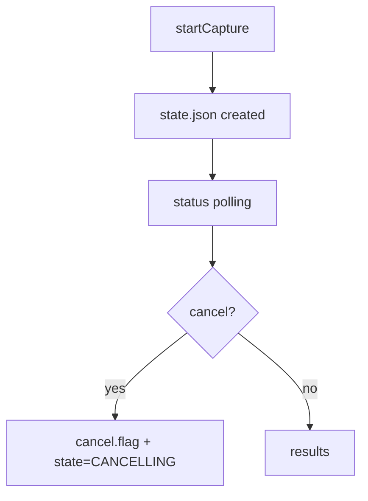

# FILE: docs/api/fast-api/pnm-rxmer.md
<!-- SPDX-License-Identifier: Apache-2.0 -->
<!-- Copyright (c) 2026 Maurice Garcia -->

# RxMER Orchestration Endpoints

RxMER serving-group orchestration uses a filesystem-backed operation model. The CMTS API creates and tracks job state while PyPNM captures are executed later in the pipeline.

## Lifecycle



## POST /cmts/pnm/rxmer/sg/startCapture

Create a new serving-group RxMER operation. The response returns a new `operation_id` and initial counters.
Status values use numeric `ServiceStatusCode`.

### Request

```json
{
  "cmts": {
    "serving_group": { "id": [] },
    "cable_modem": {
      "mac_address": [],
      "pnm_parameters": {
        "tftp": { "ipv4": null, "ipv6": null },
        "capture": { "channel_ids": [] }
      },
      "snmp": { "snmpV2C": { "community": "public" } }
    }
  },
  "execution": {
    "max_workers": 16,
    "retry_count": 3,
    "retry_delay_seconds": 5.0,
    "per_modem_timeout_seconds": 30.0,
    "overall_timeout_seconds": 120.0
  }
}
```

### Response

```json
{
  "status": 0,
  "message": "",
  "operation": {
    "operation_id": "1b3f5f3d4f3c4ab29a9ff9a3f0b7c8d1",
    "state": "queued",
    "counters": {
      "total_modems": 0,
      "eligible_modems": 0,
      "precheck_passed": 0,
      "capture_started": 0,
      "completed": 0,
      "success": 0,
      "failed": 0,
      "skipped": 0
    },
    "timestamps": {
      "created_epoch": 1767444600,
      "started_epoch": 0,
      "updated_epoch": 1767444600,
      "finished_epoch": 0
    },
    "request_summary": {
      "serving_group_ids": [],
      "mac_addresses": [],
      "channel_ids": [],
      "execution": {
        "max_workers": 16,
        "retry_count": 3,
        "retry_delay_seconds": 5.0,
        "per_modem_timeout_seconds": 30.0,
        "overall_timeout_seconds": 120.0
      }
    },
    "error_summary": null
  }
}
```

## POST /cmts/pnm/rxmer/sg/status

Return the persisted operation state.

### Request

```json
{
  "pnm_capture_operation_id": "1b3f5f3d4f3c4ab29a9ff9a3f0b7c8d1"
}
```

### Response

```json
{
  "status": 0,
  "message": "",
  "operation": {
    "operation_id": "1b3f5f3d4f3c4ab29a9ff9a3f0b7c8d1",
    "state": "queued",
    "counters": {
      "total_modems": 0,
      "eligible_modems": 0,
      "precheck_passed": 0,
      "capture_started": 0,
      "completed": 0,
      "success": 0,
      "failed": 0,
      "skipped": 0
    },
    "timestamps": {
      "created_epoch": 1767444600,
      "started_epoch": 0,
      "updated_epoch": 1767444600,
      "finished_epoch": 0
    },
    "request_summary": {
      "serving_group_ids": [],
      "mac_addresses": [],
      "channel_ids": [],
      "execution": {
        "max_workers": 16,
        "retry_count": 3,
        "retry_delay_seconds": 5.0,
        "per_modem_timeout_seconds": 30.0,
        "overall_timeout_seconds": 120.0
      }
    },
    "error_summary": null
  }
}
```

## POST /cmts/pnm/rxmer/sg/results

Return linkage records for an operation. The response includes records only when the dataset is small enough to inline.

### Request

```json
{
  "pnm_capture_operation_id": "1b3f5f3d4f3c4ab29a9ff9a3f0b7c8d1"
}
```

### Response

```json
{
  "status": 0,
  "message": "no results recorded",
  "summary": {
    "record_count": 0,
    "included_count": 0,
    "files_scanned": 0
  },
  "records": []
}
```

## POST /cmts/pnm/rxmer/sg/cancel

Request cancellation for an operation.

### Request

```json
{
  "pnm_capture_operation_id": "1b3f5f3d4f3c4ab29a9ff9a3f0b7c8d1"
}
```

### Response

```json
{
  "status": 0,
  "message": "",
  "operation": {
    "operation_id": "1b3f5f3d4f3c4ab29a9ff9a3f0b7c8d1",
    "state": "cancelling",
    "counters": {
      "total_modems": 0,
      "eligible_modems": 0,
      "precheck_passed": 0,
      "capture_started": 0,
      "completed": 0,
      "success": 0,
      "failed": 0,
      "skipped": 0
    },
    "timestamps": {
      "created_epoch": 1767444600,
      "started_epoch": 0,
      "updated_epoch": 1767444610,
      "finished_epoch": 0
    },
    "request_summary": {
      "serving_group_ids": [],
      "mac_addresses": [],
      "channel_ids": [],
      "execution": {
        "max_workers": 16,
        "retry_count": 3,
        "retry_delay_seconds": 5.0,
        "per_modem_timeout_seconds": 30.0,
        "overall_timeout_seconds": 120.0
      }
    },
    "error_summary": null
  }
}
```

# FILE: tests/test_rxmer_orchestration.py
# SPDX-License-Identifier: Apache-2.0
# Copyright (c) 2026 Maurice Garcia

from __future__ import annotations

from pathlib import Path

import pytest
from pydantic import ValidationError
from pypnm.api.routes.common.service.status_codes import ServiceStatusCode
from pypnm.lib.types import FileNameStr, InetAddressStr, MacAddressStr, TransactionId

from pypnm_cmts.api.common.cmts_request import (
    CmtsCableModemFilterModel,
    CmtsPnmCaptureParametersModel,
    CmtsPnmParametersModel,
    CmtsRequestEnvelopeModel,
    CmtsSnmpModel,
    CmtsSnmpV2CModel,
    CmtsTftpParametersModel,
)
from pypnm_cmts.api.common.operations.models import PerModemLinkageRecordModel
from pypnm_cmts.api.common.operations.store import OperationStore
from pypnm_cmts.api.routes.pnm.rxmer.schemas import (
    RxMerServiceGroupExecutionModel,
    RxMerServiceGroupOperationRequest,
    RxMerServiceGroupStartCaptureRequest,
)
from pypnm_cmts.api.routes.pnm.rxmer.service import RxMerServiceGroupOperationService
from pypnm_cmts.lib.constants import OperationStage, OperationState
from pypnm_cmts.lib.types import ServiceGroupId


def _build_service(tmp_path: Path) -> RxMerServiceGroupOperationService:
    store = OperationStore(base_dir=tmp_path)
    return RxMerServiceGroupOperationService(store=store)


def test_rxmer_start_capture_creates_state(tmp_path: Path) -> None:
    service = _build_service(tmp_path)
    request = RxMerServiceGroupStartCaptureRequest()
    response = service.start_capture(request)

    operation = response.operation
    assert operation.state == OperationState.QUEUED

    state_path = tmp_path / str(operation.operation_id) / "state.json"
    assert state_path.exists()


def test_rxmer_status_reads_state(tmp_path: Path) -> None:
    service = _build_service(tmp_path)
    request = RxMerServiceGroupStartCaptureRequest()
    start_response = service.start_capture(request)

    status_request = RxMerServiceGroupOperationRequest(
        pnm_capture_operation_id=start_response.operation.operation_id,
    )
    status_response = service.status(status_request)
    assert status_response.operation is not None
    assert status_response.operation.operation_id == start_response.operation.operation_id


def test_rxmer_cancel_creates_flag(tmp_path: Path) -> None:
    store = OperationStore(base_dir=tmp_path)
    service = RxMerServiceGroupOperationService(store=store)
    request = RxMerServiceGroupStartCaptureRequest()
    start_response = service.start_capture(request)

    cancel_request = RxMerServiceGroupOperationRequest(
        pnm_capture_operation_id=start_response.operation.operation_id,
    )
    cancel_response = service.cancel(cancel_request)
    assert cancel_response.operation is not None
    assert cancel_response.operation.state == OperationState.CANCELLING
    assert store.is_cancel_requested(start_response.operation.operation_id)


def test_rxmer_results_empty(tmp_path: Path) -> None:
    service = _build_service(tmp_path)
    request = RxMerServiceGroupStartCaptureRequest()
    start_response = service.start_capture(request)

    results_request = RxMerServiceGroupOperationRequest(
        pnm_capture_operation_id=start_response.operation.operation_id,
    )
    results_response = service.results(results_request)
    assert results_response.summary.record_count == 0
    assert results_response.records == []


def test_rxmer_results_include_records(tmp_path: Path) -> None:
    store = OperationStore(base_dir=tmp_path)
    service = RxMerServiceGroupOperationService(store=store)
    request = RxMerServiceGroupStartCaptureRequest()
    start_response = service.start_capture(request)

    record = PerModemLinkageRecordModel(
        pnm_capture_operation_id=start_response.operation.operation_id,
        sg_id=ServiceGroupId(1),
        mac_address=MacAddressStr("aa:bb:cc:dd:ee:ff"),
        ip_address=InetAddressStr("192.168.0.100"),
        stage=OperationStage.ELIGIBILITY,
        status_code=ServiceStatusCode.SUCCESS,
        transaction_ids=[TransactionId("1a2b3c4d5e6f7a8b9c0d1e2f")],
        filenames=[FileNameStr("capture.bin")],
        started_epoch=1,
        finished_epoch=2,
        message="",
    )
    store.append_result_record(record)

    results_request = RxMerServiceGroupOperationRequest(
        pnm_capture_operation_id=start_response.operation.operation_id,
    )
    results_response = service.results(results_request)
    assert results_response.summary.record_count == 1
    assert len(results_response.records) == 1


def test_rxmer_request_rejects_blank_snmp_community() -> None:
    with pytest.raises(ValidationError):
        RxMerServiceGroupStartCaptureRequest(
            cmts=CmtsRequestEnvelopeModel(
                cable_modem=CmtsCableModemFilterModel(
                    snmp=CmtsSnmpModel(
                        snmpV2C=CmtsSnmpV2CModel(community=""),
                    ),
                )
            )
        )


def test_rxmer_request_allows_null_snmp_community() -> None:
    request = RxMerServiceGroupStartCaptureRequest(
        cmts=CmtsRequestEnvelopeModel(
            cable_modem=CmtsCableModemFilterModel(
                snmp=CmtsSnmpModel(
                    snmpV2C=CmtsSnmpV2CModel(community=None),
                ),
            )
        )
    )
    assert request.cmts.cable_modem.snmp is not None


def test_rxmer_request_rejects_blank_tftp_overrides() -> None:
    with pytest.raises(ValidationError):
        RxMerServiceGroupStartCaptureRequest(
            cmts=CmtsRequestEnvelopeModel(
                cable_modem=CmtsCableModemFilterModel(
                    pnm_parameters=CmtsPnmParametersModel(
                        tftp=CmtsTftpParametersModel(ipv4="", ipv6=None),
                    )
                )
            )
        )


def test_rxmer_request_allows_null_tftp_overrides() -> None:
    request = RxMerServiceGroupStartCaptureRequest(
        cmts=CmtsRequestEnvelopeModel(
            cable_modem=CmtsCableModemFilterModel(
                pnm_parameters=CmtsPnmParametersModel(
                    tftp=CmtsTftpParametersModel(ipv4=None, ipv6=None),
                    capture=CmtsPnmCaptureParametersModel(channel_ids=[]),
                )
            )
        )
    )
    assert request.cmts.cable_modem.pnm_parameters is not None


def test_rxmer_execution_validation_rules() -> None:
    with pytest.raises(ValidationError):
        RxMerServiceGroupExecutionModel(
            max_workers=-1,
            retry_count=0,
            retry_delay_seconds=0.0,
            per_modem_timeout_seconds=1.0,
            overall_timeout_seconds=1.0,
        )
    with pytest.raises(ValidationError):
        RxMerServiceGroupExecutionModel(
            max_workers=0,
            retry_count=-1,
            retry_delay_seconds=0.0,
            per_modem_timeout_seconds=1.0,
            overall_timeout_seconds=1.0,
        )
    with pytest.raises(ValidationError):
        RxMerServiceGroupExecutionModel(
            max_workers=0,
            retry_count=0,
            retry_delay_seconds=-1.0,
            per_modem_timeout_seconds=1.0,
            overall_timeout_seconds=1.0,
        )
    with pytest.raises(ValidationError):
        RxMerServiceGroupExecutionModel(
            max_workers=0,
            retry_count=0,
            retry_delay_seconds=0.0,
            per_modem_timeout_seconds=0.0,
            overall_timeout_seconds=1.0,
        )

# FILE: tests/test_cmts_request_models.py
# SPDX-License-Identifier: Apache-2.0
# Copyright (c) 2025-2026 Maurice Garcia

from __future__ import annotations

import pytest
from pydantic import ValidationError
from pypnm.lib.types import ChannelId, MacAddressStr

from pypnm_cmts.api.common.cmts_request import (
    CmtsCableModemFilterModel,
    CmtsPnmCaptureParametersModel,
    CmtsRequestEnvelopeModel,
    CmtsServingGroupFilterModel,
    CmtsSnmpV2CModel,
    CmtsTftpParametersModel,
)
from pypnm_cmts.config.request_defaults import (
    ENV_CM_SNMPV2C_WRITE_COMMUNITY,
    ENV_CM_TFTP_IPV4,
    ENV_CM_TFTP_IPV6,
    CmtsRequestDefaults,
)
from pypnm_cmts.lib.types import ServiceGroupId


@pytest.mark.unit
def test_serving_group_filter_rejects_duplicates() -> None:
    with pytest.raises(ValidationError, match="serving_group.id contains duplicate values"):
        CmtsServingGroupFilterModel(id=[ServiceGroupId(2), ServiceGroupId(1), ServiceGroupId(2)])


@pytest.mark.unit
def test_serving_group_filter_rejects_negative() -> None:
    with pytest.raises(ValidationError, match="serving_group.id values must be zero or greater."):
        CmtsServingGroupFilterModel(id=[ServiceGroupId(-1)])


@pytest.mark.unit
def test_cable_modem_filter_rejects_duplicates() -> None:
    with pytest.raises(ValidationError, match="cable_modem.mac_address contains duplicate values"):
        CmtsCableModemFilterModel(
            mac_address=[
                MacAddressStr("aa:bb:cc:dd:ee:ff"),
                MacAddressStr("aa:bb:cc:dd:ee:ff"),
            ]
        )


@pytest.mark.unit
def test_cable_modem_filter_rejects_invalid_mac() -> None:
    with pytest.raises(ValidationError, match="cable_modem.mac_address entries must be valid MAC addresses."):
        CmtsCableModemFilterModel(mac_address=["invalid-mac"])


@pytest.mark.unit
def test_request_envelope_resolves_all_when_empty() -> None:
    envelope = CmtsRequestEnvelopeModel()
    discovered_sg_ids = [ServiceGroupId(1), ServiceGroupId(2)]
    discovered_macs = [
        MacAddressStr("aa:bb:cc:dd:ee:01"),
        MacAddressStr("aa:bb:cc:dd:ee:02"),
    ]
    assert envelope.resolve_sg_ids(discovered_sg_ids) == discovered_sg_ids
    assert envelope.resolve_mac_addresses(discovered_macs) == discovered_macs


@pytest.mark.unit
def test_request_envelope_resolves_selected() -> None:
    envelope = CmtsRequestEnvelopeModel(
        serving_group=CmtsServingGroupFilterModel(id=[ServiceGroupId(2)]),
        cable_modem=CmtsCableModemFilterModel(mac_address=[MacAddressStr("aa:bb:cc:dd:ee:ff")]),
    )
    discovered_sg_ids = [ServiceGroupId(1), ServiceGroupId(2)]
    discovered_macs = [MacAddressStr("aa:bb:cc:dd:ee:01")]
    assert envelope.resolve_sg_ids(discovered_sg_ids) == [ServiceGroupId(2)]
    assert envelope.resolve_mac_addresses(discovered_macs) == [MacAddressStr("aa:bb:cc:dd:ee:ff")]


@pytest.mark.unit
def test_request_apply_defaults_uses_env_overrides(monkeypatch: pytest.MonkeyPatch) -> None:
    monkeypatch.setenv(ENV_CM_SNMPV2C_WRITE_COMMUNITY, "private")
    monkeypatch.setenv(ENV_CM_TFTP_IPV4, "192.168.0.100")
    monkeypatch.setenv(ENV_CM_TFTP_IPV6, "::1")

    defaults = CmtsRequestDefaults.from_system_config()
    envelope = CmtsRequestEnvelopeModel()
    applied = envelope.apply_defaults(defaults)

    snmp = applied.cable_modem.snmp
    assert snmp is not None
    assert snmp.snmpV2C is not None
    assert snmp.snmpV2C.community == "private"
    pnm = applied.cable_modem.pnm_parameters
    assert pnm is not None
    assert pnm.tftp is not None
    assert pnm.tftp.ipv4 == "192.168.0.100"
    assert pnm.tftp.ipv6 == "::1"


@pytest.mark.unit
def test_capture_channel_ids_rejects_duplicates() -> None:
    with pytest.raises(ValidationError, match="pnm_parameters.capture.channel_ids contains duplicate values"):
        CmtsPnmCaptureParametersModel(channel_ids=[ChannelId(3), ChannelId(1), ChannelId(3)])


@pytest.mark.unit
def test_tftp_requires_ipv4_ipv6_keys() -> None:
    with pytest.raises(ValidationError, match="Field required"):
        CmtsTftpParametersModel.model_validate({})


@pytest.mark.unit
def test_tftp_accepts_null_defaults() -> None:
    model = CmtsTftpParametersModel.model_validate({"ipv4": None, "ipv6": None})
    assert model.ipv4 is None
    assert model.ipv6 is None


@pytest.mark.unit
def test_tftp_rejects_blank_ipv4() -> None:
    with pytest.raises(ValidationError, match="tftp.ipv4 must be null or a valid IP address"):
        CmtsTftpParametersModel.model_validate({"ipv4": "", "ipv6": None})


@pytest.mark.unit
def test_snmpv2c_requires_community_key() -> None:
    with pytest.raises(ValidationError, match="Field required"):
        CmtsSnmpV2CModel.model_validate({})


@pytest.mark.unit
def test_snmpv2c_accepts_null_default() -> None:
    model = CmtsSnmpV2CModel.model_validate({"community": None})
    assert model.community is None


@pytest.mark.unit
def test_snmpv2c_rejects_blank() -> None:
    with pytest.raises(ValidationError, match="snmpV2C.community must not be blank"):
        CmtsSnmpV2CModel.model_validate({"community": ""})


@pytest.mark.unit
def test_request_apply_defaults_preserves_capture() -> None:
    capture = CmtsPnmCaptureParametersModel(channel_ids=[ChannelId(33)])
    envelope = CmtsRequestEnvelopeModel(
        cable_modem=CmtsCableModemFilterModel(
            pnm_parameters={"capture": capture},
        )
    )
    defaults = CmtsRequestDefaults(
        cm_snmpv2c_write_community=None,
        cm_tftp_ipv4="192.168.0.100",
        cm_tftp_ipv6="::1",
    )
    applied = envelope.apply_defaults(defaults)
    pnm = applied.cable_modem.pnm_parameters
    assert pnm is not None
    assert pnm.capture is not None
    assert pnm.capture.channel_ids == [ChannelId(33)]

