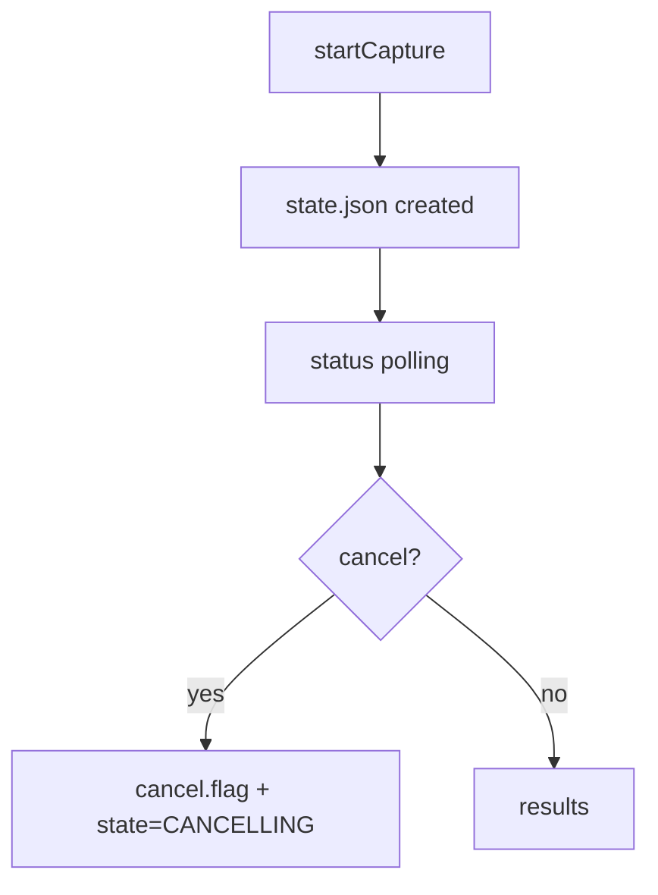

# FILE: src/pypnm_cmts/api/routes/pnm/rxmer/schemas.py
# SPDX-License-Identifier: Apache-2.0
# Copyright (c) 2026 Maurice Garcia

from __future__ import annotations

from pydantic import BaseModel, ConfigDict, Field
from pypnm.api.routes.common.service.status_codes import ServiceStatusCode

from pypnm_cmts.api.common.cmts_request import CmtsRequestEnvelopeModel
from pypnm_cmts.api.common.operations.models import (
    OperationResultsSummaryModel,
    OperationStateModel,
    PerModemLinkageRecordModel,
)
from pypnm_cmts.lib.types import PnmCaptureOperationId

DEFAULT_MAX_WORKERS = 16
DEFAULT_RETRY_COUNT = 3
DEFAULT_RETRY_DELAY_SECONDS = 5.0
DEFAULT_PER_MODEM_TIMEOUT_SECONDS = 30.0
DEFAULT_OVERALL_TIMEOUT_SECONDS = 120.0


class RxMerServiceGroupExecutionModel(BaseModel):
    """Execution controls for serving-group RxMER orchestration."""

    max_workers: int = Field(default=DEFAULT_MAX_WORKERS, gt=0, description="Maximum concurrent workers.")
    retry_count: int = Field(default=DEFAULT_RETRY_COUNT, ge=0, description="Retry attempts for retryable failures.")
    retry_delay_seconds: float = Field(
        default=DEFAULT_RETRY_DELAY_SECONDS,
        ge=0.0,
        description="Delay between retry attempts in seconds.",
    )
    per_modem_timeout_seconds: float = Field(
        default=DEFAULT_PER_MODEM_TIMEOUT_SECONDS,
        gt=0.0,
        description="Timeout for each modem in seconds.",
    )
    overall_timeout_seconds: float = Field(
        default=DEFAULT_OVERALL_TIMEOUT_SECONDS,
        gt=0.0,
        description="Overall timeout in seconds.",
    )


class RxMerServiceGroupStartCaptureRequest(BaseModel):
    """Request payload for SG-level RxMER startCapture."""

    model_config = ConfigDict(extra="ignore")

    cmts: CmtsRequestEnvelopeModel = Field(default_factory=CmtsRequestEnvelopeModel, description="CMTS request envelope.")
    execution: RxMerServiceGroupExecutionModel = Field(
        default_factory=RxMerServiceGroupExecutionModel,
        description="Execution settings for the orchestration.",
    )


class RxMerServiceGroupOperationRequest(BaseModel):
    """Request payload for SG-level RxMER operation lookup."""

    pnm_capture_operation_id: PnmCaptureOperationId = Field(..., description="Operation identifier.")


class RxMerServiceGroupStartCaptureResponse(BaseModel):
    """Response payload for SG-level RxMER startCapture."""

    status: ServiceStatusCode = Field(default=ServiceStatusCode.SUCCESS, description="Service status code.")
    message: str = Field(default="", description="Informational or error message.")
    operation: OperationStateModel = Field(..., description="Initial operation state.")


class RxMerServiceGroupStatusResponse(BaseModel):
    """Response payload for SG-level RxMER status."""

    status: ServiceStatusCode = Field(default=ServiceStatusCode.SUCCESS, description="Service status code.")
    message: str = Field(default="", description="Informational or error message.")
    operation: OperationStateModel | None = Field(default=None, description="Operation state snapshot.")


class RxMerServiceGroupCancelResponse(BaseModel):
    """Response payload for SG-level RxMER cancel."""

    status: ServiceStatusCode = Field(default=ServiceStatusCode.SUCCESS, description="Service status code.")
    message: str = Field(default="", description="Informational or error message.")
    operation: OperationStateModel | None = Field(default=None, description="Updated operation state.")


class RxMerServiceGroupResultsResponse(BaseModel):
    """Response payload for SG-level RxMER results."""

    status: ServiceStatusCode = Field(default=ServiceStatusCode.SUCCESS, description="Service status code.")
    message: str = Field(default="", description="Informational or error message.")
    summary: OperationResultsSummaryModel = Field(
        default_factory=OperationResultsSummaryModel,
        description="Results summary for the operation.",
    )
    records: list[PerModemLinkageRecordModel] = Field(
        default_factory=list,
        description="Linkage records included in the response.",
    )


__all__ = [
    "RxMerServiceGroupCancelResponse",
    "RxMerServiceGroupExecutionModel",
    "RxMerServiceGroupOperationRequest",
    "RxMerServiceGroupResultsResponse",
    "RxMerServiceGroupStartCaptureRequest",
    "RxMerServiceGroupStartCaptureResponse",
    "RxMerServiceGroupStatusResponse",
]

# FILE: src/pypnm_cmts/api/routes/pnm/rxmer/service.py
# SPDX-License-Identifier: Apache-2.0
# Copyright (c) 2026 Maurice Garcia

from __future__ import annotations

import logging

from pypnm.api.routes.common.service.status_codes import ServiceStatusCode
from pypnm.lib.types import ChannelId

from pypnm_cmts.api.common.cmts_request import CmtsRequestEnvelopeModel
from pypnm_cmts.api.common.operations.models import (
    OperationExecutionModel,
    OperationRequestSummaryModel,
    OperationResultsSummaryModel,
)
from pypnm_cmts.api.common.operations.store import OperationStore
from pypnm_cmts.api.routes.pnm.rxmer.schemas import (
    RxMerServiceGroupCancelResponse,
    RxMerServiceGroupOperationRequest,
    RxMerServiceGroupResultsResponse,
    RxMerServiceGroupStartCaptureRequest,
    RxMerServiceGroupStartCaptureResponse,
    RxMerServiceGroupStatusResponse,
)

DEFAULT_MAX_INLINE_RECORDS = 250
NOT_FOUND_MESSAGE = "operation not found"


class RxMerServiceGroupOperationService:
    """Service layer for SG-level RxMER operation lifecycle endpoints."""

    def __init__(
        self,
        store: OperationStore | None = None,
        max_inline_records: int = DEFAULT_MAX_INLINE_RECORDS,
    ) -> None:
        self._store = store or OperationStore()
        self._max_inline_records = max_inline_records
        self.logger = logging.getLogger(f"{self.__class__.__name__}")

    def start_capture(
        self,
        request: RxMerServiceGroupStartCaptureRequest,
    ) -> RxMerServiceGroupStartCaptureResponse:
        """Create a new SG-level RxMER operation state record."""
        request_summary = self._build_request_summary(request)
        state = self._store.create_operation(request_summary)
        return RxMerServiceGroupStartCaptureResponse(
            status=ServiceStatusCode.SUCCESS,
            message="",
            operation=state,
        )

    def status(
        self,
        request: RxMerServiceGroupOperationRequest,
    ) -> RxMerServiceGroupStatusResponse:
        """Return the persisted state for an operation."""
        try:
            state = self._store.load_state(request.pnm_capture_operation_id)
        except FileNotFoundError:
            return RxMerServiceGroupStatusResponse(
                status=ServiceStatusCode.FAILURE,
                message=NOT_FOUND_MESSAGE,
                operation=None,
            )
        return RxMerServiceGroupStatusResponse(
            status=ServiceStatusCode.SUCCESS,
            message="",
            operation=state,
        )

    def cancel(
        self,
        request: RxMerServiceGroupOperationRequest,
    ) -> RxMerServiceGroupCancelResponse:
        """Request cancellation for an operation."""
        try:
            state = self._store.request_cancel(request.pnm_capture_operation_id)
        except FileNotFoundError:
            return RxMerServiceGroupCancelResponse(
                status=ServiceStatusCode.FAILURE,
                message=NOT_FOUND_MESSAGE,
                operation=None,
            )
        return RxMerServiceGroupCancelResponse(
            status=ServiceStatusCode.SUCCESS,
            message="",
            operation=state,
        )

    def results(
        self,
        request: RxMerServiceGroupOperationRequest,
    ) -> RxMerServiceGroupResultsResponse:
        """Return linkage records for an operation when available."""
        try:
            self._store.load_state(request.pnm_capture_operation_id)
        except FileNotFoundError:
            return RxMerServiceGroupResultsResponse(
                status=ServiceStatusCode.FAILURE,
                message=NOT_FOUND_MESSAGE,
            )

        files_scanned = self._store.count_result_files(request.pnm_capture_operation_id)
        total_records = self._store.count_result_records(request.pnm_capture_operation_id)
        include_records = total_records <= self._max_inline_records
        records = []
        if include_records:
            records = self._store.load_result_records(request.pnm_capture_operation_id)
        summary = OperationResultsSummaryModel(
            record_count=total_records,
            included_count=len(records),
            files_scanned=files_scanned,
        )
        message = "" if total_records > 0 else "no results recorded"
        return RxMerServiceGroupResultsResponse(
            status=ServiceStatusCode.SUCCESS,
            message=message,
            summary=summary,
            records=records,
        )

    @staticmethod
    def _build_request_summary(
        request: RxMerServiceGroupStartCaptureRequest,
    ) -> OperationRequestSummaryModel:
        cmts = request.cmts
        channel_ids = RxMerServiceGroupOperationService._resolve_channel_ids(cmts)
        execution = request.execution
        return OperationRequestSummaryModel(
            serving_group_ids=list(cmts.serving_group.id),
            mac_addresses=list(cmts.cable_modem.mac_address),
            channel_ids=channel_ids,
            execution=OperationExecutionModel(
                max_workers=execution.max_workers,
                retry_count=execution.retry_count,
                retry_delay_seconds=execution.retry_delay_seconds,
                per_modem_timeout_seconds=execution.per_modem_timeout_seconds,
                overall_timeout_seconds=execution.overall_timeout_seconds,
            ),
        )

    @staticmethod
    def _resolve_channel_ids(cmts: CmtsRequestEnvelopeModel) -> list[ChannelId]:
        pnm = cmts.cable_modem.pnm_parameters
        capture = pnm.capture if pnm is not None else None
        channel_ids = capture.channel_ids if capture is not None else None
        if not channel_ids:
            return []
        return list(channel_ids)


__all__ = [
    "RxMerServiceGroupOperationService",
]

# FILE: tests/test_rxmer_orchestration.py
# SPDX-License-Identifier: Apache-2.0
# Copyright (c) 2026 Maurice Garcia

from __future__ import annotations

from pathlib import Path

import pytest
from pydantic import ValidationError
from pypnm.api.routes.common.service.status_codes import ServiceStatusCode
from pypnm.lib.types import FileNameStr, InetAddressStr, MacAddressStr, TransactionId

from pypnm_cmts.api.common.cmts_request import (
    CmtsCableModemFilterModel,
    CmtsPnmCaptureParametersModel,
    CmtsPnmParametersModel,
    CmtsRequestEnvelopeModel,
    CmtsSnmpModel,
    CmtsSnmpV2CModel,
    CmtsTftpParametersModel,
)
from pypnm_cmts.api.common.operations.models import PerModemLinkageRecordModel
from pypnm_cmts.api.common.operations.store import OperationStore
from pypnm_cmts.api.routes.pnm.rxmer.schemas import (
    RxMerServiceGroupExecutionModel,
    RxMerServiceGroupOperationRequest,
    RxMerServiceGroupStartCaptureRequest,
)
from pypnm_cmts.api.routes.pnm.rxmer.service import RxMerServiceGroupOperationService
from pypnm_cmts.lib.constants import OperationStage, OperationState
from pypnm_cmts.lib.types import ServiceGroupId


def _build_service(tmp_path: Path) -> RxMerServiceGroupOperationService:
    store = OperationStore(base_dir=tmp_path)
    return RxMerServiceGroupOperationService(store=store)


def test_rxmer_start_capture_creates_state(tmp_path: Path) -> None:
    service = _build_service(tmp_path)
    request = RxMerServiceGroupStartCaptureRequest()
    response = service.start_capture(request)

    operation = response.operation
    assert operation.state == OperationState.QUEUED

    state_path = tmp_path / str(operation.operation_id) / "state.json"
    assert state_path.exists()


def test_rxmer_status_reads_state(tmp_path: Path) -> None:
    service = _build_service(tmp_path)
    request = RxMerServiceGroupStartCaptureRequest()
    start_response = service.start_capture(request)

    status_request = RxMerServiceGroupOperationRequest(
        pnm_capture_operation_id=start_response.operation.operation_id,
    )
    status_response = service.status(status_request)
    assert status_response.operation is not None
    assert status_response.operation.operation_id == start_response.operation.operation_id


def test_rxmer_cancel_creates_flag(tmp_path: Path) -> None:
    store = OperationStore(base_dir=tmp_path)
    service = RxMerServiceGroupOperationService(store=store)
    request = RxMerServiceGroupStartCaptureRequest()
    start_response = service.start_capture(request)

    cancel_request = RxMerServiceGroupOperationRequest(
        pnm_capture_operation_id=start_response.operation.operation_id,
    )
    cancel_response = service.cancel(cancel_request)
    assert cancel_response.operation is not None
    assert cancel_response.operation.state == OperationState.CANCELLING
    assert store.is_cancel_requested(start_response.operation.operation_id)


def test_rxmer_results_empty(tmp_path: Path) -> None:
    service = _build_service(tmp_path)
    request = RxMerServiceGroupStartCaptureRequest()
    start_response = service.start_capture(request)

    results_request = RxMerServiceGroupOperationRequest(
        pnm_capture_operation_id=start_response.operation.operation_id,
    )
    results_response = service.results(results_request)
    assert results_response.summary.record_count == 0
    assert results_response.records == []


def test_rxmer_results_include_records(tmp_path: Path) -> None:
    store = OperationStore(base_dir=tmp_path)
    service = RxMerServiceGroupOperationService(store=store)
    request = RxMerServiceGroupStartCaptureRequest()
    start_response = service.start_capture(request)

    record = PerModemLinkageRecordModel(
        pnm_capture_operation_id=start_response.operation.operation_id,
        sg_id=ServiceGroupId(1),
        mac_address=MacAddressStr("aa:bb:cc:dd:ee:ff"),
        ip_address=InetAddressStr("192.168.0.100"),
        stage=OperationStage.ELIGIBILITY,
        status_code=ServiceStatusCode.SUCCESS,
        transaction_ids=[TransactionId("1a2b3c4d5e6f7a8b9c0d1e2f")],
        filenames=[FileNameStr("capture.bin")],
        started_epoch=1,
        finished_epoch=2,
        message="",
    )
    store.append_result_record(record)

    results_request = RxMerServiceGroupOperationRequest(
        pnm_capture_operation_id=start_response.operation.operation_id,
    )
    results_response = service.results(results_request)
    assert results_response.summary.record_count == 1
    assert len(results_response.records) == 1


def test_rxmer_request_rejects_blank_snmp_community() -> None:
    with pytest.raises(ValidationError):
        RxMerServiceGroupStartCaptureRequest(
            cmts=CmtsRequestEnvelopeModel(
                cable_modem=CmtsCableModemFilterModel(
                    snmp=CmtsSnmpModel(
                        snmpV2C=CmtsSnmpV2CModel(community=""),
                    ),
                )
            )
        )


def test_rxmer_request_allows_null_snmp_community() -> None:
    request = RxMerServiceGroupStartCaptureRequest(
        cmts=CmtsRequestEnvelopeModel(
            cable_modem=CmtsCableModemFilterModel(
                snmp=CmtsSnmpModel(
                    snmpV2C=CmtsSnmpV2CModel(community=None),
                ),
            )
        )
    )
    assert request.cmts.cable_modem.snmp is not None


def test_rxmer_request_rejects_blank_tftp_overrides() -> None:
    with pytest.raises(ValidationError):
        RxMerServiceGroupStartCaptureRequest(
            cmts=CmtsRequestEnvelopeModel(
                cable_modem=CmtsCableModemFilterModel(
                    pnm_parameters=CmtsPnmParametersModel(
                        tftp=CmtsTftpParametersModel(ipv4="", ipv6=None),
                    )
                )
            )
        )


def test_rxmer_request_allows_null_tftp_overrides() -> None:
    request = RxMerServiceGroupStartCaptureRequest(
        cmts=CmtsRequestEnvelopeModel(
            cable_modem=CmtsCableModemFilterModel(
                pnm_parameters=CmtsPnmParametersModel(
                    tftp=CmtsTftpParametersModel(ipv4=None, ipv6=None),
                    capture=CmtsPnmCaptureParametersModel(channel_ids=[]),
                )
            )
        )
    )
    assert request.cmts.cable_modem.pnm_parameters is not None


def test_rxmer_execution_validation_rules() -> None:
    with pytest.raises(ValidationError):
        RxMerServiceGroupExecutionModel(
            max_workers=0,
            retry_count=0,
            retry_delay_seconds=0.0,
            per_modem_timeout_seconds=1.0,
            overall_timeout_seconds=1.0,
        )
    with pytest.raises(ValidationError):
        RxMerServiceGroupExecutionModel(
            max_workers=0,
            retry_count=-1,
            retry_delay_seconds=0.0,
            per_modem_timeout_seconds=1.0,
            overall_timeout_seconds=1.0,
        )
    with pytest.raises(ValidationError):
        RxMerServiceGroupExecutionModel(
            max_workers=0,
            retry_count=0,
            retry_delay_seconds=-1.0,
            per_modem_timeout_seconds=1.0,
            overall_timeout_seconds=1.0,
        )
    with pytest.raises(ValidationError):
        RxMerServiceGroupExecutionModel(
            max_workers=0,
            retry_count=0,
            retry_delay_seconds=0.0,
            per_modem_timeout_seconds=0.0,
            overall_timeout_seconds=1.0,
        )

# FILE: docs/api/fast-api/pnm-rxmer.md
<!-- SPDX-License-Identifier: Apache-2.0 -->
<!-- Copyright (c) 2026 Maurice Garcia -->

# RxMER Orchestration Endpoints

RxMER serving-group orchestration uses a filesystem-backed operation model. The CMTS API creates and tracks job state while PyPNM captures are executed later in the pipeline.

## Lifecycle



## POST /cmts/pnm/rxmer/sg/startCapture

Create a new serving-group RxMER operation. The response returns a new `operation_id` and initial counters.
Status values use numeric `ServiceStatusCode`.

Current behavior (Step 2): startCapture only creates a queued operation record. Status, cancel, and results operate on persisted state and JSONL linkage records. Async execution is added in Step 3.

### Request

```json
{
  "cmts": {
    "serving_group": { "id": [] },
    "cable_modem": {
      "mac_address": [],
      "pnm_parameters": {
        "tftp": { "ipv4": null, "ipv6": null },
        "capture": { "channel_ids": [] }
      },
      "snmp": { "snmpV2C": { "community": "public" } }
    }
  },
  "execution": {
    "max_workers": 16,
    "retry_count": 3,
    "retry_delay_seconds": 5.0,
    "per_modem_timeout_seconds": 30.0,
    "overall_timeout_seconds": 120.0
  }
}
```

### Response

```json
{
  "status": 0,
  "message": "",
  "operation": {
    "operation_id": "1b3f5f3d4f3c4ab29a9ff9a3f0b7c8d1",
    "state": "queued",
    "counters": {
      "total_modems": 0,
      "eligible_modems": 0,
      "precheck_passed": 0,
      "capture_started": 0,
      "completed": 0,
      "success": 0,
      "failed": 0,
      "skipped": 0
    },
    "timestamps": {
      "created_epoch": 1767444600,
      "started_epoch": 0,
      "updated_epoch": 1767444600,
      "finished_epoch": 0
    },
    "request_summary": {
      "serving_group_ids": [],
      "mac_addresses": [],
      "channel_ids": [],
      "execution": {
        "max_workers": 16,
        "retry_count": 3,
        "retry_delay_seconds": 5.0,
        "per_modem_timeout_seconds": 30.0,
        "overall_timeout_seconds": 120.0
      }
    },
    "error_summary": null
  }
}
```

## POST /cmts/pnm/rxmer/sg/status

Return the persisted operation state.
The request payload uses `pnm_capture_operation_id`, while the returned state uses `operation_id`.

### Request

```json
{
  "pnm_capture_operation_id": "1b3f5f3d4f3c4ab29a9ff9a3f0b7c8d1"
}
```

### Response

```json
{
  "status": 0,
  "message": "",
  "operation": {
    "operation_id": "1b3f5f3d4f3c4ab29a9ff9a3f0b7c8d1",
    "state": "queued",
    "counters": {
      "total_modems": 0,
      "eligible_modems": 0,
      "precheck_passed": 0,
      "capture_started": 0,
      "completed": 0,
      "success": 0,
      "failed": 0,
      "skipped": 0
    },
    "timestamps": {
      "created_epoch": 1767444600,
      "started_epoch": 0,
      "updated_epoch": 1767444600,
      "finished_epoch": 0
    },
    "request_summary": {
      "serving_group_ids": [],
      "mac_addresses": [],
      "channel_ids": [],
      "execution": {
        "max_workers": 16,
        "retry_count": 3,
        "retry_delay_seconds": 5.0,
        "per_modem_timeout_seconds": 30.0,
        "overall_timeout_seconds": 120.0
      }
    },
    "error_summary": null
  }
}
```

## POST /cmts/pnm/rxmer/sg/results

Return linkage records for an operation. The response includes records only when the dataset is small enough to inline.
The request payload uses `pnm_capture_operation_id`, while the returned state uses `operation_id`.

### Request

```json
{
  "pnm_capture_operation_id": "1b3f5f3d4f3c4ab29a9ff9a3f0b7c8d1"
}
```

### Response

```json
{
  "status": 0,
  "message": "no results recorded",
  "summary": {
    "record_count": 0,
    "included_count": 0,
    "files_scanned": 0
  },
  "records": []
}
```

## POST /cmts/pnm/rxmer/sg/cancel

Request cancellation for an operation.
The request payload uses `pnm_capture_operation_id`, while the returned state uses `operation_id`.

### Request

```json
{
  "pnm_capture_operation_id": "1b3f5f3d4f3c4ab29a9ff9a3f0b7c8d1"
}
```

### Response

```json
{
  "status": 0,
  "message": "",
  "operation": {
    "operation_id": "1b3f5f3d4f3c4ab29a9ff9a3f0b7c8d1",
    "state": "cancelling",
    "counters": {
      "total_modems": 0,
      "eligible_modems": 0,
      "precheck_passed": 0,
      "capture_started": 0,
      "completed": 0,
      "success": 0,
      "failed": 0,
      "skipped": 0
    },
    "timestamps": {
      "created_epoch": 1767444600,
      "started_epoch": 0,
      "updated_epoch": 1767444610,
      "finished_epoch": 0
    },
    "request_summary": {
      "serving_group_ids": [],
      "mac_addresses": [],
      "channel_ids": [],
      "execution": {
        "max_workers": 16,
        "retry_count": 3,
        "retry_delay_seconds": 5.0,
        "per_modem_timeout_seconds": 30.0,
        "overall_timeout_seconds": 120.0
      }
    },
    "error_summary": null
  }
}
```

