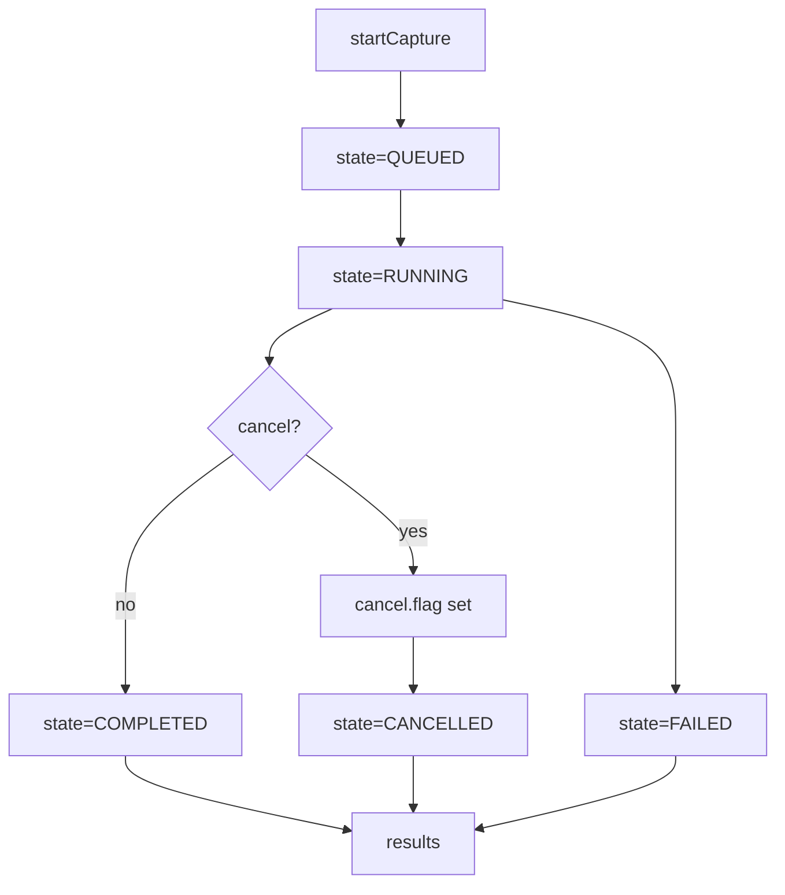

# FILE: src/pypnm_cmts/api/common/operations/__init__.py
# SPDX-License-Identifier: Apache-2.0
# Copyright (c) 2026 Maurice Garcia

"""Reusable filesystem-backed operation primitives for CMTS orchestration."""
from __future__ import annotations

from pypnm_cmts.api.common.operations.models import (
    OperationCountersModel,
    OperationErrorSummaryModel,
    OperationExecutionModel,
    OperationRequestSummaryModel,
    OperationResultsSummaryModel,
    OperationStateModel,
    OperationTimestampsModel,
    PerModemLinkageRecordModel,
)
from pypnm_cmts.api.common.operations.runner import OperationRunner
from pypnm_cmts.api.common.operations.store import OperationStore

__all__ = [
    "OperationCountersModel",
    "OperationErrorSummaryModel",
    "OperationExecutionModel",
    "OperationRequestSummaryModel",
    "OperationResultsSummaryModel",
    "OperationStateModel",
    "OperationTimestampsModel",
    "OperationRunner",
    "OperationStore",
    "PerModemLinkageRecordModel",
]

# FILE: src/pypnm_cmts/api/common/operations/runner.py
# SPDX-License-Identifier: Apache-2.0
# Copyright (c) 2026 Maurice Garcia

from __future__ import annotations

import logging
import threading
import time
from collections.abc import Callable
from concurrent.futures import Future, ThreadPoolExecutor, as_completed
from concurrent.futures import TimeoutError as FutureTimeoutError

from pydantic import BaseModel, Field
from pypnm.api.routes.common.service.status_codes import ServiceStatusCode
from pypnm.lib.types import FileNameStr, MacAddressStr, TimestampSec, TransactionId
from pypnm.lib.utils import Generate, TimeUnit

from pypnm_cmts.api.common.operations.models import (
    OperationErrorSummaryModel,
    OperationStateModel,
    OperationTimestampsModel,
    PerModemLinkageRecordModel,
)
from pypnm_cmts.api.common.operations.store import OperationStore
from pypnm_cmts.lib.constants import OperationStage, OperationState
from pypnm_cmts.lib.types import PnmCaptureOperationId, ServiceGroupId

DEFAULT_WORKER_DELAY_SECONDS = 0.01
DEFAULT_CANCEL_GRACE_SECONDS = 1.0
DEFAULT_POLL_INTERVAL_SECONDS = 0.05


class OperationWorkerResultModel(BaseModel):
    """Result payload returned by per-modem worker functions."""

    status_code: ServiceStatusCode = Field(default=ServiceStatusCode.SUCCESS, description="Per-modem status code.")
    transaction_ids: list[TransactionId] = Field(default_factory=list, description="Transaction identifiers from capture.")
    filenames: list[FileNameStr] = Field(default_factory=list, description="Capture filenames for the modem.")
    message: str = Field(default="", description="Worker message or error detail.")
    started_epoch: TimestampSec = Field(default=TimestampSec(0), ge=0, description="Worker start epoch seconds.")
    finished_epoch: TimestampSec = Field(default=TimestampSec(0), ge=0, description="Worker finish epoch seconds.")


class OperationWorkItemModel(BaseModel):
    """Work item describing a single modem execution."""

    sg_id: ServiceGroupId = Field(..., description="Serving group identifier.")
    mac_address: MacAddressStr = Field(..., description="Cable modem MAC address.")
    attempt: int = Field(default=0, ge=0, description="Attempt index for retry tracking.")


class OperationRunner:
    """Background runner that executes operation work in a thread."""

    def __init__(
        self,
        store: OperationStore,
        worker: Callable[[OperationWorkItemModel], OperationWorkerResultModel] | None = None,
        cancel_grace_seconds: float = DEFAULT_CANCEL_GRACE_SECONDS,
        poll_interval_seconds: float = DEFAULT_POLL_INTERVAL_SECONDS,
    ) -> None:
        self._store = store
        self._worker = worker or self._default_worker
        self._cancel_grace_seconds = cancel_grace_seconds
        self._poll_interval_seconds = poll_interval_seconds
        self._lock = threading.Lock()
        self._threads: dict[PnmCaptureOperationId, threading.Thread] = {}
        self.logger = logging.getLogger(f"{self.__class__.__name__}")

    def start(self, operation_id: PnmCaptureOperationId) -> bool:
        """Start background execution for the operation if not already running."""
        with self._lock:
            existing = self._threads.get(operation_id)
            if existing is not None and existing.is_alive():
                return False
            thread = threading.Thread(
                target=self._run_operation,
                args=(operation_id,),
                daemon=True,
            )
            self._threads[operation_id] = thread
            thread.start()
            return True

    def is_running(self, operation_id: PnmCaptureOperationId) -> bool:
        """Return whether a background thread is active for the operation."""
        with self._lock:
            thread = self._threads.get(operation_id)
            if thread is None:
                return False
            return thread.is_alive()

    def request_cancel(self, operation_id: PnmCaptureOperationId) -> OperationStateModel:
        """Request cooperative cancellation via the store."""
        return self._store.request_cancel(operation_id)

    def _run_operation(self, operation_id: PnmCaptureOperationId) -> None:
        try:
            self._execute_operation(operation_id)
        except Exception as exc:
            self.logger.exception("operation runner failed for %s", operation_id)
            self._mark_failed(operation_id, str(exc))
        finally:
            self._cleanup(operation_id)

    def _execute_operation(self, operation_id: PnmCaptureOperationId) -> None:
        state = self._store.load_state(operation_id)
        state = self._transition_to_running(state)
        self._store.save_state_atomic(state)

        request_summary = state.request_summary
        execution = request_summary.execution
        macs = list(request_summary.mac_addresses)
        sg_ids = list(request_summary.serving_group_ids)

        if not macs or not sg_ids:
            self._mark_completed(state, operation_id, counters_total=0)
            return

        total_modems = len(macs)
        state = state.model_copy(update={"counters": state.counters.model_copy(update={"total_modems": total_modems})})
        self._store.save_state_atomic(state)

        work_items = self._build_work_items(macs, sg_ids)
        overall_deadline = time.monotonic() + execution.overall_timeout_seconds

        executor = ThreadPoolExecutor(max_workers=execution.max_workers)
        futures = {executor.submit(self._execute_modem, item): item for item in work_items}
        cancelled = False
        failed = False
        try:
            for future in as_completed(futures):
                if self._store.is_cancel_requested(operation_id):
                    self._cancel_remaining(futures, executor, overall_deadline)
                    cancelled = True
                    return
                if time.monotonic() >= overall_deadline:
                    self._cancel_remaining(futures, executor, overall_deadline)
                    failed = True
                    return

                item = futures[future]
                result = self._resolve_future_result(future, execution.per_modem_timeout_seconds)
                self._persist_stage_records(operation_id, item, result)
                state = self._update_counters(state, result.status_code)
                state = state.model_copy(update={"timestamps": self._touch_timestamp(state.timestamps)})
                self._store.save_state_atomic(state)
        finally:
            if cancelled:
                executor.shutdown(wait=False, cancel_futures=True)
                self._mark_cancelled(operation_id)
                return
            if failed:
                executor.shutdown(wait=False, cancel_futures=True)
                self._mark_failed(operation_id, "overall timeout exceeded")
                return
            executor.shutdown(wait=True)

        terminal_state = OperationState.COMPLETED
        if state.counters.failed > 0:
            terminal_state = OperationState.FAILED
        state = state.model_copy(
            update={
                "state": terminal_state,
                "timestamps": self._finish_timestamps(state.timestamps),
                "error_summary": None,
            }
        )
        self._store.save_state_atomic(state)

    def _execute_modem(self, item: OperationWorkItemModel) -> OperationWorkerResultModel:
        return self._worker(item)

    def _default_worker(self, item: OperationWorkItemModel) -> OperationWorkerResultModel:
        started_epoch = self._now_epoch()
        time.sleep(DEFAULT_WORKER_DELAY_SECONDS)
        finished_epoch = self._now_epoch()
        return OperationWorkerResultModel(
            status_code=ServiceStatusCode.SUCCESS,
            transaction_ids=[],
            filenames=[],
            message="completed",
            started_epoch=started_epoch,
            finished_epoch=finished_epoch,
        )

    def _resolve_future_result(
        self,
        future: Future,
        timeout_seconds: float,
    ) -> OperationWorkerResultModel:
        try:
            return future.result(timeout=timeout_seconds)
        except FutureTimeoutError:
            now_epoch = self._now_epoch()
            return OperationWorkerResultModel(
                status_code=ServiceStatusCode.MEASUREMENT_TIMEOUT,
                transaction_ids=[],
                filenames=[],
                message="per-modem timeout exceeded",
                started_epoch=now_epoch,
                finished_epoch=now_epoch,
            )
        except Exception as exc:
            now_epoch = self._now_epoch()
            return OperationWorkerResultModel(
                status_code=ServiceStatusCode.FAILURE,
                transaction_ids=[],
                filenames=[],
                message=str(exc),
                started_epoch=now_epoch,
                finished_epoch=now_epoch,
            )

    def _persist_stage_records(
        self,
        operation_id: PnmCaptureOperationId,
        item: OperationWorkItemModel,
        result: OperationWorkerResultModel,
    ) -> None:
        stages = [OperationStage.ELIGIBILITY, OperationStage.PRECHECK, OperationStage.CAPTURE]
        for stage in stages:
            record = PerModemLinkageRecordModel(
                pnm_capture_operation_id=operation_id,
                sg_id=item.sg_id,
                mac_address=item.mac_address,
                ip_address=None,
                stage=stage,
                status_code=result.status_code,
                transaction_ids=list(result.transaction_ids),
                filenames=list(result.filenames),
                started_epoch=result.started_epoch,
                finished_epoch=result.finished_epoch,
                message=result.message,
            )
            self._store.append_result_record(record)

    def _update_counters(self, state: OperationStateModel, status_code: ServiceStatusCode) -> OperationStateModel:
        counters = state.counters
        counters = counters.model_copy(
            update={
                "eligible_modems": counters.eligible_modems + 1,
                "precheck_passed": counters.precheck_passed + 1,
                "capture_started": counters.capture_started + 1,
                "completed": counters.completed + 1,
            }
        )
        if status_code == ServiceStatusCode.SUCCESS:
            counters = counters.model_copy(update={"success": counters.success + 1})
        else:
            counters = counters.model_copy(update={"failed": counters.failed + 1})
        return state.model_copy(update={"counters": counters})

    def _cancel_remaining(
        self,
        futures: dict[Future, OperationWorkItemModel],
        executor: ThreadPoolExecutor,
        deadline: float,
    ) -> None:
        for future in futures:
            future.cancel()
        remaining = max(0.0, deadline - time.monotonic())
        wait_limit = min(self._cancel_grace_seconds, remaining)
        if wait_limit <= 0:
            return
        end = time.monotonic() + wait_limit
        while time.monotonic() < end:
            if all(f.done() for f in futures):
                return
            time.sleep(self._poll_interval_seconds)
        executor.shutdown(wait=False, cancel_futures=True)

    def _mark_cancelled(self, operation_id: PnmCaptureOperationId) -> None:
        state = self._store.load_state(operation_id)
        state = state.model_copy(
            update={
                "state": OperationState.CANCELLED,
                "timestamps": self._finish_timestamps(state.timestamps),
            }
        )
        self._store.save_state_atomic(state)

    def _mark_failed(self, operation_id: PnmCaptureOperationId, message: str) -> None:
        state = self._store.load_state(operation_id)
        state = state.model_copy(
            update={
                "state": OperationState.FAILED,
                "timestamps": self._finish_timestamps(state.timestamps),
                "error_summary": OperationErrorSummaryModel(message=message, detail=""),
            }
        )
        self._store.save_state_atomic(state)

    def _mark_completed(
        self,
        state: OperationStateModel,
        operation_id: PnmCaptureOperationId,
        counters_total: int,
    ) -> None:
        updated = state.model_copy(
            update={
                "state": OperationState.COMPLETED,
                "counters": state.counters.model_copy(update={"total_modems": counters_total}),
                "timestamps": self._finish_timestamps(state.timestamps),
            }
        )
        self._store.save_state_atomic(updated)

    def _transition_to_running(self, state: OperationStateModel) -> OperationStateModel:
        timestamps = state.timestamps
        if timestamps.started_epoch == TimestampSec(0):
            timestamps = timestamps.model_copy(update={"started_epoch": self._now_epoch()})
        timestamps = self._touch_timestamp(timestamps)
        return state.model_copy(update={"state": OperationState.RUNNING, "timestamps": timestamps})

    def _finish_timestamps(self, timestamps: OperationTimestampsModel) -> OperationTimestampsModel:
        now_epoch = self._now_epoch()
        return timestamps.model_copy(
            update={
                "updated_epoch": now_epoch,
                "finished_epoch": now_epoch,
            }
        )

    def _touch_timestamp(self, timestamps: OperationTimestampsModel) -> OperationTimestampsModel:
        return timestamps.model_copy(update={"updated_epoch": self._now_epoch()})

    def _build_work_items(
        self,
        macs: list[MacAddressStr],
        sg_ids: list[ServiceGroupId],
    ) -> list[OperationWorkItemModel]:
        items: list[OperationWorkItemModel] = []
        sg_count = len(sg_ids)
        for index, mac in enumerate(macs):
            sg_id = sg_ids[index % sg_count]
            items.append(OperationWorkItemModel(sg_id=sg_id, mac_address=mac, attempt=0))
        return items

    @staticmethod
    def _now_epoch() -> TimestampSec:
        return TimestampSec(Generate.time_stamp(unit=TimeUnit.SECONDS))

    def _cleanup(self, operation_id: PnmCaptureOperationId) -> None:
        with self._lock:
            self._threads.pop(operation_id, None)


__all__ = [
    "OperationRunner",
    "OperationWorkerResultModel",
    "OperationWorkItemModel",
]

# FILE: src/pypnm_cmts/api/routes/pnm/rxmer/service.py
# SPDX-License-Identifier: Apache-2.0
# Copyright (c) 2026 Maurice Garcia

from __future__ import annotations

import logging

from pypnm.api.routes.common.service.status_codes import ServiceStatusCode
from pypnm.lib.types import ChannelId

from pypnm_cmts.api.common.cmts_request import CmtsRequestEnvelopeModel
from pypnm_cmts.api.common.operations.models import (
    OperationExecutionModel,
    OperationRequestSummaryModel,
    OperationResultsSummaryModel,
)
from pypnm_cmts.api.common.operations.runner import OperationRunner
from pypnm_cmts.api.common.operations.store import OperationStore
from pypnm_cmts.api.routes.pnm.rxmer.schemas import (
    RxMerServiceGroupCancelResponse,
    RxMerServiceGroupOperationRequest,
    RxMerServiceGroupResultsResponse,
    RxMerServiceGroupStartCaptureRequest,
    RxMerServiceGroupStartCaptureResponse,
    RxMerServiceGroupStatusResponse,
)
from pypnm_cmts.lib.constants import OperationState

DEFAULT_MAX_INLINE_RECORDS = 250
NOT_FOUND_MESSAGE = "operation not found"


class RxMerServiceGroupOperationService:
    """Service layer for SG-level RxMER operation lifecycle endpoints."""

    def __init__(
        self,
        store: OperationStore | None = None,
        runner: OperationRunner | None = None,
        max_inline_records: int = DEFAULT_MAX_INLINE_RECORDS,
    ) -> None:
        self._store = store or OperationStore()
        self._runner = runner or OperationRunner(self._store)
        self._max_inline_records = max_inline_records
        self.logger = logging.getLogger(f"{self.__class__.__name__}")

    def start_capture(
        self,
        request: RxMerServiceGroupStartCaptureRequest,
    ) -> RxMerServiceGroupStartCaptureResponse:
        """Create a new SG-level RxMER operation state record."""
        request_summary = self._build_request_summary(request)
        state = self._store.create_operation(request_summary)
        started = self._runner.start(state.operation_id)
        if not started:
            self.logger.warning("operation runner already active for %s", state.operation_id)
        return RxMerServiceGroupStartCaptureResponse(
            status=ServiceStatusCode.SUCCESS,
            message="",
            operation=state,
        )

    def status(
        self,
        request: RxMerServiceGroupOperationRequest,
    ) -> RxMerServiceGroupStatusResponse:
        """Return the persisted state for an operation."""
        try:
            state = self._store.load_state(request.pnm_capture_operation_id)
        except FileNotFoundError:
            return RxMerServiceGroupStatusResponse(
                status=ServiceStatusCode.FAILURE,
                message=NOT_FOUND_MESSAGE,
                operation=None,
            )
        message = ""
        if state.state == OperationState.COMPLETED and state.counters.total_modems == 0:
            message = "no modems selected"
        return RxMerServiceGroupStatusResponse(
            status=ServiceStatusCode.SUCCESS,
            message=message,
            operation=state,
        )

    def cancel(
        self,
        request: RxMerServiceGroupOperationRequest,
    ) -> RxMerServiceGroupCancelResponse:
        """Request cancellation for an operation."""
        try:
            state = self._runner.request_cancel(request.pnm_capture_operation_id)
        except FileNotFoundError:
            return RxMerServiceGroupCancelResponse(
                status=ServiceStatusCode.FAILURE,
                message=NOT_FOUND_MESSAGE,
                operation=None,
            )
        return RxMerServiceGroupCancelResponse(
            status=ServiceStatusCode.SUCCESS,
            message="",
            operation=state,
        )

    def results(
        self,
        request: RxMerServiceGroupOperationRequest,
    ) -> RxMerServiceGroupResultsResponse:
        """Return linkage records for an operation when available."""
        try:
            self._store.load_state(request.pnm_capture_operation_id)
        except FileNotFoundError:
            return RxMerServiceGroupResultsResponse(
                status=ServiceStatusCode.FAILURE,
                message=NOT_FOUND_MESSAGE,
            )

        files_scanned = self._store.count_result_files(request.pnm_capture_operation_id)
        total_records = self._store.count_result_records(request.pnm_capture_operation_id)
        include_records = total_records <= self._max_inline_records
        records = []
        if include_records:
            records = self._store.load_result_records(request.pnm_capture_operation_id)
        summary = OperationResultsSummaryModel(
            record_count=total_records,
            included_count=len(records),
            files_scanned=files_scanned,
        )
        message = "" if total_records > 0 else "no results recorded"
        return RxMerServiceGroupResultsResponse(
            status=ServiceStatusCode.SUCCESS,
            message=message,
            summary=summary,
            records=records,
        )

    @staticmethod
    def _build_request_summary(
        request: RxMerServiceGroupStartCaptureRequest,
    ) -> OperationRequestSummaryModel:
        cmts = request.cmts
        channel_ids = RxMerServiceGroupOperationService._resolve_channel_ids(cmts)
        execution = request.execution
        return OperationRequestSummaryModel(
            serving_group_ids=list(cmts.serving_group.id),
            mac_addresses=list(cmts.cable_modem.mac_address),
            channel_ids=channel_ids,
            execution=OperationExecutionModel(
                max_workers=execution.max_workers,
                retry_count=execution.retry_count,
                retry_delay_seconds=execution.retry_delay_seconds,
                per_modem_timeout_seconds=execution.per_modem_timeout_seconds,
                overall_timeout_seconds=execution.overall_timeout_seconds,
            ),
        )

    @staticmethod
    def _resolve_channel_ids(cmts: CmtsRequestEnvelopeModel) -> list[ChannelId]:
        pnm = cmts.cable_modem.pnm_parameters
        capture = pnm.capture if pnm is not None else None
        channel_ids = capture.channel_ids if capture is not None else None
        if not channel_ids:
            return []
        return list(channel_ids)


__all__ = [
    "RxMerServiceGroupOperationService",
]

# FILE: docs/api/fast-api/pnm-rxmer.md
<!-- SPDX-License-Identifier: Apache-2.0 -->
<!-- Copyright (c) 2026 Maurice Garcia -->

# RxMER Orchestration Endpoints

RxMER serving-group orchestration uses a filesystem-backed operation model. The CMTS API creates and tracks job state while PyPNM captures are executed later in the pipeline.

## Lifecycle



## POST /cmts/pnm/rxmer/sg/startCapture

Create a new serving-group RxMER operation. The response returns a new `operation_id` and initial counters.
Status values use numeric `ServiceStatusCode`.

Current behavior (Step 3): startCapture schedules background execution and returns immediately. Status, cancel, and results operate on persisted state and JSONL linkage records. Cancel creates `cancel.flag`, and the runner transitions to `CANCELLED`.

### Request

```json
{
  "cmts": {
    "serving_group": { "id": [] },
    "cable_modem": {
      "mac_address": [],
      "pnm_parameters": {
        "tftp": { "ipv4": null, "ipv6": null },
        "capture": { "channel_ids": [] }
      },
      "snmp": { "snmpV2C": { "community": "public" } }
    }
  },
  "execution": {
    "max_workers": 16,
    "retry_count": 3,
    "retry_delay_seconds": 5.0,
    "per_modem_timeout_seconds": 30.0,
    "overall_timeout_seconds": 120.0
  }
}
```

### Response

```json
{
  "status": 0,
  "message": "",
  "operation": {
    "operation_id": "1b3f5f3d4f3c4ab29a9ff9a3f0b7c8d1",
    "state": "queued",
    "counters": {
      "total_modems": 0,
      "eligible_modems": 0,
      "precheck_passed": 0,
      "capture_started": 0,
      "completed": 0,
      "success": 0,
      "failed": 0,
      "skipped": 0
    },
    "timestamps": {
      "created_epoch": 1767444600,
      "started_epoch": 0,
      "updated_epoch": 1767444600,
      "finished_epoch": 0
    },
    "request_summary": {
      "serving_group_ids": [],
      "mac_addresses": [],
      "channel_ids": [],
      "execution": {
        "max_workers": 16,
        "retry_count": 3,
        "retry_delay_seconds": 5.0,
        "per_modem_timeout_seconds": 30.0,
        "overall_timeout_seconds": 120.0
      }
    },
    "error_summary": null
  }
}
```

## POST /cmts/pnm/rxmer/sg/status

Return the persisted operation state.
The request payload uses `pnm_capture_operation_id`, while the returned state uses `operation_id`.

### Request

```json
{
  "pnm_capture_operation_id": "1b3f5f3d4f3c4ab29a9ff9a3f0b7c8d1"
}
```

### Response

```json
{
  "status": 0,
  "message": "",
  "operation": {
    "operation_id": "1b3f5f3d4f3c4ab29a9ff9a3f0b7c8d1",
    "state": "queued",
    "counters": {
      "total_modems": 0,
      "eligible_modems": 0,
      "precheck_passed": 0,
      "capture_started": 0,
      "completed": 0,
      "success": 0,
      "failed": 0,
      "skipped": 0
    },
    "timestamps": {
      "created_epoch": 1767444600,
      "started_epoch": 0,
      "updated_epoch": 1767444600,
      "finished_epoch": 0
    },
    "request_summary": {
      "serving_group_ids": [],
      "mac_addresses": [],
      "channel_ids": [],
      "execution": {
        "max_workers": 16,
        "retry_count": 3,
        "retry_delay_seconds": 5.0,
        "per_modem_timeout_seconds": 30.0,
        "overall_timeout_seconds": 120.0
      }
    },
    "error_summary": null
  }
}
```

## POST /cmts/pnm/rxmer/sg/results

Return linkage records for an operation. The response includes records only when the dataset is small enough to inline.
The request payload uses `pnm_capture_operation_id`, while the returned state uses `operation_id`.

### Request

```json
{
  "pnm_capture_operation_id": "1b3f5f3d4f3c4ab29a9ff9a3f0b7c8d1"
}
```

### Response

```json
{
  "status": 0,
  "message": "no results recorded",
  "summary": {
    "record_count": 0,
    "included_count": 0,
    "files_scanned": 0
  },
  "records": []
}
```

## POST /cmts/pnm/rxmer/sg/cancel

Request cancellation for an operation.
The request payload uses `pnm_capture_operation_id`, while the returned state uses `operation_id`.

### Request

```json
{
  "pnm_capture_operation_id": "1b3f5f3d4f3c4ab29a9ff9a3f0b7c8d1"
}
```

### Response

```json
{
  "status": 0,
  "message": "",
  "operation": {
    "operation_id": "1b3f5f3d4f3c4ab29a9ff9a3f0b7c8d1",
    "state": "cancelling",
    "counters": {
      "total_modems": 0,
      "eligible_modems": 0,
      "precheck_passed": 0,
      "capture_started": 0,
      "completed": 0,
      "success": 0,
      "failed": 0,
      "skipped": 0
    },
    "timestamps": {
      "created_epoch": 1767444600,
      "started_epoch": 0,
      "updated_epoch": 1767444610,
      "finished_epoch": 0
    },
    "request_summary": {
      "serving_group_ids": [],
      "mac_addresses": [],
      "channel_ids": [],
      "execution": {
        "max_workers": 16,
        "retry_count": 3,
        "retry_delay_seconds": 5.0,
        "per_modem_timeout_seconds": 30.0,
        "overall_timeout_seconds": 120.0
      }
    },
    "error_summary": null
  }
}
```

# FILE: tests/test_rxmer_orchestration.py
# SPDX-License-Identifier: Apache-2.0
# Copyright (c) 2026 Maurice Garcia

from __future__ import annotations

from collections.abc import Callable
from pathlib import Path
import time

import pytest
from pydantic import ValidationError
from pypnm.api.routes.common.service.status_codes import ServiceStatusCode
from pypnm.lib.types import FileNameStr, InetAddressStr, MacAddressStr, TimestampSec, TransactionId
from pypnm.lib.utils import Generate, TimeUnit

from pypnm_cmts.api.common.cmts_request import (
    CmtsCableModemFilterModel,
    CmtsPnmCaptureParametersModel,
    CmtsPnmParametersModel,
    CmtsRequestEnvelopeModel,
    CmtsServingGroupFilterModel,
    CmtsSnmpModel,
    CmtsSnmpV2CModel,
    CmtsTftpParametersModel,
)
from pypnm_cmts.api.common.operations.models import PerModemLinkageRecordModel
from pypnm_cmts.api.common.operations.runner import (
    OperationRunner,
    OperationWorkItemModel,
    OperationWorkerResultModel,
)
from pypnm_cmts.api.common.operations.store import OperationStore
from pypnm_cmts.api.routes.pnm.rxmer.schemas import (
    RxMerServiceGroupExecutionModel,
    RxMerServiceGroupOperationRequest,
    RxMerServiceGroupStartCaptureRequest,
)
from pypnm_cmts.api.routes.pnm.rxmer.service import RxMerServiceGroupOperationService
from pypnm_cmts.lib.constants import OperationStage, OperationState
from pypnm_cmts.lib.types import PnmCaptureOperationId, ServiceGroupId

POLL_INTERVAL_SECONDS = 0.02
STATE_TIMEOUT_SECONDS = 2.0
WORKER_DELAY_SECONDS = 0.05


def _build_service(
    tmp_path: Path,
    worker: Callable[[OperationWorkItemModel], OperationWorkerResultModel] | None = None,
) -> RxMerServiceGroupOperationService:
    store = OperationStore(base_dir=tmp_path)
    runner = OperationRunner(store=store, worker=worker)
    return RxMerServiceGroupOperationService(store=store, runner=runner)


def _build_request(mac_count: int = 0) -> RxMerServiceGroupStartCaptureRequest:
    macs = [MacAddressStr(f"aa:bb:cc:dd:ee:{index:02x}") for index in range(mac_count)]
    return RxMerServiceGroupStartCaptureRequest(
        cmts=CmtsRequestEnvelopeModel(
            serving_group=CmtsServingGroupFilterModel(id=[ServiceGroupId(1)]),
            cable_modem=CmtsCableModemFilterModel(mac_address=macs),
        )
    )


def _wait_for_state(
    store: OperationStore,
    operation_id: PnmCaptureOperationId,
    targets: set[OperationState],
) -> OperationState | None:
    deadline = time.monotonic() + STATE_TIMEOUT_SECONDS
    while time.monotonic() < deadline:
        state = store.load_state(operation_id)
        if state.state in targets:
            return state.state
        time.sleep(POLL_INTERVAL_SECONDS)
    return None


def _slow_worker(item: OperationWorkItemModel) -> OperationWorkerResultModel:
    started_epoch = TimestampSec(Generate.time_stamp(unit=TimeUnit.SECONDS))
    time.sleep(WORKER_DELAY_SECONDS)
    finished_epoch = TimestampSec(Generate.time_stamp(unit=TimeUnit.SECONDS))
    return OperationWorkerResultModel(
        status_code=ServiceStatusCode.SUCCESS,
        transaction_ids=[TransactionId("1a2b3c4d5e6f7a8b9c0d1e2f")],
        filenames=[FileNameStr("capture.bin")],
        message="completed",
        started_epoch=started_epoch,
        finished_epoch=finished_epoch,
    )


def test_rxmer_start_capture_creates_state(tmp_path: Path) -> None:
    service = _build_service(tmp_path)
    request = _build_request()
    response = service.start_capture(request)

    operation = response.operation
    assert operation.state == OperationState.QUEUED

    state_path = tmp_path / str(operation.operation_id) / "state.json"
    assert state_path.exists()


def test_rxmer_status_reads_state(tmp_path: Path) -> None:
    service = _build_service(tmp_path)
    request = _build_request()
    start_response = service.start_capture(request)

    status_request = RxMerServiceGroupOperationRequest(
        pnm_capture_operation_id=start_response.operation.operation_id,
    )
    status_response = service.status(status_request)
    assert status_response.operation is not None
    assert status_response.operation.operation_id == start_response.operation.operation_id


def test_rxmer_cancel_creates_flag(tmp_path: Path) -> None:
    service = _build_service(tmp_path, worker=_slow_worker)
    request = _build_request(mac_count=2)
    start_response = service.start_capture(request)

    cancel_request = RxMerServiceGroupOperationRequest(
        pnm_capture_operation_id=start_response.operation.operation_id,
    )
    cancel_response = service.cancel(cancel_request)
    assert cancel_response.operation is not None
    assert cancel_response.operation.state in {OperationState.CANCELLING, OperationState.CANCELLED}
    assert service._store.is_cancel_requested(start_response.operation.operation_id)


def test_rxmer_results_empty(tmp_path: Path) -> None:
    service = _build_service(tmp_path)
    request = _build_request()
    start_response = service.start_capture(request)

    results_request = RxMerServiceGroupOperationRequest(
        pnm_capture_operation_id=start_response.operation.operation_id,
    )
    results_response = service.results(results_request)
    assert results_response.summary.record_count == 0
    assert results_response.records == []


def test_rxmer_results_include_records(tmp_path: Path) -> None:
    service = _build_service(tmp_path)
    request = _build_request()
    start_response = service.start_capture(request)

    record = PerModemLinkageRecordModel(
        pnm_capture_operation_id=start_response.operation.operation_id,
        sg_id=ServiceGroupId(1),
        mac_address=MacAddressStr("aa:bb:cc:dd:ee:ff"),
        ip_address=InetAddressStr("192.168.0.100"),
        stage=OperationStage.ELIGIBILITY,
        status_code=ServiceStatusCode.SUCCESS,
        transaction_ids=[TransactionId("1a2b3c4d5e6f7a8b9c0d1e2f")],
        filenames=[FileNameStr("capture.bin")],
        started_epoch=1,
        finished_epoch=2,
        message="",
    )
    service._store.append_result_record(record)

    results_request = RxMerServiceGroupOperationRequest(
        pnm_capture_operation_id=start_response.operation.operation_id,
    )
    results_response = service.results(results_request)
    assert results_response.summary.record_count == 1
    assert len(results_response.records) == 1


def test_rxmer_runner_transitions_to_running(tmp_path: Path) -> None:
    service = _build_service(tmp_path, worker=_slow_worker)
    request = _build_request(mac_count=2)
    start_response = service.start_capture(request)

    running_state = _wait_for_state(
        service._store,
        start_response.operation.operation_id,
        {OperationState.RUNNING},
    )
    assert running_state == OperationState.RUNNING


def test_rxmer_runner_cancelled(tmp_path: Path) -> None:
    service = _build_service(tmp_path, worker=_slow_worker)
    request = _build_request(mac_count=2)
    start_response = service.start_capture(request)

    cancel_request = RxMerServiceGroupOperationRequest(
        pnm_capture_operation_id=start_response.operation.operation_id,
    )
    service.cancel(cancel_request)
    cancelled_state = _wait_for_state(
        service._store,
        start_response.operation.operation_id,
        {OperationState.CANCELLED},
    )
    assert cancelled_state == OperationState.CANCELLED


def test_rxmer_runner_emits_records(tmp_path: Path) -> None:
    service = _build_service(tmp_path, worker=_slow_worker)
    request = _build_request(mac_count=2)
    start_response = service.start_capture(request)

    terminal_state = _wait_for_state(
        service._store,
        start_response.operation.operation_id,
        {OperationState.COMPLETED, OperationState.FAILED},
    )
    assert terminal_state == OperationState.COMPLETED
    assert service._store.count_result_records(start_response.operation.operation_id) > 0


def test_rxmer_request_rejects_blank_snmp_community() -> None:
    with pytest.raises(ValidationError):
        RxMerServiceGroupStartCaptureRequest(
            cmts=CmtsRequestEnvelopeModel(
                cable_modem=CmtsCableModemFilterModel(
                    snmp=CmtsSnmpModel(
                        snmpV2C=CmtsSnmpV2CModel(community=""),
                    ),
                )
            )
        )


def test_rxmer_request_allows_null_snmp_community() -> None:
    request = RxMerServiceGroupStartCaptureRequest(
        cmts=CmtsRequestEnvelopeModel(
            cable_modem=CmtsCableModemFilterModel(
                snmp=CmtsSnmpModel(
                    snmpV2C=CmtsSnmpV2CModel(community=None),
                ),
            )
        )
    )
    assert request.cmts.cable_modem.snmp is not None


def test_rxmer_request_rejects_blank_tftp_overrides() -> None:
    with pytest.raises(ValidationError):
        RxMerServiceGroupStartCaptureRequest(
            cmts=CmtsRequestEnvelopeModel(
                cable_modem=CmtsCableModemFilterModel(
                    pnm_parameters=CmtsPnmParametersModel(
                        tftp=CmtsTftpParametersModel(ipv4="", ipv6=None),
                    )
                )
            )
        )


def test_rxmer_request_allows_null_tftp_overrides() -> None:
    request = RxMerServiceGroupStartCaptureRequest(
        cmts=CmtsRequestEnvelopeModel(
            cable_modem=CmtsCableModemFilterModel(
                pnm_parameters=CmtsPnmParametersModel(
                    tftp=CmtsTftpParametersModel(ipv4=None, ipv6=None),
                    capture=CmtsPnmCaptureParametersModel(channel_ids=[]),
                )
            )
        )
    )
    assert request.cmts.cable_modem.pnm_parameters is not None


def test_rxmer_execution_validation_rules() -> None:
    with pytest.raises(ValidationError):
        RxMerServiceGroupExecutionModel(
            max_workers=0,
            retry_count=0,
            retry_delay_seconds=0.0,
            per_modem_timeout_seconds=1.0,
            overall_timeout_seconds=1.0,
        )
    with pytest.raises(ValidationError):
        RxMerServiceGroupExecutionModel(
            max_workers=1,
            retry_count=-1,
            retry_delay_seconds=0.0,
            per_modem_timeout_seconds=1.0,
            overall_timeout_seconds=1.0,
        )
    with pytest.raises(ValidationError):
        RxMerServiceGroupExecutionModel(
            max_workers=1,
            retry_count=0,
            retry_delay_seconds=-1.0,
            per_modem_timeout_seconds=1.0,
            overall_timeout_seconds=1.0,
        )
    with pytest.raises(ValidationError):
        RxMerServiceGroupExecutionModel(
            max_workers=1,
            retry_count=0,
            retry_delay_seconds=0.0,
            per_modem_timeout_seconds=0.0,
            overall_timeout_seconds=1.0,
        )
    with pytest.raises(ValidationError):
        RxMerServiceGroupExecutionModel(
            max_workers=1,
            retry_count=0,
            retry_delay_seconds=0.0,
            per_modem_timeout_seconds=1.0,
            overall_timeout_seconds=0.0,
        )

