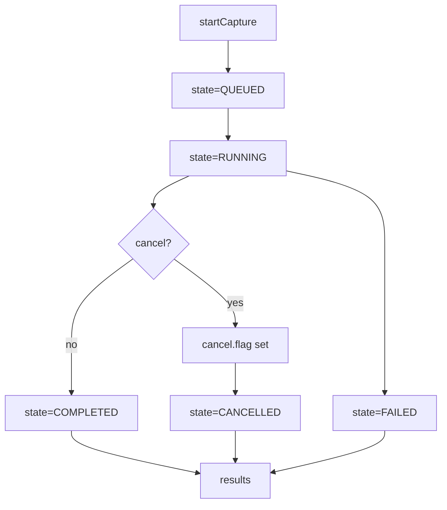

Summary:
- Added collect-only RxMER capture wiring with artifact persistence and ledger JSONL.
- Stored request context for TFTP/SNMP overrides and used it during capture.
- Updated runner work items to include operation_id for capture worker context.
- Documented collect-first artifact/ledger behavior and added artifact persistence tests.

# FILE: src/pypnm_cmts/api/common/operations/models.py
# SPDX-License-Identifier: Apache-2.0
# Copyright (c) 2026 Maurice Garcia

from __future__ import annotations

from pydantic import BaseModel, Field
from pypnm.api.routes.common.service.status_codes import ServiceStatusCode
from pypnm.lib.types import (
    ChannelId,
    FileNameStr,
    InetAddressStr,
    MacAddressStr,
    TimestampSec,
    TransactionId,
    IPv4Str,
    IPv6Str,
    SnmpWriteCommunity,
)

from pypnm_cmts.lib.constants import OperationStage, OperationState
from pypnm_cmts.lib.types import PnmCaptureOperationId, ServiceGroupId

MIN_TIMEOUT_SECONDS = 1.0


class OperationCountersModel(BaseModel):
    """Aggregate counters for operation progress tracking."""

    total_modems: int = Field(default=0, ge=0, description="Total modems in scope.")
    eligible_modems: int = Field(default=0, ge=0, description="Modems passing eligibility gate.")
    precheck_passed: int = Field(default=0, ge=0, description="Modems passing precheck stage.")
    capture_started: int = Field(default=0, ge=0, description="Modems with capture started.")
    completed: int = Field(default=0, ge=0, description="Modems with completed processing.")
    success: int = Field(default=0, ge=0, description="Modems with successful capture.")
    failed: int = Field(default=0, ge=0, description="Modems with failed capture.")
    skipped: int = Field(default=0, ge=0, description="Modems skipped by eligibility or constraints.")


class OperationTimestampsModel(BaseModel):
    """Epoch timestamp lifecycle for an operation."""

    created_epoch: TimestampSec = Field(
        default=TimestampSec(0),
        ge=0,
        description="Epoch timestamp when the operation was created.",
    )
    started_epoch: TimestampSec = Field(
        default=TimestampSec(0),
        ge=0,
        description="Epoch timestamp when execution started.",
    )
    updated_epoch: TimestampSec = Field(
        default=TimestampSec(0),
        ge=0,
        description="Epoch timestamp for the last state update.",
    )
    finished_epoch: TimestampSec = Field(
        default=TimestampSec(0),
        ge=0,
        description="Epoch timestamp when execution finished.",
    )


class OperationExecutionModel(BaseModel):
    """Execution settings captured for the operation request summary."""

    max_workers: int = Field(default=0, ge=0, description="Maximum concurrent workers requested.")
    retry_count: int = Field(default=0, ge=0, description="Retry attempts for retryable failures.")
    retry_delay_seconds: float = Field(default=0.0, ge=0.0, description="Delay between retry attempts in seconds.")
    per_modem_timeout_seconds: float = Field(
        default=MIN_TIMEOUT_SECONDS,
        gt=0.0,
        description="Per-modem timeout in seconds.",
    )
    overall_timeout_seconds: float = Field(
        default=MIN_TIMEOUT_SECONDS,
        gt=0.0,
        description="Overall timeout in seconds.",
    )


class OperationRequestSummaryModel(BaseModel):
    """Minimal summary of the request payload for tracking and auditing."""

    serving_group_ids: list[ServiceGroupId] = Field(
        default_factory=list,
        description="Requested serving group identifiers (empty means all).",
    )
    mac_addresses: list[MacAddressStr] = Field(
        default_factory=list,
        description="Requested cable modem MAC addresses (empty means all).",
    )
    channel_ids: list[ChannelId] = Field(
        default_factory=list,
        description="Requested channel identifiers (empty means all).",
    )
    execution: OperationExecutionModel = Field(
        default_factory=OperationExecutionModel,
        description="Execution settings supplied with the request.",
    )


class OperationRequestContextModel(BaseModel):
    """Internal request context for capture overrides."""

    tftp_ipv4: IPv4Str | None = Field(default=None, description="Optional TFTP IPv4 override.")
    tftp_ipv6: IPv6Str | None = Field(default=None, description="Optional TFTP IPv6 override.")
    snmp_write_community: SnmpWriteCommunity | None = Field(
        default=None,
        description="Optional SNMP write community override.",
    )


class OperationErrorSummaryModel(BaseModel):
    """Optional error summary for failed operations."""

    message: str = Field(default="", description="Error message describing the failure.")
    detail: str = Field(default="", description="Optional failure detail.")


class OperationStageResultModel(BaseModel):
    """Per-stage execution result for a modem."""

    stage: OperationStage = Field(..., description="Execution stage identifier.")
    status_code: ServiceStatusCode = Field(default=ServiceStatusCode.SUCCESS, description="Stage status code.")
    transaction_ids: list[TransactionId] = Field(
        default_factory=list,
        description="Transaction identifiers linked to this stage.",
    )
    filenames: list[FileNameStr] = Field(
        default_factory=list,
        description="Capture filenames linked to this stage.",
    )
    message: str = Field(default="", description="Stage message or error detail.")
    started_epoch: TimestampSec = Field(
        default=TimestampSec(0),
        ge=0,
        description="Epoch timestamp when stage started.",
    )
    finished_epoch: TimestampSec = Field(
        default=TimestampSec(0),
        ge=0,
        description="Epoch timestamp when stage finished.",
    )


class OperationStateModel(BaseModel):
    """Filesystem-backed operation state record."""

    operation_id: PnmCaptureOperationId = Field(..., description="Operation identifier.")
    state: OperationState = Field(default=OperationState.QUEUED, description="Lifecycle state for the operation.")
    counters: OperationCountersModel = Field(default_factory=OperationCountersModel, description="Progress counters.")
    timestamps: OperationTimestampsModel = Field(default_factory=OperationTimestampsModel, description="Lifecycle timestamps.")
    request_summary: OperationRequestSummaryModel = Field(
        default_factory=OperationRequestSummaryModel,
        description="Minimal request summary for the operation.",
    )
    error_summary: OperationErrorSummaryModel | None = Field(
        default=None,
        description="Optional error summary if the operation fails.",
    )


class PerModemLinkageRecordModel(BaseModel):
    """JSONL linkage record tying a modem to capture artifacts and outcomes."""

    pnm_capture_operation_id: PnmCaptureOperationId = Field(..., description="Parent operation identifier.")
    sg_id: ServiceGroupId = Field(..., description="Serving group identifier for the modem.")
    mac_address: MacAddressStr = Field(..., description="Cable modem MAC address.")
    ip_address: InetAddressStr | None = Field(default=None, description="Cable modem IP address, if known.")
    stage: OperationStage = Field(default=OperationStage.ELIGIBILITY, description="Operation stage for this record.")
    status_code: ServiceStatusCode = Field(default=ServiceStatusCode.SUCCESS, description="Status code for this stage.")
    transaction_ids: list[TransactionId] = Field(
        default_factory=list,
        description="Transaction identifiers linked to this modem stage.",
    )
    filenames: list[FileNameStr] = Field(
        default_factory=list,
        description="Capture filenames linked to this modem stage.",
    )
    started_epoch: TimestampSec = Field(
        default=TimestampSec(0),
        ge=0,
        description="Epoch timestamp when stage started.",
    )
    finished_epoch: TimestampSec = Field(
        default=TimestampSec(0),
        ge=0,
        description="Epoch timestamp when stage finished.",
    )
    message: str = Field(default="", description="Stage message or error detail.")


class PnmLedgerEntryModel(BaseModel):
    """Ledger entry that links capture artifacts to an operation."""

    schema_version: int = Field(default=1, ge=1, description="Ledger schema version.")
    pnm_capture_operation_id: PnmCaptureOperationId = Field(..., description="Parent operation identifier.")
    sg_id: ServiceGroupId = Field(..., description="Serving group identifier.")
    mac_address: MacAddressStr = Field(..., description="Cable modem MAC address.")
    stage: OperationStage = Field(default=OperationStage.CAPTURE, description="Capture stage identifier.")
    status_code: ServiceStatusCode = Field(default=ServiceStatusCode.SUCCESS, description="Capture status code.")
    transaction_id: TransactionId | None = Field(default=None, description="PyPNM transaction identifier.")
    filename: FileNameStr | None = Field(default=None, description="Capture artifact filename.")
    created_epoch: TimestampSec = Field(default=TimestampSec(0), ge=0, description="Ledger creation epoch seconds.")
    message: str = Field(default="", description="Capture message or error detail.")


class OperationResultsSummaryModel(BaseModel):
    """Summary of JSONL linkage results for a completed operation."""

    record_count: int = Field(default=0, ge=0, description="Total linkage records stored for this operation.")
    included_count: int = Field(default=0, ge=0, description="Linkage records included in the response.")
    files_scanned: int = Field(default=0, ge=0, description="Result files scanned for linkage records.")


__all__ = [
    "OperationCountersModel",
    "OperationErrorSummaryModel",
    "OperationExecutionModel",
    "OperationRequestContextModel",
    "OperationRequestSummaryModel",
    "OperationResultsSummaryModel",
    "OperationStageResultModel",
    "OperationStateModel",
    "OperationTimestampsModel",
    "PnmLedgerEntryModel",
    "PerModemLinkageRecordModel",
]

# FILE: src/pypnm_cmts/api/common/operations/__init__.py
# SPDX-License-Identifier: Apache-2.0
# Copyright (c) 2026 Maurice Garcia

"""Reusable filesystem-backed operation primitives for CMTS orchestration."""
from __future__ import annotations

from pypnm_cmts.api.common.operations.models import (
    OperationCountersModel,
    OperationErrorSummaryModel,
    OperationExecutionModel,
    OperationRequestContextModel,
    OperationRequestSummaryModel,
    OperationResultsSummaryModel,
    OperationStageResultModel,
    OperationStateModel,
    OperationTimestampsModel,
    PnmLedgerEntryModel,
    PerModemLinkageRecordModel,
)
from pypnm_cmts.api.common.operations.runner import OperationRunner
from pypnm_cmts.api.common.operations.store import OperationStore

__all__ = [
    "OperationCountersModel",
    "OperationErrorSummaryModel",
    "OperationExecutionModel",
    "OperationRequestContextModel",
    "OperationRequestSummaryModel",
    "OperationResultsSummaryModel",
    "OperationStageResultModel",
    "OperationStateModel",
    "OperationTimestampsModel",
    "PnmLedgerEntryModel",
    "OperationRunner",
    "OperationStore",
    "PerModemLinkageRecordModel",
]

# FILE: src/pypnm_cmts/api/common/operations/pnm_artifact_writer.py
# SPDX-License-Identifier: Apache-2.0
# Copyright (c) 2026 Maurice Garcia

from __future__ import annotations

import shutil
import threading
from pathlib import Path
from uuid import uuid4

from pypnm.api.routes.common.service.status_codes import ServiceStatusCode
from pypnm.config.system_config_settings import SystemConfigSettings
from pypnm.lib.types import FileNameStr, TimestampSec
from pypnm.lib.utils import Generate, TimeUnit

from pypnm_cmts.api.common.operations.models import PnmLedgerEntryModel
from pypnm_cmts.lib.types import PnmCaptureOperationId

LEDGER_FILENAME = "ledger.jsonl"


class PnmArtifactWriter:
    """Persist PNM capture artifacts and ledger entries to the filesystem."""

    def __init__(self, pnm_root: Path | None = None) -> None:
        self._pnm_root = pnm_root or Path(SystemConfigSettings.pnm_dir())
        self._ledger_lock = threading.Lock()

    def move_capture_file(
        self,
        operation_id: PnmCaptureOperationId,
        filename: FileNameStr,
        source_path: Path,
    ) -> tuple[ServiceStatusCode, FileNameStr | None, str]:
        """Move a capture file into the operation directory atomically."""
        if not source_path.exists():
            return (ServiceStatusCode.MISSING_PNM_FILENAME, None, "pnm capture file not found")

        operation_dir = self._operation_dir(operation_id)
        operation_dir.mkdir(parents=True, exist_ok=True)
        destination = operation_dir / str(filename)
        tmp_path = operation_dir / f".{filename}.{uuid4().hex}.tmp"
        try:
            shutil.copyfile(source_path, tmp_path)
            tmp_path.replace(destination)
            source_path.unlink(missing_ok=True)
            return (ServiceStatusCode.SUCCESS, FileNameStr(destination.name), "")
        except Exception as exc:
            if tmp_path.exists():
                tmp_path.unlink(missing_ok=True)
            return (ServiceStatusCode.COPY_PNM_FILE_TO_LOCAL_SAVE_DIR_FAILED, None, str(exc))

    def append_ledger_entry(self, entry: PnmLedgerEntryModel) -> None:
        """Append a JSONL ledger entry for a capture artifact."""
        ledger_path = self._ledger_path(entry.pnm_capture_operation_id)
        ledger_path.parent.mkdir(parents=True, exist_ok=True)
        with self._ledger_lock:
            with ledger_path.open("a", encoding="utf-8") as handle:
                handle.write(f"{entry.model_dump_json()}\n")

    @staticmethod
    def now_epoch() -> TimestampSec:
        """Return the current epoch seconds timestamp."""
        return TimestampSec(Generate.time_stamp(unit=TimeUnit.SECONDS))

    def _operation_dir(self, operation_id: PnmCaptureOperationId) -> Path:
        return self._pnm_root / str(operation_id)

    def _ledger_path(self, operation_id: PnmCaptureOperationId) -> Path:
        return self._operation_dir(operation_id) / LEDGER_FILENAME


__all__ = [
    "PnmArtifactWriter",
]

# FILE: src/pypnm_cmts/api/common/operations/store.py
# SPDX-License-Identifier: Apache-2.0
# Copyright (c) 2026 Maurice Garcia

from __future__ import annotations

import json
import threading
from pathlib import Path
from uuid import uuid4

from pypnm.lib.types import TimestampSec
from pypnm.lib.utils import Generate, TimeUnit

from pypnm_cmts.api.common.operations.models import (
    OperationRequestContextModel,
    OperationRequestSummaryModel,
    OperationStateModel,
    OperationTimestampsModel,
    PerModemLinkageRecordModel,
)
from pypnm_cmts.lib.constants import OperationState
from pypnm_cmts.lib.types import PnmCaptureOperationId, ServiceGroupId

STATE_FILE_NAME = "state.json"
REQUEST_CONTEXT_FILE_NAME = "request_context.json"
CANCEL_FLAG_NAME = "cancel.flag"
RESULTS_DIR_NAME = "results"
RESULT_FILE_PREFIX = "sg-"
RESULT_FILE_SUFFIX = ".jsonl"
DEFAULT_BASE_DIR = Path(".data/sg_operations")


class OperationStore:
    """Filesystem-backed store for operation state and linkage records."""

    def __init__(self, base_dir: Path | None = None) -> None:
        self._base_dir = base_dir or DEFAULT_BASE_DIR
        self._state_lock = threading.Lock()

    def create_operation(
        self,
        request_summary: OperationRequestSummaryModel,
        request_context: OperationRequestContextModel | None = None,
    ) -> OperationStateModel:
        """Create a new operation directory and persist initial state."""
        operation_id = self._generate_operation_id()
        now_epoch = self._now_epoch()
        timestamps = OperationTimestampsModel(
            created_epoch=now_epoch,
            started_epoch=TimestampSec(0),
            updated_epoch=now_epoch,
            finished_epoch=TimestampSec(0),
        )
        state = OperationStateModel(
            operation_id=operation_id,
            state=OperationState.QUEUED,
            timestamps=timestamps,
            request_summary=request_summary,
        )
        self._ensure_operation_dirs(operation_id)
        self.save_state_atomic(state)
        if request_context is not None:
            self.save_request_context(operation_id, request_context)
        return state

    def load_state(self, operation_id: PnmCaptureOperationId) -> OperationStateModel:
        """Load operation state from disk."""
        path = self._state_path(operation_id)
        if not path.exists():
            raise FileNotFoundError(f"operation state not found: {path}")
        with self._state_lock:
            payload = json.loads(path.read_text(encoding="utf-8"))
        return OperationStateModel.model_validate(payload)

    def save_state_atomic(self, state: OperationStateModel) -> None:
        """Persist operation state with an atomic file replace."""
        path = self._state_path(state.operation_id)
        path.parent.mkdir(parents=True, exist_ok=True)
        tmp_path = path.with_suffix(f".{uuid4().hex}.tmp")
        with self._state_lock:
            if path.exists():
                current_payload = json.loads(path.read_text(encoding="utf-8"))
                current_state = OperationStateModel.model_validate(current_payload)
                if not self._can_replace_state(current_state.state, state.state):
                    return
            tmp_path.write_text(state.model_dump_json(indent=2), encoding="utf-8")
            tmp_path.replace(path)

    def save_request_context(
        self,
        operation_id: PnmCaptureOperationId,
        context: OperationRequestContextModel,
    ) -> None:
        """Persist request context overrides to disk."""
        path = self._request_context_path(operation_id)
        path.parent.mkdir(parents=True, exist_ok=True)
        tmp_path = path.with_suffix(f".{uuid4().hex}.tmp")
        with self._state_lock:
            tmp_path.write_text(context.model_dump_json(indent=2), encoding="utf-8")
            tmp_path.replace(path)

    def load_request_context(
        self,
        operation_id: PnmCaptureOperationId,
    ) -> OperationRequestContextModel | None:
        """Load request context overrides if present."""
        path = self._request_context_path(operation_id)
        if not path.exists():
            return None
        with self._state_lock:
            payload = json.loads(path.read_text(encoding="utf-8"))
        return OperationRequestContextModel.model_validate(payload)

    def request_cancel(self, operation_id: PnmCaptureOperationId) -> OperationStateModel:
        """Create cancel.flag and update state unless already terminal."""
        state = self.load_state(operation_id)
        if self._is_terminal_state(state.state):
            return state
        self._cancel_flag_path(operation_id).touch(exist_ok=True)
        updated = state.model_copy(
            update={
                "state": OperationState.CANCELLING,
                "timestamps": state.timestamps.model_copy(
                    update={
                        "updated_epoch": self._now_epoch(),
                    }
                ),
            }
        )
        self.save_state_atomic(updated)
        return updated

    def is_cancel_requested(self, operation_id: PnmCaptureOperationId) -> bool:
        """Return whether the cancel flag exists for the operation."""
        return self._cancel_flag_path(operation_id).exists()

    def append_result_record(self, record: PerModemLinkageRecordModel) -> None:
        """Append a JSONL linkage record for the specified service group."""
        path = self._result_path(record.pnm_capture_operation_id, record.sg_id)
        path.parent.mkdir(parents=True, exist_ok=True)
        line = record.model_dump_json()
        with path.open("a", encoding="utf-8") as handle:
            handle.write(f"{line}\n")

    def count_result_files(self, operation_id: PnmCaptureOperationId) -> int:
        """Count JSONL result files for the operation."""
        return len(self._list_result_files(operation_id))

    def load_result_records(
        self,
        operation_id: PnmCaptureOperationId,
        max_records: int | None = None,
    ) -> list[PerModemLinkageRecordModel]:
        """Load linkage records from JSONL files, bounded by max_records."""
        records: list[PerModemLinkageRecordModel] = []
        for path in self._list_result_files(operation_id):
            with path.open("r", encoding="utf-8") as handle:
                for line in handle:
                    if max_records is not None and len(records) >= max_records:
                        return records
                    trimmed = line.strip()
                    if trimmed == "":
                        continue
                    records.append(PerModemLinkageRecordModel.model_validate_json(trimmed))
        return records

    def count_result_records(self, operation_id: PnmCaptureOperationId) -> int:
        """Count linkage records across all JSONL result files."""
        count = 0
        for path in self._list_result_files(operation_id):
            with path.open("r", encoding="utf-8") as handle:
                for line in handle:
                    if line.strip() != "":
                        count += 1
        return count

    def _ensure_operation_dirs(self, operation_id: PnmCaptureOperationId) -> None:
        base = self._operation_dir(operation_id)
        base.mkdir(parents=True, exist_ok=True)
        self._results_dir(operation_id).mkdir(parents=True, exist_ok=True)

    def _operation_dir(self, operation_id: PnmCaptureOperationId) -> Path:
        return self._base_dir / str(operation_id)

    def _results_dir(self, operation_id: PnmCaptureOperationId) -> Path:
        return self._operation_dir(operation_id) / RESULTS_DIR_NAME

    def _state_path(self, operation_id: PnmCaptureOperationId) -> Path:
        return self._operation_dir(operation_id) / STATE_FILE_NAME

    def _request_context_path(self, operation_id: PnmCaptureOperationId) -> Path:
        return self._operation_dir(operation_id) / REQUEST_CONTEXT_FILE_NAME

    def _cancel_flag_path(self, operation_id: PnmCaptureOperationId) -> Path:
        return self._operation_dir(operation_id) / CANCEL_FLAG_NAME

    def _result_path(self, operation_id: PnmCaptureOperationId, sg_id: ServiceGroupId) -> Path:
        name = f"{RESULT_FILE_PREFIX}{int(sg_id)}{RESULT_FILE_SUFFIX}"
        return self._results_dir(operation_id) / name

    def _list_result_files(self, operation_id: PnmCaptureOperationId) -> list[Path]:
        results_dir = self._results_dir(operation_id)
        if not results_dir.exists():
            return []
        return sorted(results_dir.glob(f"{RESULT_FILE_PREFIX}*{RESULT_FILE_SUFFIX}"))

    @staticmethod
    def _generate_operation_id() -> PnmCaptureOperationId:
        return PnmCaptureOperationId(uuid4().hex)

    @staticmethod
    def _now_epoch() -> TimestampSec:
        return TimestampSec(Generate.time_stamp(unit=TimeUnit.SECONDS))

    @staticmethod
    def _is_terminal_state(state: OperationState) -> bool:
        return state in {
            OperationState.COMPLETED,
            OperationState.FAILED,
            OperationState.CANCELLED,
        }

    @classmethod
    def _can_replace_state(cls, current: OperationState, incoming: OperationState) -> bool:
        if cls._is_terminal_state(current):
            return current == incoming
        return True


__all__ = [
    "OperationStore",
]

# FILE: src/pypnm_cmts/api/common/operations/runner.py
# SPDX-License-Identifier: Apache-2.0
# Copyright (c) 2026 Maurice Garcia

from __future__ import annotations

import logging
import threading
import time
from collections.abc import Callable
from concurrent.futures import FIRST_COMPLETED, Future, ThreadPoolExecutor, wait

from pydantic import BaseModel, Field
from pypnm.api.routes.common.service.status_codes import ServiceStatusCode
from pypnm.lib.types import MacAddressStr, TimestampSec
from pypnm.lib.utils import Generate, TimeUnit

from pypnm_cmts.api.common.operations.models import (
    OperationErrorSummaryModel,
    OperationExecutionModel,
    OperationStageResultModel,
    OperationStateModel,
    OperationTimestampsModel,
    PerModemLinkageRecordModel,
)
from pypnm_cmts.api.common.operations.store import OperationStore
from pypnm_cmts.lib.constants import OperationStage, OperationState
from pypnm_cmts.lib.types import PnmCaptureOperationId, ServiceGroupId

DEFAULT_WORKER_DELAY_SECONDS = 0.01
DEFAULT_CANCEL_GRACE_SECONDS = 1.0
DEFAULT_POLL_INTERVAL_SECONDS = 0.05
DEFAULT_OVERALL_TIMEOUT_MESSAGE = "overall timeout exceeded"
DEFAULT_PER_MODEM_TIMEOUT_MESSAGE = "per-modem timeout exceeded"


class OperationWorkerResultModel(BaseModel):
    """Result payload returned by per-modem worker functions."""

    stages: list[OperationStageResultModel] = Field(
        default_factory=list,
        description="Per-stage execution results for the modem.",
    )


class OperationWorkItemModel(BaseModel):
    """Work item describing a single modem execution."""

    operation_id: PnmCaptureOperationId = Field(..., description="Parent operation identifier.")
    sg_id: ServiceGroupId = Field(..., description="Serving group identifier.")
    mac_address: MacAddressStr = Field(..., description="Cable modem MAC address.")
    attempt: int = Field(default=0, ge=0, description="Attempt index for retry tracking.")


class OperationRunner:
    """Background runner that executes operation work in a thread."""

    def __init__(
        self,
        store: OperationStore,
        worker: Callable[[OperationWorkItemModel], OperationWorkerResultModel] | None = None,
        cancel_grace_seconds: float = DEFAULT_CANCEL_GRACE_SECONDS,
        poll_interval_seconds: float = DEFAULT_POLL_INTERVAL_SECONDS,
    ) -> None:
        self._store = store
        self._worker = worker or self._default_worker
        self._cancel_grace_seconds = cancel_grace_seconds
        self._poll_interval_seconds = poll_interval_seconds
        self._lock = threading.Lock()
        self._threads: dict[PnmCaptureOperationId, threading.Thread] = {}
        self.logger = logging.getLogger(f"{self.__class__.__name__}")

    def start(self, operation_id: PnmCaptureOperationId) -> bool:
        """Start background execution for the operation if not already running."""
        with self._lock:
            existing = self._threads.get(operation_id)
            if existing is not None and existing.is_alive():
                return False
            thread = threading.Thread(
                target=self._run_operation,
                args=(operation_id,),
                daemon=True,
            )
            self._threads[operation_id] = thread
            thread.start()
            return True

    def is_running(self, operation_id: PnmCaptureOperationId) -> bool:
        """Return whether a background thread is active for the operation."""
        with self._lock:
            thread = self._threads.get(operation_id)
            if thread is None:
                return False
            return thread.is_alive()

    def request_cancel(self, operation_id: PnmCaptureOperationId) -> OperationStateModel:
        """Request cooperative cancellation via the store."""
        return self._store.request_cancel(operation_id)

    def _run_operation(self, operation_id: PnmCaptureOperationId) -> None:
        try:
            self._execute_operation(operation_id)
        except Exception as exc:
            self.logger.exception("operation runner failed for %s", operation_id)
            self._mark_failed(operation_id, str(exc))
        finally:
            self._cleanup(operation_id)

    def _execute_operation(self, operation_id: PnmCaptureOperationId) -> None:
        state = self._store.load_state(operation_id)
        state = self._transition_to_running(state)
        self._store.save_state_atomic(state)

        request_summary = state.request_summary
        execution = request_summary.execution
        macs = list(request_summary.mac_addresses)
        sg_ids = list(request_summary.serving_group_ids)

        if not macs or not sg_ids:
            self._mark_completed(state, operation_id, counters_total=0)
            return

        total_modems = len(macs)
        state = state.model_copy(update={"counters": state.counters.model_copy(update={"total_modems": total_modems})})
        self._store.save_state_atomic(state)

        work_items = self._build_work_items(operation_id, macs, sg_ids)
        overall_deadline = time.monotonic() + execution.overall_timeout_seconds

        executor = ThreadPoolExecutor(max_workers=execution.max_workers)
        pending: dict[Future, tuple[OperationWorkItemModel, float]] = {}
        abandoned: dict[Future, tuple[OperationWorkItemModel, float]] = {}
        queue: list[OperationWorkItemModel] = list(work_items)
        retry_queue: list[tuple[float, OperationWorkItemModel]] = []
        cancelled = False
        failed = False
        try:
            while queue or pending or abandoned or retry_queue:
                if self._store.is_cancel_requested(operation_id):
                    cancelled = True
                    self._cancel_remaining(list(pending.keys()) + list(abandoned.keys()), executor, overall_deadline)
                    return
                if time.monotonic() >= overall_deadline:
                    failed = True
                    self._cancel_remaining(list(pending.keys()) + list(abandoned.keys()), executor, overall_deadline)
                    return

                now = time.monotonic()
                ready_retries = [(ready_at, item) for (ready_at, item) in retry_queue if ready_at <= now]
                if ready_retries:
                    retry_queue = [(ready_at, item) for (ready_at, item) in retry_queue if ready_at > now]
                    ready_retries.sort(key=lambda entry: entry[0])
                    for _, item in ready_retries:
                        queue.append(item)

                in_flight = len(pending) + len(abandoned)
                while queue and in_flight < execution.max_workers:
                    item = queue.pop(0)
                    future = executor.submit(self._execute_modem, item)
                    pending[future] = (item, time.monotonic())
                    in_flight = len(pending) + len(abandoned)

                futures = list(pending.keys()) + list(abandoned.keys())
                if not futures:
                    time.sleep(self._poll_interval_seconds)
                    continue

                done, _ = wait(
                    futures,
                    timeout=self._poll_interval_seconds,
                    return_when=FIRST_COMPLETED,
                )

                now = time.monotonic()
                timed_out: list[Future] = []
                for future, (_, start_time) in pending.items():
                    if future.done():
                        continue
                    if now - start_time >= execution.per_modem_timeout_seconds:
                        timed_out.append(future)

                for future in timed_out:
                    item, start_time = pending.pop(future)
                    abandoned[future] = (item, start_time)
                    future.cancel()
                    result = self._timeout_result()
                    state = self._handle_result(operation_id, state, item, result, execution, retry_queue)
                    if state.state in {OperationState.CANCELLED, OperationState.FAILED}:
                        return

                for future in done:
                    if future in abandoned:
                        abandoned.pop(future, None)
                        continue

                    pending_item = pending.pop(future, None)
                    if pending_item is None:
                        continue

                    item, _ = pending_item
                    result = self._resolve_future_result(future)
                    state = self._handle_result(operation_id, state, item, result, execution, retry_queue)
                    if state.state in {OperationState.CANCELLED, OperationState.FAILED}:
                        return
        finally:
            if cancelled:
                executor.shutdown(wait=False, cancel_futures=True)
                self._mark_cancelled(operation_id)
                return
            if failed:
                executor.shutdown(wait=False, cancel_futures=True)
                self._mark_failed(operation_id, DEFAULT_OVERALL_TIMEOUT_MESSAGE)
                return
            executor.shutdown(wait=True)

        terminal_state = OperationState.COMPLETED
        if state.counters.failed > 0:
            terminal_state = OperationState.FAILED
        state = state.model_copy(
            update={
                "state": terminal_state,
                "timestamps": self._finish_timestamps(state.timestamps),
                "error_summary": None,
            }
        )
        self._store.save_state_atomic(state)

    def _execute_modem(self, item: OperationWorkItemModel) -> OperationWorkerResultModel:
        return self._worker(item)

    def _default_worker(self, item: OperationWorkItemModel) -> OperationWorkerResultModel:
        started_epoch = self._now_epoch()
        time.sleep(DEFAULT_WORKER_DELAY_SECONDS)
        finished_epoch = self._now_epoch()
        return OperationWorkerResultModel(
            stages=self._build_stage_results(
                status_code=ServiceStatusCode.SUCCESS,
                message="completed",
                started_epoch=started_epoch,
                finished_epoch=finished_epoch,
            ),
        )

    def _resolve_future_result(
        self,
        future: Future,
    ) -> OperationWorkerResultModel:
        try:
            return future.result()
        except Exception as exc:
            return self._failure_result(str(exc))

    def _persist_stage_records(
        self,
        operation_id: PnmCaptureOperationId,
        item: OperationWorkItemModel,
        result: OperationWorkerResultModel,
    ) -> None:
        for stage_result in result.stages:
            record = PerModemLinkageRecordModel(
                pnm_capture_operation_id=operation_id,
                sg_id=item.sg_id,
                mac_address=item.mac_address,
                ip_address=None,
                stage=stage_result.stage,
                status_code=stage_result.status_code,
                transaction_ids=list(stage_result.transaction_ids),
                filenames=list(stage_result.filenames),
                started_epoch=stage_result.started_epoch,
                finished_epoch=stage_result.finished_epoch,
                message=stage_result.message,
            )
            self._store.append_result_record(record)

    def _update_counters(self, state: OperationStateModel, result: OperationWorkerResultModel) -> OperationStateModel:
        counters = state.counters
        eligibility = self._find_stage(result, OperationStage.ELIGIBILITY)
        precheck = self._find_stage(result, OperationStage.PRECHECK)
        capture = self._find_stage(result, OperationStage.CAPTURE)
        if eligibility is not None and eligibility.status_code == ServiceStatusCode.SUCCESS:
            counters = counters.model_copy(update={"eligible_modems": counters.eligible_modems + 1})
        if precheck is not None and precheck.status_code == ServiceStatusCode.SUCCESS:
            counters = counters.model_copy(update={"precheck_passed": counters.precheck_passed + 1})
        if capture is not None:
            counters = counters.model_copy(update={"capture_started": counters.capture_started + 1})
        counters = counters.model_copy(
            update={
                "completed": counters.completed + 1,
            }
        )
        final_status = self._final_status_code(result)
        if final_status == ServiceStatusCode.SUCCESS:
            counters = counters.model_copy(update={"success": counters.success + 1})
        else:
            counters = counters.model_copy(update={"failed": counters.failed + 1})
        return state.model_copy(update={"counters": counters})

    def _cancel_remaining(
        self,
        futures: list[Future],
        executor: ThreadPoolExecutor,
        deadline: float,
    ) -> None:
        for future in futures:
            future.cancel()
        remaining = max(0.0, deadline - time.monotonic())
        wait_limit = min(self._cancel_grace_seconds, remaining)
        if wait_limit <= 0:
            return
        end = time.monotonic() + wait_limit
        while time.monotonic() < end:
            if all(f.done() for f in futures):
                return
            time.sleep(self._poll_interval_seconds)
        executor.shutdown(wait=False, cancel_futures=True)

    def _mark_cancelled(self, operation_id: PnmCaptureOperationId) -> None:
        state = self._store.load_state(operation_id)
        state = state.model_copy(
            update={
                "state": OperationState.CANCELLED,
                "timestamps": self._finish_timestamps(state.timestamps),
                "error_summary": None,
            }
        )
        self._store.save_state_atomic(state)

    def _mark_failed(self, operation_id: PnmCaptureOperationId, message: str) -> None:
        state = self._store.load_state(operation_id)
        state = state.model_copy(
            update={
                "state": OperationState.FAILED,
                "timestamps": self._finish_timestamps(state.timestamps),
                "error_summary": OperationErrorSummaryModel(message=message, detail=""),
            }
        )
        self._store.save_state_atomic(state)

    def _mark_completed(
        self,
        state: OperationStateModel,
        operation_id: PnmCaptureOperationId,
        counters_total: int,
    ) -> None:
        updated = state.model_copy(
            update={
                "state": OperationState.COMPLETED,
                "counters": state.counters.model_copy(update={"total_modems": counters_total}),
                "timestamps": self._finish_timestamps(state.timestamps),
                "error_summary": None,
            }
        )
        self._store.save_state_atomic(updated)

    def _transition_to_running(self, state: OperationStateModel) -> OperationStateModel:
        timestamps = state.timestamps
        if timestamps.started_epoch == TimestampSec(0):
            timestamps = timestamps.model_copy(update={"started_epoch": self._now_epoch()})
        timestamps = self._touch_timestamp(timestamps)
        return state.model_copy(update={"state": OperationState.RUNNING, "timestamps": timestamps})

    def _finish_timestamps(self, timestamps: OperationTimestampsModel) -> OperationTimestampsModel:
        now_epoch = self._now_epoch()
        return timestamps.model_copy(
            update={
                "updated_epoch": now_epoch,
                "finished_epoch": now_epoch,
            }
        )

    def _touch_timestamp(self, timestamps: OperationTimestampsModel) -> OperationTimestampsModel:
        return timestamps.model_copy(update={"updated_epoch": self._now_epoch()})

    def _build_work_items(
        self,
        operation_id: PnmCaptureOperationId,
        macs: list[MacAddressStr],
        sg_ids: list[ServiceGroupId],
    ) -> list[OperationWorkItemModel]:
        items: list[OperationWorkItemModel] = []
        sg_count = len(sg_ids)
        for index, mac in enumerate(macs):
            sg_id = sg_ids[index % sg_count]
            items.append(
                OperationWorkItemModel(
                    operation_id=operation_id,
                    sg_id=sg_id,
                    mac_address=mac,
                    attempt=0,
                )
            )
        return items

    def _handle_result(
        self,
        operation_id: PnmCaptureOperationId,
        state: OperationStateModel,
        item: OperationWorkItemModel,
        result: OperationWorkerResultModel,
        execution: OperationExecutionModel,
        retry_queue: list[tuple[float, OperationWorkItemModel]],
    ) -> OperationStateModel:
        final_status = self._final_status_code(result)
        if final_status != ServiceStatusCode.SUCCESS and item.attempt < execution.retry_count:
            retry_item = item.model_copy(update={"attempt": item.attempt + 1})
            ready_at = time.monotonic() + execution.retry_delay_seconds
            retry_queue.append((ready_at, retry_item))
            updated = state.model_copy(update={"timestamps": self._touch_timestamp(state.timestamps)})
            self._store.save_state_atomic(updated)
            return updated

        self._persist_stage_records(operation_id, item, result)
        updated = self._update_counters(state, result)
        updated = updated.model_copy(update={"timestamps": self._touch_timestamp(updated.timestamps)})
        self._store.save_state_atomic(updated)
        return updated

    def _timeout_result(self) -> OperationWorkerResultModel:
        now_epoch = self._now_epoch()
        timeout_status = getattr(ServiceStatusCode, "MEASUREMENT_TIMEOUT", ServiceStatusCode.FAILURE)
        return OperationWorkerResultModel(
            stages=self._build_stage_results(
                status_code=timeout_status,
                message=DEFAULT_PER_MODEM_TIMEOUT_MESSAGE,
                started_epoch=now_epoch,
                finished_epoch=now_epoch,
                capture_only=True,
            ),
        )

    def _failure_result(self, message: str) -> OperationWorkerResultModel:
        now_epoch = self._now_epoch()
        return OperationWorkerResultModel(
            stages=self._build_stage_results(
                status_code=ServiceStatusCode.FAILURE,
                message=message,
                started_epoch=now_epoch,
                finished_epoch=now_epoch,
                capture_only=True,
            ),
        )

    def _build_stage_results(
        self,
        status_code: ServiceStatusCode,
        message: str,
        started_epoch: TimestampSec,
        finished_epoch: TimestampSec,
        capture_only: bool = False,
    ) -> list[OperationStageResultModel]:
        capture_result = OperationStageResultModel(
            stage=OperationStage.CAPTURE,
            status_code=status_code,
            transaction_ids=[],
            filenames=[],
            message=message,
            started_epoch=started_epoch,
            finished_epoch=finished_epoch,
        )
        if capture_only:
            return [
                OperationStageResultModel(
                    stage=OperationStage.ELIGIBILITY,
                    status_code=ServiceStatusCode.SUCCESS,
                    transaction_ids=[],
                    filenames=[],
                    message="",
                    started_epoch=started_epoch,
                    finished_epoch=finished_epoch,
                ),
                OperationStageResultModel(
                    stage=OperationStage.PRECHECK,
                    status_code=ServiceStatusCode.SUCCESS,
                    transaction_ids=[],
                    filenames=[],
                    message="",
                    started_epoch=started_epoch,
                    finished_epoch=finished_epoch,
                ),
                capture_result,
            ]
        return [
            OperationStageResultModel(
                stage=OperationStage.ELIGIBILITY,
                status_code=status_code,
                transaction_ids=[],
                filenames=[],
                message=message,
                started_epoch=started_epoch,
                finished_epoch=finished_epoch,
            ),
            OperationStageResultModel(
                stage=OperationStage.PRECHECK,
                status_code=status_code,
                transaction_ids=[],
                filenames=[],
                message=message,
                started_epoch=started_epoch,
                finished_epoch=finished_epoch,
            ),
            capture_result,
        ]

    @staticmethod
    def _find_stage(
        result: OperationWorkerResultModel,
        stage: OperationStage,
    ) -> OperationStageResultModel | None:
        for stage_result in result.stages:
            if stage_result.stage == stage:
                return stage_result
        return None

    def _final_status_code(self, result: OperationWorkerResultModel) -> ServiceStatusCode:
        capture = self._find_stage(result, OperationStage.CAPTURE)
        if capture is not None:
            return capture.status_code
        precheck = self._find_stage(result, OperationStage.PRECHECK)
        if precheck is not None:
            return precheck.status_code
        eligibility = self._find_stage(result, OperationStage.ELIGIBILITY)
        if eligibility is not None:
            return eligibility.status_code
        return ServiceStatusCode.FAILURE

    @staticmethod
    def _now_epoch() -> TimestampSec:
        return TimestampSec(Generate.time_stamp(unit=TimeUnit.SECONDS))

    def _cleanup(self, operation_id: PnmCaptureOperationId) -> None:
        with self._lock:
            self._threads.pop(operation_id, None)


__all__ = [
    "OperationRunner",
    "OperationWorkerResultModel",
    "OperationWorkItemModel",
]

# FILE: src/pypnm_cmts/api/routes/pnm/rxmer/service.py
# SPDX-License-Identifier: Apache-2.0
# Copyright (c) 2026 Maurice Garcia

from __future__ import annotations

import asyncio
import logging
from collections.abc import Callable
from pathlib import Path

from pypnm.api.routes.common.classes.operation.cable_modem_precheck import CableModemServicePreCheck
from pypnm.api.routes.common.extended.common_measure_schema import DownstreamOfdmParameters
from pypnm.api.routes.common.extended.common_messaging_service import (
    MessageResponse,
    MessageResponseType,
)
from pypnm.api.routes.common.service.status_codes import ServiceStatusCode
from pypnm.api.routes.docs.pnm.ds.ofdm.rxmer.service import CmDsOfdmRxMerService
from pypnm.config.pnm_config_manager import PnmConfigManager
from pypnm.docsis.cable_modem import CableModem
from pypnm.lib.inet import Inet
from pypnm.lib.mac_address import MacAddress
from pypnm.lib.types import ChannelId, FileNameStr, InetAddressStr, MacAddressStr, TransactionId

from pypnm_cmts.api.common.cmts_request import CmtsRequestEnvelopeModel
from pypnm_cmts.api.common.operations.models import (
    OperationExecutionModel,
    OperationRequestContextModel,
    OperationRequestSummaryModel,
    OperationResultsSummaryModel,
    OperationStageResultModel,
    PnmLedgerEntryModel,
)
from pypnm_cmts.api.common.operations.pnm_artifact_writer import PnmArtifactWriter
from pypnm_cmts.api.common.operations.runner import (
    OperationRunner,
    OperationWorkItemModel,
    OperationWorkerResultModel,
)
from pypnm_cmts.api.common.operations.store import OperationStore
from pypnm_cmts.api.routes.pnm.rxmer.schemas import (
    RxMerServiceGroupCancelResponse,
    RxMerServiceGroupOperationRequest,
    RxMerServiceGroupResultsResponse,
    RxMerServiceGroupStartCaptureRequest,
    RxMerServiceGroupStartCaptureResponse,
    RxMerServiceGroupStatusResponse,
)
from pypnm_cmts.lib.constants import OperationStage, OperationState
from pypnm_cmts.lib.types import PnmCaptureOperationId, ServiceGroupId
from pypnm_cmts.sgw.models import SgwCableModemModel
from pypnm_cmts.sgw.runtime_state import get_sgw_store
from pypnm_cmts.sgw.store import SgwCacheStore

DEFAULT_MAX_INLINE_RECORDS = 250
NOT_FOUND_MESSAGE = "operation not found"
CLEAR_MESSAGE = ""
PRECHECK_FAILURE_MESSAGE = "precheck failed"
MISSING_IP_MESSAGE = "modem ip address missing"
NO_MESSAGE_RESPONSE = "capture returned no message response"
MISSING_TRANSACTION_MESSAGE = "missing transaction_id or filename"

CaptureExecutor = Callable[
    [CableModem, DownstreamOfdmParameters | None, tuple[Inet, Inet], str],
    MessageResponse,
]
PrecheckExecutor = Callable[[CableModem], tuple[ServiceStatusCode, str]]


class RxMerCaptureWorker:
    """Execute eligibility, precheck, and capture stages for a single modem."""

    def __init__(
        self,
        store: OperationStore,
        artifact_writer: PnmArtifactWriter,
        capture_executor: CaptureExecutor,
        precheck_executor: PrecheckExecutor,
        pnm_source_dir: Path | None,
        sgw_store: SgwCacheStore | None,
    ) -> None:
        self._store = store
        self._artifact_writer = artifact_writer
        self._capture_executor = capture_executor
        self._precheck_executor = precheck_executor
        self._pnm_source_dir = pnm_source_dir
        self._sgw_store = sgw_store
        self.logger = logging.getLogger(f"{self.__class__.__name__}")

    def __call__(self, item: OperationWorkItemModel) -> OperationWorkerResultModel:
        """Run eligibility, precheck, and capture for a modem work item."""
        state = self._store.load_state(item.operation_id)
        request_summary = state.request_summary
        request_context = self._store.load_request_context(item.operation_id)
        ip_address = self._resolve_modem_ip(item.sg_id, item.mac_address)
        now_epoch = self._artifact_writer.now_epoch()
        stages: list[OperationStageResultModel] = []
        eligibility_result = OperationStageResultModel(
            stage=OperationStage.ELIGIBILITY,
            status_code=ServiceStatusCode.SUCCESS if ip_address is not None else ServiceStatusCode.INVALID_CAPTURE_PARAMETERS,
            transaction_ids=[],
            filenames=[],
            message="" if ip_address is not None else MISSING_IP_MESSAGE,
            started_epoch=now_epoch,
            finished_epoch=now_epoch,
        )
        stages.append(eligibility_result)
        if eligibility_result.status_code != ServiceStatusCode.SUCCESS:
            return OperationWorkerResultModel(stages=stages)

        write_community = self._resolve_write_community(request_context)
        cm = CableModem(
            mac_address=MacAddress(item.mac_address),
            inet=Inet(InetAddressStr(ip_address)),
            write_community=write_community,
        )
        precheck_status, precheck_message = self._precheck_executor(cm)
        precheck_result = OperationStageResultModel(
            stage=OperationStage.PRECHECK,
            status_code=precheck_status,
            transaction_ids=[],
            filenames=[],
            message=precheck_message,
            started_epoch=now_epoch,
            finished_epoch=now_epoch,
        )
        stages.append(precheck_result)
        if precheck_status != ServiceStatusCode.SUCCESS:
            return OperationWorkerResultModel(stages=stages)

        capture_result = self._run_capture(
            operation_id=item.operation_id,
            sg_id=item.sg_id,
            mac_address=item.mac_address,
            cable_modem=cm,
            channel_ids=list(request_summary.channel_ids),
            request_context=request_context,
        )
        stages.append(capture_result)
        return OperationWorkerResultModel(stages=stages)

    def _resolve_modem_ip(
        self,
        sg_id: ServiceGroupId,
        mac_address: MacAddressStr,
    ) -> InetAddressStr | None:
        store = self._sgw_store
        if store is None:
            return None
        entry = store.get_entry(sg_id)
        if entry is None:
            return None
        for modem in entry.snapshot.cable_modems:
            if modem.mac != mac_address:
                continue
            ip_value = self._select_ip(modem)
            if ip_value is None:
                return None
            try:
                return InetAddressStr(str(Inet(ip_value)))
            except Exception:
                return None
        return None

    @staticmethod
    def _select_ip(modem: SgwCableModemModel) -> str | None:
        ipv4 = str(modem.ipv4).strip()
        if ipv4 not in {"", "0.0.0.0"}:
            return ipv4
        ipv6 = str(modem.ipv6).strip()
        if ipv6 not in {"", "::"}:
            return ipv6
        return None

    @staticmethod
    def _resolve_write_community(context: OperationRequestContextModel | None) -> str:
        if context is None or context.snmp_write_community is None:
            return PnmConfigManager.get_write_community()
        return str(context.snmp_write_community)

    def _run_capture(
        self,
        operation_id: PnmCaptureOperationId,
        sg_id: ServiceGroupId,
        mac_address: MacAddressStr,
        cable_modem: CableModem,
        channel_ids: list[ChannelId],
        request_context: OperationRequestContextModel | None,
    ) -> OperationStageResultModel:
        interface_parameters = None
        if channel_ids:
            interface_parameters = DownstreamOfdmParameters(channel_id=list(channel_ids))
        tftp_servers = self._resolve_tftp_servers(request_context)
        tftp_path = PnmConfigManager.get_tftp_path()
        capture_response = self._capture_executor(cable_modem, interface_parameters, tftp_servers, tftp_path)
        status_code, transaction_id, filename, message = self._parse_capture_response(capture_response)
        created_epoch = self._artifact_writer.now_epoch()
        ledger_entry = PnmLedgerEntryModel(
            pnm_capture_operation_id=operation_id,
            sg_id=sg_id,
            mac_address=mac_address,
            stage=OperationStage.CAPTURE,
            status_code=status_code,
            transaction_id=transaction_id,
            filename=filename,
            created_epoch=created_epoch,
            message=message,
        )

        final_status = status_code
        final_transaction_ids: list[TransactionId] = []
        final_filenames: list[FileNameStr] = []
        final_message = message
        if status_code == ServiceStatusCode.SUCCESS and filename is not None:
            source_dir = self._resolve_pnm_source_dir()
            source_path = source_dir / str(filename)
            move_status, moved_filename, move_message = self._artifact_writer.move_capture_file(
                operation_id,
                filename,
                source_path,
            )
            if move_status != ServiceStatusCode.SUCCESS:
                final_status = move_status
                final_message = move_message
                ledger_entry = ledger_entry.model_copy(
                    update={
                        "status_code": move_status,
                        "transaction_id": None,
                        "filename": None,
                        "message": move_message,
                    }
                )
            else:
                final_filenames = [moved_filename] if moved_filename is not None else []
                final_transaction_ids = [transaction_id] if transaction_id is not None else []
                ledger_entry = ledger_entry.model_copy(update={"filename": moved_filename, "message": message})
        else:
            ledger_entry = ledger_entry.model_copy(
                update={
                    "transaction_id": None,
                    "filename": None,
                    "message": final_message,
                }
            )

        self._artifact_writer.append_ledger_entry(ledger_entry)
        return OperationStageResultModel(
            stage=OperationStage.CAPTURE,
            status_code=final_status,
            transaction_ids=final_transaction_ids,
            filenames=final_filenames,
            message=final_message,
            started_epoch=created_epoch,
            finished_epoch=created_epoch,
        )

    def _resolve_pnm_source_dir(self) -> Path:
        if self._pnm_source_dir is not None:
            return self._pnm_source_dir
        return Path(PnmConfigManager.get_save_dir())

    @staticmethod
    def _resolve_tftp_servers(context: OperationRequestContextModel | None) -> tuple[Inet, Inet]:
        default_v4, default_v6 = PnmConfigManager.get_tftp_servers()
        ipv4 = default_v4 if context is None or context.tftp_ipv4 is None else Inet(str(context.tftp_ipv4))
        ipv6 = default_v6 if context is None or context.tftp_ipv6 is None else Inet(str(context.tftp_ipv6))
        return (ipv4, ipv6)

    @staticmethod
    def _parse_capture_response(
        response: MessageResponse | None,
    ) -> tuple[ServiceStatusCode, TransactionId | None, FileNameStr | None, str]:
        if response is None:
            return (ServiceStatusCode.FAILURE, None, None, NO_MESSAGE_RESPONSE)
        status_code = response.status
        if status_code != ServiceStatusCode.SUCCESS:
            return (status_code, None, None, f"{status_code.name}")
        payload = response.payload
        if not isinstance(payload, list):
            return (ServiceStatusCode.FAILURE, None, None, MISSING_TRANSACTION_MESSAGE)
        for element in payload:
            message_type = element.get("message_type") if isinstance(element, dict) else None
            if message_type != MessageResponseType.PNM_FILE_TRANSACTION.name:
                continue
            message = element.get("message") if isinstance(element, dict) else None
            if not isinstance(message, dict):
                continue
            transaction_id = message.get("transaction_id")
            filename = message.get("filename")
            if transaction_id is None or filename is None:
                continue
            return (
                status_code,
                TransactionId(str(transaction_id)),
                FileNameStr(str(filename)),
                CLEAR_MESSAGE,
            )
        return (ServiceStatusCode.PNM_FILE_TRANSACTION_ID_NOT_FOUND, None, None, MISSING_TRANSACTION_MESSAGE)


def _run_pypnm_capture(
    cable_modem: CableModem,
    interface_parameters: DownstreamOfdmParameters | None,
    tftp_servers: tuple[Inet, Inet],
    tftp_path: str,
) -> MessageResponse:
    service = CmDsOfdmRxMerService(cable_modem, tftp_servers, tftp_path)
    return asyncio.run(service.set_and_go(interface_parameters=interface_parameters))


class RxMerServiceGroupOperationService:
    """Service layer for SG-level RxMER operation lifecycle endpoints."""

    def __init__(
        self,
        store: OperationStore | None = None,
        runner: OperationRunner | None = None,
        artifact_writer: PnmArtifactWriter | None = None,
        capture_executor: CaptureExecutor | None = None,
        precheck_executor: PrecheckExecutor | None = None,
        pnm_source_dir: Path | None = None,
        sgw_store: SgwCacheStore | None = None,
        max_inline_records: int = DEFAULT_MAX_INLINE_RECORDS,
    ) -> None:
        self._store = store or OperationStore()
        self._artifact_writer = artifact_writer or PnmArtifactWriter()
        self._capture_executor = capture_executor or _run_pypnm_capture
        self._precheck_executor = precheck_executor or self._run_precheck
        self._pnm_source_dir = pnm_source_dir
        self._sgw_store = sgw_store or get_sgw_store()
        if runner is None:
            worker = RxMerCaptureWorker(
                store=self._store,
                artifact_writer=self._artifact_writer,
                capture_executor=self._capture_executor,
                precheck_executor=self._precheck_executor,
                pnm_source_dir=self._pnm_source_dir,
                sgw_store=self._sgw_store,
            )
            runner = OperationRunner(self._store, worker=worker)
        self._runner = runner
        self._max_inline_records = max_inline_records
        self.logger = logging.getLogger(f"{self.__class__.__name__}")

    def start_capture(
        self,
        request: RxMerServiceGroupStartCaptureRequest,
    ) -> RxMerServiceGroupStartCaptureResponse:
        """Create a new SG-level RxMER operation state record."""
        request_summary = self._build_request_summary(request)
        request_context = self._build_request_context(request)
        state = self._store.create_operation(request_summary, request_context)
        started = self._runner.start(state.operation_id)
        if not started:
            self.logger.warning("operation runner already active for %s", state.operation_id)
        return RxMerServiceGroupStartCaptureResponse(
            status=ServiceStatusCode.SUCCESS,
            message="",
            operation=state,
        )

    def status(
        self,
        request: RxMerServiceGroupOperationRequest,
    ) -> RxMerServiceGroupStatusResponse:
        """Return the persisted state for an operation."""
        try:
            state = self._store.load_state(request.pnm_capture_operation_id)
        except FileNotFoundError:
            return RxMerServiceGroupStatusResponse(
                status=ServiceStatusCode.FAILURE,
                message=NOT_FOUND_MESSAGE,
                operation=None,
            )
        message = ""
        if state.state == OperationState.COMPLETED and state.counters.total_modems == 0:
            message = "no modems selected"
        return RxMerServiceGroupStatusResponse(
            status=ServiceStatusCode.SUCCESS,
            message=message,
            operation=state,
        )

    def cancel(
        self,
        request: RxMerServiceGroupOperationRequest,
    ) -> RxMerServiceGroupCancelResponse:
        """Request cancellation for an operation."""
        try:
            state = self._runner.request_cancel(request.pnm_capture_operation_id)
        except FileNotFoundError:
            return RxMerServiceGroupCancelResponse(
                status=ServiceStatusCode.FAILURE,
                message=NOT_FOUND_MESSAGE,
                operation=None,
            )
        return RxMerServiceGroupCancelResponse(
            status=ServiceStatusCode.SUCCESS,
            message="",
            operation=state,
        )

    def results(
        self,
        request: RxMerServiceGroupOperationRequest,
    ) -> RxMerServiceGroupResultsResponse:
        """Return linkage records for an operation when available."""
        try:
            self._store.load_state(request.pnm_capture_operation_id)
        except FileNotFoundError:
            return RxMerServiceGroupResultsResponse(
                status=ServiceStatusCode.FAILURE,
                message=NOT_FOUND_MESSAGE,
            )

        files_scanned = self._store.count_result_files(request.pnm_capture_operation_id)
        total_records = self._store.count_result_records(request.pnm_capture_operation_id)
        include_records = total_records <= self._max_inline_records
        records = []
        if include_records:
            records = self._store.load_result_records(request.pnm_capture_operation_id)
        summary = OperationResultsSummaryModel(
            record_count=total_records,
            included_count=len(records),
            files_scanned=files_scanned,
        )
        message = "" if total_records > 0 else "no results recorded"
        return RxMerServiceGroupResultsResponse(
            status=ServiceStatusCode.SUCCESS,
            message=message,
            summary=summary,
            records=records,
        )

    @staticmethod
    def _build_request_context(
        request: RxMerServiceGroupStartCaptureRequest,
    ) -> OperationRequestContextModel:
        cmts = request.cmts
        pnm = cmts.cable_modem.pnm_parameters
        tftp = pnm.tftp if pnm is not None else None
        snmp = cmts.cable_modem.snmp
        snmp_v2c = snmp.snmpV2C if snmp is not None else None
        return OperationRequestContextModel(
            tftp_ipv4=tftp.ipv4 if tftp is not None else None,
            tftp_ipv6=tftp.ipv6 if tftp is not None else None,
            snmp_write_community=snmp_v2c.community if snmp_v2c is not None else None,
        )

    @staticmethod
    def _run_precheck(cable_modem: CableModem) -> tuple[ServiceStatusCode, str]:
        try:
            return asyncio.run(
                CableModemServicePreCheck(cable_modem=cable_modem, validate_ofdm_exist=True).run_precheck()
            )
        except Exception as exc:
            return (ServiceStatusCode.FAILURE, f"{PRECHECK_FAILURE_MESSAGE}: {exc}")

    @staticmethod
    def _build_request_summary(
        request: RxMerServiceGroupStartCaptureRequest,
    ) -> OperationRequestSummaryModel:
        cmts = request.cmts
        channel_ids = RxMerServiceGroupOperationService._resolve_channel_ids(cmts)
        execution = request.execution
        return OperationRequestSummaryModel(
            serving_group_ids=list(cmts.serving_group.id),
            mac_addresses=list(cmts.cable_modem.mac_address),
            channel_ids=channel_ids,
            execution=OperationExecutionModel(
                max_workers=execution.max_workers,
                retry_count=execution.retry_count,
                retry_delay_seconds=execution.retry_delay_seconds,
                per_modem_timeout_seconds=execution.per_modem_timeout_seconds,
                overall_timeout_seconds=execution.overall_timeout_seconds,
            ),
        )

    @staticmethod
    def _resolve_channel_ids(cmts: CmtsRequestEnvelopeModel) -> list[ChannelId]:
        pnm = cmts.cable_modem.pnm_parameters
        capture = pnm.capture if pnm is not None else None
        channel_ids = capture.channel_ids if capture is not None else None
        if not channel_ids:
            return []
        return list(channel_ids)


__all__ = [
    "RxMerServiceGroupOperationService",
]

# FILE: docs/api/fast-api/pnm-rxmer.md
<!-- SPDX-License-Identifier: Apache-2.0 -->
<!-- Copyright (c) 2026 Maurice Garcia -->

# RxMER Orchestration Endpoints

RxMER serving-group orchestration uses a filesystem-backed operation model. The CMTS API creates and tracks job state while PyPNM captures are executed later in the pipeline.

## Lifecycle



## POST /cmts/pnm/rxmer/sg/startCapture

Create a new serving-group RxMER operation. The response returns a new `operation_id` and initial counters.
Status values use numeric `ServiceStatusCode`.

Current behavior (Step 3): startCapture schedules background execution and returns immediately. Status, cancel, and results operate on persisted state and JSONL linkage records. Cancel creates `cancel.flag`, and the runner transitions to `CANCELLED`.

Collect-only behavior (Step 8): successful capture writes a PNM artifact under `.data/pnm/<operation_id>/` and appends a JSONL ledger entry to `.data/pnm/<operation_id>/ledger.jsonl`. The results endpoint will later consume these ledger entries for decode/analysis (out of scope here).

### Request

```json
{
  "cmts": {
    "serving_group": { "id": [] },
    "cable_modem": {
      "mac_address": [],
      "pnm_parameters": {
        "tftp": { "ipv4": null, "ipv6": null },
        "capture": { "channel_ids": [] }
      },
      "snmp": { "snmpV2C": { "community": "public" } }
    }
  },
  "execution": {
    "max_workers": 16,
    "retry_count": 3,
    "retry_delay_seconds": 5.0,
    "per_modem_timeout_seconds": 30.0,
    "overall_timeout_seconds": 120.0
  }
}
```

### Response

```json
{
  "status": 0,
  "message": "",
  "operation": {
    "operation_id": "1b3f5f3d4f3c4ab29a9ff9a3f0b7c8d1",
    "state": "queued",
    "counters": {
      "total_modems": 0,
      "eligible_modems": 0,
      "precheck_passed": 0,
      "capture_started": 0,
      "completed": 0,
      "success": 0,
      "failed": 0,
      "skipped": 0
    },
    "timestamps": {
      "created_epoch": 1767444600,
      "started_epoch": 0,
      "updated_epoch": 1767444600,
      "finished_epoch": 0
    },
    "request_summary": {
      "serving_group_ids": [],
      "mac_addresses": [],
      "channel_ids": [],
      "execution": {
        "max_workers": 16,
        "retry_count": 3,
        "retry_delay_seconds": 5.0,
        "per_modem_timeout_seconds": 30.0,
        "overall_timeout_seconds": 120.0
      }
    },
    "error_summary": null
  }
}
```

## POST /cmts/pnm/rxmer/sg/status

Return the persisted operation state.
The request payload uses `pnm_capture_operation_id`, while the returned state uses `operation_id`.

### Request

```json
{
  "pnm_capture_operation_id": "1b3f5f3d4f3c4ab29a9ff9a3f0b7c8d1"
}
```

### Response

```json
{
  "status": 0,
  "message": "",
  "operation": {
    "operation_id": "1b3f5f3d4f3c4ab29a9ff9a3f0b7c8d1",
    "state": "queued",
    "counters": {
      "total_modems": 0,
      "eligible_modems": 0,
      "precheck_passed": 0,
      "capture_started": 0,
      "completed": 0,
      "success": 0,
      "failed": 0,
      "skipped": 0
    },
    "timestamps": {
      "created_epoch": 1767444600,
      "started_epoch": 0,
      "updated_epoch": 1767444600,
      "finished_epoch": 0
    },
    "request_summary": {
      "serving_group_ids": [],
      "mac_addresses": [],
      "channel_ids": [],
      "execution": {
        "max_workers": 16,
        "retry_count": 3,
        "retry_delay_seconds": 5.0,
        "per_modem_timeout_seconds": 30.0,
        "overall_timeout_seconds": 120.0
      }
    },
    "error_summary": null
  }
}
```

## POST /cmts/pnm/rxmer/sg/results

Return linkage records for an operation. The response includes records only when the dataset is small enough to inline.
The request payload uses `pnm_capture_operation_id`, while the returned state uses `operation_id`.

### Request

```json
{
  "pnm_capture_operation_id": "1b3f5f3d4f3c4ab29a9ff9a3f0b7c8d1"
}
```

### Response

```json
{
  "status": 0,
  "message": "no results recorded",
  "summary": {
    "record_count": 0,
    "included_count": 0,
    "files_scanned": 0
  },
  "records": []
}
```

## POST /cmts/pnm/rxmer/sg/cancel

Request cancellation for an operation.
The request payload uses `pnm_capture_operation_id`, while the returned state uses `operation_id`.

### Request

```json
{
  "pnm_capture_operation_id": "1b3f5f3d4f3c4ab29a9ff9a3f0b7c8d1"
}
```

### Response

```json
{
  "status": 0,
  "message": "",
  "operation": {
    "operation_id": "1b3f5f3d4f3c4ab29a9ff9a3f0b7c8d1",
    "state": "cancelling",
    "counters": {
      "total_modems": 0,
      "eligible_modems": 0,
      "precheck_passed": 0,
      "capture_started": 0,
      "completed": 0,
      "success": 0,
      "failed": 0,
      "skipped": 0
    },
    "timestamps": {
      "created_epoch": 1767444600,
      "started_epoch": 0,
      "updated_epoch": 1767444610,
      "finished_epoch": 0
    },
    "request_summary": {
      "serving_group_ids": [],
      "mac_addresses": [],
      "channel_ids": [],
      "execution": {
        "max_workers": 16,
        "retry_count": 3,
        "retry_delay_seconds": 5.0,
        "per_modem_timeout_seconds": 30.0,
        "overall_timeout_seconds": 120.0
      }
    },
    "error_summary": null
  }
}
```

# FILE: tests/test_rxmer_pnm_artifacts.py
# SPDX-License-Identifier: Apache-2.0
# Copyright (c) 2026 Maurice Garcia

from __future__ import annotations

from pathlib import Path
import time

from pypnm.api.routes.common.extended.common_messaging_service import MessageResponse
from pypnm.api.routes.common.service.status_codes import ServiceStatusCode
from pypnm.lib.types import FileNameStr, IPv4Str, IPv6Str, MacAddressStr, TransactionId

from pypnm_cmts.api.common.cmts_request import (
    CmtsCableModemFilterModel,
    CmtsRequestEnvelopeModel,
    CmtsServingGroupFilterModel,
)
from pypnm_cmts.api.common.operations.models import PnmLedgerEntryModel
from pypnm_cmts.api.common.operations.pnm_artifact_writer import PnmArtifactWriter
from pypnm_cmts.api.common.operations.store import OperationStore
from pypnm_cmts.api.routes.pnm.rxmer.schemas import (
    RxMerServiceGroupExecutionModel,
    RxMerServiceGroupStartCaptureRequest,
)
from pypnm_cmts.api.routes.pnm.rxmer.service import RxMerServiceGroupOperationService
from pypnm_cmts.lib.constants import OperationStage, OperationState
from pypnm_cmts.lib.types import PnmCaptureOperationId, ServiceGroupId
from pypnm_cmts.sgw.models import SgwCableModemModel, SgwCacheEntryModel, SgwSnapshotModel
from pypnm_cmts.sgw.store import SgwCacheStore

POLL_INTERVAL_SECONDS = 0.02
STATE_TIMEOUT_SECONDS = 3.0
TEST_TRANSACTION_ID = TransactionId("1a2b3c4d5e6f7a8b9c0d1e2f")
TEST_FILENAME = FileNameStr("rxmer-test.bin")


def _wait_for_state(
    store: OperationStore,
    operation_id: PnmCaptureOperationId,
    targets: set[OperationState],
) -> OperationState | None:
    deadline = time.monotonic() + STATE_TIMEOUT_SECONDS
    while time.monotonic() < deadline:
        state = store.load_state(operation_id)
        if state.state in targets:
            return state.state
        time.sleep(POLL_INTERVAL_SECONDS)
    return None


def _build_sgw_store(mac_address: MacAddressStr, sg_id: ServiceGroupId) -> SgwCacheStore:
    store = SgwCacheStore()
    snapshot = SgwSnapshotModel(
        sg_id=sg_id,
        cable_modems=[
            SgwCableModemModel(
                mac=mac_address,
                ipv4=IPv4Str("192.168.0.100"),
                ipv6=IPv6Str(""),
            )
        ],
    )
    store.upsert_entry(SgwCacheEntryModel(sg_id=sg_id, snapshot=snapshot))
    return store


def test_rxmer_capture_persists_artifacts(tmp_path: Path) -> None:
    mac = MacAddressStr("aa:bb:cc:dd:ee:ff")
    sg_id = ServiceGroupId(1)
    pnm_source_dir = tmp_path / "pypnm"
    pnm_root = tmp_path / "pnm"
    pnm_source_dir.mkdir(parents=True, exist_ok=True)
    writer = PnmArtifactWriter(pnm_root=pnm_root)
    sgw_store = _build_sgw_store(mac, sg_id)

    def _fake_precheck(_cm) -> tuple[ServiceStatusCode, str]:
        return (ServiceStatusCode.SUCCESS, "precheck ok")

    def _fake_capture(_cm, _interface_parameters, _tftp_servers, _tftp_path) -> MessageResponse:
        (pnm_source_dir / str(TEST_FILENAME)).write_text("data", encoding="utf-8")
        payload = [
            {
                "status": ServiceStatusCode.SUCCESS.name,
                "message_type": "PNM_FILE_TRANSACTION",
                "message": {
                    "transaction_id": str(TEST_TRANSACTION_ID),
                    "filename": str(TEST_FILENAME),
                },
            }
        ]
        return MessageResponse(ServiceStatusCode.SUCCESS, payload)

    service = RxMerServiceGroupOperationService(
        store=OperationStore(base_dir=tmp_path / "ops"),
        artifact_writer=writer,
        capture_executor=_fake_capture,
        precheck_executor=_fake_precheck,
        pnm_source_dir=pnm_source_dir,
        sgw_store=sgw_store,
    )
    request = RxMerServiceGroupStartCaptureRequest(
        cmts=CmtsRequestEnvelopeModel(
            serving_group=CmtsServingGroupFilterModel(id=[sg_id]),
            cable_modem=CmtsCableModemFilterModel(mac_address=[mac]),
        ),
        execution=RxMerServiceGroupExecutionModel(
            max_workers=1,
            retry_count=0,
            retry_delay_seconds=0.0,
            per_modem_timeout_seconds=1.0,
            overall_timeout_seconds=2.0,
        ),
    )
    start_response = service.start_capture(request)
    terminal_state = _wait_for_state(
        service._store,
        start_response.operation.operation_id,
        {OperationState.COMPLETED, OperationState.FAILED},
    )
    assert terminal_state == OperationState.COMPLETED

    operation_dir = pnm_root / str(start_response.operation.operation_id)
    capture_path = operation_dir / str(TEST_FILENAME)
    assert capture_path.exists()

    ledger_path = operation_dir / "ledger.jsonl"
    lines = ledger_path.read_text(encoding="utf-8").splitlines()
    assert lines
    entry = PnmLedgerEntryModel.model_validate_json(lines[-1])
    assert entry.transaction_id == TEST_TRANSACTION_ID
    assert entry.filename == TEST_FILENAME
    assert entry.status_code == ServiceStatusCode.SUCCESS

    records = service._store.load_result_records(start_response.operation.operation_id)
    capture_records = [record for record in records if record.stage == OperationStage.CAPTURE]
    assert capture_records
    assert capture_records[0].filenames == [TEST_FILENAME]


def test_rxmer_capture_failure_writes_ledger(tmp_path: Path) -> None:
    mac = MacAddressStr("aa:bb:cc:dd:ee:01")
    sg_id = ServiceGroupId(2)
    pnm_source_dir = tmp_path / "pypnm"
    pnm_root = tmp_path / "pnm"
    writer = PnmArtifactWriter(pnm_root=pnm_root)
    sgw_store = _build_sgw_store(mac, sg_id)

    def _fake_precheck(_cm) -> tuple[ServiceStatusCode, str]:
        return (ServiceStatusCode.SUCCESS, "precheck ok")

    def _fake_capture(_cm, _interface_parameters, _tftp_servers, _tftp_path) -> MessageResponse:
        return MessageResponse(ServiceStatusCode.FAILURE, [])

    service = RxMerServiceGroupOperationService(
        store=OperationStore(base_dir=tmp_path / "ops"),
        artifact_writer=writer,
        capture_executor=_fake_capture,
        precheck_executor=_fake_precheck,
        pnm_source_dir=pnm_source_dir,
        sgw_store=sgw_store,
    )
    request = RxMerServiceGroupStartCaptureRequest(
        cmts=CmtsRequestEnvelopeModel(
            serving_group=CmtsServingGroupFilterModel(id=[sg_id]),
            cable_modem=CmtsCableModemFilterModel(mac_address=[mac]),
        ),
        execution=RxMerServiceGroupExecutionModel(
            max_workers=1,
            retry_count=0,
            retry_delay_seconds=0.0,
            per_modem_timeout_seconds=1.0,
            overall_timeout_seconds=2.0,
        ),
    )
    start_response = service.start_capture(request)
    terminal_state = _wait_for_state(
        service._store,
        start_response.operation.operation_id,
        {OperationState.COMPLETED, OperationState.FAILED},
    )
    assert terminal_state == OperationState.FAILED

    operation_dir = pnm_root / str(start_response.operation.operation_id)
    ledger_path = operation_dir / "ledger.jsonl"
    lines = ledger_path.read_text(encoding="utf-8").splitlines()
    assert lines
    entry = PnmLedgerEntryModel.model_validate_json(lines[-1])
    assert entry.status_code == ServiceStatusCode.FAILURE
    assert entry.filename is None
    assert entry.transaction_id is None

