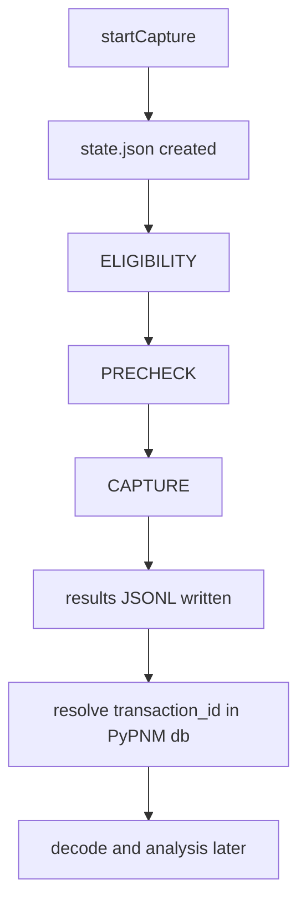

## Agent Review Bundle Summary
- Goal: Document RxMER orchestration as the generic design pattern for future PNM operations.
- Changes: Added a reusable operation framework section describing shared classes, composition boundaries, and inheritance rules for new operations.
- Files: docs/api/fast-api/pypnm-cmts/sg-operations.md
- Tests: mkdocs build -s (pass).
- Notes: Pattern anchors future operations to api/common/operations shared models/store/runner with thin router/service per operation.

# FILE: docs/api/fast-api/pypnm-cmts/sg-operations.md
<!-- SPDX-License-Identifier: Apache-2.0 -->
<!-- Copyright (c) 2026 Maurice Garcia -->

# SG Operations Data Model

This document describes the on-disk layout for PyPNM-CMTS serving-group operations and how orchestration records link to PyPNM capture artifacts and transaction records.

## PyPNM-CMTS On-Disk Layout

```
.data/sg_operations
└── <sg_operation_id>
    ├── state.json
    ├── request_context.json
    ├── cancel.flag
    └── results
        ├── sg-<sg_id>.jsonl
        └── ...
```

- `state.json` stores operation state, counters, timestamps, and the request summary.
- `request_context.json` stores optional TFTP/SNMP override context for the run.
- `cancel.flag` indicates cooperative cancellation has been requested.
- `results/sg-<sg_id>.jsonl` stores per-modem stage outcomes and pointers to PyPNM capture artifacts.

## Relationship To PyPNM Artifacts And Transactions

- PyPNM owns binary capture artifacts under `.data/pnm/`.
- PyPNM owns the authoritative transaction database under `.data/db/transactions.json`.
- PyPNM-CMTS stores orchestration results only. Linkage records reference PyPNM artifacts via:
  - `transaction_id` (primary pointer)
  - `filename` (secondary pointer)

Results processing resolves artifacts by transaction_id using the PyPNM transaction database and then performs decode/analysis in a later phase.

## Cancellation Semantics

- The cancel endpoint creates `cancel.flag` and updates operation state to `CANCELLING`.
- The runner observes `cancel.flag` and transitions the operation to `CANCELLED`.
- Results and status can be queried at any point during cancellation.

## Runner-Level Failures

The runner may synthesize stage results when a per-modem timeout or internal exception occurs. In those cases:

- `ELIGIBILITY` and `PRECHECK` may be marked successful even if they did not run.
- `CAPTURE` carries the failure status and a normalized `failure_reason` when the runner can determine it.
- Worker-reported failures keep `failure_reason` unset unless the worker provides a reliable mapping.

## Status Types

- Orchestration responses use numeric `ServiceStatusCode` values.
- `PnmCaptureStatus` exists for other capture workflows and is not used in the RxMER orchestration responses.

## Traceability Flow

- `startCapture` creates the CMTS operation state and schedules work.
- Per-modem stages run in order:
  - `ELIGIBILITY` (local CMTS orchestration)
  - `PRECHECK` (PyPNM precheck)
  - `CAPTURE` (PyPNM set_and_go returns transaction_id and filename)
- CMTS stores per-modem stage outcomes and pointers in `results/sg-<sg_id>.jsonl`.
- A later results workflow resolves transaction records from PyPNM and runs decode/analysis.



## Generic PNM Operation Design Pattern

This is the standard pattern for all CMTS-side PNM operations. RxMER is the first implementation and future operations should inherit and compose the same common operation classes.

### Core Shared Classes

- `src/pypnm_cmts/api/common/operations/models.py` is the shared operation contract for state, counters, request summary, context, stage records, and results summaries.
- `src/pypnm_cmts/api/common/operations/store.py` is the filesystem-backed authority for operation state, cancellation flags, request context, and JSONL result records.
- `src/pypnm_cmts/api/common/operations/runner.py` is the generic lifecycle executor for queue, run, retry, timeout, cancel, and terminal state transitions.

### Concrete Operation Composition

- `router.py` remains routing glue only and delegates to a service class.
- `service.py` maps endpoint payloads into generic operation models, creates operation state, starts the runner, and serves status/results/cancel.
- `worker` logic implements operation-specific stage behavior while returning generic `OperationStageResultModel` records.
- stage outputs always persist through the shared `OperationStore` JSON/JSONL contract.

### Inheritance Rules For New Operations

- Reuse the shared operation models, store, and runner from `api/common/operations`.
- Implement only operation-specific request schema, stage execution, and response mapping in the route folder.
- Keep operation lifecycle semantics identical: `QUEUED` -> `RUNNING` -> `COMPLETED` or `FAILED` with `CANCELLING`/`CANCELLED` support.
- Preserve the same traceability model: stage results point to PyPNM transaction metadata, while PyPNM remains authoritative for artifacts and transaction records.
