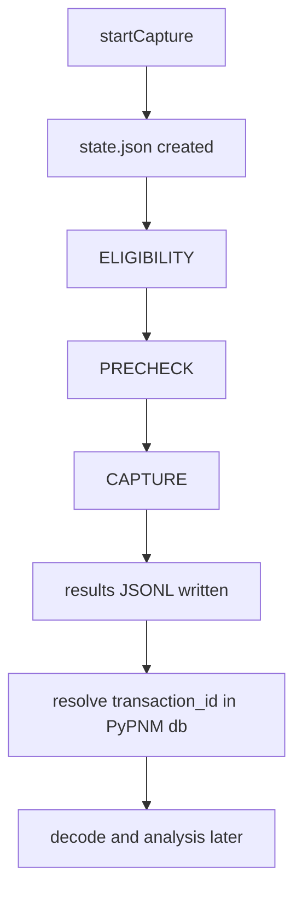

## Agent Review Bundle Summary
- Goal: Emit operation-completed INFO logs with terminal status for generic PNM operations, and retain current RxMER wildcard/design updates.
- Changes: Added generic runner terminal-state log line for COMPLETED/FAILED/CANCELLED; existing startCapture log and wildcard scope logic remain; documented generic operation pattern.
- Files: src/pypnm_cmts/api/common/operations/runner.py, src/pypnm_cmts/api/routes/pnm/sg/ds/ofdm/rxmer/service.py, tests/test_rxmer_orchestration.py, docs/api/fast-api/pypnm-cmts/sg-operations.md
- Tests: ruff check src/pypnm_cmts/api/common/operations/runner.py (pass); ruff check src/pypnm_cmts/api/routes/pnm/sg/ds/ofdm/rxmer/service.py tests/test_rxmer_orchestration.py (pass); pytest -q tests/test_rxmer_orchestration.py tests/test_rxmer_pnm_artifacts.py (25 passed); mkdocs build -s (pass).
- Notes: Terminal log format is operation terminal operation_id=<id> state=<completed|failed|cancelled> total=<n> success=<n> failed=<n> completed=<n>.

# FILE: src/pypnm_cmts/api/common/operations/runner.py
# SPDX-License-Identifier: Apache-2.0
# Copyright (c) 2026 Maurice Garcia

from __future__ import annotations

import logging
import threading
import time
from collections.abc import Callable
from concurrent.futures import FIRST_COMPLETED, Future, ThreadPoolExecutor, wait

from pydantic import BaseModel, Field
from pypnm.api.routes.common.service.status_codes import ServiceStatusCode
from pypnm.lib.types import InetAddressStr, MacAddressStr, TimestampSec
from pypnm.lib.utils import Generate, TimeUnit

from pypnm_cmts.api.common.operations.models import (
    OperationErrorSummaryModel,
    OperationExecutionModel,
    OperationStageResultModel,
    OperationStateModel,
    OperationTimestampsModel,
    PerModemLinkageRecordModel,
)
from pypnm_cmts.api.common.operations.store import OperationStore
from pypnm_cmts.lib.constants import (
    OperationStage,
    OperationState,
    PnmCaptureFailureReason,
)
from pypnm_cmts.lib.types import PnmCaptureOperationId, ServiceGroupId

DEFAULT_WORKER_DELAY_SECONDS = 0.01
DEFAULT_CANCEL_GRACE_SECONDS = 1.0
DEFAULT_POLL_INTERVAL_SECONDS = 0.05
DEFAULT_OVERALL_TIMEOUT_MESSAGE = "overall timeout exceeded"
DEFAULT_PER_MODEM_TIMEOUT_MESSAGE = "per-modem timeout exceeded"


class OperationWorkerResultModel(BaseModel):
    """Result payload returned by per-modem worker functions."""

    ip_address: InetAddressStr | None = Field(default=None, description="Resolved modem IP address, if available.")
    stages: list[OperationStageResultModel] = Field(
        default_factory=list,
        description="Per-stage execution results for the modem.",
    )


class OperationWorkItemModel(BaseModel):
    """Work item describing a single modem execution."""

    operation_id: PnmCaptureOperationId = Field(..., description="Parent operation identifier.")
    sg_id: ServiceGroupId = Field(..., description="Serving group identifier.")
    mac_address: MacAddressStr = Field(..., description="Cable modem MAC address.")
    attempt: int = Field(default=0, ge=0, description="Attempt index for retry tracking.")


class OperationRunner:
    """Background runner that executes operation work in a thread."""

    def __init__(
        self,
        store: OperationStore,
        worker: Callable[[OperationWorkItemModel], OperationWorkerResultModel] | None = None,
        cancel_grace_seconds: float = DEFAULT_CANCEL_GRACE_SECONDS,
        poll_interval_seconds: float = DEFAULT_POLL_INTERVAL_SECONDS,
    ) -> None:
        self._store = store
        self._worker = worker or self._default_worker
        self._cancel_grace_seconds = cancel_grace_seconds
        self._poll_interval_seconds = poll_interval_seconds
        self._lock = threading.Lock()
        self._threads: dict[PnmCaptureOperationId, threading.Thread] = {}
        self.logger = logging.getLogger(f"{self.__class__.__name__}")

    def start(self, operation_id: PnmCaptureOperationId) -> bool:
        """Start background execution for the operation if not already running."""
        with self._lock:
            existing = self._threads.get(operation_id)
            if existing is not None and existing.is_alive():
                return False
            thread = threading.Thread(
                target=self._run_operation,
                args=(operation_id,),
                daemon=True,
            )
            self._threads[operation_id] = thread
            thread.start()
            return True

    def is_running(self, operation_id: PnmCaptureOperationId) -> bool:
        """Return whether a background thread is active for the operation."""
        with self._lock:
            thread = self._threads.get(operation_id)
            if thread is None:
                return False
            return thread.is_alive()

    def request_cancel(self, operation_id: PnmCaptureOperationId) -> OperationStateModel:
        """Request cooperative cancellation via the store."""
        return self._store.request_cancel(operation_id)

    def _run_operation(self, operation_id: PnmCaptureOperationId) -> None:
        try:
            self._execute_operation(operation_id)
        except Exception as exc:
            self.logger.exception("operation runner failed for %s", operation_id)
            self._mark_failed(operation_id, str(exc))
        finally:
            self._cleanup(operation_id)

    def _execute_operation(self, operation_id: PnmCaptureOperationId) -> None:
        state = self._store.load_state(operation_id)
        state = self._transition_to_running(state)
        self._store.save_state_atomic(state)

        request_summary = state.request_summary
        execution = request_summary.execution
        macs = list(request_summary.mac_addresses)
        sg_ids = list(request_summary.serving_group_ids)

        if not macs or not sg_ids:
            self._mark_completed(state, operation_id, counters_total=0)
            return

        total_modems = len(macs)
        state = state.model_copy(update={"counters": state.counters.model_copy(update={"total_modems": total_modems})})
        self._store.save_state_atomic(state)

        work_items = self._build_work_items(operation_id, macs, sg_ids)
        overall_deadline = time.monotonic() + execution.overall_timeout_seconds

        executor = ThreadPoolExecutor(max_workers=execution.max_workers)
        pending: dict[Future, tuple[OperationWorkItemModel, float]] = {}
        abandoned: dict[Future, tuple[OperationWorkItemModel, float]] = {}
        queue: list[OperationWorkItemModel] = list(work_items)
        retry_queue: list[tuple[float, OperationWorkItemModel]] = []
        cancelled = False
        failed = False
        try:
            while queue or pending or abandoned or retry_queue:
                if self._store.is_cancel_requested(operation_id):
                    cancelled = True
                    self._cancel_remaining(list(pending.keys()) + list(abandoned.keys()), executor, overall_deadline)
                    return
                if time.monotonic() >= overall_deadline:
                    failed = True
                    self._cancel_remaining(list(pending.keys()) + list(abandoned.keys()), executor, overall_deadline)
                    return

                now = time.monotonic()
                ready_retries = [(ready_at, item) for (ready_at, item) in retry_queue if ready_at <= now]
                if ready_retries:
                    retry_queue = [(ready_at, item) for (ready_at, item) in retry_queue if ready_at > now]
                    ready_retries.sort(key=lambda entry: entry[0])
                    for _, item in ready_retries:
                        queue.append(item)

                in_flight = len(pending) + len(abandoned)
                while queue and in_flight < execution.max_workers:
                    item = queue.pop(0)
                    future = executor.submit(self._execute_modem, item)
                    pending[future] = (item, time.monotonic())
                    in_flight = len(pending) + len(abandoned)

                futures = list(pending.keys()) + list(abandoned.keys())
                if not futures:
                    time.sleep(self._poll_interval_seconds)
                    continue

                done, _ = wait(
                    futures,
                    timeout=self._poll_interval_seconds,
                    return_when=FIRST_COMPLETED,
                )

                now = time.monotonic()
                timed_out: list[Future] = []
                for future, (_, start_time) in pending.items():
                    if future.done():
                        continue
                    if now - start_time >= execution.per_modem_timeout_seconds:
                        timed_out.append(future)

                for future in timed_out:
                    item, start_time = pending.pop(future)
                    abandoned[future] = (item, start_time)
                    future.cancel()
                    result = self._timeout_result()
                    state = self._handle_result(operation_id, state, item, result, execution, retry_queue)
                    if state.state in {OperationState.CANCELLED, OperationState.FAILED}:
                        return

                for future in done:
                    if future in abandoned:
                        abandoned.pop(future, None)
                        continue

                    pending_item = pending.pop(future, None)
                    if pending_item is None:
                        continue

                    item, _ = pending_item
                    result = self._resolve_future_result(future)
                    state = self._handle_result(operation_id, state, item, result, execution, retry_queue)
                    if state.state in {OperationState.CANCELLED, OperationState.FAILED}:
                        return
        finally:
            if cancelled:
                executor.shutdown(wait=False, cancel_futures=True)
                self._mark_cancelled(operation_id)
            elif failed:
                executor.shutdown(wait=False, cancel_futures=True)
                self._mark_failed(operation_id, DEFAULT_OVERALL_TIMEOUT_MESSAGE)
            else:
                executor.shutdown(wait=True)

        if cancelled or failed:
            return

        terminal_state = OperationState.COMPLETED
        if state.counters.failed > 0:
            terminal_state = OperationState.FAILED
        state = state.model_copy(
            update={
                "state": terminal_state,
                "timestamps": self._finish_timestamps(state.timestamps),
                "error_summary": None,
            }
        )
        self._store.save_state_atomic(state)
        self._log_terminal_state(state)

    def _execute_modem(self, item: OperationWorkItemModel) -> OperationWorkerResultModel:
        return self._worker(item)

    def _default_worker(self, item: OperationWorkItemModel) -> OperationWorkerResultModel:
        started_epoch = self._now_epoch()
        time.sleep(DEFAULT_WORKER_DELAY_SECONDS)
        finished_epoch = self._now_epoch()
        return OperationWorkerResultModel(
            stages=self._build_stage_results(
                status_code=ServiceStatusCode.SUCCESS,
                message="completed",
                started_epoch=started_epoch,
                finished_epoch=finished_epoch,
            ),
        )

    def _resolve_future_result(
        self,
        future: Future,
    ) -> OperationWorkerResultModel:
        try:
            return future.result()
        except Exception as exc:
            return self._failure_result(str(exc))

    def _persist_stage_records(
        self,
        operation_id: PnmCaptureOperationId,
        item: OperationWorkItemModel,
        result: OperationWorkerResultModel,
    ) -> None:
        for stage_result in result.stages:
            record = PerModemLinkageRecordModel(
                pnm_capture_operation_id=operation_id,
                sg_id=item.sg_id,
                mac_address=item.mac_address,
                ip_address=result.ip_address,
                stage=stage_result.stage,
                status_code=stage_result.status_code,
                failure_reason=stage_result.failure_reason,
                transaction_ids=list(stage_result.transaction_ids),
                filenames=list(stage_result.filenames),
                started_epoch=stage_result.started_epoch,
                finished_epoch=stage_result.finished_epoch,
                message=stage_result.message,
            )
            self._store.append_result_record(record)

    def _update_counters(self, state: OperationStateModel, result: OperationWorkerResultModel) -> OperationStateModel:
        counters = state.counters
        eligibility = self._find_stage(result, OperationStage.ELIGIBILITY)
        precheck = self._find_stage(result, OperationStage.PRECHECK)
        capture = self._find_stage(result, OperationStage.CAPTURE)
        if eligibility is not None and eligibility.status_code == ServiceStatusCode.SUCCESS:
            counters = counters.model_copy(update={"eligible_modems": counters.eligible_modems + 1})
        if precheck is not None and precheck.status_code == ServiceStatusCode.SUCCESS:
            counters = counters.model_copy(update={"precheck_passed": counters.precheck_passed + 1})
        if capture is not None:
            counters = counters.model_copy(update={"capture_started": counters.capture_started + 1})
        counters = counters.model_copy(
            update={
                "completed": counters.completed + 1,
            }
        )
        final_status = self._final_status_code(result)
        if final_status == ServiceStatusCode.SUCCESS:
            counters = counters.model_copy(update={"success": counters.success + 1})
        else:
            counters = counters.model_copy(update={"failed": counters.failed + 1})
        return state.model_copy(update={"counters": counters})

    def _cancel_remaining(
        self,
        futures: list[Future],
        executor: ThreadPoolExecutor,
        deadline: float,
    ) -> None:
        for future in futures:
            future.cancel()
        remaining = max(0.0, deadline - time.monotonic())
        wait_limit = min(self._cancel_grace_seconds, remaining)
        if wait_limit <= 0:
            return
        end = time.monotonic() + wait_limit
        while time.monotonic() < end:
            if all(f.done() for f in futures):
                return
            time.sleep(self._poll_interval_seconds)
        executor.shutdown(wait=False, cancel_futures=True)

    def _mark_cancelled(self, operation_id: PnmCaptureOperationId) -> None:
        state = self._store.load_state(operation_id)
        state = state.model_copy(
            update={
                "state": OperationState.CANCELLED,
                "timestamps": self._finish_timestamps(state.timestamps),
                "error_summary": None,
            }
        )
        self._store.save_state_atomic(state)
        self._log_terminal_state(state)

    def _mark_failed(self, operation_id: PnmCaptureOperationId, message: str) -> None:
        state = self._store.load_state(operation_id)
        state = state.model_copy(
            update={
                "state": OperationState.FAILED,
                "timestamps": self._finish_timestamps(state.timestamps),
                "error_summary": OperationErrorSummaryModel(message=message, detail=""),
            }
        )
        self._store.save_state_atomic(state)
        self._log_terminal_state(state)

    def _mark_completed(
        self,
        state: OperationStateModel,
        operation_id: PnmCaptureOperationId,
        counters_total: int,
    ) -> None:
        updated = state.model_copy(
            update={
                "state": OperationState.COMPLETED,
                "counters": state.counters.model_copy(update={"total_modems": counters_total}),
                "timestamps": self._finish_timestamps(state.timestamps),
                "error_summary": None,
            }
        )
        self._store.save_state_atomic(updated)
        self._log_terminal_state(updated)

    def _transition_to_running(self, state: OperationStateModel) -> OperationStateModel:
        timestamps = state.timestamps
        if timestamps.started_epoch == TimestampSec(0):
            timestamps = timestamps.model_copy(update={"started_epoch": self._now_epoch()})
        timestamps = self._touch_timestamp(timestamps)
        return state.model_copy(update={"state": OperationState.RUNNING, "timestamps": timestamps})

    def _finish_timestamps(self, timestamps: OperationTimestampsModel) -> OperationTimestampsModel:
        now_epoch = self._now_epoch()
        return timestamps.model_copy(
            update={
                "updated_epoch": now_epoch,
                "finished_epoch": now_epoch,
            }
        )

    def _touch_timestamp(self, timestamps: OperationTimestampsModel) -> OperationTimestampsModel:
        return timestamps.model_copy(update={"updated_epoch": self._now_epoch()})

    def _build_work_items(
        self,
        operation_id: PnmCaptureOperationId,
        macs: list[MacAddressStr],
        sg_ids: list[ServiceGroupId],
    ) -> list[OperationWorkItemModel]:
        items: list[OperationWorkItemModel] = []
        sg_count = len(sg_ids)
        for index, mac in enumerate(macs):
            sg_id = sg_ids[index % sg_count]
            items.append(
                OperationWorkItemModel(
                    operation_id=operation_id,
                    sg_id=sg_id,
                    mac_address=mac,
                    attempt=0,
                )
            )
        return items

    def _handle_result(
        self,
        operation_id: PnmCaptureOperationId,
        state: OperationStateModel,
        item: OperationWorkItemModel,
        result: OperationWorkerResultModel,
        execution: OperationExecutionModel,
        retry_queue: list[tuple[float, OperationWorkItemModel]],
    ) -> OperationStateModel:
        final_status = self._final_status_code(result)
        if final_status != ServiceStatusCode.SUCCESS and item.attempt < execution.retry_count:
            retry_item = item.model_copy(update={"attempt": item.attempt + 1})
            ready_at = time.monotonic() + execution.retry_delay_seconds
            retry_queue.append((ready_at, retry_item))
            updated = state.model_copy(update={"timestamps": self._touch_timestamp(state.timestamps)})
            self._store.save_state_atomic(updated)
            return updated

        self._persist_stage_records(operation_id, item, result)
        updated = self._update_counters(state, result)
        updated = updated.model_copy(update={"timestamps": self._touch_timestamp(updated.timestamps)})
        self._store.save_state_atomic(updated)
        return updated

    def _timeout_result(self) -> OperationWorkerResultModel:
        now_epoch = self._now_epoch()
        timeout_status = getattr(ServiceStatusCode, "MEASUREMENT_TIMEOUT", ServiceStatusCode.FAILURE)
        return OperationWorkerResultModel(
            stages=self._build_stage_results(
                status_code=timeout_status,
                message=DEFAULT_PER_MODEM_TIMEOUT_MESSAGE,
                started_epoch=now_epoch,
                finished_epoch=now_epoch,
                capture_only=True,
                failure_reason=PnmCaptureFailureReason.PER_MODEM_TIMEOUT,
            ),
        )

    def _failure_result(self, message: str) -> OperationWorkerResultModel:
        now_epoch = self._now_epoch()
        return OperationWorkerResultModel(
            stages=self._build_stage_results(
                status_code=ServiceStatusCode.FAILURE,
                message=message,
                started_epoch=now_epoch,
                finished_epoch=now_epoch,
                capture_only=True,
                failure_reason=PnmCaptureFailureReason.UNKNOWN,
            ),
        )

    def _build_stage_results(
        self,
        status_code: ServiceStatusCode,
        message: str,
        started_epoch: TimestampSec,
        finished_epoch: TimestampSec,
        capture_only: bool = False,
        failure_reason: PnmCaptureFailureReason | None = None,
    ) -> list[OperationStageResultModel]:
        capture_result = OperationStageResultModel(
            stage=OperationStage.CAPTURE,
            status_code=status_code,
            transaction_ids=[],
            filenames=[],
            failure_reason=failure_reason,
            message=message,
            started_epoch=started_epoch,
            finished_epoch=finished_epoch,
        )
        if capture_only:
            return [
                OperationStageResultModel(
                    stage=OperationStage.ELIGIBILITY,
                    status_code=ServiceStatusCode.SUCCESS,
                    transaction_ids=[],
                    filenames=[],
                    failure_reason=None,
                    message="",
                    started_epoch=started_epoch,
                    finished_epoch=finished_epoch,
                ),
                OperationStageResultModel(
                    stage=OperationStage.PRECHECK,
                    status_code=ServiceStatusCode.SUCCESS,
                    transaction_ids=[],
                    filenames=[],
                    failure_reason=None,
                    message="",
                    started_epoch=started_epoch,
                    finished_epoch=finished_epoch,
                ),
                capture_result,
            ]
        return [
            OperationStageResultModel(
                stage=OperationStage.ELIGIBILITY,
                status_code=status_code,
                transaction_ids=[],
                filenames=[],
                failure_reason=failure_reason,
                message=message,
                started_epoch=started_epoch,
                finished_epoch=finished_epoch,
            ),
            OperationStageResultModel(
                stage=OperationStage.PRECHECK,
                status_code=status_code,
                transaction_ids=[],
                filenames=[],
                failure_reason=failure_reason,
                message=message,
                started_epoch=started_epoch,
                finished_epoch=finished_epoch,
            ),
            capture_result,
        ]

    @staticmethod
    def _find_stage(
        result: OperationWorkerResultModel,
        stage: OperationStage,
    ) -> OperationStageResultModel | None:
        for stage_result in result.stages:
            if stage_result.stage == stage:
                return stage_result
        return None

    def _final_status_code(self, result: OperationWorkerResultModel) -> ServiceStatusCode:
        capture = self._find_stage(result, OperationStage.CAPTURE)
        if capture is not None:
            return capture.status_code
        precheck = self._find_stage(result, OperationStage.PRECHECK)
        if precheck is not None:
            return precheck.status_code
        eligibility = self._find_stage(result, OperationStage.ELIGIBILITY)
        if eligibility is not None:
            return eligibility.status_code
        return ServiceStatusCode.FAILURE

    @staticmethod
    def _now_epoch() -> TimestampSec:
        return TimestampSec(Generate.time_stamp(unit=TimeUnit.SECONDS))

    def _cleanup(self, operation_id: PnmCaptureOperationId) -> None:
        with self._lock:
            self._threads.pop(operation_id, None)

    def _log_terminal_state(self, state: OperationStateModel) -> None:
        self.logger.info(
            "operation terminal operation_id=%s state=%s total=%s success=%s failed=%s completed=%s",
            state.operation_id,
            state.state.value,
            state.counters.total_modems,
            state.counters.success,
            state.counters.failed,
            state.counters.completed,
        )


__all__ = [
    "OperationRunner",
    "OperationWorkerResultModel",
    "OperationWorkItemModel",
]

# FILE: src/pypnm_cmts/api/routes/pnm/sg/ds/ofdm/rxmer/service.py
# SPDX-License-Identifier: Apache-2.0
# Copyright (c) 2026 Maurice Garcia

from __future__ import annotations

import asyncio
import logging
from collections.abc import Callable

from pypnm.api.routes.common.classes.operation.cable_modem_precheck import (
    CableModemServicePreCheck,
)
from pypnm.api.routes.common.extended.common_measure_schema import (
    DownstreamOfdmParameters,
)
from pypnm.api.routes.common.extended.common_messaging_service import (
    MessagePayload,
    MessageResponse,
    MessageResponseType,
)
from pypnm.api.routes.common.service.status_codes import ServiceStatusCode
from pypnm.api.routes.docs.pnm.ds.ofdm.rxmer.service import CmDsOfdmRxMerService
from pypnm.config.pnm_config_manager import PnmConfigManager
from pypnm.docsis.cable_modem import CableModem
from pypnm.lib.inet import Inet
from pypnm.lib.mac_address import MacAddress
from pypnm.lib.types import (
    ChannelId,
    FileNameStr,
    InetAddressStr,
    MacAddressStr,
    TimestampSec,
    TransactionId,
)
from pypnm.lib.utils import Generate, TimeUnit

from pypnm_cmts.api.common.cmts_request import CmtsRequestEnvelopeModel
from pypnm_cmts.api.common.operations.models import (
    OperationExecutionModel,
    OperationRequestContextModel,
    OperationRequestSummaryModel,
    OperationResultsSummaryModel,
    OperationStageResultModel,
)
from pypnm_cmts.api.common.operations.runner import (
    OperationRunner,
    OperationWorkerResultModel,
    OperationWorkItemModel,
)
from pypnm_cmts.api.common.operations.store import OperationStore
from pypnm_cmts.api.routes.pnm.sg.ds.ofdm.rxmer.schemas import (
    RxMerServiceGroupCancelResponse,
    RxMerServiceGroupOperationRequest,
    RxMerServiceGroupResultsResponse,
    RxMerServiceGroupStartCaptureRequest,
    RxMerServiceGroupStartCaptureResponse,
    RxMerServiceGroupStatusResponse,
)
from pypnm_cmts.lib.constants import OperationStage, OperationState
from pypnm_cmts.lib.types import PnmCaptureOperationId, ServiceGroupId
from pypnm_cmts.sgw.models import SgwCableModemModel
from pypnm_cmts.sgw.runtime_state import get_sgw_store
from pypnm_cmts.sgw.store import SgwCacheStore

DEFAULT_MAX_INLINE_RECORDS = 250
NOT_FOUND_MESSAGE = "operation not found"
CLEAR_MESSAGE = ""
PRECHECK_FAILURE_MESSAGE = "precheck failed"
MISSING_IP_MESSAGE = "modem ip address missing"
NO_MESSAGE_RESPONSE = "capture returned no message response"
MISSING_TRANSACTION_MESSAGE = "missing transaction_id or filename"

CaptureExecutor = Callable[
    [CableModem, DownstreamOfdmParameters | None, tuple[Inet, Inet], str],
    MessageResponse,
]
PrecheckExecutor = Callable[[CableModem], tuple[ServiceStatusCode, str]]


class RxMerCaptureWorker:
    """Execute eligibility, precheck, and capture stages for a single modem."""

    def __init__(
        self,
        store: OperationStore,
        capture_executor: CaptureExecutor,
        precheck_executor: PrecheckExecutor,
        sgw_store: SgwCacheStore | None,
    ) -> None:
        self._store = store
        self._capture_executor = capture_executor
        self._precheck_executor = precheck_executor
        self._sgw_store = sgw_store
        self.logger = logging.getLogger(f"{self.__class__.__name__}")

    def __call__(self, item: OperationWorkItemModel) -> OperationWorkerResultModel:
        """Run eligibility, precheck, and capture for a modem work item."""
        state = self._store.load_state(item.operation_id)
        request_summary = state.request_summary
        request_context = self._store.load_request_context(item.operation_id)
        ip_address = self._resolve_modem_ip(item.sg_id, item.mac_address)
        now_epoch = self._now_epoch()
        stages: list[OperationStageResultModel] = []
        eligibility_result = OperationStageResultModel(
            stage=OperationStage.ELIGIBILITY,
            status_code=ServiceStatusCode.SUCCESS if ip_address is not None else ServiceStatusCode.INVALID_CAPTURE_PARAMETERS,
            transaction_ids=[],
            filenames=[],
            message="" if ip_address is not None else MISSING_IP_MESSAGE,
            started_epoch=now_epoch,
            finished_epoch=now_epoch,
        )
        stages.append(eligibility_result)
        if eligibility_result.status_code != ServiceStatusCode.SUCCESS:
            return OperationWorkerResultModel(ip_address=ip_address, stages=stages)

        write_community = self._resolve_write_community(request_context)
        cm = CableModem(
            mac_address=MacAddress(item.mac_address),
            inet=Inet(InetAddressStr(ip_address)),
            write_community=write_community,
        )
        precheck_status, precheck_message = self._precheck_executor(cm)
        precheck_result = OperationStageResultModel(
            stage=OperationStage.PRECHECK,
            status_code=precheck_status,
            transaction_ids=[],
            filenames=[],
            message=precheck_message,
            started_epoch=now_epoch,
            finished_epoch=now_epoch,
        )
        stages.append(precheck_result)
        if precheck_status != ServiceStatusCode.SUCCESS:
            return OperationWorkerResultModel(ip_address=ip_address, stages=stages)

        capture_result = self._run_capture(
            operation_id=item.operation_id,
            sg_id=item.sg_id,
            mac_address=item.mac_address,
            cable_modem=cm,
            channel_ids=list(request_summary.channel_ids),
            request_context=request_context,
        )
        stages.append(capture_result)
        return OperationWorkerResultModel(ip_address=ip_address, stages=stages)

    def _resolve_modem_ip(
        self,
        sg_id: ServiceGroupId,
        mac_address: MacAddressStr,
    ) -> InetAddressStr | None:
        store = self._sgw_store
        if store is None:
            return None
        entry = store.get_entry(sg_id)
        if entry is None:
            return None
        for modem in entry.snapshot.cable_modems:
            if modem.mac != mac_address:
                continue
            ip_value = self._select_ip(modem)
            if ip_value is None:
                return None
            try:
                return InetAddressStr(str(Inet(ip_value)))
            except Exception:
                return None
        return None

    @staticmethod
    def _select_ip(modem: SgwCableModemModel) -> str | None:
        ipv4 = str(modem.ipv4).strip()
        if ipv4 not in {"", "0.0.0.0"}:
            return ipv4
        ipv6 = str(modem.ipv6).strip()
        if ipv6 not in {"", "::"}:
            return ipv6
        return None

    @staticmethod
    def _resolve_write_community(context: OperationRequestContextModel | None) -> str:
        if context is None or context.snmp_write_community is None:
            return PnmConfigManager.get_write_community()
        return str(context.snmp_write_community)

    def _run_capture(
        self,
        operation_id: PnmCaptureOperationId,
        sg_id: ServiceGroupId,
        mac_address: MacAddressStr,
        cable_modem: CableModem,
        channel_ids: list[ChannelId],
        request_context: OperationRequestContextModel | None,
    ) -> OperationStageResultModel:
        interface_parameters = None
        if channel_ids:
            interface_parameters = DownstreamOfdmParameters(channel_id=list(channel_ids))
        tftp_servers = self._resolve_tftp_servers(request_context)
        tftp_path = PnmConfigManager.get_tftp_path()
        capture_response = self._capture_executor(cable_modem, interface_parameters, tftp_servers, tftp_path)
        status_code, transaction_id, filename, message = self._parse_capture_response(capture_response)
        created_epoch = self._now_epoch()
        final_transaction_ids: list[TransactionId] = []
        final_filenames: list[FileNameStr] = []
        final_message = message
        if status_code == ServiceStatusCode.SUCCESS and filename is not None and transaction_id is not None:
            final_transaction_ids = [transaction_id]
            final_filenames = [filename]
        else:
            final_message = message or MISSING_TRANSACTION_MESSAGE
        return OperationStageResultModel(
            stage=OperationStage.CAPTURE,
            status_code=status_code,
            transaction_ids=final_transaction_ids,
            filenames=final_filenames,
            message=final_message,
            started_epoch=created_epoch,
            finished_epoch=created_epoch,
        )

    @staticmethod
    def _resolve_tftp_servers(context: OperationRequestContextModel | None) -> tuple[Inet, Inet]:
        default_v4, default_v6 = PnmConfigManager.get_tftp_servers()
        ipv4 = default_v4 if context is None or context.tftp_ipv4 is None else Inet(str(context.tftp_ipv4))
        ipv6 = default_v6 if context is None or context.tftp_ipv6 is None else Inet(str(context.tftp_ipv6))
        return (ipv4, ipv6)

    @staticmethod
    def _parse_capture_response(
        response: MessageResponse | None,
    ) -> tuple[ServiceStatusCode, TransactionId | None, FileNameStr | None, str]:
        if response is None:
            return (ServiceStatusCode.FAILURE, None, None, NO_MESSAGE_RESPONSE)
        status_code = response.status
        if status_code != ServiceStatusCode.SUCCESS:
            return (status_code, None, None, f"{status_code.name}")
        payload = response.payload
        if not isinstance(payload, list):
            return (ServiceStatusCode.FAILURE, None, None, MISSING_TRANSACTION_MESSAGE)
        for element in payload:
            message_type, message = RxMerCaptureWorker._extract_payload_entry(element)
            if message_type != MessageResponseType.PNM_FILE_TRANSACTION.name:
                continue
            if not isinstance(message, dict):
                continue
            transaction_id = message.get("transaction_id")
            filename = message.get("filename")
            if transaction_id is None or filename is None:
                continue
            return (
                status_code,
                TransactionId(str(transaction_id)),
                FileNameStr(str(filename)),
                CLEAR_MESSAGE,
            )
        return (ServiceStatusCode.PNM_FILE_TRANSACTION_ID_NOT_FOUND, None, None, MISSING_TRANSACTION_MESSAGE)

    @staticmethod
    def _extract_payload_entry(
        element: MessagePayload | dict[str, object],
    ) -> tuple[str | None, object | None]:
        if isinstance(element, MessagePayload):
            return (element.message_type, element.message)
        if isinstance(element, dict):
            message_type = element.get("message_type")
            message = element.get("message")
            return (
                str(message_type) if message_type is not None else None,
                message,
            )
        return (None, None)

    @staticmethod
    def _now_epoch() -> TimestampSec:
        return TimestampSec(Generate.time_stamp(unit=TimeUnit.SECONDS))


def _run_pypnm_capture(
    cable_modem: CableModem,
    interface_parameters: DownstreamOfdmParameters | None,
    tftp_servers: tuple[Inet, Inet],
    tftp_path: str,
) -> MessageResponse:
    service = CmDsOfdmRxMerService(cable_modem, tftp_servers, tftp_path)
    return asyncio.run(service.set_and_go(interface_parameters=interface_parameters))


class RxMerServiceGroupOperationService:
    """Service layer for SG-level RxMER operation lifecycle endpoints."""

    def __init__(
        self,
        store: OperationStore | None = None,
        runner: OperationRunner | None = None,
        capture_executor: CaptureExecutor | None = None,
        precheck_executor: PrecheckExecutor | None = None,
        sgw_store: SgwCacheStore | None = None,
        max_inline_records: int = DEFAULT_MAX_INLINE_RECORDS,
    ) -> None:
        self._store = store or OperationStore()
        self._capture_executor = capture_executor or _run_pypnm_capture
        self._precheck_executor = precheck_executor or self._run_precheck
        self._sgw_store = sgw_store or get_sgw_store()
        if runner is None:
            worker = RxMerCaptureWorker(
                store=self._store,
                capture_executor=self._capture_executor,
                precheck_executor=self._precheck_executor,
                sgw_store=self._sgw_store,
            )
            runner = OperationRunner(self._store, worker=worker)
        self._runner = runner
        self._max_inline_records = max_inline_records
        self.logger = logging.getLogger(f"{self.__class__.__name__}")

    def start_capture(
        self,
        request: RxMerServiceGroupStartCaptureRequest,
    ) -> RxMerServiceGroupStartCaptureResponse:
        """Create a new SG-level RxMER operation state record."""
        request_summary = self._build_request_summary(request)
        request_context = self._build_request_context(request)
        state = self._store.create_operation(request_summary, request_context)
        self.logger.info(
            "rxmer startCapture queued operation_id=%s scope_sg=%s scope_macs=%s",
            state.operation_id,
            len(state.request_summary.serving_group_ids),
            len(state.request_summary.mac_addresses),
        )
        started = self._runner.start(state.operation_id)
        if not started:
            self.logger.warning("operation runner already active for %s", state.operation_id)
        return RxMerServiceGroupStartCaptureResponse(
            status=ServiceStatusCode.SUCCESS,
            message="",
            operation=state,
        )

    def status(
        self,
        request: RxMerServiceGroupOperationRequest,
    ) -> RxMerServiceGroupStatusResponse:
        """Return the persisted state for an operation."""
        try:
            state = self._store.load_state(request.pnm_capture_operation_id)
        except FileNotFoundError:
            return RxMerServiceGroupStatusResponse(
                status=ServiceStatusCode.FAILURE,
                message=NOT_FOUND_MESSAGE,
                operation=None,
            )
        message = ""
        if state.state == OperationState.COMPLETED and state.counters.total_modems == 0:
            message = "no modems selected"
        return RxMerServiceGroupStatusResponse(
            status=ServiceStatusCode.SUCCESS,
            message=message,
            operation=state,
        )

    def cancel(
        self,
        request: RxMerServiceGroupOperationRequest,
    ) -> RxMerServiceGroupCancelResponse:
        """Request cancellation for an operation."""
        try:
            state = self._runner.request_cancel(request.pnm_capture_operation_id)
        except FileNotFoundError:
            return RxMerServiceGroupCancelResponse(
                status=ServiceStatusCode.FAILURE,
                message=NOT_FOUND_MESSAGE,
                operation=None,
            )
        return RxMerServiceGroupCancelResponse(
            status=ServiceStatusCode.SUCCESS,
            message="",
            operation=state,
        )

    def results(
        self,
        request: RxMerServiceGroupOperationRequest,
    ) -> RxMerServiceGroupResultsResponse:
        """Return linkage records for an operation when available."""
        try:
            self._store.load_state(request.pnm_capture_operation_id)
        except FileNotFoundError:
            return RxMerServiceGroupResultsResponse(
                status=ServiceStatusCode.FAILURE,
                message=NOT_FOUND_MESSAGE,
            )

        files_scanned = self._store.count_result_files(request.pnm_capture_operation_id)
        total_records = self._store.count_result_records(request.pnm_capture_operation_id)
        include_records = total_records <= self._max_inline_records
        records = []
        if include_records:
            records = self._store.load_result_records(request.pnm_capture_operation_id)
        summary = OperationResultsSummaryModel(
            record_count=total_records,
            included_count=len(records),
            files_scanned=files_scanned,
        )
        message = "" if total_records > 0 else "no results recorded"
        return RxMerServiceGroupResultsResponse(
            status=ServiceStatusCode.SUCCESS,
            message=message,
            summary=summary,
            records=records,
        )

    @staticmethod
    def _build_request_context(
        request: RxMerServiceGroupStartCaptureRequest,
    ) -> OperationRequestContextModel:
        cmts = request.cmts
        pnm = cmts.cable_modem.pnm_parameters
        tftp = pnm.tftp if pnm is not None else None
        snmp = cmts.cable_modem.snmp
        snmp_v2c = snmp.snmpV2C if snmp is not None else None
        return OperationRequestContextModel(
            tftp_ipv4=tftp.ipv4 if tftp is not None else None,
            tftp_ipv6=tftp.ipv6 if tftp is not None else None,
            snmp_write_community=snmp_v2c.community if snmp_v2c is not None else None,
        )

    @staticmethod
    def _run_precheck(cable_modem: CableModem) -> tuple[ServiceStatusCode, str]:
        try:
            return asyncio.run(
                CableModemServicePreCheck(cable_modem=cable_modem, validate_ofdm_exist=True).run_precheck()
            )
        except Exception as exc:
            return (ServiceStatusCode.FAILURE, f"{PRECHECK_FAILURE_MESSAGE}: {exc}")

    def _build_request_summary(
        self,
        request: RxMerServiceGroupStartCaptureRequest,
    ) -> OperationRequestSummaryModel:
        cmts = request.cmts
        channel_ids = RxMerServiceGroupOperationService._resolve_channel_ids(cmts)
        requested_sg_ids = list(cmts.serving_group.id)
        requested_mac_addresses = list(cmts.cable_modem.mac_address)
        serving_group_ids, mac_addresses = self._resolve_modem_scope(requested_sg_ids, requested_mac_addresses)
        execution = request.execution
        return OperationRequestSummaryModel(
            serving_group_ids=serving_group_ids,
            mac_addresses=mac_addresses,
            channel_ids=channel_ids,
            execution=OperationExecutionModel(
                max_workers=execution.max_workers,
                retry_count=execution.retry_count,
                retry_delay_seconds=execution.retry_delay_seconds,
                per_modem_timeout_seconds=execution.per_modem_timeout_seconds,
                overall_timeout_seconds=execution.overall_timeout_seconds,
            ),
        )

    def _resolve_modem_scope(
        self,
        requested_sg_ids: list[ServiceGroupId],
        requested_mac_addresses: list[MacAddressStr],
    ) -> tuple[list[ServiceGroupId], list[MacAddressStr]]:
        if requested_sg_ids and requested_mac_addresses:
            return requested_sg_ids, requested_mac_addresses
        store = self._sgw_store if self._sgw_store is not None else get_sgw_store()
        if store is None:
            return requested_sg_ids, requested_mac_addresses
        if self._sgw_store is None:
            self._sgw_store = store

        sg_ids = requested_sg_ids if requested_sg_ids else store.get_ids()
        if not sg_ids:
            return ([], [])

        cache_entries = self._load_cache_entries(sg_ids)
        if requested_mac_addresses:
            return self._expand_macs_with_wildcard_sg(requested_mac_addresses, cache_entries)
        return self._expand_modems_for_sgs(cache_entries)

    def _load_cache_entries(
        self,
        sg_ids: list[ServiceGroupId],
    ) -> list[tuple[ServiceGroupId, list[SgwCableModemModel]]]:
        entries: list[tuple[ServiceGroupId, list[SgwCableModemModel]]] = []
        store = self._sgw_store
        if store is None:
            return entries
        for sg_id in sg_ids:
            entry = store.get_entry(sg_id)
            if entry is None:
                continue
            entries.append((sg_id, list(entry.snapshot.cable_modems)))
        return entries

    @staticmethod
    def _expand_macs_with_wildcard_sg(
        requested_mac_addresses: list[MacAddressStr],
        cache_entries: list[tuple[ServiceGroupId, list[SgwCableModemModel]]],
    ) -> tuple[list[ServiceGroupId], list[MacAddressStr]]:
        mac_to_sg_ids: dict[MacAddressStr, list[ServiceGroupId]] = {}
        for sg_id, cable_modems in cache_entries:
            for cable_modem in cable_modems:
                if cable_modem.mac not in mac_to_sg_ids:
                    mac_to_sg_ids[cable_modem.mac] = []
                mac_to_sg_ids[cable_modem.mac].append(sg_id)

        expanded_sg_ids: list[ServiceGroupId] = []
        expanded_mac_addresses: list[MacAddressStr] = []
        for mac_address in requested_mac_addresses:
            sg_ids = mac_to_sg_ids.get(mac_address)
            if sg_ids is None:
                continue
            for sg_id in sg_ids:
                expanded_sg_ids.append(sg_id)
                expanded_mac_addresses.append(mac_address)
        return (expanded_sg_ids, expanded_mac_addresses)

    @staticmethod
    def _expand_modems_for_sgs(
        cache_entries: list[tuple[ServiceGroupId, list[SgwCableModemModel]]],
    ) -> tuple[list[ServiceGroupId], list[MacAddressStr]]:
        expanded_sg_ids: list[ServiceGroupId] = []
        expanded_mac_addresses: list[MacAddressStr] = []
        for sg_id, cable_modems in cache_entries:
            for cable_modem in cable_modems:
                expanded_sg_ids.append(sg_id)
                expanded_mac_addresses.append(cable_modem.mac)
        return (expanded_sg_ids, expanded_mac_addresses)

    @staticmethod
    def _resolve_channel_ids(cmts: CmtsRequestEnvelopeModel) -> list[ChannelId]:
        pnm = cmts.cable_modem.pnm_parameters
        capture = pnm.capture if pnm is not None else None
        channel_ids = capture.channel_ids if capture is not None else None
        if not channel_ids:
            return []
        return list(channel_ids)


__all__ = [
    "RxMerServiceGroupOperationService",
]

# FILE: tests/test_rxmer_orchestration.py
# SPDX-License-Identifier: Apache-2.0
# Copyright (c) 2026 Maurice Garcia

from __future__ import annotations

import time
from collections.abc import Callable
from pathlib import Path

import pytest
from pydantic import ValidationError
from pypnm.api.routes.common.service.status_codes import ServiceStatusCode
from pypnm.lib.types import (
    FileNameStr,
    InetAddressStr,
    IPv4Str,
    IPv6Str,
    MacAddressStr,
    TimestampSec,
    TransactionId,
)
from pypnm.lib.utils import Generate, TimeUnit

import pypnm_cmts.api.routes.pnm.sg.ds.ofdm.rxmer.service as rxmer_service_module
from pypnm_cmts.api.common.cmts_request import (
    CmtsCableModemFilterModel,
    CmtsPnmCaptureParametersModel,
    CmtsPnmParametersModel,
    CmtsRequestEnvelopeModel,
    CmtsServingGroupFilterModel,
    CmtsSnmpModel,
    CmtsSnmpV2CModel,
    CmtsTftpParametersModel,
)
from pypnm_cmts.api.common.operations.models import (
    OperationStageResultModel,
    PerModemLinkageRecordModel,
)
from pypnm_cmts.api.common.operations.runner import (
    DEFAULT_OVERALL_TIMEOUT_MESSAGE,
    OperationRunner,
    OperationWorkerResultModel,
    OperationWorkItemModel,
)
from pypnm_cmts.api.common.operations.store import OperationStore
from pypnm_cmts.api.routes.pnm.sg.ds.ofdm.rxmer.schemas import (
    RxMerServiceGroupExecutionModel,
    RxMerServiceGroupOperationRequest,
    RxMerServiceGroupStartCaptureRequest,
)
from pypnm_cmts.api.routes.pnm.sg.ds.ofdm.rxmer.service import (
    RxMerServiceGroupOperationService,
)
from pypnm_cmts.lib.constants import OperationStage, OperationState
from pypnm_cmts.lib.types import PnmCaptureOperationId, ServiceGroupId
from pypnm_cmts.sgw.models import (
    SgwCableModemModel,
    SgwCacheEntryModel,
    SgwSnapshotModel,
)
from pypnm_cmts.sgw.store import SgwCacheStore

POLL_INTERVAL_SECONDS = 0.02
STATE_TIMEOUT_SECONDS = 2.0
WORKER_DELAY_SECONDS = 0.1


def _build_service(
    tmp_path: Path,
    worker: Callable[[OperationWorkItemModel], OperationWorkerResultModel] | None = None,
    sgw_store: SgwCacheStore | None = None,
) -> RxMerServiceGroupOperationService:
    store = OperationStore(base_dir=tmp_path)
    runner = OperationRunner(store=store, worker=worker)
    return RxMerServiceGroupOperationService(store=store, runner=runner, sgw_store=sgw_store)


def _build_request(
    mac_count: int = 0,
    execution: RxMerServiceGroupExecutionModel | None = None,
) -> RxMerServiceGroupStartCaptureRequest:
    macs = [MacAddressStr(f"aa:bb:cc:dd:ee:{index:02x}") for index in range(mac_count)]
    return RxMerServiceGroupStartCaptureRequest(
        cmts=CmtsRequestEnvelopeModel(
            serving_group=CmtsServingGroupFilterModel(id=[ServiceGroupId(1)]),
            cable_modem=CmtsCableModemFilterModel(mac_address=macs),
        ),
        execution=execution or RxMerServiceGroupExecutionModel(),
    )


def _build_sgw_store(entries: list[tuple[ServiceGroupId, list[MacAddressStr]]]) -> SgwCacheStore:
    store = SgwCacheStore()
    for sg_id, mac_addresses in entries:
        cable_modems = [
            SgwCableModemModel(
                mac=mac_address,
                ipv4=IPv4Str("192.168.0.100"),
                ipv6=IPv6Str(""),
            )
            for mac_address in mac_addresses
        ]
        snapshot = SgwSnapshotModel(
            sg_id=sg_id,
            cable_modems=cable_modems,
        )
        store.upsert_entry(SgwCacheEntryModel(sg_id=sg_id, snapshot=snapshot))
    return store


def _wait_for_state(
    store: OperationStore,
    operation_id: PnmCaptureOperationId,
    targets: set[OperationState],
) -> OperationState | None:
    deadline = time.monotonic() + STATE_TIMEOUT_SECONDS
    while time.monotonic() < deadline:
        state = store.load_state(operation_id)
        if state.state in targets:
            return state.state
        time.sleep(POLL_INTERVAL_SECONDS)
    return None


def _slow_worker(item: OperationWorkItemModel) -> OperationWorkerResultModel:
    started_epoch = TimestampSec(Generate.time_stamp(unit=TimeUnit.SECONDS))
    time.sleep(WORKER_DELAY_SECONDS)
    finished_epoch = TimestampSec(Generate.time_stamp(unit=TimeUnit.SECONDS))
    return OperationWorkerResultModel(
        stages=[
            OperationStageResultModel(
                stage=OperationStage.ELIGIBILITY,
                status_code=ServiceStatusCode.SUCCESS,
                transaction_ids=[],
                filenames=[],
                message="eligible",
                started_epoch=started_epoch,
                finished_epoch=finished_epoch,
            ),
            OperationStageResultModel(
                stage=OperationStage.PRECHECK,
                status_code=ServiceStatusCode.SUCCESS,
                transaction_ids=[],
                filenames=[],
                message="precheck ok",
                started_epoch=started_epoch,
                finished_epoch=finished_epoch,
            ),
            OperationStageResultModel(
                stage=OperationStage.CAPTURE,
                status_code=ServiceStatusCode.SUCCESS,
                transaction_ids=[TransactionId("1a2b3c4d5e6f7a8b9c0d1e2f")],
                filenames=[FileNameStr("capture.bin")],
                message="completed",
                started_epoch=started_epoch,
                finished_epoch=finished_epoch,
            ),
        ]
    )


def test_rxmer_start_capture_creates_state(tmp_path: Path) -> None:
    service = _build_service(tmp_path)
    request = _build_request()
    response = service.start_capture(request)

    operation = response.operation
    assert operation.state == OperationState.QUEUED

    state_path = tmp_path / str(operation.operation_id) / "state.json"
    assert state_path.exists()


def test_rxmer_status_reads_state(tmp_path: Path) -> None:
    service = _build_service(tmp_path)
    request = _build_request()
    start_response = service.start_capture(request)

    status_request = RxMerServiceGroupOperationRequest(
        pnm_capture_operation_id=start_response.operation.operation_id,
    )
    status_response = service.status(status_request)
    assert status_response.operation is not None
    assert status_response.operation.operation_id == start_response.operation.operation_id


def test_rxmer_cancel_creates_flag(tmp_path: Path) -> None:
    service = _build_service(tmp_path, worker=_slow_worker)
    request = _build_request(mac_count=2)
    start_response = service.start_capture(request)

    cancel_request = RxMerServiceGroupOperationRequest(
        pnm_capture_operation_id=start_response.operation.operation_id,
    )
    cancel_response = service.cancel(cancel_request)
    assert cancel_response.operation is not None
    assert cancel_response.operation.state in {OperationState.CANCELLING, OperationState.CANCELLED}
    assert service._store.is_cancel_requested(start_response.operation.operation_id)


def test_rxmer_results_empty(tmp_path: Path) -> None:
    service = _build_service(tmp_path)
    request = _build_request()
    start_response = service.start_capture(request)

    results_request = RxMerServiceGroupOperationRequest(
        pnm_capture_operation_id=start_response.operation.operation_id,
    )
    results_response = service.results(results_request)
    assert results_response.summary.record_count == 0
    assert results_response.records == []


def test_rxmer_results_include_records(tmp_path: Path) -> None:
    service = _build_service(tmp_path)
    request = _build_request()
    start_response = service.start_capture(request)

    record = PerModemLinkageRecordModel(
        pnm_capture_operation_id=start_response.operation.operation_id,
        sg_id=ServiceGroupId(1),
        mac_address=MacAddressStr("aa:bb:cc:dd:ee:ff"),
        ip_address=InetAddressStr("192.168.0.100"),
        stage=OperationStage.ELIGIBILITY,
        status_code=ServiceStatusCode.SUCCESS,
        transaction_ids=[TransactionId("1a2b3c4d5e6f7a8b9c0d1e2f")],
        filenames=[FileNameStr("capture.bin")],
        started_epoch=1,
        finished_epoch=2,
        message="",
    )
    service._store.append_result_record(record)

    results_request = RxMerServiceGroupOperationRequest(
        pnm_capture_operation_id=start_response.operation.operation_id,
    )
    results_response = service.results(results_request)
    assert results_response.summary.record_count == 1
    assert len(results_response.records) == 1


def test_rxmer_runner_transitions_to_running(tmp_path: Path) -> None:
    service = _build_service(tmp_path, worker=_slow_worker)
    request = _build_request(mac_count=2)
    start_response = service.start_capture(request)

    running_state = _wait_for_state(
        service._store,
        start_response.operation.operation_id,
        {OperationState.RUNNING},
    )
    assert running_state == OperationState.RUNNING


def test_rxmer_runner_cancelled(tmp_path: Path) -> None:
    service = _build_service(tmp_path, worker=_slow_worker)
    request = _build_request(mac_count=2)
    start_response = service.start_capture(request)

    cancel_request = RxMerServiceGroupOperationRequest(
        pnm_capture_operation_id=start_response.operation.operation_id,
    )
    service.cancel(cancel_request)
    cancelled_state = _wait_for_state(
        service._store,
        start_response.operation.operation_id,
        {OperationState.CANCELLED},
    )
    assert cancelled_state == OperationState.CANCELLED


def test_rxmer_runner_emits_records(tmp_path: Path) -> None:
    service = _build_service(tmp_path, worker=_slow_worker)
    request = _build_request(mac_count=2)
    start_response = service.start_capture(request)

    terminal_state = _wait_for_state(
        service._store,
        start_response.operation.operation_id,
        {OperationState.COMPLETED, OperationState.FAILED},
    )
    assert terminal_state == OperationState.COMPLETED
    assert service._store.count_result_records(start_response.operation.operation_id) > 0


def test_rxmer_runner_no_modems_selected(tmp_path: Path) -> None:
    service = _build_service(tmp_path, worker=_slow_worker)
    request = _build_request(mac_count=0)
    start_response = service.start_capture(request)

    completed_state = _wait_for_state(
        service._store,
        start_response.operation.operation_id,
        {OperationState.COMPLETED},
    )
    assert completed_state == OperationState.COMPLETED
    state = service._store.load_state(start_response.operation.operation_id)
    assert state.counters.total_modems == 0
    assert service._store.count_result_records(start_response.operation.operation_id) == 0


def test_rxmer_start_capture_expands_wildcard_sg_and_mac(tmp_path: Path) -> None:
    sg_one = ServiceGroupId(1)
    sg_two = ServiceGroupId(2)
    mac_one = MacAddressStr("aa:bb:cc:dd:ee:01")
    mac_two = MacAddressStr("aa:bb:cc:dd:ee:02")
    mac_three = MacAddressStr("aa:bb:cc:dd:ee:03")
    sgw_store = _build_sgw_store(
        entries=[
            (sg_one, [mac_one]),
            (sg_two, [mac_two, mac_three]),
        ]
    )
    service = _build_service(tmp_path, worker=_slow_worker, sgw_store=sgw_store)
    request = RxMerServiceGroupStartCaptureRequest(
        cmts=CmtsRequestEnvelopeModel(
            serving_group=CmtsServingGroupFilterModel(id=[]),
            cable_modem=CmtsCableModemFilterModel(mac_address=[]),
        ),
        execution=RxMerServiceGroupExecutionModel(max_workers=4),
    )

    start_response = service.start_capture(request)
    state = service._store.load_state(start_response.operation.operation_id)
    assert state.request_summary.serving_group_ids == [sg_one, sg_two, sg_two]
    assert state.request_summary.mac_addresses == [mac_one, mac_two, mac_three]


def test_rxmer_start_capture_expands_wildcard_mac_for_selected_sg(tmp_path: Path) -> None:
    sg_one = ServiceGroupId(1)
    sg_two = ServiceGroupId(2)
    mac_one = MacAddressStr("aa:bb:cc:dd:ee:01")
    mac_two = MacAddressStr("aa:bb:cc:dd:ee:02")
    sgw_store = _build_sgw_store(
        entries=[
            (sg_one, [mac_one]),
            (sg_two, [mac_two]),
        ]
    )
    service = _build_service(tmp_path, worker=_slow_worker, sgw_store=sgw_store)
    request = RxMerServiceGroupStartCaptureRequest(
        cmts=CmtsRequestEnvelopeModel(
            serving_group=CmtsServingGroupFilterModel(id=[sg_two]),
            cable_modem=CmtsCableModemFilterModel(mac_address=[]),
        ),
        execution=RxMerServiceGroupExecutionModel(max_workers=2),
    )

    start_response = service.start_capture(request)
    state = service._store.load_state(start_response.operation.operation_id)
    assert state.request_summary.serving_group_ids == [sg_two]
    assert state.request_summary.mac_addresses == [mac_two]


def test_rxmer_start_capture_expands_wildcard_sg_for_selected_mac(tmp_path: Path) -> None:
    sg_one = ServiceGroupId(1)
    sg_two = ServiceGroupId(2)
    target_mac = MacAddressStr("aa:bb:cc:dd:ee:aa")
    sgw_store = _build_sgw_store(
        entries=[
            (sg_one, [target_mac]),
            (sg_two, [MacAddressStr("aa:bb:cc:dd:ee:bb")]),
        ]
    )
    service = _build_service(tmp_path, worker=_slow_worker, sgw_store=sgw_store)
    request = RxMerServiceGroupStartCaptureRequest(
        cmts=CmtsRequestEnvelopeModel(
            serving_group=CmtsServingGroupFilterModel(id=[]),
            cable_modem=CmtsCableModemFilterModel(mac_address=[target_mac]),
        ),
        execution=RxMerServiceGroupExecutionModel(max_workers=2),
    )

    start_response = service.start_capture(request)
    state = service._store.load_state(start_response.operation.operation_id)
    assert state.request_summary.serving_group_ids == [sg_one]
    assert state.request_summary.mac_addresses == [target_mac]


def test_rxmer_start_capture_refreshes_runtime_sgw_store_when_unset(
    tmp_path: Path,
    monkeypatch: pytest.MonkeyPatch,
) -> None:
    sg_id = ServiceGroupId(7)
    mac = MacAddressStr("aa:bb:cc:dd:ee:07")
    runtime_store = _build_sgw_store(entries=[(sg_id, [mac])])
    service = _build_service(tmp_path, worker=_slow_worker, sgw_store=None)
    monkeypatch.setattr(rxmer_service_module, "get_sgw_store", lambda: runtime_store)
    request = RxMerServiceGroupStartCaptureRequest(
        cmts=CmtsRequestEnvelopeModel(
            serving_group=CmtsServingGroupFilterModel(id=[]),
            cable_modem=CmtsCableModemFilterModel(mac_address=[]),
        ),
        execution=RxMerServiceGroupExecutionModel(max_workers=1),
    )

    start_response = service.start_capture(request)
    state = service._store.load_state(start_response.operation.operation_id)
    assert state.request_summary.serving_group_ids == [sg_id]
    assert state.request_summary.mac_addresses == [mac]


def test_rxmer_runner_retries_until_success(tmp_path: Path) -> None:
    attempts: dict[str, int] = {}

    def _flaky_worker(item: OperationWorkItemModel) -> OperationWorkerResultModel:
        count = attempts.get(str(item.mac_address), 0) + 1
        attempts[str(item.mac_address)] = count
        started_epoch = TimestampSec(Generate.time_stamp(unit=TimeUnit.SECONDS))
        finished_epoch = TimestampSec(Generate.time_stamp(unit=TimeUnit.SECONDS))
        if count == 1:
            return OperationWorkerResultModel(
                stages=[
                    OperationStageResultModel(
                        stage=OperationStage.ELIGIBILITY,
                        status_code=ServiceStatusCode.SUCCESS,
                        transaction_ids=[],
                        filenames=[],
                        message="eligible",
                        started_epoch=started_epoch,
                        finished_epoch=finished_epoch,
                    ),
                    OperationStageResultModel(
                        stage=OperationStage.PRECHECK,
                        status_code=ServiceStatusCode.SUCCESS,
                        transaction_ids=[],
                        filenames=[],
                        message="precheck ok",
                        started_epoch=started_epoch,
                        finished_epoch=finished_epoch,
                    ),
                    OperationStageResultModel(
                        stage=OperationStage.CAPTURE,
                        status_code=ServiceStatusCode.FAILURE,
                        transaction_ids=[],
                        filenames=[],
                        message="failed once",
                        started_epoch=started_epoch,
                        finished_epoch=finished_epoch,
                    ),
                ]
            )
        return OperationWorkerResultModel(
            stages=[
                OperationStageResultModel(
                    stage=OperationStage.ELIGIBILITY,
                    status_code=ServiceStatusCode.SUCCESS,
                    transaction_ids=[],
                    filenames=[],
                    message="eligible",
                    started_epoch=started_epoch,
                    finished_epoch=finished_epoch,
                ),
                OperationStageResultModel(
                    stage=OperationStage.PRECHECK,
                    status_code=ServiceStatusCode.SUCCESS,
                    transaction_ids=[],
                    filenames=[],
                    message="precheck ok",
                    started_epoch=started_epoch,
                    finished_epoch=finished_epoch,
                ),
                OperationStageResultModel(
                    stage=OperationStage.CAPTURE,
                    status_code=ServiceStatusCode.SUCCESS,
                    transaction_ids=[],
                    filenames=[],
                    message="recovered",
                    started_epoch=started_epoch,
                    finished_epoch=finished_epoch,
                ),
            ]
        )

    service = _build_service(tmp_path, worker=_flaky_worker)
    request = _build_request(
        mac_count=1,
        execution=RxMerServiceGroupExecutionModel(
            max_workers=1,
            retry_count=1,
            retry_delay_seconds=0.0,
            per_modem_timeout_seconds=1.0,
            overall_timeout_seconds=2.0,
        ),
    )
    start_response = service.start_capture(request)
    terminal_state = _wait_for_state(
        service._store,
        start_response.operation.operation_id,
        {OperationState.COMPLETED, OperationState.FAILED},
    )
    assert terminal_state == OperationState.COMPLETED
    state = service._store.load_state(start_response.operation.operation_id)
    assert state.counters.success == 1
    assert state.counters.failed == 0


def test_rxmer_runner_per_modem_timeout(tmp_path: Path) -> None:
    def _slow_timeout_worker(item: OperationWorkItemModel) -> OperationWorkerResultModel:
        started_epoch = TimestampSec(Generate.time_stamp(unit=TimeUnit.SECONDS))
        time.sleep(WORKER_DELAY_SECONDS)
        finished_epoch = TimestampSec(Generate.time_stamp(unit=TimeUnit.SECONDS))
        return OperationWorkerResultModel(
            stages=[
                OperationStageResultModel(
                    stage=OperationStage.ELIGIBILITY,
                    status_code=ServiceStatusCode.SUCCESS,
                    transaction_ids=[],
                    filenames=[],
                    message="eligible",
                    started_epoch=started_epoch,
                    finished_epoch=finished_epoch,
                ),
                OperationStageResultModel(
                    stage=OperationStage.PRECHECK,
                    status_code=ServiceStatusCode.SUCCESS,
                    transaction_ids=[],
                    filenames=[],
                    message="precheck ok",
                    started_epoch=started_epoch,
                    finished_epoch=finished_epoch,
                ),
                OperationStageResultModel(
                    stage=OperationStage.CAPTURE,
                    status_code=ServiceStatusCode.SUCCESS,
                    transaction_ids=[],
                    filenames=[],
                    message="late",
                    started_epoch=started_epoch,
                    finished_epoch=finished_epoch,
                ),
            ]
        )

    service = _build_service(tmp_path, worker=_slow_timeout_worker)
    request = _build_request(
        mac_count=2,
        execution=RxMerServiceGroupExecutionModel(
            max_workers=1,
            retry_count=0,
            retry_delay_seconds=0.0,
            per_modem_timeout_seconds=0.01,
            overall_timeout_seconds=2.0,
        ),
    )
    start_response = service.start_capture(request)
    terminal_state = _wait_for_state(
        service._store,
        start_response.operation.operation_id,
        {OperationState.COMPLETED, OperationState.FAILED},
    )
    assert terminal_state == OperationState.FAILED
    state = service._store.load_state(start_response.operation.operation_id)
    assert state.counters.failed == 2
    assert state.counters.success == 0
    records = service._store.load_result_records(start_response.operation.operation_id)
    assert len(records) == 6
    stages = {record.stage for record in records}
    assert stages == {OperationStage.ELIGIBILITY, OperationStage.PRECHECK, OperationStage.CAPTURE}


def test_rxmer_runner_overall_timeout(tmp_path: Path) -> None:
    def _slow_overall_worker(item: OperationWorkItemModel) -> OperationWorkerResultModel:
        started_epoch = TimestampSec(Generate.time_stamp(unit=TimeUnit.SECONDS))
        time.sleep(WORKER_DELAY_SECONDS)
        finished_epoch = TimestampSec(Generate.time_stamp(unit=TimeUnit.SECONDS))
        return OperationWorkerResultModel(
            stages=[
                OperationStageResultModel(
                    stage=OperationStage.ELIGIBILITY,
                    status_code=ServiceStatusCode.SUCCESS,
                    transaction_ids=[],
                    filenames=[],
                    message="eligible",
                    started_epoch=started_epoch,
                    finished_epoch=finished_epoch,
                ),
                OperationStageResultModel(
                    stage=OperationStage.PRECHECK,
                    status_code=ServiceStatusCode.SUCCESS,
                    transaction_ids=[],
                    filenames=[],
                    message="precheck ok",
                    started_epoch=started_epoch,
                    finished_epoch=finished_epoch,
                ),
                OperationStageResultModel(
                    stage=OperationStage.CAPTURE,
                    status_code=ServiceStatusCode.SUCCESS,
                    transaction_ids=[],
                    filenames=[],
                    message="late",
                    started_epoch=started_epoch,
                    finished_epoch=finished_epoch,
                ),
            ]
        )

    service = _build_service(tmp_path, worker=_slow_overall_worker)
    request = _build_request(
        mac_count=2,
        execution=RxMerServiceGroupExecutionModel(
            max_workers=1,
            retry_count=0,
            retry_delay_seconds=0.0,
            per_modem_timeout_seconds=1.0,
            overall_timeout_seconds=0.05,
        ),
    )
    start_response = service.start_capture(request)
    terminal_state = _wait_for_state(
        service._store,
        start_response.operation.operation_id,
        {OperationState.FAILED},
    )
    assert terminal_state == OperationState.FAILED
    state = service._store.load_state(start_response.operation.operation_id)
    assert state.error_summary is not None
    assert DEFAULT_OVERALL_TIMEOUT_MESSAGE in state.error_summary.message


def test_rxmer_runner_cancel_mid_flight(tmp_path: Path) -> None:
    service = _build_service(tmp_path, worker=_slow_worker)
    request = _build_request(mac_count=5)
    start_response = service.start_capture(request)

    running_state = _wait_for_state(
        service._store,
        start_response.operation.operation_id,
        {OperationState.RUNNING},
    )
    assert running_state == OperationState.RUNNING

    cancel_request = RxMerServiceGroupOperationRequest(
        pnm_capture_operation_id=start_response.operation.operation_id,
    )
    service.cancel(cancel_request)
    cancelled_state = _wait_for_state(
        service._store,
        start_response.operation.operation_id,
        {OperationState.CANCELLED},
    )
    assert cancelled_state == OperationState.CANCELLED
    assert service._runner.is_running(start_response.operation.operation_id) is False


def test_rxmer_request_rejects_blank_snmp_community() -> None:
    with pytest.raises(ValidationError):
        RxMerServiceGroupStartCaptureRequest(
            cmts=CmtsRequestEnvelopeModel(
                cable_modem=CmtsCableModemFilterModel(
                    snmp=CmtsSnmpModel(
                        snmpV2C=CmtsSnmpV2CModel(community=""),
                    ),
                )
            )
        )


def test_rxmer_request_allows_null_snmp_community() -> None:
    request = RxMerServiceGroupStartCaptureRequest(
        cmts=CmtsRequestEnvelopeModel(
            cable_modem=CmtsCableModemFilterModel(
                snmp=CmtsSnmpModel(
                    snmpV2C=CmtsSnmpV2CModel(community=None),
                ),
            )
        )
    )
    assert request.cmts.cable_modem.snmp is not None


def test_rxmer_request_rejects_blank_tftp_overrides() -> None:
    with pytest.raises(ValidationError):
        RxMerServiceGroupStartCaptureRequest(
            cmts=CmtsRequestEnvelopeModel(
                cable_modem=CmtsCableModemFilterModel(
                    pnm_parameters=CmtsPnmParametersModel(
                        tftp=CmtsTftpParametersModel(ipv4="", ipv6=None),
                    )
                )
            )
        )


def test_rxmer_request_allows_null_tftp_overrides() -> None:
    request = RxMerServiceGroupStartCaptureRequest(
        cmts=CmtsRequestEnvelopeModel(
            cable_modem=CmtsCableModemFilterModel(
                pnm_parameters=CmtsPnmParametersModel(
                    tftp=CmtsTftpParametersModel(ipv4=None, ipv6=None),
                    capture=CmtsPnmCaptureParametersModel(channel_ids=[]),
                )
            )
        )
    )
    assert request.cmts.cable_modem.pnm_parameters is not None


def test_rxmer_execution_validation_rules() -> None:
    with pytest.raises(ValidationError):
        RxMerServiceGroupExecutionModel(
            max_workers=0,
            retry_count=0,
            retry_delay_seconds=0.0,
            per_modem_timeout_seconds=1.0,
            overall_timeout_seconds=1.0,
        )
    with pytest.raises(ValidationError):
        RxMerServiceGroupExecutionModel(
            max_workers=1,
            retry_count=-1,
            retry_delay_seconds=0.0,
            per_modem_timeout_seconds=1.0,
            overall_timeout_seconds=1.0,
        )
    with pytest.raises(ValidationError):
        RxMerServiceGroupExecutionModel(
            max_workers=1,
            retry_count=0,
            retry_delay_seconds=-1.0,
            per_modem_timeout_seconds=1.0,
            overall_timeout_seconds=1.0,
        )
    with pytest.raises(ValidationError):
        RxMerServiceGroupExecutionModel(
            max_workers=1,
            retry_count=0,
            retry_delay_seconds=0.0,
            per_modem_timeout_seconds=0.0,
            overall_timeout_seconds=1.0,
        )
    with pytest.raises(ValidationError):
        RxMerServiceGroupExecutionModel(
            max_workers=1,
            retry_count=0,
            retry_delay_seconds=0.0,
            per_modem_timeout_seconds=1.0,
            overall_timeout_seconds=0.0,
        )

# FILE: docs/api/fast-api/pypnm-cmts/sg-operations.md
<!-- SPDX-License-Identifier: Apache-2.0 -->
<!-- Copyright (c) 2026 Maurice Garcia -->

# SG Operations Data Model

This document describes the on-disk layout for PyPNM-CMTS serving-group operations and how orchestration records link to PyPNM capture artifacts and transaction records.

## PyPNM-CMTS On-Disk Layout

```
.data/sg_operations
└── <sg_operation_id>
    ├── state.json
    ├── request_context.json
    ├── cancel.flag
    └── results
        ├── sg-<sg_id>.jsonl
        └── ...
```

- `state.json` stores operation state, counters, timestamps, and the request summary.
- `request_context.json` stores optional TFTP/SNMP override context for the run.
- `cancel.flag` indicates cooperative cancellation has been requested.
- `results/sg-<sg_id>.jsonl` stores per-modem stage outcomes and pointers to PyPNM capture artifacts.

## Relationship To PyPNM Artifacts And Transactions

- PyPNM owns binary capture artifacts under `.data/pnm/`.
- PyPNM owns the authoritative transaction database under `.data/db/transactions.json`.
- PyPNM-CMTS stores orchestration results only. Linkage records reference PyPNM artifacts via:
  - `transaction_id` (primary pointer)
  - `filename` (secondary pointer)

Results processing resolves artifacts by transaction_id using the PyPNM transaction database and then performs decode/analysis in a later phase.

## Cancellation Semantics

- The cancel endpoint creates `cancel.flag` and updates operation state to `CANCELLING`.
- The runner observes `cancel.flag` and transitions the operation to `CANCELLED`.
- Results and status can be queried at any point during cancellation.

## Runner-Level Failures

The runner may synthesize stage results when a per-modem timeout or internal exception occurs. In those cases:

- `ELIGIBILITY` and `PRECHECK` may be marked successful even if they did not run.
- `CAPTURE` carries the failure status and a normalized `failure_reason` when the runner can determine it.
- Worker-reported failures keep `failure_reason` unset unless the worker provides a reliable mapping.

## Status Types

- Orchestration responses use numeric `ServiceStatusCode` values.
- `PnmCaptureStatus` exists for other capture workflows and is not used in the RxMER orchestration responses.

## Traceability Flow

- `startCapture` creates the CMTS operation state and schedules work.
- Per-modem stages run in order:
  - `ELIGIBILITY` (local CMTS orchestration)
  - `PRECHECK` (PyPNM precheck)
  - `CAPTURE` (PyPNM set_and_go returns transaction_id and filename)
- CMTS stores per-modem stage outcomes and pointers in `results/sg-<sg_id>.jsonl`.
- A later results workflow resolves transaction records from PyPNM and runs decode/analysis.



## Generic PNM Operation Design Pattern

This is the standard pattern for all CMTS-side PNM operations. RxMER is the first implementation and future operations should inherit and compose the same common operation classes.

### Core Shared Classes

- `src/pypnm_cmts/api/common/operations/models.py` is the shared operation contract for state, counters, request summary, context, stage records, and results summaries.
- `src/pypnm_cmts/api/common/operations/store.py` is the filesystem-backed authority for operation state, cancellation flags, request context, and JSONL result records.
- `src/pypnm_cmts/api/common/operations/runner.py` is the generic lifecycle executor for queue, run, retry, timeout, cancel, and terminal state transitions.

### Concrete Operation Composition

- `router.py` remains routing glue only and delegates to a service class.
- `service.py` maps endpoint payloads into generic operation models, creates operation state, starts the runner, and serves status/results/cancel.
- `worker` logic implements operation-specific stage behavior while returning generic `OperationStageResultModel` records.
- stage outputs always persist through the shared `OperationStore` JSON/JSONL contract.

### Inheritance Rules For New Operations

- Reuse the shared operation models, store, and runner from `api/common/operations`.
- Implement only operation-specific request schema, stage execution, and response mapping in the route folder.
- Keep operation lifecycle semantics identical: `QUEUED` -> `RUNNING` -> `COMPLETED` or `FAILED` with `CANCELLING`/`CANCELLED` support.
- Preserve the same traceability model: stage results point to PyPNM transaction metadata, while PyPNM remains authoritative for artifacts and transaction records.
