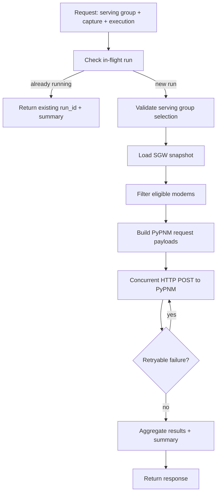

Fix summary for flagged issues

Changes
- MAC-filtered runs now scope modem selection before counting totals, so total_modems and summary.requested_count reflect the filtered set.
- In-flight dedupe uses a canonical channel_ids key (order-insensitive) while preserving request order in the PyPNM payload.
- RxMER response example now uses null for ipv6 to match runtime serialization.

Files updated
- src/pypnm_cmts/api/routes/pnm/rxmer/service.py
- tests/test_rxmer_orchestration.py
- docs/api/fast-api/pnm-rxmer.md

Tests
- pytest -q (331 passed, 8 skipped)

# FILE: src/pypnm_cmts/api/routes/pnm/rxmer/service.py
# SPDX-License-Identifier: Apache-2.0
# Copyright (c) 2026 Maurice Garcia

from __future__ import annotations

import asyncio
import logging
import time
from uuid import uuid4

from pypnm.api.routes.common.classes.common_endpoint_classes.common_req_resp import (
    CommonMatPlotConfigRequest,
    CommonOutput,
    CommonSingleCaptureAnalysisType,
)
from pypnm.api.routes.common.service.status_codes import ServiceStatusCode
from pypnm.lib.types import (
    ChannelId,
    InetAddressStr,
    IPv4Str,
    IPv6Str,
    OperationId,
    TransactionId,
)

from pypnm_cmts.api.common.cmts_request import CmtsRequestEnvelopeModel
from pypnm_cmts.api.common.service.pnm import (
    HttpxPnmClient,
    PnmCaptureExecutor,
    PnmCaptureJobModel,
    PnmCaptureParsedModel,
    PnmCaptureResultModel,
    PnmHttpClient,
    PnmHttpResponseModel,
)
from pypnm_cmts.api.routes.pnm.rxmer.schemas import (
    RxMerServiceGroupCaptureModemResult,
    RxMerServiceGroupCaptureRequest,
    RxMerServiceGroupCaptureResponse,
)
from pypnm_cmts.config.request_defaults import CmtsRequestDefaults
from pypnm_cmts.docsis.data_type.cmts_cm_reg_state import (
    CmtsCmRegStateText,
    decode_cmts_cm_reg_state,
)
from pypnm_cmts.lib.constants import PnmCaptureFailureReason, PnmCaptureStatus
from pypnm_cmts.lib.types import ServiceGroupId
from pypnm_cmts.sgw.models import SgwCableModemModel, SgwSnapshotModel
from pypnm_cmts.sgw.runtime_state import get_sgw_startup_status, get_sgw_store
from pypnm_cmts.sgw.store import SgwCacheStore

RXMER_ENDPOINT_PATH = "/docs/pnm/ds/ofdm/rxMer/getCapture"
DEFAULT_ANALYSIS_CONFIG = CommonSingleCaptureAnalysisType(
    output=CommonOutput(),
    plot=CommonMatPlotConfigRequest(),
)
RETRYABLE_STATUS_CODES = {
    ServiceStatusCode.NOT_READY_AFTER_FILE_CAPTURE,
    ServiceStatusCode.MEASUREMENT_TIMEOUT,
}
RETRYABLE_HTTP_STATUS = {408, 425, 429, 500, 502, 503, 504}
ELIGIBLE_REG_STATES = {
    CmtsCmRegStateText.operational,
    CmtsCmRegStateText.registrationComplete,
}
_INFLIGHT_LOCK = asyncio.Lock()
_INFLIGHT_RUNS: dict[tuple[int, tuple[str, ...]], str] = {}


class RxMerServiceGroupCaptureService:
    """Service layer for orchestrated RxMER capture across a serving group."""

    def __init__(self, http_client: PnmHttpClient | None = None) -> None:
        self._http_client = http_client
        self.logger = logging.getLogger(f"{self.__class__.__name__}")

    async def capture(
        self,
        request: RxMerServiceGroupCaptureRequest,
        pypnm_base_url: str,
    ) -> RxMerServiceGroupCaptureResponse:
        """
        Execute RxMER capture concurrently for a serving group using SGW cache inventory.

        Args:
            request: RxMER orchestration request payload.
            pypnm_base_url: Base URL for the mounted PyPNM API (e.g., http://host:port/cm).

        Returns:
            Structured response summarizing per-modem capture outcomes.
        """
        elapsed_start = time.monotonic()
        selected_sg_id = request.cmts.serving_group.id[0]
        envelope = self._apply_defaults(request.cmts)
        requested_channel_ids = self._resolve_channel_ids(envelope)
        inflight_key = self._resolve_inflight_key(selected_sg_id, requested_channel_ids)
        async with _INFLIGHT_LOCK:
            inflight_run_id = _INFLIGHT_RUNS.get(inflight_key)
            if inflight_run_id is not None:
                return self._already_running_response(
                    requested_sg_id=selected_sg_id,
                    requested_channel_ids=requested_channel_ids,
                    run_id=inflight_run_id,
                    elapsed_start=elapsed_start,
                )
            run_id = str(uuid4())
            _INFLIGHT_RUNS[inflight_key] = run_id
        try:
            status = get_sgw_startup_status()
            if not bool(status.startup_completed):
                return self._failure_response(
                    "sgw startup not completed",
                    selected_sg_id,
                    requested_channel_ids,
                    elapsed_start,
                    run_id,
                )
            if not bool(status.discovery_ok) or bool(status.prime_failed):
                message = status.error_message if status.error_message != "" else "sgw startup failed"
                return self._failure_response(
                    message,
                    selected_sg_id,
                    requested_channel_ids,
                    elapsed_start,
                    run_id,
                )

            store = get_sgw_store()
            if store is None:
                return self._failure_response(
                    "sgw store not available",
                    selected_sg_id,
                    requested_channel_ids,
                    elapsed_start,
                    run_id,
                )

            snapshot = self._load_snapshot(store, selected_sg_id)
            if snapshot is None:
                return self._failure_response(
                    f"sgw snapshot missing for sg_id={int(selected_sg_id)}",
                    selected_sg_id,
                    requested_channel_ids,
                    elapsed_start,
                    run_id,
                )

            scoped_modems = self._resolve_scoped_modems(snapshot, envelope)
            results: list[RxMerServiceGroupCaptureModemResult] = []
            job_inputs, skipped = self._prepare_jobs(scoped_modems, envelope, requested_channel_ids)
            results.extend(skipped)

            async with self._resolve_http_client(pypnm_base_url) as http_client:
                executor = PnmCaptureExecutor(
                    http_client=http_client,
                    settings=request.execution,
                    clock=time.time,
                )
                executed = await executor.run(
                    jobs=job_inputs,
                    parser=self._parse_pypnm_response,
                    should_retry=self._should_retry,
                )
            results.extend([RxMerServiceGroupCaptureModemResult.from_executor_result(item) for item in executed])

            total_modems = len(scoped_modems)
            eligible_modems = len(job_inputs)
            started_modems = len(job_inputs)
            success_modems = sum(1 for item in results if item.status == PnmCaptureStatus.SUCCESS)
            failed_modems = sum(1 for item in results if item.status == PnmCaptureStatus.FAILED)
            skipped_modems = sum(1 for item in results if item.status == PnmCaptureStatus.SKIPPED)
            summary = self._build_summary(
                requested_count=total_modems,
                attempted_count=started_modems,
                success_count=success_modems,
                failure_count=failed_modems,
                results=executed,
                elapsed_start=elapsed_start,
            )

            return RxMerServiceGroupCaptureResponse(
                status=ServiceStatusCode.SUCCESS,
                message="" if results else "no modems found in serving group",
                timestamp=RxMerServiceGroupCaptureResponse.now_timestamp(),
                run_id=run_id,
                already_running=False,
                requested_sg_id=selected_sg_id,
                requested_channel_ids=requested_channel_ids,
                summary=summary,
                total_modems=total_modems,
                eligible_modems=eligible_modems,
                started_modems=started_modems,
                success_modems=success_modems,
                failed_modems=failed_modems,
                skipped_modems=skipped_modems,
                results=results,
            )
        finally:
            async with _INFLIGHT_LOCK:
                existing_run = _INFLIGHT_RUNS.get(inflight_key)
                if existing_run == run_id:
                    _INFLIGHT_RUNS.pop(inflight_key, None)

    @staticmethod
    def _apply_defaults(envelope: CmtsRequestEnvelopeModel) -> CmtsRequestEnvelopeModel:
        defaults = CmtsRequestDefaults.from_system_config()
        return envelope.apply_defaults(defaults)

    @staticmethod
    def _resolve_channel_ids(envelope: CmtsRequestEnvelopeModel) -> list[ChannelId]:
        pnm = envelope.cable_modem.pnm_parameters
        capture = pnm.capture if pnm is not None else None
        channel_ids = capture.channel_ids if capture is not None else None
        if not channel_ids:
            return []
        return list(channel_ids)

    @staticmethod
    def _load_snapshot(store: SgwCacheStore, sg_id: ServiceGroupId) -> SgwSnapshotModel | None:
        entry = store.get_entry(sg_id)
        if entry is None:
            return None
        return entry.snapshot

    @staticmethod
    def _resolve_scoped_modems(
        snapshot: SgwSnapshotModel,
        envelope: CmtsRequestEnvelopeModel,
    ) -> list[SgwCableModemModel]:
        selected_macs = set(envelope.cable_modem.mac_address)
        if not selected_macs:
            return list(snapshot.cable_modems)
        return [modem for modem in snapshot.cable_modems if modem.mac in selected_macs]

    def _prepare_jobs(
        self,
        modems: list[SgwCableModemModel],
        envelope: CmtsRequestEnvelopeModel,
        channel_ids: list[ChannelId],
    ) -> tuple[list[PnmCaptureJobModel], list[RxMerServiceGroupCaptureModemResult]]:
        jobs: list[PnmCaptureJobModel] = []
        skipped: list[RxMerServiceGroupCaptureModemResult] = []
        for modem in modems:
            eligible, message = self._is_modem_eligible(modem)
            if not eligible:
                skipped.append(self._build_skipped_result(modem, message))
                continue
            payload = self._build_pypnm_payload(modem, envelope, channel_ids)
            if payload is None:
                skipped.append(self._build_skipped_result(modem, "missing modem ip address"))
                continue
            job = PnmCaptureJobModel(
                mac_address=modem.mac,
                ipv4=self._normalize_ipv4(modem.ipv4),
                ipv6=self._normalize_ipv6(modem.ipv6),
                path=RXMER_ENDPOINT_PATH,
                payload=payload,
            )
            jobs.append(job)
        return jobs, skipped

    @staticmethod
    def _normalize_ipv4(value: IPv4Str) -> IPv4Str | None:
        if str(value).strip() == "":
            return None
        return value

    @staticmethod
    def _normalize_ipv6(value: IPv6Str) -> IPv6Str | None:
        if str(value).strip() == "":
            return None
        return value

    @staticmethod
    def _normalize_optional_string(value: object | None) -> str | None:
        if value is None:
            return None
        if isinstance(value, str):
            if value.strip() == "":
                return None
            return value
        text = str(value).strip()
        if text == "":
            return None
        return text

    def _is_modem_eligible(self, modem: SgwCableModemModel) -> tuple[bool, str]:
        reg_state = decode_cmts_cm_reg_state(int(modem.registration_status))
        if reg_state not in ELIGIBLE_REG_STATES:
            return False, f"registration state not eligible: {reg_state.value}"
        if self._normalize_ipv4(modem.ipv4) is None and self._normalize_ipv6(modem.ipv6) is None:
            return False, "no modem ip address available"
        return True, ""

    def _build_pypnm_payload(
        self,
        modem: SgwCableModemModel,
        envelope: CmtsRequestEnvelopeModel,
        channel_ids: list[ChannelId],
    ) -> dict[str, object] | None:
        pnm = envelope.cable_modem.pnm_parameters
        tftp = pnm.tftp if pnm is not None else None
        snmp = envelope.cable_modem.snmp
        snmp_v2c = snmp.snmpV2C if snmp is not None else None
        community = snmp_v2c.community if snmp_v2c is not None else None
        community_value = self._normalize_optional_string(community)
        tftp_ipv4_value = self._normalize_optional_string(tftp.ipv4 if tftp is not None else None)
        tftp_ipv6_value = self._normalize_optional_string(tftp.ipv6 if tftp is not None else None)

        ip_address = self._resolve_modem_ip(modem)
        if ip_address is None:
            return None

        capture_payload: dict[str, object] | None = None
        if channel_ids:
            capture_payload = {"channel_ids": [int(channel_id) for channel_id in channel_ids]}

        pnm_payload: dict[str, object] = {
            "tftp": {
                "ipv4": tftp_ipv4_value,
                "ipv6": tftp_ipv6_value,
            }
        }
        if capture_payload is not None:
            pnm_payload["capture"] = capture_payload

        return {
            "cable_modem": {
                "mac_address": str(modem.mac),
                "ip_address": ip_address,
                "pnm_parameters": pnm_payload,
                "snmp": {"snmpV2C": {"community": community_value}},
            },
            "analysis": DEFAULT_ANALYSIS_CONFIG.model_dump(mode="json"),
        }

    @staticmethod
    def _resolve_modem_ip(modem: SgwCableModemModel) -> InetAddressStr | None:
        ipv4 = str(modem.ipv4).strip()
        if ipv4 != "":
            return InetAddressStr(ipv4)
        ipv6 = str(modem.ipv6).strip()
        if ipv6 != "":
            return InetAddressStr(ipv6)
        return None

    def _build_skipped_result(self, modem: SgwCableModemModel, reason: str) -> RxMerServiceGroupCaptureModemResult:
        return RxMerServiceGroupCaptureModemResult(
            mac_address=modem.mac,
            ipv4=self._normalize_ipv4(modem.ipv4),
            ipv6=self._normalize_ipv6(modem.ipv6),
            status=PnmCaptureStatus.SKIPPED,
            message=reason,
            attempts=0,
            http_status=0,
            pypnm_status=None,
            started_epoch=0.0,
            finished_epoch=0.0,
        )

    def _resolve_http_client(self, base_url: str) -> PnmHttpClient:
        if self._http_client is not None:
            return self._http_client
        return HttpxPnmClient(base_url=base_url)

    @staticmethod
    def _parse_status_code(value: object) -> ServiceStatusCode | None:
        if isinstance(value, int):
            try:
                return ServiceStatusCode(value)
            except ValueError:
                return ServiceStatusCode.UNKNOWN
        if isinstance(value, str):
            if value.isdigit():
                return ServiceStatusCode(int(value))
            return None
        return None

    def _parse_pypnm_response(self, response: PnmHttpResponseModel) -> PnmCaptureParsedModel:
        payload = response.payload
        status_code = self._parse_status_code(payload.get("status"))
        message_value = payload.get("message", "")
        message = str(message_value) if isinstance(message_value, (str, int, float)) else ""
        transaction_id = self._find_identifier(payload, "transaction_id")
        operation_id = self._find_identifier(payload, "operation_id")
        return PnmCaptureParsedModel(
            status_code=status_code,
            message=message,
            transaction_id=TransactionId(transaction_id) if transaction_id is not None else None,
            operation_id=OperationId(operation_id) if operation_id is not None else None,
            raw_payload=payload,
        )

    def _should_retry(
        self,
        parsed: PnmCaptureParsedModel,
        response: PnmHttpResponseModel,
    ) -> bool:
        if response.error_message != "":
            return True
        if response.status_code in RETRYABLE_HTTP_STATUS:
            return True
        return parsed.status_code in RETRYABLE_STATUS_CODES

    @staticmethod
    def _find_identifier(payload: dict[str, object], key: str) -> str | None:
        if key in payload and isinstance(payload[key], str):
            value = payload[key]
            if value.strip() != "":
                return value
        for item in payload.values():
            if isinstance(item, dict):
                found = RxMerServiceGroupCaptureService._find_identifier(item, key)
                if found is not None:
                    return found
            if isinstance(item, list):
                for entry in item:
                    if isinstance(entry, dict):
                        found = RxMerServiceGroupCaptureService._find_identifier(entry, key)
                        if found is not None:
                            return found
        return None

    @staticmethod
    def _resolve_inflight_key(
        sg_id: ServiceGroupId,
        channel_ids: list[ChannelId],
    ) -> tuple[int, tuple[str, ...]]:
        if not channel_ids:
            return (int(sg_id), ("all",))
        sorted_ids = sorted(int(channel_id) for channel_id in channel_ids)
        return (int(sg_id), tuple(str(channel_id) for channel_id in sorted_ids))

    def _build_summary(
        self,
        requested_count: int,
        attempted_count: int,
        success_count: int,
        failure_count: int,
        results: list[PnmCaptureResultModel],
        elapsed_start: float,
    ) -> RxMerServiceGroupCaptureResponse.SummaryModel:
        failure_counts: dict[PnmCaptureFailureReason, int] = {}
        for result in results:
            if result.status != PnmCaptureStatus.FAILED:
                continue
            reason = result.failure_reason
            if reason is None:
                continue
            failure_counts[reason] = failure_counts.get(reason, 0) + 1
        elapsed_seconds = max(0.0, time.monotonic() - elapsed_start)
        return RxMerServiceGroupCaptureResponse.SummaryModel(
            requested_count=requested_count,
            attempted_count=attempted_count,
            success_count=success_count,
            failure_count=failure_count,
            failures_by_reason=failure_counts,
            elapsed_seconds=elapsed_seconds,
        )

    def _already_running_response(
        self,
        requested_sg_id: ServiceGroupId,
        requested_channel_ids: list[ChannelId],
        run_id: str,
        elapsed_start: float,
    ) -> RxMerServiceGroupCaptureResponse:
        summary = self._build_summary(
            requested_count=0,
            attempted_count=0,
            success_count=0,
            failure_count=0,
            results=[],
            elapsed_start=elapsed_start,
        )
        return RxMerServiceGroupCaptureResponse(
            status=ServiceStatusCode.SUCCESS,
            message="capture already running",
            timestamp=RxMerServiceGroupCaptureResponse.now_timestamp(),
            run_id=run_id,
            already_running=True,
            requested_sg_id=requested_sg_id,
            requested_channel_ids=requested_channel_ids,
            summary=summary,
            total_modems=0,
            eligible_modems=0,
            started_modems=0,
            success_modems=0,
            failed_modems=0,
            skipped_modems=0,
            results=[],
        )

    def _failure_response(
        self,
        message: str,
        requested_sg_id: ServiceGroupId,
        requested_channel_ids: list[ChannelId],
        elapsed_start: float,
        run_id: str,
    ) -> RxMerServiceGroupCaptureResponse:
        summary = self._build_summary(
            requested_count=0,
            attempted_count=0,
            success_count=0,
            failure_count=0,
            results=[],
            elapsed_start=elapsed_start,
        )
        return RxMerServiceGroupCaptureResponse(
            status=ServiceStatusCode.FAILURE,
            message=message,
            timestamp=RxMerServiceGroupCaptureResponse.now_timestamp(),
            run_id=run_id,
            already_running=False,
            requested_sg_id=requested_sg_id,
            requested_channel_ids=requested_channel_ids,
            summary=summary,
            total_modems=0,
            eligible_modems=0,
            started_modems=0,
            success_modems=0,
            failed_modems=0,
            skipped_modems=0,
            results=[],
        )

# FILE: tests/test_rxmer_orchestration.py
# SPDX-License-Identifier: Apache-2.0
# Copyright (c) 2026 Maurice Garcia

from __future__ import annotations

import asyncio

import pytest
from pypnm.api.routes.common.service.status_codes import ServiceStatusCode
from pypnm.config.system_config_settings import SystemConfigSettings

from pypnm_cmts.api.common.service.pnm import PnmHttpClient, PnmHttpResponseModel
from pypnm_cmts.api.routes.pnm.rxmer.schemas import RxMerServiceGroupCaptureRequest
from pypnm_cmts.api.routes.pnm.rxmer.service import (
    RXMER_ENDPOINT_PATH,
    RxMerServiceGroupCaptureService,
)
from pypnm_cmts.config.orchestrator_config import CmtsOrchestratorSettings
from pypnm_cmts.config.request_defaults import (
    ENV_CM_SNMPV2C_WRITE_COMMUNITY,
    ENV_CM_TFTP_IPV4,
    ENV_CM_TFTP_IPV6,
)
from pypnm_cmts.lib.constants import PnmCaptureFailureReason, PnmCaptureStatus
from pypnm_cmts.lib.types import CmtsCmRegState, ServiceGroupId
from pypnm_cmts.orchestrator.models import SgwCacheMetadataModel
from pypnm_cmts.sgw.manager import SgwManager
from pypnm_cmts.sgw.models import (
    SgwCableModemModel,
    SgwCacheEntryModel,
    SgwSnapshotModel,
)
from pypnm_cmts.sgw.runtime_state import (
    reset_sgw_runtime_state,
    set_sgw_startup_success,
)
from pypnm_cmts.sgw.store import SgwCacheStore

SNAPSHOT_TIME_EPOCH = 1000.0
PER_MODEM_TIMEOUT_SECONDS = 0.05
OVERALL_TIMEOUT_SECONDS = 0.05
SHORT_SLEEP_SECONDS = 0.02
LONG_SLEEP_SECONDS = 0.2


class FakePnmHttpClient(PnmHttpClient):
    """In-memory PyPNM client for RxMER service tests."""

    def __init__(self, responses: list[PnmHttpResponseModel]) -> None:
        self._responses = list(responses)
        self.requests: list[tuple[str, dict[str, object]]] = []

    async def __aenter__(self) -> FakePnmHttpClient:
        return self

    async def __aexit__(self, exc_type: object, exc: object, tb: object) -> None:
        return None

    async def post_json(self, path: str, payload: dict[str, object]) -> PnmHttpResponseModel:
        self.requests.append((path, payload))
        if self._responses:
            return self._responses.pop(0)
        return PnmHttpResponseModel(
            status_code=500,
            payload={"status": ServiceStatusCode.FAILURE.value},
            error_message="",
        )


class DelayedPnmHttpClient(PnmHttpClient):
    """In-memory PyPNM client that delays responses for timeout testing."""

    def __init__(self, delay_seconds: float, response: PnmHttpResponseModel) -> None:
        self._delay_seconds = float(delay_seconds)
        self._response = response
        self.requests: list[tuple[str, dict[str, object]]] = []

    async def __aenter__(self) -> DelayedPnmHttpClient:
        return self

    async def __aexit__(self, exc_type: object, exc: object, tb: object) -> None:
        return None

    async def post_json(self, path: str, payload: dict[str, object]) -> PnmHttpResponseModel:
        self.requests.append((path, payload))
        await asyncio.sleep(self._delay_seconds)
        return self._response


class BlockingPnmHttpClient(PnmHttpClient):
    """In-memory PyPNM client that blocks until released."""

    def __init__(self, event: asyncio.Event, response: PnmHttpResponseModel) -> None:
        self._event = event
        self._response = response
        self.requests: list[tuple[str, dict[str, object]]] = []

    async def __aenter__(self) -> BlockingPnmHttpClient:
        return self

    async def __aexit__(self, exc_type: object, exc: object, tb: object) -> None:
        return None

    async def post_json(self, path: str, payload: dict[str, object]) -> PnmHttpResponseModel:
        self.requests.append((path, payload))
        await self._event.wait()
        return self._response

def _configure_runtime_state(store: SgwCacheStore, sg_id: ServiceGroupId) -> None:
    settings = CmtsOrchestratorSettings.model_validate(
        {"adapter": {"hostname": "cmts.example", "community": "public"}}
    )
    manager = SgwManager(settings=settings, store=store, service_groups=[sg_id])
    set_sgw_startup_success([sg_id], store, manager, SNAPSHOT_TIME_EPOCH)


def _seed_snapshot(store: SgwCacheStore, sg_id: ServiceGroupId, modems: list[SgwCableModemModel]) -> None:
    metadata = SgwCacheMetadataModel(snapshot_time_epoch=SNAPSHOT_TIME_EPOCH, age_seconds=0.0)
    snapshot = SgwSnapshotModel(sg_id=sg_id, cable_modems=modems, metadata=metadata)
    store.upsert_entry(SgwCacheEntryModel(sg_id=sg_id, snapshot=snapshot))


@pytest.mark.asyncio
async def test_rxmer_capture_passes_channel_ids(monkeypatch: pytest.MonkeyPatch) -> None:
    reset_sgw_runtime_state()
    monkeypatch.setenv(ENV_CM_SNMPV2C_WRITE_COMMUNITY, "public")
    monkeypatch.setenv(ENV_CM_TFTP_IPV4, "192.168.0.100")
    monkeypatch.setenv(ENV_CM_TFTP_IPV6, "::1")

    sg_id = ServiceGroupId(3147266)
    store = SgwCacheStore()
    modem = SgwCableModemModel(
        mac="aa:bb:cc:dd:ee:ff",
        ipv4="192.168.0.100",
        ipv6="",
        registration_status=CmtsCmRegState(8),
    )
    _seed_snapshot(store, sg_id, [modem])
    _configure_runtime_state(store, sg_id)

    responses = [
        PnmHttpResponseModel(
            status_code=200,
            payload={
                "status": ServiceStatusCode.SUCCESS.value,
                "message": "ok",
                "transaction_id": "tx-123",
                "operation_id": "op-456",
            },
            error_message="",
        )
    ]
    http_client = FakePnmHttpClient(responses)
    service = RxMerServiceGroupCaptureService(http_client=http_client)

    request = RxMerServiceGroupCaptureRequest.model_validate(
        {
            "cmts": {
                "serving_group": {"id": [int(sg_id)]},
                "cable_modem": {"pnm_parameters": {"capture": {"channel_ids": [194, 193]}}},
            },
            "execution": {"max_workers": 1, "retry_count": 0, "retry_delay_seconds": 0.0},
        }
    )
    response = await service.capture(request, "http://localhost/cm")

    assert response.requested_sg_id == sg_id
    assert [int(channel_id) for channel_id in response.requested_channel_ids] == [194, 193]
    assert response.total_modems == 1
    assert response.eligible_modems == 1
    assert response.started_modems == 1
    assert response.success_modems == 1
    assert response.failed_modems == 0
    assert response.skipped_modems == 0
    assert response.summary.requested_count == 1
    assert response.summary.attempted_count == 1
    assert response.summary.success_count == 1
    assert response.summary.failure_count == 0
    assert response.results[0].status == PnmCaptureStatus.SUCCESS

    assert len(http_client.requests) == 1
    path, payload = http_client.requests[0]
    assert path == RXMER_ENDPOINT_PATH
    capture = payload["cable_modem"]["pnm_parameters"]["capture"]
    assert capture["channel_ids"] == [194, 193]


@pytest.mark.asyncio
async def test_rxmer_capture_honors_mac_filter_counts(monkeypatch: pytest.MonkeyPatch) -> None:
    reset_sgw_runtime_state()
    monkeypatch.setenv(ENV_CM_SNMPV2C_WRITE_COMMUNITY, "public")
    monkeypatch.setenv(ENV_CM_TFTP_IPV4, "192.168.0.100")
    monkeypatch.setenv(ENV_CM_TFTP_IPV6, "::1")

    sg_id = ServiceGroupId(3147266)
    store = SgwCacheStore()
    modems = [
        SgwCableModemModel(
            mac="aa:bb:cc:dd:ee:ff",
            ipv4="192.168.0.100",
            ipv6="",
            registration_status=CmtsCmRegState(8),
        ),
        SgwCableModemModel(
            mac="aa:bb:cc:dd:ee:10",
            ipv4="192.168.0.101",
            ipv6="",
            registration_status=CmtsCmRegState(8),
        ),
    ]
    _seed_snapshot(store, sg_id, modems)
    _configure_runtime_state(store, sg_id)

    responses = [
        PnmHttpResponseModel(
            status_code=200,
            payload={"status": ServiceStatusCode.SUCCESS.value},
            error_message="",
        )
    ]
    http_client = FakePnmHttpClient(responses)
    service = RxMerServiceGroupCaptureService(http_client=http_client)

    request = RxMerServiceGroupCaptureRequest.model_validate(
        {
            "cmts": {
                "serving_group": {"id": [int(sg_id)]},
                "cable_modem": {"mac_address": ["aa:bb:cc:dd:ee:ff"]},
            },
            "execution": {"max_workers": 1, "retry_count": 0, "retry_delay_seconds": 0.0},
        }
    )
    response = await service.capture(request, "http://localhost/cm")

    assert response.total_modems == 1
    assert response.eligible_modems == 1
    assert response.started_modems == 1
    assert response.success_modems == 1
    assert response.failed_modems == 0
    assert response.skipped_modems == 0
    assert response.summary.requested_count == 1
    assert response.summary.attempted_count == 1


@pytest.mark.asyncio
async def test_rxmer_capture_sends_null_overrides(monkeypatch: pytest.MonkeyPatch) -> None:
    reset_sgw_runtime_state()
    monkeypatch.delenv(ENV_CM_SNMPV2C_WRITE_COMMUNITY, raising=False)
    monkeypatch.delenv(ENV_CM_TFTP_IPV4, raising=False)
    monkeypatch.delenv(ENV_CM_TFTP_IPV6, raising=False)
    monkeypatch.setattr(SystemConfigSettings, "snmp_write_community", staticmethod(lambda: ""))
    monkeypatch.setattr(SystemConfigSettings, "bulk_tftp_ip_v4", staticmethod(lambda: ""))
    monkeypatch.setattr(SystemConfigSettings, "bulk_tftp_ip_v6", staticmethod(lambda: ""))

    sg_id = ServiceGroupId(3147266)
    store = SgwCacheStore()
    modem = SgwCableModemModel(
        mac="aa:bb:cc:dd:ee:ff",
        ipv4="192.168.0.100",
        ipv6="",
        registration_status=CmtsCmRegState(8),
    )
    _seed_snapshot(store, sg_id, [modem])
    _configure_runtime_state(store, sg_id)

    responses = [
        PnmHttpResponseModel(
            status_code=200,
            payload={
                "status": ServiceStatusCode.SUCCESS.value,
                "message": "ok",
                "transaction_id": "tx-123",
            },
            error_message="",
        )
    ]
    http_client = FakePnmHttpClient(responses)
    service = RxMerServiceGroupCaptureService(http_client=http_client)

    request = RxMerServiceGroupCaptureRequest.model_validate(
        {
            "cmts": {"serving_group": {"id": [int(sg_id)]}},
            "execution": {"max_workers": 1, "retry_count": 0, "retry_delay_seconds": 0.0},
        }
    )
    response = await service.capture(request, "http://localhost/cm")

    assert response.success_modems == 1
    assert len(http_client.requests) == 1
    _, payload = http_client.requests[0]
    tftp_payload = payload["cable_modem"]["pnm_parameters"]["tftp"]
    snmp_payload = payload["cable_modem"]["snmp"]["snmpV2C"]
    assert tftp_payload["ipv4"] is None
    assert tftp_payload["ipv6"] is None
    assert snmp_payload["community"] is None


@pytest.mark.asyncio
async def test_rxmer_capture_retries_on_not_ready(monkeypatch: pytest.MonkeyPatch) -> None:
    reset_sgw_runtime_state()
    monkeypatch.setenv(ENV_CM_SNMPV2C_WRITE_COMMUNITY, "public")
    monkeypatch.setenv(ENV_CM_TFTP_IPV4, "192.168.0.100")
    monkeypatch.setenv(ENV_CM_TFTP_IPV6, "::1")

    sg_id = ServiceGroupId(3147266)
    store = SgwCacheStore()
    modem = SgwCableModemModel(
        mac="aa:bb:cc:dd:ee:ff",
        ipv4="192.168.0.100",
        ipv6="",
        registration_status=CmtsCmRegState(8),
    )
    _seed_snapshot(store, sg_id, [modem])
    _configure_runtime_state(store, sg_id)

    responses = [
        PnmHttpResponseModel(
            status_code=200,
            payload={"status": ServiceStatusCode.NOT_READY_AFTER_FILE_CAPTURE.value, "message": "busy"},
            error_message="",
        ),
        PnmHttpResponseModel(
            status_code=200,
            payload={"status": ServiceStatusCode.NOT_READY_AFTER_FILE_CAPTURE.value, "message": "busy"},
            error_message="",
        ),
        PnmHttpResponseModel(
            status_code=200,
            payload={
                "status": ServiceStatusCode.SUCCESS.value,
                "message": "ok",
                "transaction_id": "tx-789",
            },
            error_message="",
        ),
    ]
    http_client = FakePnmHttpClient(responses)
    service = RxMerServiceGroupCaptureService(http_client=http_client)

    request = RxMerServiceGroupCaptureRequest.model_validate(
        {
            "cmts": {
                "serving_group": {"id": [int(sg_id)]},
            },
            "execution": {"max_workers": 1, "retry_count": 2, "retry_delay_seconds": 0.0},
        }
    )
    response = await service.capture(request, "http://localhost/cm")

    assert response.results[0].status == PnmCaptureStatus.SUCCESS
    assert response.results[0].attempts == 3
    assert len(http_client.requests) == 3


@pytest.mark.asyncio
async def test_rxmer_capture_per_modem_timeout(monkeypatch: pytest.MonkeyPatch) -> None:
    reset_sgw_runtime_state()
    monkeypatch.setenv(ENV_CM_SNMPV2C_WRITE_COMMUNITY, "public")
    monkeypatch.setenv(ENV_CM_TFTP_IPV4, "192.168.0.100")
    monkeypatch.setenv(ENV_CM_TFTP_IPV6, "::1")

    sg_id = ServiceGroupId(3147266)
    store = SgwCacheStore()
    modem = SgwCableModemModel(
        mac="aa:bb:cc:dd:ee:ff",
        ipv4="192.168.0.100",
        ipv6="",
        registration_status=CmtsCmRegState(8),
    )
    _seed_snapshot(store, sg_id, [modem])
    _configure_runtime_state(store, sg_id)

    response_payload = PnmHttpResponseModel(
        status_code=200,
        payload={"status": ServiceStatusCode.SUCCESS.value},
        error_message="",
    )
    http_client = DelayedPnmHttpClient(LONG_SLEEP_SECONDS, response_payload)
    service = RxMerServiceGroupCaptureService(http_client=http_client)

    request = RxMerServiceGroupCaptureRequest.model_validate(
        {
            "cmts": {"serving_group": {"id": [int(sg_id)]}},
            "execution": {
                "max_workers": 1,
                "retry_count": 0,
                "retry_delay_seconds": 0.0,
                "per_modem_timeout_seconds": PER_MODEM_TIMEOUT_SECONDS,
                "overall_timeout_seconds": 0.0,
            },
        }
    )
    response = await service.capture(request, "http://localhost/cm")

    assert response.failed_modems == 1
    assert response.summary.failure_count == 1
    assert response.summary.failures_by_reason[PnmCaptureFailureReason.PER_MODEM_TIMEOUT] == 1


@pytest.mark.asyncio
async def test_rxmer_capture_overall_timeout(monkeypatch: pytest.MonkeyPatch) -> None:
    reset_sgw_runtime_state()
    monkeypatch.setenv(ENV_CM_SNMPV2C_WRITE_COMMUNITY, "public")
    monkeypatch.setenv(ENV_CM_TFTP_IPV4, "192.168.0.100")
    monkeypatch.setenv(ENV_CM_TFTP_IPV6, "::1")

    sg_id = ServiceGroupId(3147266)
    store = SgwCacheStore()
    modems = [
        SgwCableModemModel(mac="aa:bb:cc:dd:ee:ff", ipv4="192.168.0.100", ipv6="", registration_status=CmtsCmRegState(8)),
        SgwCableModemModel(mac="aa:bb:cc:dd:ee:10", ipv4="192.168.0.101", ipv6="", registration_status=CmtsCmRegState(8)),
    ]
    _seed_snapshot(store, sg_id, modems)
    _configure_runtime_state(store, sg_id)

    response_payload = PnmHttpResponseModel(
        status_code=200,
        payload={"status": ServiceStatusCode.SUCCESS.value},
        error_message="",
    )
    http_client = DelayedPnmHttpClient(LONG_SLEEP_SECONDS, response_payload)
    service = RxMerServiceGroupCaptureService(http_client=http_client)

    request = RxMerServiceGroupCaptureRequest.model_validate(
        {
            "cmts": {"serving_group": {"id": [int(sg_id)]}},
            "execution": {
                "max_workers": 2,
                "retry_count": 0,
                "retry_delay_seconds": 0.0,
                "per_modem_timeout_seconds": 0.0,
                "overall_timeout_seconds": OVERALL_TIMEOUT_SECONDS,
            },
        }
    )
    response = await service.capture(request, "http://localhost/cm")

    assert response.summary.failure_count >= 1
    assert response.summary.failures_by_reason[PnmCaptureFailureReason.OVERALL_TIMEOUT] >= 1


@pytest.mark.asyncio
async def test_rxmer_capture_inflight_dedupe(monkeypatch: pytest.MonkeyPatch) -> None:
    reset_sgw_runtime_state()
    monkeypatch.setenv(ENV_CM_SNMPV2C_WRITE_COMMUNITY, "public")
    monkeypatch.setenv(ENV_CM_TFTP_IPV4, "192.168.0.100")
    monkeypatch.setenv(ENV_CM_TFTP_IPV6, "::1")

    sg_id = ServiceGroupId(3147266)
    store = SgwCacheStore()
    modem = SgwCableModemModel(
        mac="aa:bb:cc:dd:ee:ff",
        ipv4="192.168.0.100",
        ipv6="",
        registration_status=CmtsCmRegState(8),
    )
    _seed_snapshot(store, sg_id, [modem])
    _configure_runtime_state(store, sg_id)

    event = asyncio.Event()
    response_payload = PnmHttpResponseModel(
        status_code=200,
        payload={"status": ServiceStatusCode.SUCCESS.value},
        error_message="",
    )
    http_client = BlockingPnmHttpClient(event, response_payload)
    service = RxMerServiceGroupCaptureService(http_client=http_client)

    request = RxMerServiceGroupCaptureRequest.model_validate(
        {
            "cmts": {"serving_group": {"id": [int(sg_id)]}},
            "execution": {
                "max_workers": 1,
                "retry_count": 0,
                "retry_delay_seconds": 0.0,
                "per_modem_timeout_seconds": 0.0,
                "overall_timeout_seconds": 0.0,
            },
        }
    )
    request_with_channel_ids = RxMerServiceGroupCaptureRequest.model_validate(
        {
            "cmts": {
                "serving_group": {"id": [int(sg_id)]},
                "cable_modem": {"pnm_parameters": {"capture": {"channel_ids": [194, 193]}}},
            },
            "execution": {
                "max_workers": 1,
                "retry_count": 0,
                "retry_delay_seconds": 0.0,
                "per_modem_timeout_seconds": 0.0,
                "overall_timeout_seconds": 0.0,
            },
        }
    )
    request_with_channel_ids_reversed = RxMerServiceGroupCaptureRequest.model_validate(
        {
            "cmts": {
                "serving_group": {"id": [int(sg_id)]},
                "cable_modem": {"pnm_parameters": {"capture": {"channel_ids": [193, 194]}}},
            },
            "execution": {
                "max_workers": 1,
                "retry_count": 0,
                "retry_delay_seconds": 0.0,
                "per_modem_timeout_seconds": 0.0,
                "overall_timeout_seconds": 0.0,
            },
        }
    )
    capture_task = asyncio.create_task(service.capture(request, "http://localhost/cm"))
    await asyncio.sleep(SHORT_SLEEP_SECONDS)

    duplicate_response = await service.capture(request, "http://localhost/cm")
    assert duplicate_response.already_running is True
    assert duplicate_response.run_id != ""

    event.set()
    response = await capture_task
    assert response.already_running is False
    assert response.run_id == duplicate_response.run_id

    event = asyncio.Event()
    http_client = BlockingPnmHttpClient(event, response_payload)
    service = RxMerServiceGroupCaptureService(http_client=http_client)
    capture_task = asyncio.create_task(service.capture(request_with_channel_ids, "http://localhost/cm"))
    await asyncio.sleep(SHORT_SLEEP_SECONDS)
    duplicate_response = await service.capture(request_with_channel_ids_reversed, "http://localhost/cm")
    assert duplicate_response.already_running is True
    assert duplicate_response.run_id != ""

    event.set()
    response = await capture_task
    assert response.already_running is False
    assert response.run_id == duplicate_response.run_id

# FILE: docs/api/fast-api/pnm-rxmer.md
# RxMER Orchestration Endpoints

RxMER capture orchestration uses the SGW cache to identify cable modems in a serving group and triggers PyPNM RxMER capture concurrently per modem. Requests target the CMTS API and PyPNM is invoked under the `/cm` mount.

## POST /cmts/pnm/rxmer/getCapture

Orchestrate RxMER capture for a single serving group. The request enforces exactly one `cmts.serving_group.id`. Optional `cmts.cable_modem.pnm_parameters.capture.channel_ids` are forwarded to PyPNM to filter channels; empty or missing lists capture all channels. Per-modem and overall timeouts are configurable via `execution`.

### Flow



### Request

```json
{
  "cmts": {
    "serving_group": {
      "id": [3147266]
    },
    "cable_modem": {
      "pnm_parameters": {
        "capture": {
          "channel_ids": [193]
        }
      }
    }
  },
  "execution": {
    "max_workers": 32,
    "retry_count": 6,
    "retry_delay_seconds": 5.0,
    "per_modem_timeout_seconds": 30.0,
    "overall_timeout_seconds": 120.0
  }
}
```

### Response

```json
{
  "status": 0,
  "message": "",
  "timestamp": "2026-01-08T02:10:00.000000+00:00",
  "run_id": "3c7db8f0-1d38-4d28-88b2-1a2c4f8a2f8a",
  "already_running": false,
  "requested_sg_id": 3147266,
  "requested_channel_ids": [193],
  "summary": {
    "requested_count": 2,
    "attempted_count": 1,
    "success_count": 1,
    "failure_count": 0,
    "failures_by_reason": {},
    "elapsed_seconds": 1.23
  },
  "total_modems": 2,
  "eligible_modems": 1,
  "started_modems": 1,
  "success_modems": 1,
  "failed_modems": 0,
  "skipped_modems": 1,
  "results": [
    {
      "mac_address": "aa:bb:cc:dd:ee:ff",
      "ipv4": "192.168.0.100",
      "ipv6": null,
      "status": "success",
      "message": "ok",
      "transaction_id": "tx-123",
      "operation_id": "op-456",
      "attempts": 1,
      "http_status": 200,
      "pypnm_status": 0,
      "started_epoch": 1767444600.0,
      "finished_epoch": 1767444601.0
    }
  ]
}
```

### Notes

- `cmts.serving_group.id` must include exactly one SG id.
- `execution` controls concurrency and bounded retry behavior.
- `per_modem_timeout_seconds` bounds each individual cable-modem capture attempt.
- `overall_timeout_seconds` bounds the total orchestration time.
- Skipped modems report `status: "skipped"` with a reason in `message`.
- When a matching capture is already in-flight, the response includes `already_running: true` with the existing `run_id`.
- `failures_by_reason` keys are one of: `per_modem_timeout`, `overall_timeout`, `http_error`, `pypnm_error`, `request_error`, `unknown`.
- If `cmts.cable_modem.pnm_parameters.tftp` or `cmts.cable_modem.snmp.snmpV2C` is provided, their fields must be present; use `null` for defaults and never send blank strings.
- Duplicate entries in request lists (serving_group.id, cable_modem.mac_address, channel_ids) are rejected with 422.
